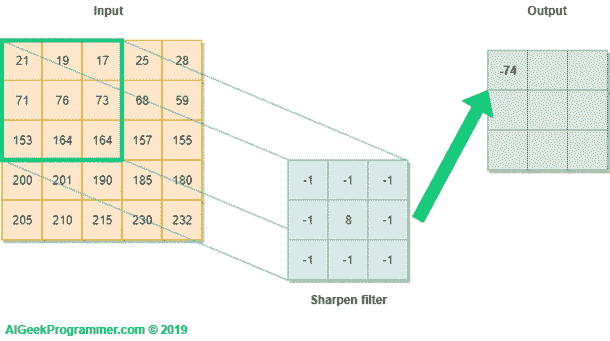
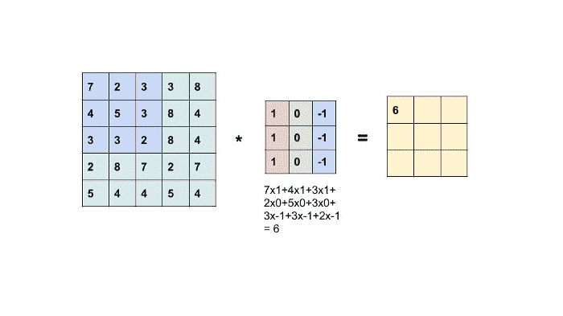
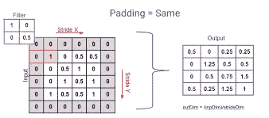
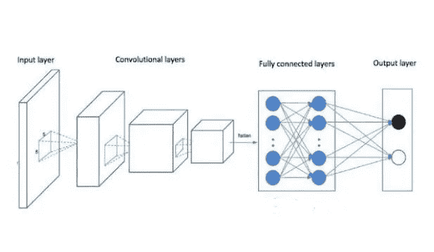

# 卷积神经网络(CNN)及其应用-所有你需要知道的

> 原文：<https://medium.com/analytics-vidhya/convolutional-neural-network-cnn-and-its-application-all-u-need-to-know-f29c1d51b3e5?source=collection_archive---------1----------------------->

**基础知识入门:**

# **什么是神经网络？**

神经网络是一系列算法，通过模拟人脑运行方式的过程，努力识别一组数据中的潜在关系。一般当你睁开眼睛时，你看到的东西被称为数据，并由你大脑中的神经元(数据处理细胞)进行处理，并识别你周围的东西。这就是神经网络的工作原理。他们从大量的数据中提取模式，并输出它是什么。

**(一)。人脑神经元** ( **B)。人工神经网络**

**安的是什么？**

神经网络有时被称为人工神经网络(ANN ),因为它们不像大脑中的神经元那样自然。它们人工模仿神经网络的性质和功能。人工神经网络由大量高度互联的处理元件(神经元)组成，它们协同工作来解决特定的问题。

像人一样，像孩子一样，他们甚至以身作则。神经网络有几个其他类别的网络，如卷积神经网络(CNN)，递归神经网络(RNN)，长期短期记忆网络(LSTM)。在这篇博客中，我们将关注卷积神经网络(CNN)

## **什么是卷积神经网络？**

**卷积神经网络(ConvNet/CNN)** 是一种深度学习算法，可以接受输入图像，为图像中的各个方面/对象分配重要性(可学习的权重和偏差)，并能够区分彼此。与其他分类算法相比，ConvNet 中所需的预处理要低得多。在原始方法中，滤波器是手工设计的，经过足够的训练，ConvNets 有能力学习这些滤波器/特性。

# **2。架构**

**卷积神经网络(CNN)架构**

计算机不能像我们一样看东西，因为计算机的图像只是一个矩阵

ConvNet 架构由三种类型的层组成:**卷积层、池层和全连接层**。

卷积神经网络(CNN)架构

# **2.1 输入/输出量**

CNN 主要应用于图像数据。每个图像都是像素值的矩阵。对于彩色图像，尤其是基于 RGB(红、绿、蓝)的图像，单独颜色(在 RGB 图像的情况下为 3)的存在给数据引入了额外的“深度”场，使得输入是三维的。因此，对于给定大小的 RGB 图像，比如 255 X 255(宽 X 高)像素，我们将有 3 个矩阵与每个图像相关联，每个矩阵对应一个颜色通道。因此，整个图像构成了一个称为输入体积(255×255×3)的三维结构。

# **2.2 功能**

特征是从输入数据中获得的独特且有用的观察或模式，有助于执行所需的图像分析。CNN 从输入图像中学习特征。通常情况下，它们会从数据中反复出现，以获得显著性。

# **2.3 滤波器(卷积核或特征检测器)**

-过滤器(或内核)是分层架构中不可或缺的组件。
-它指的是应用于整个图像的操作符，它转换像素中编码的信息。
-然后将内核与输入体积进行卷积，以获得所谓的“激活图”。
-激活图表示“激活”区域，即在输入中检测到内核特有特征的区域。
-过滤器的尺寸与输入特征图的尺寸相同。

# **2.4 卷积层**

这一层是 ConvNet 的核心。它完成了大部分繁重的计算工作。

CONV 层将计算内核和与内核大小相同的输入图像的子阵列之间的点积。然后，它将对点积得到的所有值求和，这将是输出图像的单个像素值。重复这个过程，直到覆盖了整个输入图像和所有的内核。

# 该层中使用的超参数:

1.  输出体积的**深度**表示存在的层数。该值取决于使用的过滤器数量。在上面的图像中，深度是 1，因为它是一个二维图像。
2.  **过滤器尺寸(f)** 代表所用过滤器的高度和宽度。没有定义滤镜的深度，因为它与输入图像的深度相同。对于给定的图像，滤波器大小为 3。
3.  **Stride (s)** 表示沿输入图像的高度和重量水平和垂直遍历时的步长。对于给定的图像，步幅等于 1。
4.  **填充(p)** 有助于保持输入图像的高度和宽度。因为在处理之后，输入图像的尺寸减小，因此我们不能为小尺寸图像建模具有许多这些层的深层网络。去制造。使用深度网络可行填充。在填充中，我们在图像周围添加多行和多列。默认情况下，添加的像素值为 0，如下所示。填充的另一个优点是，它帮助我们保留更多关于角点像素的信息，因为现在它们将被多次处理，而不是一次。

对于给定的层，所有上述超参数都是固定的。多个卷积层可以具有不同的值。滤波器矩阵也是一个权重矩阵，其值需要使用反向传播来训练。

# 工作

1.  输入的三维体积被传递到这一层。尺寸为 H * W * C。H、W 和 C 分别代表高度、宽度和通道数量。
2.  可以使用 K 个滤波器，其中 K 代表输出体积的深度。所有 K 个滤波器的维数是相同的，即 f * f * c。f 是滤波器大小，c 是输入图像具有的通道数。
3.  如果我们已经配置了填充，那么将向输入音量添加填充。如果 padding 等于 same，则将在维度的每一侧添加一行和一列，值将为零。填充仅适用于输入维度的高度和宽度，并应用于每一层。
4.  填充后，计算开始。现在，我们将从左上角开始滑动过滤器。滤波器和输入音量的相应值相乘，然后对所有相乘的值求和。现在过滤器是水平滑动的，在每个滑动中取步数。因此，如果步幅为 2，我们将水平滑动 2 列。垂直重复相同的过程，直到覆盖整个图像。
5.  在从过滤器计算中获得所有值之后，它们通过 Relu 激活，这是 max(0，x)。在这种情况下，获得的所有负值都被零代替，因为负值在像素中没有意义。
6.  步骤 4 和 5 只生成输出体的一个层，即将三维输入体转换为二维体。
7.  现在，对 K 个过滤器重复步骤 4 和 5。并且每个滤波器的输出彼此堆叠，因此输出图像的深度为 k 维
8.  现在，为了计算输出体积的维度，我们需要卷积层的所有超参数。在这一层使用的所有过滤器都需要训练，并用随机的小数字初始化。

输出体积的高度和重量由下式给出

**身高体重=楼层((W+2*P-F )/S +1 )**

**深度= K(使用的过滤器数量)**

这就是卷积层的工作原理。

这一层的计算

# **2.5 汇集层**

**最大池化**

汇集层用于减少输入体积的维度。该层不会减少输入的深度。该层可用于减小空间大小，从而降低处理图像所需的计算能力。

池层不会丢失图像的重要属性。池层提取最主要的信息，从而维持模型的有效训练过程。

使用两种类型的池:**最大池**和**平均池**。

最大池和平均池

在最大池中，保留选定内核中的最大值，而丢弃所有其他值。而在平均池中，存储所选内核中存在的所有值的平均值。

合用还可以抑制噪音。但是最大池比平均池执行得更好，因此它被更频繁地使用。

# 该层中使用的超参数:

1.  **滤波器大小(f)** 表示要使用的内核的大小。
2.  **Stride (s)** 代表滑动内核窗口时要走的步数。
3.  **填充(p)** 表示在输入图像上应用多少填充。通常在这一层不使用填充。

所使用的过滤器不需要训练。因此，反向传播对该层没有影响。一旦超参数固定下来，它们就永远不会改变。

现在，可以像在卷积层那样计算输出体积的维度。这里，输出体积的深度类似于输入体积的深度。

# 2.6 全连接层(FC 层)

在卷积和汇集层的末端，网络通常使用全连接层，其中每个像素都被视为一个独立的神经元，就像常规神经网络一样。最后一个完全连接的层将包含与要预测的类别数量一样多的神经元。例如，在 CIFAR-10 的情况下，最后一个全连接层将具有 10 个神经元。

**CNN 内部全连接层**

从现在开始，我们实际上将进行分类过程。

现在，我们已经将输入图像转换为适合多级全连接架构的形式，我们应该将图像展平为一个列向量。平坦化的输出被馈送到前馈神经网络，并且反向传播被应用于训练的每次迭代。在一系列时期内，该模型可以区分图像中的主导特征和某些低级特征，并对它们进行分类。

**总结:**

1.  将输入图像提供给卷积层。
2.  使用特色内核/过滤器进行卷积。
3.  应用池层以减少维度。
4.  多次添加这些层。
5.  展平输出，馈入完全连接的图层。
6.  现在，使用逻辑回归通过反向传播来训练模型。

而你已经做出了你的 ***卷积神经网络。***

有各种可用的 CNN 架构，它们是构建算法的关键，在可预见的未来，这些算法将作为一个整体为 AI 提供动力。其中一些列举如下:

1.  LeNet
2.  AlexNet
3.  VGGNet
4.  谷歌网
5.  雷斯内特
6.  ZFNet

# 2.7 CNN 的应用

## 1.解码面部识别

面部识别被卷积神经网络分解成以下几个主要部分-

*   识别照片中的每一张脸
*   不管光线、角度、姿势等外部因素，专注于每一张脸。
*   识别独特的功能
*   将所有收集的数据与数据库中已经存在的数据进行比较，以将人脸与姓名进行匹配。

## 2.分析文档

**卷积神经网络**也可以用于文档分析。这不仅对手写分析有用，而且对识别器也很重要。要让一台机器能够扫描一个人的笔迹，然后将其与它所拥有的广泛的数据库进行比较，它必须每分钟执行近百万条命令。据说，随着 CNN 和更新的模型和算法的使用，字符级的错误率已降至最低 0.4%，尽管其完整的测试尚未被广泛看到。

## **3。了解气候**

CNN 可以在对抗气候变化的斗争中发挥重要作用，特别是在理解我们为什么会看到如此剧烈的变化以及我们如何实验来抑制这种影响方面。据说，这种自然历史收藏中的数据也可以提供更大的社会和科学见解，但这需要有技能的人力资源，如可以亲自访问这些类型的储存库的研究人员。需要更多的人力在这个领域进行更深入的实验。

## 4.灰色地带

将灰色区域引入 CNN 是为了提供真实世界的更加真实的画面。目前，CNN 很大程度上就像一台机器，可以看到每个问题的真值和假值。然而，作为人类，我们明白现实世界在一千个灰色阴影中展开。让机器理解和处理更模糊的逻辑，将有助于它理解我们人类生活的灰色区域，并努力与之对抗。这将有助于 CNN 更全面地了解人类所见。

## 5.广告

随着程序化购买和数据驱动的个性化广告的引入，CNN 已经为广告带来了一个不同的世界。

## 7.其他有趣的领域

随着 CNN 被引入无人驾驶汽车、可以模仿人类行为的机器人、人类基因组绘图项目的助手、预测地震和自然灾害，甚至可能是医疗问题的自我诊断，CNN 已经准备好成为未来。因此，你甚至不必开车去诊所或预约医生，以确保你的打喷嚏或高烧只是简单的流感，而不是一些罕见疾病的症状。研究人员正在用 CNN 解决的一个问题是脑癌检测。脑癌的早期检测可以证明是拯救更多受这种疾病影响的生命的一大步。

我希望你现在了解 CNN 的基本架构和它的各种应用。这种架构有很多变化，但正如我之前提到的，基本概念是相同的。如果您有任何疑问/反馈，请评论。