# 卷积神经网络

> 原文：<https://medium.com/analytics-vidhya/convolutional-neural-networks-4d1582a39714?source=collection_archive---------12----------------------->

## 深度学习专业化课程 4(第一周笔记)

**更新:**如果你还没有看过我之前在其他三个深度学习专业化课程笔记上的文章，那么请务必查看系列:[第一条](/analytics-vidhya/deep-learning-specialization-353c997af655)、[第二条](/analytics-vidhya/deep-learning-specialization-df3938c3234c)、[第三条](/analytics-vidhya/deep-learning-specialization-d517a9d8db56)、[第四条](/analytics-vidhya/deep-learning-specialization-course-notes-3cb2734ea36e)、[第五条](/analytics-vidhya/deep-learning-specialization-course-notes-138ecd5ad4ef)、[第六条](/analytics-vidhya/deep-learning-specialization-course-20c115b77d0e)、[第七条](/analytics-vidhya/deep-learning-specialization-course-fd18ee60394)、[第八条](/analytics-vidhya/deep-learning-specialization-course-3-2e245684ffd)和[第九条](/analytics-vidhya/deep-learning-specialization-course-3-bc467e3dd085)

如今，深度学习被证明在一些领域非常有用，如自动驾驶汽车、医疗保健、物体检测、图像识别等。在图像识别领域中，当图像的尺寸较小时，具有少量隐藏单元的神经网络表现良好，但是如果图像的尺寸例如是 1000*1000 像素，则一个图像的输入特征变成 1000*1000*3，即 3 百万，其中 3 表示 RGB 颜色编码。如果神经网络具有 1000 个隐藏单元，则权重参数矩阵 W 的形状将是(1000，3M)。但是对于计算机视觉应用来说，你不希望只使用微小的图像。你想要使用大的图像。为此，我们需要更好地实现卷积运算，这是卷积神经网络的基本构建模块之一。

## **卷积运算示例**

正如我们所知，神经网络的早期层可能检测垂直和水平边缘，然后一些后期层可能检测对象的部分，然后甚至后期层可能检测完整对象的部分，如人脸。

要了解卷积神经网络是如何工作的，我们先来了解卷积运算。
考虑下图所示的 6 x 6 矩阵，为了检测边缘，创建一个看起来像 1，1，1，0，0，0，-1，-1 的 3 x 3 矩阵。后一个矩阵被称为滤波器或内核。滤波器矩阵中的第一列表示高像素，即较亮的区域，最后一行表示低像素，即较暗的区域。

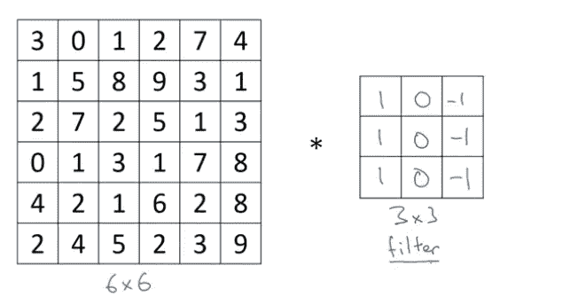

星号用于表示卷积运算。在程序设计语言中，它也用来表示乘法或逐元素乘法运算。这两个矩阵之间的卷积将产生一个 4 x 4 的矩阵。

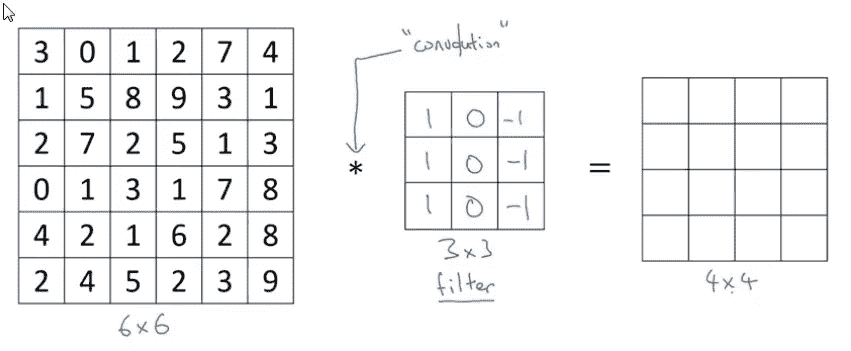

作为第一步，我们将把滤波器矩阵与我们的目标矩阵相结合，并执行逐元素乘法。如下图所示，3 * 1+1 * 1+2 * 1+0 * 0+5 * 0+7 * 0+1 *-1+8 *-1+2 *-1 =-5，并将最终值放入结果矩阵中。

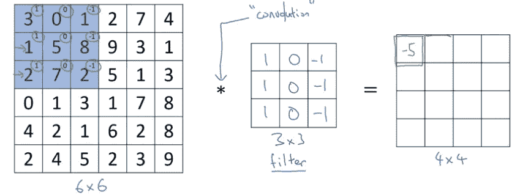

然后，滤波器矩阵将逐渐在水平方向上移动，并执行类似的乘法。

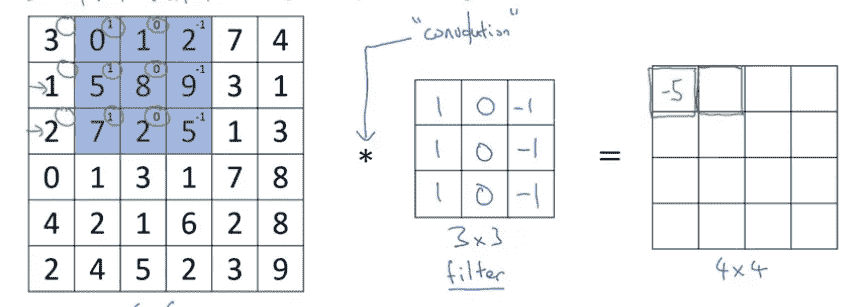

完整的卷积运算将生成 4 x 4 矩阵。得到的矩阵将代表图像中的边缘。

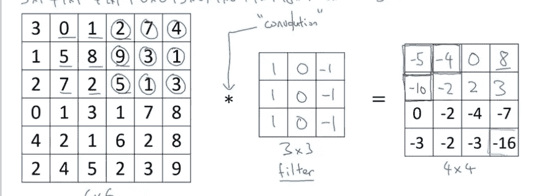

由于我们采用了 6 X 6 矩阵，因此得到的矩阵并不能提供任何清晰度，但是当图像或输入特征具有更高的矩阵(如 1000 维)时，它确实有助于定义边缘。

如果我们在滤波器矩阵上方旋转 90 度，我们也将能够检测水平边缘。不同的过滤器可以让你找到垂直和水平的边缘。事实证明，我们使用的 3×3 垂直边缘检测滤波器只是一种可能的选择。从历史上看，在计算机视觉文献中，有相当多的关于什么是最好的一组数字的争论。你还可以用其他的，可能是 1，2，1，0，0，0，-1，-2，-1。这被称为索贝尔过滤器。这样做的好处是，它让中间部分更重了一点。滤波器的另一个例子是 3，10，3，0，0，0，-3，-10，-3，这称为 Scharr 滤波器。这也有其他稍微不同的特性。我们不需要计算机视觉研究人员为 3×3 过滤器精心挑选这些数字，我们可以将这九个数字视为参数，并通过反向传播来学习它们。

## 填料

当我们有一个由 f x f 滤波器卷积的 N x N 图像时，输出滤波器的维数为 n-f+1。这种方法有两个缺点。

1.  每次应用卷积运算符时，图像都会缩小。因此，每当应用卷积运算符时，我们都不希望图像缩小。
2.  图像边缘的像素比中间的像素用得少。因此，边缘附近的大量有用信息有可能被浪费掉。

要解决上述两个问题，我们可以在应用卷积图像之前填充图像。例如，如果我们用一个像素填充 6 X 6 图像，使其成为 8 X 8 图像，并应用卷积运算，则得到的图像将是保留原始图像的 6 X 6 图像。如果 p 是我们增加填充的像素数，那么得到的矩阵的维数变成；n+2p-f+1 * n+2p-f+1。

就垫多少而言，有两种选择；有效卷积和相同卷积。有效的卷积意味着没有填充，相同的卷积意味着当我们填充时，输出矩阵的大小与输入矩阵的大小相同。可以使用 f-1/2 公式来选择填充大小，其中 f 是奇数滤波器。

## 交错回旋

在跨步卷积中，如果我们选择 stride =2，我们可以跳过两个模块，同时执行卷积运算，而不是通常的方式，如下所示。

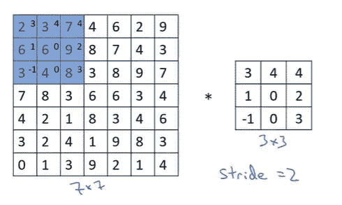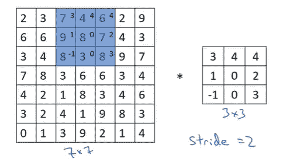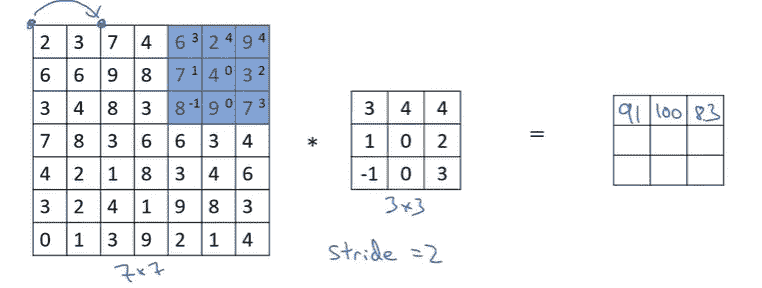

输入和输出尺寸可由以下公式控制。

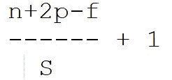

如果得到的数字不是一个整数，那么我们可以向下舍入这个数字。

## 体积上的卷积

我们看到了如何对 2D 图像执行卷积运算。现在，我们将了解如何对 3D 图像执行卷积运算。在这种情况下，我们将有一个第三维的图像，这将代表 RGB 颜色通道。需要记住的一点是，图像的第三个维度和滤镜是一样的。如果只使用一个滤波器，输出矩阵将是 2D。

**3D 卷积层的符号概要:**

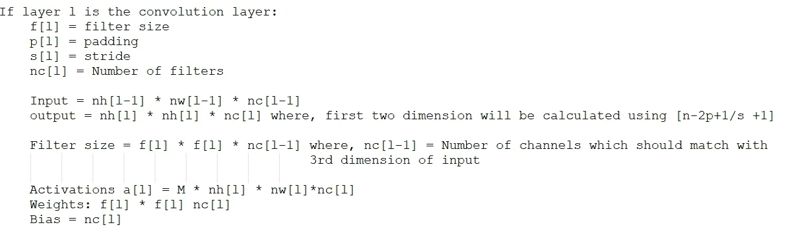

## 池层

假设我们有 4 * 4 的输入，我们希望将最大池应用于我们的输入，如下图所示。我们可以将区域分成不同的颜色，并从每个区域中获取最大数量。因此，最大拉伸背后的直觉是，如果我们将每个区域视为一组要素，那么每个区域的每个要素都会保留在输出中。

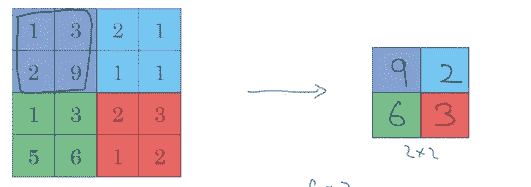

最大池化

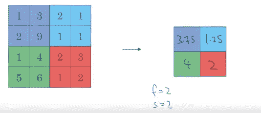

平均池

## 完整的卷积神经网络示例

在以下示例中，图像的输入尺寸为 32 * 32 * 7。卷积和池层被视为一个层，因为池层没有自己的参数。在卷积和合并图层后，输入矢量被展平为(400，1)矢量。然后，按照 softmax 算法在最后一层应用完全连接的层。

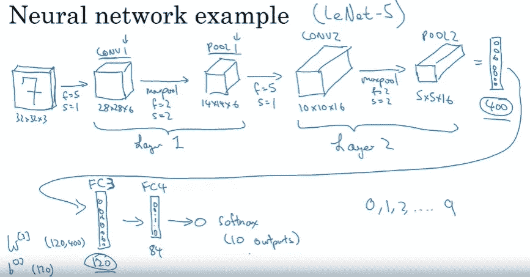

在卷积神经网络的端到端示例中，我们来到了一周的末尾。敬请关注下周的笔记。

快乐学习:)