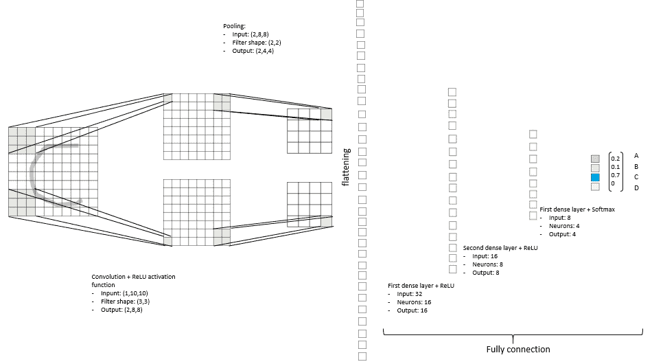

# 卷积神经网络

> 原文：<https://medium.com/analytics-vidhya/convolutional-neural-networks-80cd69f396a7?source=collection_archive---------13----------------------->

## 背后的建筑

神经网络是一类广泛用于深度学习的算法，深度学习是机器学习领域，其目标是通过多层深度算法学习数据表示。

因此，根据定义，神经网络由多层组成，每一层都接近对输入数据更有意义的洞察(如果你想了解更多…