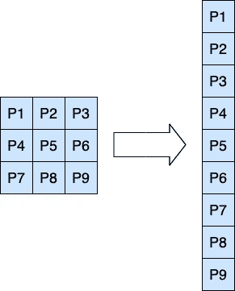
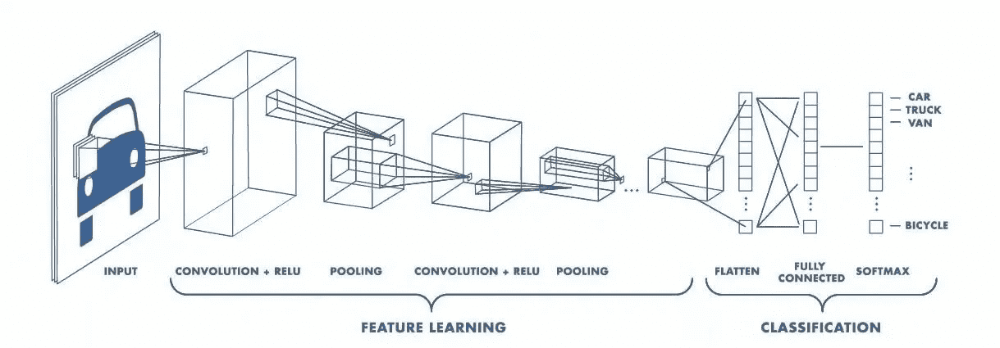
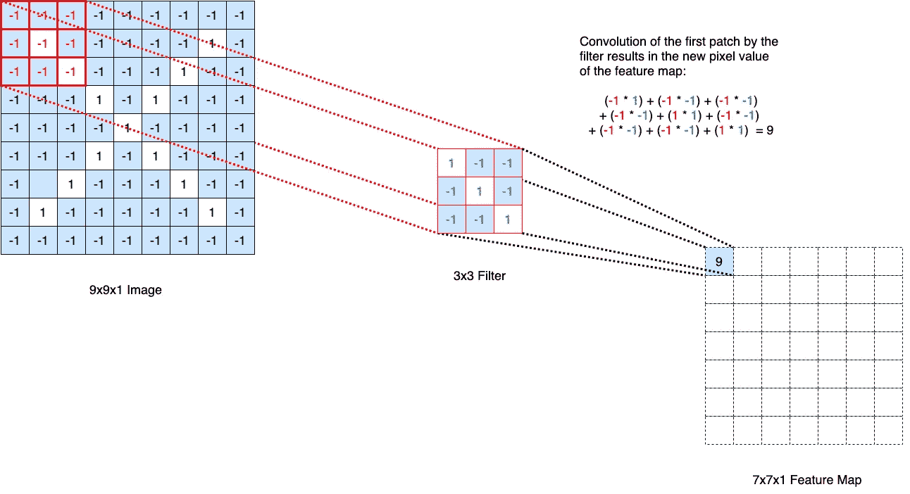
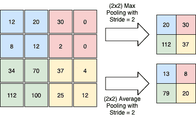
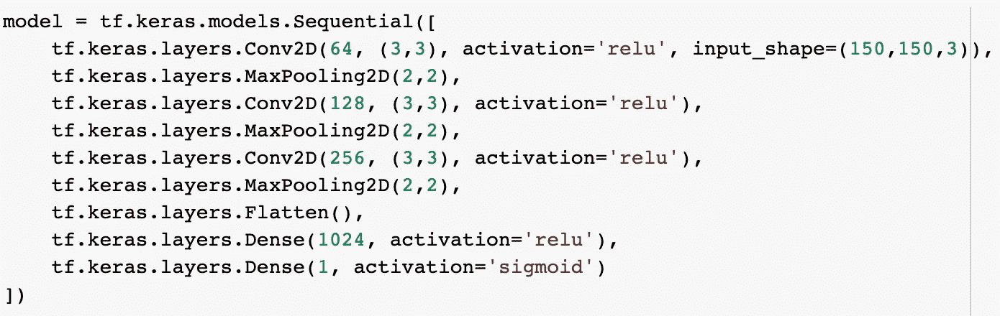

# 用于图像分类的卷积神经网络

> 原文：<https://medium.com/analytics-vidhya/convolutional-neural-networks-for-image-classification-c403159e81af?source=collection_archive---------21----------------------->

在[深度学习](/analytics-vidhya/a-brief-introduction-to-deep-learning-ccfd901d4611)中，卷积神经网络，也称为 ConvNets 或 CNN，是一种深度神经网络，已被证明在计算机视觉领域非常强大。它们被用于各种领域，如面部识别、医学成像、无人驾驶汽车等。

本文解释了卷积神经网络的工作原理，并举例说明了如何使用 TensorFlow 和 Keras 将其应用于图像分类。文章分为以下两个主要部分:

*   卷积神经网络的体系结构
*   使用 [TensorFlow](https://www.tensorflow.org/) 和 [Keras](https://keras.io/api/) 建立一个基本的 CNN 模型

# 卷积神经网络的体系结构

卷积神经网络是一种特殊的深度神经网络，能够捕捉图像中的空间相关性。在常规的前馈神经网络中，二维图像(像素值的矩阵)被折叠(即展平)成一维向量，并被馈入密集网络。这导致丢失二维图像的结构，从而丢失图像中的空间结构。此外，这需要密集的计算，因为图像中的每个像素都连接到网络中的每个神经元，导致大量的参数。

图 1:展平为 9x1 矢量的 3x3x1 图像

卷积神经网络的架构通过应用下面描述的**卷积**和**池**层来解决上述问题。

图 2:卷积神经网络的基本层

## 卷积层

卷积层是卷积神经网络的第一层，也是最重要的一层。它应用一种称为“卷积”的操作来执行特征提取，而无需手动提取这些特征。卷积运算应用于特定的过滤器(也称为内核)和图像的特定补片之间，以产生特征图。滤波器由一组图像卷积的权重表示。过滤器负责检测图像的特定模式，如边缘，它可以有几种大小；最常用的过滤器尺寸为 3x3、5x5 和 7x7。

图 3:9x9x 1 图像与 3x3 滤镜的卷积

可以应用下面的公式来确定最终的特征图大小:**[(W-K+2P/秒] + 1** ，其中 W 是输入音量，K 是内核大小，P 是添加的填充量，S 是步幅。*填充*是在边框周围用零填充输入图像的过程；这有助于控制输出的大小。一个*步距*代表过滤器在特定图像上卷积的像素数。在上面图 3 的例子中，W 是 9，K 是 3，S 是 1，P 是 0，这产生了 7x7x1 的特征图。

图 4:填充和步幅= 2 的卷积— [图源](https://github.com/vdumoulin/conv_arithmetic)

值得注意的是，实际上卷积层有多个滤波器，因此每个滤波器输出一个特征图。此外，输入图像由多个子图层组成(每个颜色图层一个)。例如，RGB 图像由三个通道组成，每个通道对应一种颜色(红色、绿色和蓝色)，而在灰度图像中只能找到一个通道。在图 3 所示的例子中，图像是 9x9x1，这意味着它是 9x9 像素的灰度图像。

卷积运算后，应用 [ReLU](https://machinelearningmastery.com/rectified-linear-activation-function-for-deep-learning-neural-networks/#:~:text=The%20rectified%20linear%20activation%20function,otherwise%2C%20it%20will%20output%20zero.&text=The%20rectified%20linear%20activation%20function%20overcomes%20the%20vanishing%20gradient%20problem,learn%20faster%20and%20perform%20better.) 激活函数引入非线性，并用零替换所有非负值。

## 汇集层

汇集层位于卷积层之后。它的作用是减少卷积图像的空间大小并提取主要特征。两种常见的池类型是:

*   Max pooling:返回内核覆盖的补丁的最大值
*   平均池:返回内核覆盖的补丁的平均值

图 5:最大池与平均池

## 全连接层

在卷积和池层之后，应用完全连接的层。简单地说，全连接层是一个负责分类任务的前馈神经网络。完全连接层的输入是合并或卷积层展平成 1D 数组的最终输出(即向量)。

# 使用 TensorFlow 和 Keras 的 CNN 模型

上一节强调了卷积神经网络的主要层并解释了它们的功能。本节描述如何使用 [TensorFlow](https://www.tensorflow.org/) 和 [Keras](https://keras.io/api/) 构建 CNN 模型。

构建模型有三种方式(顺序、功能和模型子类化)。图 6 显示了使用顺序方法创建的模型。该模型是一个基本的 CNN 模型，用于对[狗和](https://www.kaggle.com/tongpython/cat-and-dog)猫的图像进行分类，100 个时期的准确率约为 90%。

图 6:一个基本的 CNN 模型— [来源](https://github.com/kheirie/cats-vs-dogs/blob/main/cats_vs_dog.ipynb)

让我们一层一层地研究这个模型:

*   第一层使用 64 个 3×3 滤波器。使用步幅和填充的默认值，步幅为(1，1)，填充为“有效”(意味着不应用填充)。如果要应用填充，则应使用“相同的”填充。输入形状是(150，150，3)，因为图像是 150x150 像素，并且具有 3 个通道(即 RGB)。
*   接下来，使用 2x2 的池大小应用最大池层。
*   相同的结构重复两次:一个卷积层后面跟着一个最大池层。层数是一个可以调整的超参数。随着我们向卷积层的更深处移动，滤波器的数量增加；这有助于从低级特征(例如，垂直线、小圆圈等)中捕捉尽可能多的组合。)以便创建高级特征抽象。通常的做法是将过滤器的数量增加一倍。
*   然后是由两个密集层组成的全连接网络。由于密集网络需要 1D 要素阵列，因此输入会被展平。第一密集层具有 1024 个单元，并使用“relu”作为激活函数。由于所解决的问题是二进制分类问题，第二和最后的密集层由 1 单元(即输出)组成，并且“sigmoid”被用作激活函数。

卷积神经网络已经被用于各种领域，例如自然语言处理、语音识别和计算机视觉。他们最出名的是在图像分类任务上的成功。本文介绍了卷积神经网络架构的基础知识，重点是图像分类任务，并给出了一个如何使用 TensorFlow 和 Keras 构建 CNN 模型的示例。

**参考文献:**

*   [MIT 6。S191 (2020):卷积神经网络](https://www.youtube.com/watch?v=iaSUYvmCekI&list=PLtBw6njQRU-rwp5__7C0oIVt26ZgjG9NI&index=5)
*   [卷积神经网络综合指南 ELI5 方式](https://towardsdatascience.com/a-comprehensive-guide-to-convolutional-neural-networks-the-eli5-way-3bd2b1164a53)