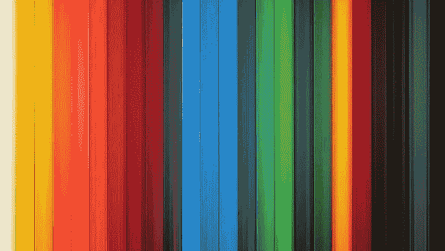
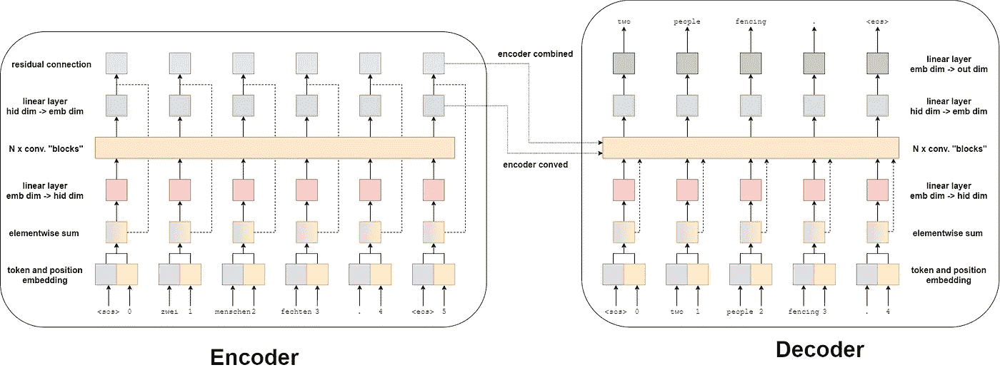
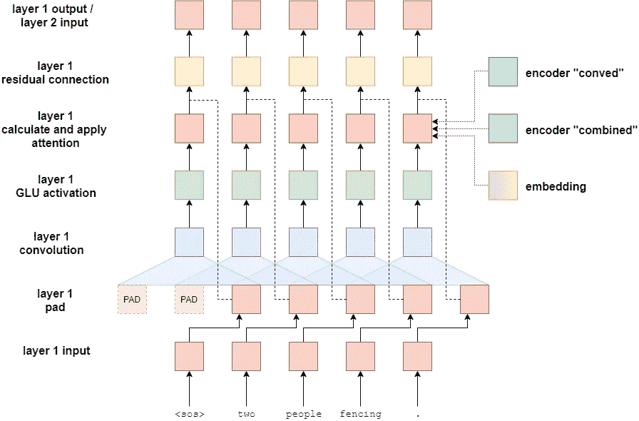
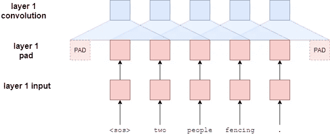
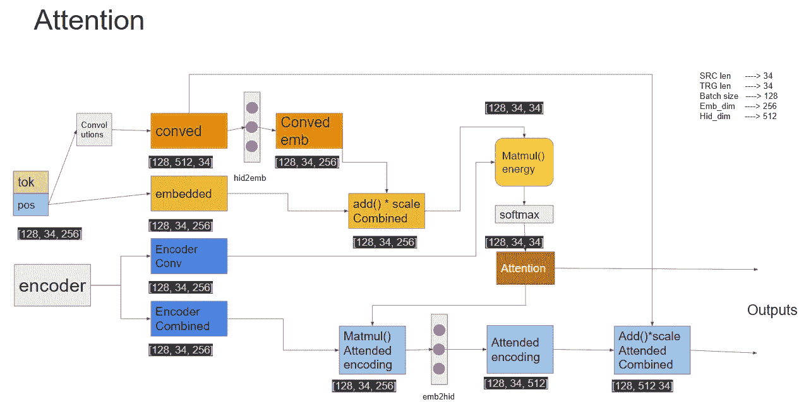

# 卷积和序列预测

> 原文：<https://medium.com/analytics-vidhya/convolutions-and-sequence-prediction-a7700bd22125?source=collection_archive---------27----------------------->

我们都知道 RNNs 擅长序列建模。递归的思想非常直观，当应用于各种任务时，如时间序列分析和 NLP，也证明了这一点。我们最初没有考虑序列建模问题中的卷积，因为我们痴迷于 CNN 如何未能捕获时间关系，而是特征之间的空间关系，正是这种质量使得 CNN 多年来在图像处理方面备受青睐。但是在序列建模和卷积之间有一个很好的关系，我们将在这里用一个示例代码一行一行地解释它。我们还将看到我们如何用一个技巧来解决时间关系的问题，并研究注意力，这形成了理解变形金刚的一个非常好的基础(似乎已经发展成为每个深度学习问题的通用答案)。

首先，让我们理解一个基于 RNN 的序列到序列架构，并从那里偏离到卷积。

基于 RNNs 的序列对序列模型

正如我们在上面看到的，该架构有两个部分，一个是位于潜在向量“Z”左侧的编码器，另一个是位于右侧的解码器。橙色方块是嵌入层，绿色和蓝色方块是潜在向量两侧的 RNN 细胞(LSTM/GRU)。观察值被一个接一个地送入构成潜在向量的网络。在解码器端，潜在向量作为输入之一被馈送到 RNN 单元。

在这种架构中，我们可以用卷积层代替 RNN 单元吗？是的，但这并不简单，因为 CNN 需要看到整个样本，而 rnn 看到的是一个接一个的“重现”。但是如果我们使用 CNN，我们如何补偿时间信息的损失呢？

让我们用工作代码找出所有的答案。

基于细胞神经网络的序列对序列模型

上述架构可能有一些可怕的组成部分，但它们都有一个目的。与之前的架构不同，这里的网络同时接收所有的单词。让我们先来看看编码器。

编码器

在底部，我们看到“令牌和位置嵌入”层，它采用令牌嵌入，因为这个网络没有递归，所以位置与单词嵌入一起添加(元素相加)。这样，网络就知道单词在句子或序列中的位置(这就是我们补偿时间信息损失的方式)。卷积块前后有线性层来转换维度。在顶部，我们看到来自元素态和的虚线连接，这类似于剩余网络(ResNet)中的“高速公路连接”。在这里，剩余连接有助于保留组合输出的位置信息，我们稍后将在关注层中使用该信息。

现在让我们看看卷积模块中发生了什么。

编码器—卷积模块

卷积由一维卷积层执行，根据问题的复杂性，我们需要多少卷积层就堆叠多少卷积层。门控线性单元(GLU)被用作卷积层之间的激活函数。GLUs 的工作类似于 LSTM 网络中的闸门，控制着有多少信息应该通过连续的层。该网络还保持类似于剩余网络的高速公路/跳跃连接。

现在让我们编码编码器部分。

我们已经成功地建立了编码器部分。现在让我们来看看解码器部分。

解码器

不同之处当然是我们将发送目标，但除此之外，您会注意到没有剩余连接，因为我们处于信息流的末端，编码器输出直接作为卷积层的输入。但是与我们一次发送一个单词来预测目标的 RNNs 不同，我们同时发送所有的目标。如果我们没有以正确的方式填充目标，模型可能会以不希望的顺序预测目标，因此我们按照下面卷积块中提到的方式进行填充。

解码器卷积模块

正如我们在上面看到的，填充只在左边完成，大小为 kernel_size-1。这将迫使模型在每个卷积过程中只看到目标的左侧。如我们在编码器部分看到的，如果填充在任何一侧，第一个卷积将看到“<sos>”和“2”，这在如下所示的推理中不会发生</sos>

填充错误

有了这个理解，现在让我们编码解码器部分。

编码器输出用于注意功能。注意力涉及的步骤如下图所示。

注意力

当用这种架构训练时，我们得到了极好的结果。

6.1 的测试分数令人印象深刻。找到下面一些翻译的注意力地图。

完整代码见 Colab 笔记本[https://Colab . research . Google . com/drive/1-cfH-pzutx 9m 5 safqyfgt 3 I _ Ji _ AEnzr？usp =分享](https://colab.research.google.com/drive/1-cfH-PzUTX9m5sAFQyFGT3i_Ji_AEnzr?usp=sharing)