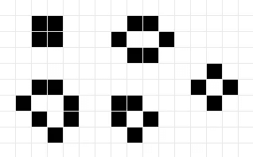
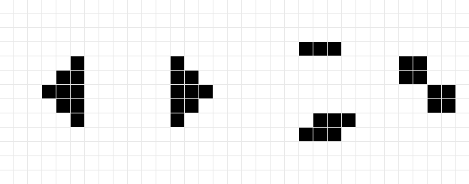
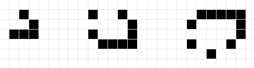

# 康威的生活游戏:编码挑战#2

> 原文：<https://medium.com/analytics-vidhya/conways-game-of-life-coding-challenge-2-c4327a1bbc47?source=collection_archive---------13----------------------->


这是探索初学者和专家面临的各种编码挑战的系列文章的第二部分。这些文章将深入探讨各种项目的概念，同时保持一切简单明了，易于理解。我将不包括任何真正的代码，以便让您可以用您喜欢的任何语言或框架来创建这个项目。

# 康威的人生游戏是什么？

《生命的游戏》是约翰·何顿·康威创造的细胞自动机。细胞自动机是网格上细胞的集合，它根据与相邻细胞状态相关的特定步骤进行进化。生活的游戏是一个非常流行的例子，它只有四个基本规则，可以进一步简化为两个条件。

## 规则 1(人口不足)

任何少于两个活邻居的活细胞都会死亡。

## 规则 2(生存)

任何有两个或三个活邻居的活细胞将继续存活。

## 规则 3(人口过剩)

任何有三个以上活邻居的活细胞都会死亡。

## 第 4 条(复制)

任何死细胞只要有三个活的邻居，它自己就会变成活细胞。

这可以简化为以下伪代码片段:

```
LOOP over all cells:
    IF this cell is alive:
        IF it has less than 2 or more than 3 neighbours:
            This cell is dead
    ELSE:
        IF it has exactly 3 neighbours:
            This cell is alive
```

这显然可以进一步简化成一个 IF/ELIF，但是我把它简化了，这样更容易理解。关于这个程序，需要记住的一件事是，每个单元格必须立即更新，而不是一个接一个地更新。这防止一个细胞复活或死亡并影响下一个细胞的更新。

# 探索生活

《生命的游戏》诞生于 1970 年，所以人们有足够的时间来研究和记录机器人的行为。生活中有三种基本模式。

## 静态模式



这些模式一旦画出来，就会保持平衡，不会改变。

## 振荡模式



这些图案一旦被画出来，就会以特定的周期振荡，总是会回到原来的状态。

## 滑翔机图案



这些图案一旦被画出来，就会向某个方向移动。它们将无限移动，除非碰到另一组单元格或网格的末端。

甚至存在创造和吸收/删除滑翔机的模式。它们为在生命游戏中创造的更复杂的系统奠定了基础，比如一个人在生命游戏中创造了一个系统来模仿生命游戏。

# 结论

一旦生命的规则被实现，如果没有画细胞的方法，这个程序就没用了。因此，可以对脚本进行简单的修改和扩展来增加功能:

*   (简单)允许在网格上绘制/删除单元格
*   (简单)允许暂停和播放自动机
*   (中等)允许在更大的网格上缩放和平移
*   (中等)为图案创建预设，以便轻松插入它们
*   (硬)使网格无限大