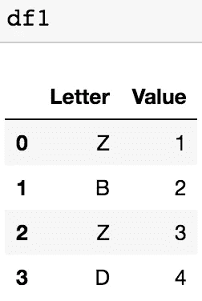

# 。copy()并不是“一文不值”

> 原文：<https://medium.com/analytics-vidhya/copy-is-not-for-the-birds-b2d71ab024c1?source=collection_archive---------19----------------------->

前阵子，我在看一篇关于 Python 中' is '和' == '区别的帖子。它真的帮助我理解了我在以前的项目中犯的一个错误。那么，这到底有什么关系。copy()？首先，让我们以' == '和'是'为例。我们从两个 int 开始:

问题解决了。' == '和'是'没有区别吧？不完全是。让我们再试一次，但用不同的号码:

我想珍妮做了一些让他心烦意乱的事。

那么，这到底是怎么回事？简而言之，' == '用于比较变量中存储的值。第一个例子，7 等于 7 吗？第二个例子，8675309 等于 8675309 吗？是的，这两个值是相等的。

那么‘是’究竟是什么在检验呢？简单的答案是:变量的 ID。让我们来看看这些场景的 id。

我感觉我在吃疯狂的药丸！！！

事实证明，对于整数，Python 会将相同的 id 赋给-5 到 256 范围内的值。除此之外，还会分配不同的 id。当我们使用数据框时会发生什么，为什么会这样。copy()甚至参与了这一切？让我们制作两个快速数据帧。

从我的经验来看，几乎总有一个原因会使一个新的数据框具有与原始数据框相同的所有值:能够更改一个 df 中的值，但不能更改另一个。让我们试试:

了不起。我们根据一个条件改变了一些值。显然，df2 发生了变化，而我们原来的 df1 将保持不变。对吗？

什么什么？两个 df 都变了…？我们回去检查一下。

因此，如果我们更改一个与另一个数据框具有相同 id 的数据框，即使我们仅将更改应用于一个变量名称，我们也会更改两个数据框。由于两个数据帧是同一个对象，这样就可以了。我们如何解决这个问题？最后，在所有这些小实验之后。copy()在此力挽狂澜！

我们应该检查明显的吗？

找到了。使用。copy()允许我们创建一个与原始数据框具有相同值的新数据框，但它会创建一个具有新 id 的新对象。

我真的希望这有助于节省未来解决这个问题的时间。使用。复制()以避免我以前犯的错误(幸运的是在学术环境中，而不是在工作环境中)，通过与你所有的朋友分享这一点点知识，成为聚会的生命。