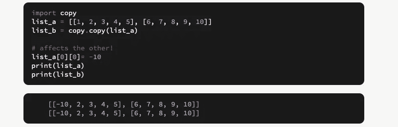

# 在 Python 中复制(带示例)

> 原文：<https://medium.com/analytics-vidhya/copying-in-python-with-examples-5706c86699e6?source=collection_archive---------10----------------------->

## 理解 python 中的浅层和深层拷贝


一张展示随机 python 代码的图片

当我在 python 上工作时，我试图通过使用' = '操作符将一个列表复制到一个新变量中。在做了一些改变后，我知道这不是我们在 python 中的正确做法。

几秒钟后，我浏览了多篇文章，理解了用 python 复制数据时使用的两个术语: ***浅层和深层复制。***

=操作符并不复制对象，它只是创建一个新的变量并共享原始变量的引用。

**注意**:下面使用的所有例子都取自 [python-engineer](https://www.python-engineer.com/courses/advancedpython/20-copy/) 和 [programiz](https://www.programiz.com/python-programming/shallow-deep-copy) 。

```
list_a = [1, 2, 3, 4, 5]
list_b = list_a

list_a[0] = -10print(list_a)
print(list_b)
```

我们一定想知道 **print(list_a)** 将*输出* [-10，2，3，4，5]，因为我们对 list_a[0] = -10 做了更改，所以 1 被替换为-10。那么我们是绝对正确的。

但另一方面，如果我们也在想 **print(list_b)** 会*输出*【1，2，3，4，5】那么这次我们就完全错了。

这里所发生的是在做 list_b = list_a，它只创建了一个新的变量与*相同的引用*。因此，修改一个会影响另一个。两者都将*输出*与[-10，2，3，4，5]相同的值。

实际上，有时您可能希望保持原始值不变，只修改新值，反之亦然。在 Python 中，有两种创建副本的方法:

1.  浅拷贝
2.  深层拷贝

为了使这些复制工作，我们使用了`copy`模块。

使用这个模块非常简单。

```
import copycopy.copy(x) # for shallow copy
copy.deepcopy(x) # for deep copy
```

**就是这样！**

让我们用几个例子来理解一下。

*   **浅拷贝:**浅拷贝创建了一个新的对象，它存储了原始元素的引用。所以，浅层拷贝不会创建嵌套对象的拷贝，相反，它只是拷贝嵌套对象的引用。这意味着复制过程本身不会递归或创建嵌套对象的副本。

我的 list_a 只有 1 级深，因此改变 list_b 不会影响 list_a。


浅层复制— 1 级深度

但是对于嵌套对象，在第 2 层或更深的层上修改会影响其他层！



浅复制— 2 级或更多级深

*   **深度复制:**深度复制创建一个新对象，并递归地添加原始元素中存在的嵌套对象的副本。

深层副本创建原始对象及其所有嵌套对象的独立副本。


深度复制

如果你在评论中遇到任何困难，请告诉我。