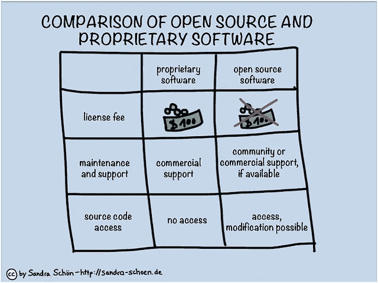

# 数据科学领域的版权许可

> 原文：<https://medium.com/analytics-vidhya/copyright-licences-in-the-world-of-data-science-8b6682c074f5?source=collection_archive---------14----------------------->

# 介绍

数据科学的花里胡哨很容易让人分心；具有令人瞠目结舌的结果的最先进的模型，或者可能是一个大型的、开源的和完美注释的数据集。但是你经常想到这些模型和数据集的可用性限制吗？

图一。[来源](https://www.notion.so/jaotheboss/Licenses-in-the-World-of-Data-Science-b27e5a2c7c324c62a4d7eca73e7bc4bf#f4d574a2180c4ca985b2e7f555fb9b71)

我从一个数据科学爱好者到一个数据科学专业人士的转变，经常引起我对这个问题的关注和好奇。现在我在商业环境中工作，使用某些模型和数据集的限制比以往任何时候都更普遍。这是因为每个模型和数据集通常都是以不允许商业开发的方式许可的，或者如果允许商业开发，会有某种警告。

现在我已经为自己做了一些关于软件许可的研究，我想写一篇文章来分享我所学到的东西。尤其是那些我不容易找到的东西。只是一个免责声明:大部分，如果不是全部，关于这些许可证的信息来自版权法。我不是律师，所以如果你需要更多的帮助来理解这些法律和许可证的本质，请联系。

# 软件许可证

先说大局。所有这一切都始于知识产权及其保护方式。[知识产权](https://www.wipo.int/about-ip/en/)指的是智力创造；意思是说任何事都是你智力的结果。知识产权的一个常见例子是歌曲作者想象、创作并赋予其生命的歌曲。就像一首歌是歌曲作者的知识产权一样，一个由代码组成的软件是编码者的知识产权。

为了确保功劳归于创造者而不是抄袭者，有各种各样的法律手段可以用来保护知识产权。这就是软件许可证的用武之地。软件许可证是保护知识产权的法律工具之一，它们通过管理软件的**使用**和**再分发**来实现这一点。

图二。[来源](http://www.differencebetween.net/technology/difference-between-open-source-and-proprietary-software/)

受版权法保护的软件有两种常见的类别，因此也有不同种类的许可证:自由和开放源码软件(FOSS)和专有软件。这两类许可证的概念差异在于授予**修改**和**重用**软件的权利。这实质上意味着，如果一个软件的源代码可以公开找到，那么这意味着该软件是自由和开源的；你可以复制代码并以任何你认为合适的方式编辑它。但是，如果不能公开找到软件的源代码，那么该软件应该是专有的。所以，为了确保你不会被起诉，请坚持使用自由/开源软件。

还有许多其他类型和定义的软件许可证，但对于本文，我将只关注这两类许可证。

# 自由和开放源码软件

让我从解决自由和开放源码软件的基础开始；什么才算开源免费？为了这篇文章，让我们用这些定义。术语“开源”意味着对你的软件的再分发和源代码的公开**有**非侵入性限制。因此，如果您在这些许可证下看到一个软件，他们有义务将该软件的源代码共享给公众。如果你想知道一个软件怎样才能被认为是完全开源的，你可以看看这里的。****

这里的“免费”不是指财务意义上的免费，而是指不受限制地使用软件的自由。这就是为什么自由/开源软件是我经常关注的东西，因为他们给了我尝试各种数据科学解决方案的灵活性。

但是，这里有一个问题。如果有人修改了原始源代码，并在发布限制的情况下发布该软件的这一派生版本和进一步的派生版本，该怎么办？这将对自由/开源软件的再发布造成越来越多的干涉性限制。以这种方式想想，如果每个人都决定他们的原始软件的派生是专有的，并设置发布限制，自由/开源软件的数量将永远不会增加。我们将生活在一个对自由/开源软件有更多限制的世界里。另一方面，如果不允许他们以这种方式自由使用软件，那么这难道不违背“自由”的定义吗？

这就是为什么自由/开源软件有两种主要的许可类型。这两种不同类型的许可证旨在解决上述任何一个问题，它们是:

1.  版权所有许可证，以及
2.  许可许可证

# 版权所有许可证

图三。[来源](https://www.conversioner.com/blog/your-competitors-have-no-idea-what-theyre-doing-stop-copying-them)

这些类型的许可证是面向那些将“免费”定义为**重新发布**软件的自由。使用 copyright left 许可证许可您的软件将确保您的软件的任何衍生产品也将在与您自己相同的条件下重新分发。例如，如果您在左版权许可下发布您的软件，唯一的条件是注明原作者，那么您的软件的任何派生也必须在左版权许可下以相同的唯一条件进行许可。因此，这确保了开源软件的健康发展。

发布自由也意味着你可以以任何你想要的方式发布软件。即使是收费的。说句实话，**是的，自由/开源软件可以用于商业目的**。但是警告是，没有人能阻止你的客户免费分发你的软件，从而使你的商业策略变得无用。这对于左版权许可证来说尤其如此，因为这种许可证的核心是关于重新发布的自由和对软件的可访问性。不过，对于许可许可证来说，情况有所不同。

# 许可许可证

这些类型的许可证是针对那些将“免费”定义为使用软件的自由的。这意味着任何人都可以对源代码进行编辑或添加内容，然后按照自己的意愿发布这些经过编辑的代码，甚至作为商业软件发布。因此允许任何人出售他们的软件衍生产品，而不用担心客户免费赠送软件。这并不能解决不断增加的再分发限制，但它确保了任何人都可以出于任何目的自由使用该软件。对此唯一的警告是需要**把功劳还给最初的创造者**。这意味着商业软件或为商业目的制作的软件不一定是专有软件。尽管人们可能很容易将专有软件视为商业软件的同义词，但事实绝对不是这样。

因此，带有许可许可证的软件衍生产品可以被视为独立于原始产品。这对于数据科学家或开发人员来说是完美的，因为它允许他们在软件的基础上构建，或者创建他们独有的东西，或者改进软件本身。一旦他们做到了这一点，他们就可以通过将他们的作品许可为专有软件来自由获利，甚至允许其他人通过在版权或许可的许可下许可他们的作品来利用他们的改进。

图 4。[来源](https://www.startschoolnow.org/how-to-become-independent-from-your-parents/)

图五。GitHub 的许可证下拉菜单

有许多不同的许可证被认为是左版权或许可的。简单地看一下 Github 上的下拉菜单就可以看到一些例子。这些许可证中的每一个显然也有不同的功能，但通常仍然集中在上述两种许可证类型中的任何一种。

在从整体上理解了软件许可之后，下一个合乎逻辑的步骤是研究许可的细节。要么找出将代码放在哪个许可证下，要么调查您感兴趣的数据集或模型的许可证。对于这些许可证的具体情况，我建议检查他们的官方网站或其他文章，通过简单的搜索可以更容易地找到。

# 专有软件

与自由和开放源码软件相比，专有软件仅仅意味着软件的所有者对源代码拥有专有权，并被允许限制软件的使用、修改和再分发。这简化了我们一直在问的每一个问题，因为一切都由业主决定。专有软件之所以被认为是商业软件的同义词，是因为它们通常需要付费才能获得。一个例子是 Adobe 的软件；在那里人们必须每月付费才能使用该软件。话虽如此，也没有什么能阻止所有者向全世界免费发布软件，也许你所需要做的就是友好地提出要求🙂

# 结论

只是我吸收了所有这些信息后的一些想法和反思。关于专有软件没有什么其他的，这就是为什么作为一名数据科学家，我对自由/开源软件领域更关心和感兴趣。自由的话题以及自由意味着什么，一直以来都被哲学地讨论着，这是有充分理由的。同样的事情也发生在自由/开源软件上，许多人都在讨论自由软件到底意味着什么。我认为很难挑选一个客观上更好的自由软件定义。尽管许可许可证(免费使用)可以帮助数据科学家改进他们正在开发的商业软件，但左版权许可证(免费再分发)在数据科学技术的扩散和改进方面是有效的。因此，为了商业和技术的发展，我看到了平衡这两种软件的重要性。

我认为看到某些种类的许可证如何有能力促进和授权，但也抑制和限制某些业务和行业也是很有趣的；这使我对这些法律文书的创造者有一种感激之情。一个有趣的事实是，你不一定要声明你想受到什么样的许可保护。只要你把你的想法写在纸上(或任何其他形式)，你就自动受到版权法的保护。

如果你想了解更多关于软件许可和每个许可的细节，这里有一些我觉得相当有用的文章。

[https://towards data science . com/a-data-scientists-guide-to-open-source-licensing-c 70 D5 Fe 42079](https://towardsdatascience.com/a-data-scientists-guide-to-open-source-licensing-c70d5fe42079)

[https://towards data science . com/the-6-common-open-source-licenses-and-what-them-mean-715d 434 c 2109](https://towardsdatascience.com/the-6-common-open-source-licenses-and-what-they-mean-715d434c2109)