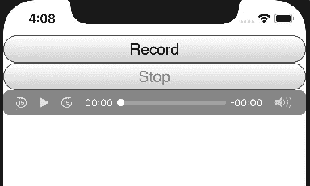

# 科尔多瓦录音机插件教程

> 原文：<https://medium.com/analytics-vidhya/cordova-audio-recorder-plugin-tutorial-51217e504bd1?source=collection_archive---------26----------------------->

# 插件概念

插件 cordova audio recorder ，可用于在 android 和 iOS 上录制音频。这个插件提供了一个 ***api，可以使用全局对象`cordova.plugins.audioRecorder`访问*** 。

API***由两个函数*** 组成，一个用于执行录制，一个用于停止录制。

***为录制***`cordova.plugins.audioRecorder.audioCapture_Start`功能，可以使用，它有如下签名:

```
cordova.plugins.audioRecorder.audioCapture_Start(audioCapture_Ended , audioCapture_Failed , audioCapture_duration )
/*
audioCapture_duration : 
    Number of seconds to perform audio
    recording . If non is provided , 
    the default is 60 seconds . 
audioCapture_Ended : 
    call back function , called when the
    amount of time allocated for recording , 
    audioCapture_duration , has elapsed . 
    It receives as argument , a String 
    containing the path of the recorded 
    m4a audio file .
    If cordova.plugins.audioRecorder.audioCapture_Stop 
    is  called , while performing recording , 
    then the registered methods ,
    using this function , are not called  , 
    instead the registered functions , using 
    cordova.plugins.audioRecorder.audioCapture_Stop
    are called .    
audioCapture_Failed : 
    If any error happens during the 
    act of performing the recording , 
    this method is called . It is passed.   
    a String , detailing the error .*/
```

要 ***停止录制*** ，要么在经过设定的时间后自动停止，要么使用`cordova.plugins.audioRecorder.audioCapture_Stop`方法随时停止，其签名如下

```
cordova.plugins.audioRecorder.audioCapture_Stop(audioCapture_Ended , audioCapture_Failed )
/*
audioCapture_Ended : 
   call back function , called when successfully , 
   the audioCapture_Stop function , stopped the
   recording of the audio file . 
   audioCapture_Ended receives as argument , a 
   String containing the path to the recorded file . 
audioCapture_Failed : 
   Called when performing the recording has 
   failed . 
   It receives as an argument , a String , detailing 
   the error .*/
```

***录制的音频文件*** 是一个`m4a`音频文件，保存在应用程序的缓存目录中。系统可能会清空低存储上的缓存目录。因此，为了永久存储，记录的文件必须复制到其他地方。

***对于 iOS，在***`config.xml`文件中，在应用程序的根目录下，必须添加以下内容，在`widget`元素之间:

```
<edit-config file="*-Info.plist" mode="merge" target="NSMicrophoneUsageDescription">
    <string>Describe why microphone permission is needed</string>
</edit-config>
```

对于 iOS，同样，为了 ***允许在后台*** 中继续录制，您应该在`config.xml`文件中添加`UIBackgroundModes`:

```
<platform name="ios">
...
    <config-file parent="UIBackgroundModes" platform="ios" target="*-Info.plist">
        <array>
            <string>audio</string>
        </array>
    </config-file>
...
</platform>
```

# 插件演示

***创建一个应用*** 如下:

```
$ cordova create audio-recorder-plugin-demo com.twiserandom.mobileapps.demo.audioRecorderPluginDemo "Audio Recorder Plugin Demo"
$ cd audio-recorder-plugin-demo/
$ cordova platform add ios
$ cordova platform add android
$ cordova plugin add cordova-plugin-audio-recorder
```

***编辑*** `www/index.html`文件，看起来像这样:

```
<!DOCTYPE html >
<html >
    <head >
        <meta name="format-detection" content="telephone=no" >
        <meta name="msapplication-tap-highlight" content="no" >
        <meta name="viewport" content="user-scalable=no, initial-scale=1, maximum-scale=1, minimum-scale=1, width=device-width" >
        <title>Audio Recorder Plugin Demo</title><style >
        *{
            margin: 0px;
            padding: 0px; }
        html{
            box-sizing: border-box; }
        html * , html *::before , html *::after{
            box-sizing: inherit; }.app_AudioRecorder_Demo{
            display: flex;
            flex-direction: column; }.app_AudioRecorder_Demo button{
            font-size : 19px; }.app_AudioRecorder_Demo audio {
            width : 100%; }
    </style> </head><body ><div class="app_AudioRecorder_Demo" ><button
                id="recordButton"
                onclick="audioCapture_Start(this )">
                    Record </button><button
                id='stopButton'
                disabled
                onclick="audioCapture_Stop(this )">
                    Stop </button><audio id="audioPlayer" autoplay controls ></audio> </div><script type="text/javascript" src="cordova.js"></script><script>
            document.addEventListener('deviceready', onDeviceReady , false );function onDeviceReady( ){
                deviceIsReady = true;
                recordButton = document.getElementById('recordButton' );
                stopButton = document.getElementById('stopButton' );
                audioPlayer = document.getElementById('audioPlayer' ); }function audioCapture_Start( ){
                if(deviceIsReady ){
                    buttons_recordStop_Toggle( );
                    cordova.plugins.audioRecorder.audioCapture_Start(
                                        audioCapture_Ended ,
                                        audioCapture_Failed
                                        , 20 ); }}function audioCapture_Stop( ){
                if(deviceIsReady ){
                    cordova.plugins.audioRecorder.audioCapture_Stop(
                                        audioCapture_Ended ,
                                        audioCapture_Failed ); } }function audioCapture_Ended(audioRecording_path ){
                buttons_recordStop_Toggle( );
                audioPlayer.src = audioRecording_path; }function audioCapture_Failed(audioRecording_error ){
                buttons_recordStop_Toggle( );
                console.log(audioRecording_error ); }function buttons_recordStop_Toggle( ){
                if(stopButton.disabled == true){
                    recordButton.disabled = true ;
                    stopButton.disabled = false; }
                else{
                    recordButton.disabled = false ;
                    stopButton.disabled = true; } }</script>
    </body>
</html>
```

***编辑*** `***config.xml***`文件，在应用程序的根目录下，看起来像这样:

```
<?xml version='1.0' encoding='utf-8'?>
<widget id="com.twiserandom.mobileapps.demo.audioRecorderPluginDemo" version="1.0.0" ae ka" href="http://www.w3.org/ns/widgets" rel="noopener ugc nofollow" target="_blank">http://www.w3.org/ns/widgets" xmlns:cdv="[http://cordova.apache.org/ns/1.0](http://cordova.apache.org/ns/1.0)"> <name>Audio Recorder Plugin Demo</name>
    <description>
        A sample Apache Cordova application that responds to the deviceready event.
    </description>
    <author email="[dev@cordova.apache.org](mailto:dev@cordova.apache.org)" href="[http://cordova.io](http://cordova.io)">
        Apache Cordova Team
    </author> <content src="index.html" /> <access origin="*" />
    <allow-intent href="[http://*/*](/*/*)" />
    <allow-intent href="[https://*/*](/*/*)" />
    <allow-intent href="tel:*" />
    <allow-intent href="sms:*" />
    <allow-intent href="mailto:*" />
    <allow-intent href="geo:*" /> <platform name="android">
        <allow-intent href="market:*" />
    </platform>
    <platform name="ios">
        <allow-intent href="itms:*" />
        <allow-intent href="itms-apps:*" />
        <!-- Optional , allow recording in background for ios -->
        <config-file parent="UIBackgroundModes" platform="ios" target="*-Info.plist">
            <array>
                <string>audio</string>
            </array>
        </config-file>
    </platform> <edit-config file="*-Info.plist" mode="merge" target="NSMicrophoneUsageDescription">
        <string>Describe why microphone permission is needed</string>
    </edit-config>
</widget>
```

***运行应用*** :

```
$ cordova emulate ios
$ cordova emulate android
```



*原载于 2021 年 2 月 8 日 https://twiserandom.com*[](https://twiserandom.com/cordova/cordova-audio-recorder-plugin-tutorial/)**。**