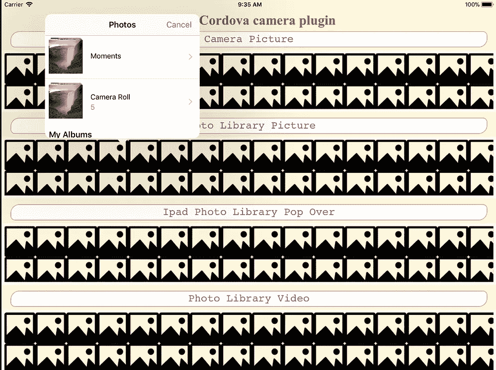

# 科尔多瓦插件相机教程

> 原文：<https://medium.com/analytics-vidhya/cordova-plugin-camera-a-tutorial-6103954c3674?source=collection_archive---------2----------------------->

为了使用 Cordova***捕捉和选择*图像**或视频，可以使用*插件*[Cordova-plugin-camera](https://cordova.apache.org/docs/en/latest/reference/cordova-plugin-camera/)。

```
$ cordova create demo-camera com.twiserandom.mobileapps.demo.camera "Demo Camera"
# Create an application , in a folder named
# demo-camera , with an id of 
# com.twiserandom.mobileapps.demo.camera 
# and a title of : Demo Camera$ cd demo-camera$ cordova platform add ios
# add the iOS platform$ cordova platform add android
# add the android platform$ cordova plugin add cordova-plugin-camera
# add the camera plugin .
```

向 ***获取一张图片或一段视频*** ，该功能:

```
navigator.camera.getPicture(cameraSuccessFct , cameraErrorFct , cameraOptions );
```

可以使用。

在触发了`deviceready`事件之后，`navigator.camera`对象是全局可访问的。

`navigator.camera.getPicture`函数将两个函数作为参数，一个在成功时调用，另一个在出错时调用。它的最后一个参数是一个包含媒体和摄像机选项的对象。该对象具有以下格式。

```
/*Camera object properties .*/
{
  "mediaType": 
      Camera.MediaType.PICTURE
        /*Select a picture , default .*/
      Camera.MediaType.VIDEO
        /*Select a video , returns url only .*/
      Camera.MediaType.ALLMEDIA
       /*Select from all media .*/ ,
  "sourceType": 
      Camera.PictureSourceType.PHOTOLIBRARY 
        /*Source , device photo library .*/
      Camera.PictureSourceType.CAMERA
        /*Source camera , default .*/
      Camera.PictureSourceType.SAVEDPHOTOALBUM
        /*Source Roll album , iOS only .*/ ,
  "cameraDirection": 
      Camera.Direction.BACK
        /*Back Camera default .*/
      Camera.Direction.FRONT
        /*Front Camera .*/ ,
  "destinationType":
      Camera.DestinationType.DATA_URL
        /*Return a base 64 encoded stream .*/
      Camera.DestinationType.FILE_URI
        /*Return a file url , default , for example : 
             file:///var/mobile/Containers/Data/...../cdv_photo_001.jpg 
          In iOS , Pictures or videos are saved in the app , 
          temporary directory , which is emptied when the app
          exits .*/
        Camera.DestinationType.NATIVE_URI ,
       /* In iOS files are saved in the save Photo Album , when
          source type is camera , and editing is ignored when
          source type is PHOTOLIBRARY .*/
  "saveToPhotoAlbum": true
      /*True or false , save image to 
        photo album , default true .*/ ,
  "encodingType": 
      Camera.EncodingType.JPEG
        /*Returned image encoding type 
          JPEG , default .*/
      Camera.EncodingType. PNG
        /*Returned image encoding type
          PNG  .*/ ,
  "quality": 50
      /*Quality of the captured image , 
        between 0 and 100 , default is
        50 .*/ ,
  "allowEdit": false
      /*True or false .
        Allow image editing before
        selection , iOS only , default
        false .*/ ,
  "targetWidth": undefined
      /*Width in px to scale image , 
        must be used with targetHeight .
        Aspect ratio remains constant 
        , default undefined .*/ ,
  "targetHeight": undefined
      /*Height in px to scale image , 
        must be used with targetWidth .
        Aspect ratio remains constant ,
        default undefined .*/ ,
  "correctOrientation": undefined
      /*True or false .
        Correct rotation of device using capture
        by rotating the image ,
        default undefined .*/ ,
  "popoverOptions": undefined 
      /*default , undefined . 
        new CameraPopoverOptions(
           /*Where to anchor PopOver , iPad , iOS only .*/
            300, /*x coordinate px  , default 0 .*/
            300, /*y coordinate px , default 32 .*/
            100, /*width px element where anchor popover , default 320 .*/
            100, /*Height px element where anchor popover , default 480 .*/
            Camera.PopoverArrowDirection.ARROW_ANY, 
              /*Specify location arrow location on
                popover , iPad , iOS Only , default ARROW_ANY
                  Camera.PopoverArrowDirection.ARROW_UP
                  Camera.PopoverArrowDirection.ARROW_DOWN
                  Camera.PopoverArrowDirection.ARROW_LEFT
                  Camera.PopoverArrowDirection.ARROW_RIGHT
                  Camera.PopoverArrowDirection. ARROW_ANY */
            300, /*width pop over , default 0 , apple default */
            600  /*Height pop over , default 0 , apple default */ ) .*/
}
```

对于 iOS，要让这个插件工作，必须设置 ***应用在做什么*** 。这可以通过编辑位于应用程序根目录下的`config.xml`文件来实现，如下所示:

```
<?xml version='1.0' encoding='utf-8'?>
<widget id="com.twiserandom.mobileapps.demo.camera" version="1.0.0" ae jd" href="http://www.w3.org/ns/widgets" rel="noopener ugc nofollow" target="_blank">http://www.w3.org/ns/widgets" xmlns:cdv="[http://cordova.apache.org/ns/1.0](http://cordova.apache.org/ns/1.0)">
    <name>Demo Camera</name>
    <description>
        A sample Apache Cordova application that responds to the deviceready event.
    </description>
    <author email="[dev@cordova.apache.org](mailto:dev@cordova.apache.org)" href="[http://cordova.io](http://cordova.io)">
        Apache Cordova Team
    </author>
    <content src="index.html" />
    <access origin="*" />
    <allow-intent href="[http://*/*](/*/*)" />
    <allow-intent href="[https://*/*](/*/*)" />
    <allow-intent href="tel:*" />
    <allow-intent href="sms:*" />
    <allow-intent href="mailto:*" />
    <allow-intent href="geo:*" />
    <platform name="android">
        <allow-intent href="market:*" />
    </platform>
    <platform name="ios">
        <allow-intent href="itms:*" />
        <allow-intent href="itms-apps:*" />
    </platform><!-- IOS  camera access  , for cordova camera plugin -->
    <edit-config target="NSCameraUsageDescription" file="*-Info.plist" mode="merge">
        <string>need camera access to take pictures</string>
    </edit-config><edit-config target="NSPhotoLibraryUsageDescription" file="*-Info.plist" mode="merge">
        <string>need photo library access to get pictures from there</string>
    </edit-config><edit-config target="NSLocationWhenInUseUsageDescription" file="*-Info.plist" mode="merge">
        <string>need location access to find things nearby</string>
    </edit-config><edit-config target="NSPhotoLibraryAddUsageDescription" file="*-Info.plist" mode="merge">
        <string>need photo library access to save pictures there</string>
    </edit-config><preference name="CameraUsesGeolocation" value="false" />
    <!-- Enable Geolocation for iOS , set the value to
         true , it seems there is a problem , with geolocation
         enabled in this plugin . -->
<!-- IOS  camera access  , for cordova camera plugin -->
</widget>
```

将`www/index.html`编辑成这样:

```
<!DOCTYPE html>
<html><head>
    <meta charset="utf-8">
    <meta http-equiv="Content-Security-Policy" >
    <meta name="format-detection" content="telephone=no">
    <meta name="msapplication-tap-highlight" content="no">
    <meta name="viewport" content="initial-scale=1, width=device-width, viewport-fit=cover">
    <meta name="color-scheme" content="light dark">
    <link rel="stylesheet" href="css/index.css">
    <title>Demo Cordova camera plugin</title>
</head><body>
    <div class="app">
        <h1>Demo Cordova camera plugin</h1>
        <div class="xmpl">
            <div  
                class="button" 
                ontouchstart="btnTouchStart(this )"
                ontouchend="btnTouchEnd(this )"
                onclick="exampleOneClicked(this.nextElementSibling )">
                    Camera Picture</div>
            
        </div>

        <div class="xmpl">
            <div  
                class="button" 
                ontouchstart="btnTouchStart(this )"
                ontouchend="btnTouchEnd(this )"
                onclick="exampleTwoClicked(this.nextElementSibling )">
                    Photo Library Picture</div>
            
        </div><div class="xmpl">
            <div  
                class="button" 
                ontouchstart="btnTouchStart(this )"
                ontouchend="btnTouchEnd(this )"
                onclick="exampleThreeClicked(this.nextElementSibling )">
                    Ipad Photo Library Pop Over </div>
            
        </div><div class="xmpl">
            <div  
                class="button" 
                ontouchstart="btnTouchStart(this )"
                ontouchend="btnTouchEnd(this )"
                onclick="exampleFourClicked(this.nextElementSibling )">
                    Photo Library Video</div>
            <video  
                controls 
                preload="metadata"
            />
        </div> </div>
    <script src="cordova.js"></script>
    <script src="js/index.js"></script>
</body></html>
```

将`www/css/index.css`文件编辑成这样:

```
*{
    border : 0px;
    margin : 0px;
    padding : 0px;
    border-radius: 0px; }html{
   box-sizing: border-box; }html * , html *::after , html *::before{
    box-sizing: inherit; }body{
    padding: env(safe-area-inset-top) env(safe-area-inset-right) env(safe-area-inset-bottom) env(safe-area-inset-left);
    -webkit-user-select: none; /* Safari */        
    -moz-user-select: none; /* Firefox */
    -ms-user-select: none; /* IE10+/Edge */
    user-select: none; /* Standard */ 
    background-color: cornsilk; }h1{
    margin: 6px 0px;
    font-size : 28px;
    text-align: center; 
    color : firebrick; }.xmpl {
    display: flex;
    flex-direction: column; }.xmpl .button{
    text-align: center;
    margin: 0px 19px 6px;
    border : 1px solid salmon;
    border-radius: 18px 9px;
    color: rgb(172, 55, 123);
    padding : 4px 0px;
    font-family: monospace; 
    font-size : 22px;
    background-color: white; }.xmpl .button.touchStart{
    background-color: transparent; }.xmpl img , .xmpl video{
    object-fit: contain;
    width : 100%; 
    border : 6px solid ivory;
    background-image: url(data:image/png;base64,iVBORw0KGgoAAAANSUhEUgAAAEAAAABACAYAAACqaXHeAAAAAXNSR0IArs4c6QAAAAlwSFlzAAALEwAACxMBAJqcGAAAAVlpVFh0WE1MOmNvbS5hZG9iZS54bXAAAAAAADx4OnhtcG1ldGEgeG1sbnM6eD0iYWRvYmU6bnM6bWV0YS8iIHg6eG1wdGs9IlhNUCBDb3JlIDUuNC4wIj4KICAgPHJkZjpSREYgeG1sbnM6cmRmPSJodHRwOi8vd3d3LnczLm9yZy8xOTk5LzAyLzIyLXJkZi1zeW50YXgtbnMjIj4KICAgICAgPHJkZjpEZXNjcmlwdGlvbiByZGY6YWJvdXQ9IiIKICAgICAgICAgICAgeG1sbnM6dGlmZj0iaHR0cDovL25zLmFkb2JlLmNvbS90aWZmLzEuMC8iPgogICAgICAgICA8dGlmZjpPcmllbnRhdGlvbj4xPC90aWZmOk9yaWVudGF0aW9uPgogICAgICA8L3JkZjpEZXNjcmlwdGlvbj4KICAgPC9yZGY6UkRGPgo8L3g6eG1wbWV0YT4KTMInWQAABvFJREFUeAHtmUuoHEUUhhNfEcVHFMWFUQkmvvEFQuJGwUQEQXEZMRvBhboIWVxXujGCuvCxVRQRBBVBI6IY0V5IlCD4WKhgcuEK14WKoEGJz8T/666/u6anZ6Yn0zPpvvce+LuqTtU5dc6pU1XdM6tXFbRD1buFdcLqgp3Wyu1Sd2ubR0qW0V4UXhGejvt2q0HncgI+pys9p/IJ4S/hhMA7rHIp0nFyikX+V1gjzJHa3wkbhP+E44WlTDiPz/Z1vxtEBvKAr1X/XTCfvi4TDp8pXCrYR/xJMx0GIC0o9wlLlb6UY7GvR+IVpgP6MSuW1Hbw1v45+GZf00Mv8PLixFBje4ClRBzyUO6XGRk7ezo6lK7H/ce6TtbGmYs97OVhN9dAP6oCgMK2EvZyVlU5S5rDH+is+vqoKwFwyuL8WcJW4UqB7bogfChwnUNkR1WA0s6qh1P9H3VSfzcM8sFRJTNLnp1nzgcFDjLb7JLAPC+cIkBl271lEvUh4xuPeq6srQGw8c+UbP1bbWC7ceZz4VQBslxc71wAvEW3ywscxOF49eABUv5QqL+mEoqzwMHoVACc+jgyL+BolfMOAqWz4QbVIQdhYADckQ1v19O2bZJZ6wW/vw+zkiBAd2ZFcd+Hdl/hSfo6WsBwBvChBtm5rFX9tMzG6u5+bpsDYGvtlNvjlCOD1uYA2PgDweM6gbDM/roybQ6AX2Y+lTPfCxxonAPDyEF6OwxyQAbKtDkAGM81yMn+WPCAADgwgZUWjPUvWm+pTtDqBCwXRoGvkLa9CXqRnpON2GlbsdcgKPC/Fc4QIMvF9UQNxsXXaY9SOtsWAKc1jjwkHBSws4xXxTtdgHz/Z60iGIkYyOUB8JuWB7axxGAHgR9vXxJuF64SThIWhD0Cv/ZAtVOfwV0IAHY6CNjLL1YvwCwRjjNu1EHZIzaLALB6GDYpoYPUZW/bWXSinzNgLMcRhKYZAKcthmM0ZROBwNmqm0Ds8Sk+KceXHizhFcJhvtF9SjsogyVn3DONAJBVpOMa4XVhUXhUgJoMQGO6nJpNvAd4S50sZz8RrJuSKwziZ6xJCMe9cGRanUB4fKLx2JJfg6rnRk4aADt/mnR+EfT+qZLJPOFdqkOTBiHTUjxHBWFgANxRqDq6Gs7jJD9Y7hOuEfj1hm0Qr9Ibal8rEGwHTNXaZEd3SWJeeDiSdF/Eqld1mh5tBng1z9N0GIU+3sut16X1c4+fI0AEpy557BYJWCclL0dQHOiMUzy90IlYyDgje/4aK4bXr+E8jl0gfCasF1h53tDKxIoz9lzhvdDJYWnjAmtg4RW+Pow4pBJ9c8IjArocJFXrk6PpFar7LeCVv1hT/SSgp2rlrd+lx3BDQATAzqWMAQ9vmRfVjy7s5Xr1au5UHfK4rJU9HeRETWQtQz1lWCFlnQDY+Ss0/tegg5VHvg4chF0aD1UZnfUUTzuxVyzmsBMEgdWHd58A2b6sVWRZIkYsSz03uG4GWPl1kv0jyI/jPJPGK7ddbch6s1bv0xnCS9UPAjrstOvopL5NgGJ9Dl4iPmMcPOpjBcBKN0nOTrtE2TiIHbgRQ0TWn7WKpx3YIJaNt8OeM9Z3RxC1Pp8NifiMtw7qudGjMsDKbpaMJ7eMjRi3tCG/Sec6jBFVbQc7cKv6yw7Ec1ofvFtQJsJuBzBRvUfeHQwcRijB2duEjwRSksmqjBW7NuEYevkh432B2wO9Zbu8BS5RH8QCVBH6yAToA2GzgP6qW0ns/olSZulh53mL8wHJJJM672nQzza6THgzMFklOx1YaXF5aFT1eRxBIIgQK361wBsphN4+ggmIFKWdRJGd3Bb66I/TzLJNlL4ZntUckOem7oxIVK9rg/05KBmCC30slOVTBkwLOAC8xkL3CvSXBc1rsrQN9zOxiOwwkcYLAvPFB96w+X1A/yKZs4V3grznQTZ3zkwHgL4Hov66kw4zaFQfe9sH7FYMEHkhLlTdWeIxo/TR7yB8o/pXArzYl4EB4PPVg2OBOpNOMsZbjH27UTDdpAp63T/OHLFMT/C8tzwJJRPvEB4XGAxVjct6mn/6EGPl9whrwxQ+AHF8XEKnHe87QB1JD/DbHXzzPGaWpVN3b/D2KZXMb34jtsQnLZFBKa+bOE67L1rizYp8PW7WhNwMF4WJG81GOx10pwVBOJaOx7ZQZzFw2iW8xqgqAI0pb1DRVJzHvq4EoMFY9qpqdD/1qu5GayUA3Vin6Vm5kgHTi203NK9kQDfWaXpWrmSAYstb1nKlw2TAgeA93/zLhezrPN/JfP1tEfjM5NW4TR9CMqdxIuP59Ysv4SetfbcqjXxfd0gPPvesNr8C3SOcX+J3PSNYWBP1ReFlgd8YVv0P70OSy5ru1vcAAAAASUVORK5CYII=);
    min-height: 128px;
    margin-bottom: 12px; }
```

编辑`www/js/index.js`如下所示:

```
document.addEventListener('deviceready', onDeviceReady, false);let isDeviceReady = false;function btnTouchStart(btn ){
    btn.classList.add("touchStart" ); }function btnTouchEnd(btn ){
    btn.classList.remove("touchStart" ); }function onDeviceReady( ) {
    isDeviceReady = true ; }function exampleOneClicked(img ){   
    /* Front Camera , disable save to phone ,
        data url , quality 60 . */
    if(isDeviceReady ){
        let pictureOptions = {
            cameraDirection: Camera.Direction.FRONT,
            saveToPhotoAlbum: false,
            destinationType: Camera.DestinationType.DATA_URL,
            quality: 60 };function fctSuccess(image ){
            img.src = `data:image/jpeg;base64,${image }`; }function fctFailure(errorMsg ){
            console.log(errorMsg ); }navigator
            .camera
            .getPicture(fctSuccess , 
                        fctFailure , 
                        pictureOptions ); }}function exampleTwoClicked(img ){
    /* Photo Library , allow Edit */
    if(isDeviceReady ){let pictureOptions = {
            sourceType: Camera.PictureSourceType.PHOTOLIBRARY ,
            allowEdit: true };function fctSuccess(image ){
            img.src = image; }function fctFailure(errorMsg ){
            console.log(errorMsg ); }navigator
            .camera
            .getPicture(fctSuccess , 
                        fctFailure , 
                        pictureOptions ); }}function exampleThreeClicked(img ){
    /* Photo Library , popover  */
    if(isDeviceReady ){let pictureOptions = {
            sourceType: Camera.PictureSourceType.PHOTOLIBRARY ,
            popoverOptions: new CameraPopoverOptions(
                0 , 
                200 , 
                300, 
                400 , 
                Camera.PopoverArrowDirection.ARROW_UP , 
                0 , 
                0 ) };function fctSuccess(image ){
            img.src = image; }function fctFailure(errorMsg ){
            console.log(errorMsg ); }navigator
                .camera
                .getPicture(fctSuccess , 
                            fctFailure , 
                            pictureOptions );function updatePopOverLocation(){
            let cameraPopoverHandle = new CameraPopoverHandle();
            let cameraPopoverOptions = new CameraPopoverOptions(
                    100 , 
                    300 , 
                    300 , 
                    600 , 
                    Camera.PopoverArrowDirection.ARROW_DOWN , 
                    0 , 
                    0 );
            cameraPopoverHandle.setPosition(cameraPopoverOptions ); }window.setTimeout(updatePopOverLocation , 4000 ); }}function exampleFourClicked(vdo ){
    /* video ,  Photo Library */
    if(isDeviceReady ){let pictureOptions = {
            mediaType: Camera.MediaType.VIDEO ,
            sourceType: Camera.PictureSourceType.PHOTOLIBRARY };function fctSuccess(video ){
            vdo.src = video; }function fctFailure(errorMsg ){
            console.log(errorMsg ); }navigator
            .camera
            .getPicture(fctSuccess , 
                        fctFailure , 
                        pictureOptions ); }}
```

运行应用程序:

```
$ cordova emulate ios 
# on iOS$ cordova emulate android 
# on android
```



当设置`sourceType`到`Camera.PictureSourceType.CAMERA`和`destinationType`到`Camera.DestinationType.FILE_URI`时，可以通过调用方法清理 iOS 上的 ***临时文件:***

```
navigator.camera.cleanup(cleanupSuccessFct, cleanupFailFct );
/*Call the cleanup method , to clean
  temporary files on iOS .
  Pass an on success function and an 
  on failure function  .*/function cleanupSuccessFct( ){
    console.log("Cleanup Success" ); }function cleanupFailFct(errorMsg ){
    console.log(errorMsg ); }
```

*原载于 2021 年 1 月 13 日 https://twiserandom.com*[](https://twiserandom.com/cordova/cordova-plugin-camera-a-tutorial/)**。**