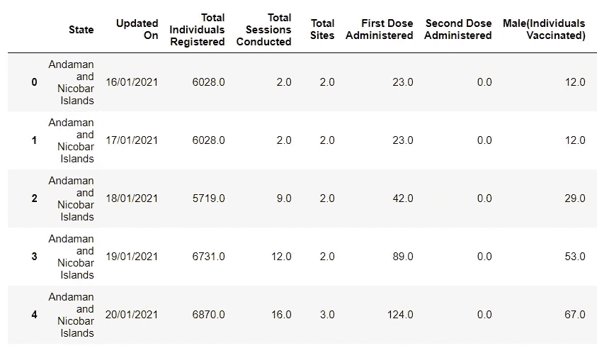
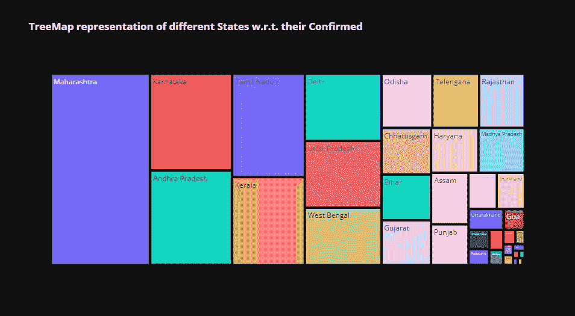
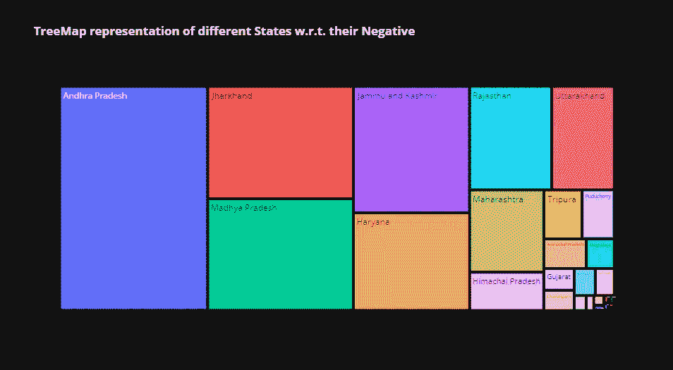

# 电晕数，电晕测试，电晕接种印度:数据分析

> 原文：<https://medium.com/analytics-vidhya/corona-numbers-corona-testing-corona-vaccinations-data-analysis-8b907d6202e3?source=collection_archive---------7----------------------->


印度是目前受电晕影响最严重的国家，每日死亡人数超过 360 万，死亡人数超过 3000 人。重要的是，我们要密切关注所有的数字，以便理解第二波浪潮的影响和后果。

# 数据分析

我收集了来自[](https://www.kaggle.com/sudalairajkumar/covid19-in-india)**的数据，是从[**covid 19 印度**](https://www.covid19india.org/) **刮来的。**zip 文件包含电晕数、电晕测试、电晕疫苗的数据。**

**打开笔记本，导入所有库。**

```
import pyforest
import plotly.express as px
```

# **疫苗接种数据**

**疫苗接种数据在 state 列中有一些行，其州名为 **India** ，假设州名没有记录，则改为 India。**

```
Vaccination_data= pd.read_csv("covid_vaccine_statewise.csv", index_col="State")
Vaccination_data
```

****

**我们将删除 state 列中值为 India 的行。**

```
Vaccination_data=Vaccination_data.drop(["India"])
```

****

```
Vaccination_data=Vaccination_data.reset_index()
```

****

```
Vaccination_data.drop(['Updated On'],inplace = True, axis = 1)
Vaccination_data.columns
```

****

## **疫苗接种可视化**

```
columns=['Total Individuals Registered', 'Total Sessions Conducted',
       'Total Sites ', 'First Dose Administered', 'Second Dose Administered',
       'Male(Individuals Vaccinated)', 'Female(Individuals Vaccinated)',
       'Transgender(Individuals Vaccinated)', 'Total Covaxin Administered',
       'Total CoviShield Administered', 'Total Individuals Vaccinated',
       'Total Doses Administered']for i in columns:
    fig=px.treemap(Vaccination_data, values=i, path=["State"], template="plotly_dark",title="<b>TreeMap representation of different States w.r.t. their {}</b>".format(i))
    fig.show()
```

********************************

****观察**:马哈拉施特拉邦和拉贾斯坦邦在给人们接种疫苗方面最为积极。U.P .是人口最多的州，第二大州的人口几乎是 UP 的一半，所以他们的疫苗表现令人沮丧。**

## **每个州每 100 人的疫苗接种率**

```
population=pd.read_csv("population_density.csv")
Vaccination_data= pd.read_csv("covid_vaccine_statewise.csv")
population = population.rename(columns={'Population\n(%)':'population', 'State or union territory':'State'})
```

**我之前已经使用过人口数据集，并且已经下载到我的系统中，你可以从 [**Kaggle**](https://www.kaggle.com/aravindm27/india-medical-resources/) 下载。**

**我们将在“州”列中加入疫苗接种和人口表。**

```
vaccination_population= pd.merge(Vaccination_data, population, on='State', how='left')
```

**要添加一个新列来查找疫苗接种的百分比，我们将创建一个新列，并在 2 个不同的列上使用百分比公式。**

```
vaccination_population["vaccination_per_100"]=(vaccination_population["Total Individuals Vaccinated"]/vaccination_population["population"])*100fig=px.treemap(vaccination_population, values=vaccination_per_100, path=["State"], template="plotly_dark",title="<b>TreeMap representation of different States w.r.t. their {} people</b>")
    fig.show()
```

****

**观察**:喀拉拉邦和古吉拉特邦做得很好，因为它们是相对较大的邦。****

# **电晕数**

**因为数据中没有提到活动的 covid 号，所以我们将创建一个新列。**

```
india_data= pd.read_csv("covid_india.csv")india_data = india_data.rename(columns={'State/UnionTerritory':'States','Cured':'Recovered'})
india_data.head()
india_data['Active'] = india_data['Confirmed']-india_data['Recovered']-india_data['Deaths']
india_data.head()
```

****

## **电晕箱数量可视化**

```
columns = ['Recovered', 'Deaths', 'Confirmed', 'Active']
for i in columns:
    fig = px.treemap(india_data,values=i,path=['States'],template="plotly_dark",title="<b>TreeMap representation of different States w.r.t. their {}</b>".format(i))
    fig.show()
```

****************

****观察**:马哈拉施特拉邦在所有的排行榜上都名列前茅，并且在遏制疫情蔓延方面做得非常糟糕。**

# **测试数字**

```
test_data = pd.read_csv("StatewiseTestingDetails.csv")
test_data = state_data.fillna(0)
test_data.dropna(inplace=True)test_data['Negative'] = pd.to_numeric(test_data['Negative'],errors='coerce')
test_data.info()
```

****

## **Covid 测试数字可视化**

```
columns = ['TotalSamples', 'Negative', 'Positive']
for i in columns:
    fig = px.treemap(test_data,values=i,path=['State'],template="plotly_dark",title="<b>TreeMap representation of different States w.r.t. their {}</b>".format(i))
    fig.show()
```

************

****观察**:马哈拉施特拉邦并不是进行核试验次数最多的邦，这是一大败笔。**

# **结论**

**马哈拉施特拉邦和拉贾斯坦邦在疫苗接种方面做得很好。而北方邦在测试中表现出色。马哈拉施特拉邦的测试数据糟糕透顶。**