# 统计学中的相关性。

> 原文：<https://medium.com/analytics-vidhya/correlation-in-statistics-fbf1a2e1bc5d?source=collection_archive---------7----------------------->

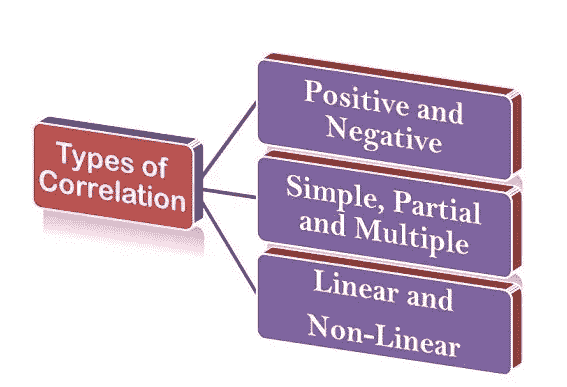

相关性是一个术语，用于衡量两个定量变量(如身高、体重)之间线性关系的强度。

有时两个或多个事件是相互关联的，即一个事件的任何变化都可能影响其他事件。如果这种变化以数字数据的形式表示，并且它们看起来是相互依赖的，那么就说它们是相关的。比如，人体的体重随着身高和年龄的增加而增加。在这里，年龄和体重是两个独立的特征，但是它们是相互依赖的，所以它们是相关的。如果两个或两个以上的变量如此相关，以至于一个变量的增加可能引起其他变量的变化，我们就说它们是相关的。

# 相关系数

相关系数 r 是描述两个区间或比率水平变量之间统计关系程度的汇总度量。对相关系数进行缩放，使其始终介于-1 和+1 之间。当 r 接近 0 时，这意味着变量之间的关系很小，r 离 0 越远，无论是正向还是负向，两个变量之间的关系越大。

**关联类型:**

根据变量变化的方向和比例以及数据系列的数量，相关性可能有以下几种类型:

1)正相关和负相关。

2)线性和非线性相关性。

3)简单、多重和偏相关。

1)图解法:

当非独立序列的值被绘制在坐标纸的 O-X 轴上，而独立序列的值被绘制在坐标纸的 O-Y 轴上时，将获得一个线性或非线性的图形，该图形将简单地给出相关的方向。

如果两个独立系列的图形线从左到右向上移动，则相关性为正，但如果一个系列的图形线从左到右向上移动，而另一个独立系列的图形线从左或右向下移动，则相关性为负。

2)散点图或点图法。

这是一种图解法，其中独立数据系列的值绘制在 O-X 轴上，非独立数据系列的值绘制在 O-Y 轴上，然后成对的值绘制在图表纸上。

通过这种方式，可以获得不同数据点的点的图形。这些点以不同的形式分散开来。因此，这些图被称为散点图。

图表上分布的点越多，变量之间的相关程度就越低。绘制的点越靠近直线，相关程度越高。相关度用“r”表示。

以下类型的散点图说明了变量 X 和变量 y 之间的相关程度。

1) **完全正相关(r=+1):**

当所有的点都位于从左下角到右上角的直线上时，称之为完全正相关。

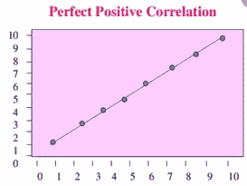

**2)** **完全负相关(r=-1):**

完全负相关当所有点都位于从左上角到右下角的直线上时，变量被称为负相关。

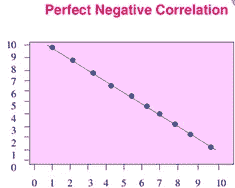

**3)** **高度正相关(r =+高):**

当绘制的点落在窄带之下时，相关程度高，当这些点显示从左下角到右上角的上升趋势时，相关程度为正。

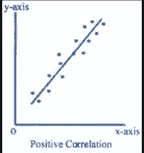

**4)** **高度负相关(r =-高):**

当绘制的点落在窄带中并且从左上角到右下角显示下降趋势时，负相关程度高。

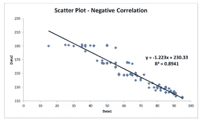

**5)** **低程度正相关(r =+低):**

当图中的点高度分散，并显示从左下角到右上角的上升趋势时，变量之间的相关性被认为是低的，但却是正的。

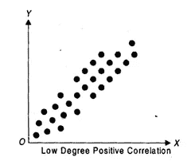

**6)** **低度负相关(r =-低):**

当点分散在图形上时，相关度较低且为负值，并显示从左上角到右下角的下降趋势。

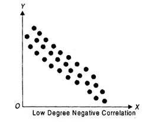

**7)**无相关性(r=0):

当这些点随意地散布在图上，并且没有显示出任何特定的模式时。我们可以说变量也互不相关。这里不存在相关性，因此 r = 0。变量 x 和 y 被认为是独立的。

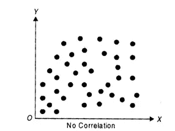

**斯皮尔曼的排名方法:**

Charls Spearman 教授发明了一种确定相关性的方法，在这种方法中，一个系列中所有数据的值都按降序或升序排列。在这个排序过程中，最高值被赋予等级 1，下一个更高的值被赋予等级 2，依此类推。在某些数列中，两个或多个数据的值是相似的。

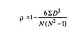

获得两个系列的相应数据的秩(D)之间的差(D = R1-R2 ),该差可以是正数或负数。然后，确定 D2 的值和 D2 的和(= ∑D2)。

**卡尔·皮尔逊的方法:**

卡尔·皮尔逊相关系数是表达两个变量之间关系的最佳尺度。通过它可以得到变量之间的关系的程度和方向。然而，以下是它的一些局限性。

(1) If 是基于变量之间的线性关系的假设。

(2)与其他方法相比，这种方法的计算比较困难。

(3)相关系数受极端观测值对的影响很大。

(4)正确地解释相关系数总是困难的。

皮尔逊法俗称皮森相关系数，是实践中使用最广泛的定量方法。相关系数用“r”表示。

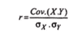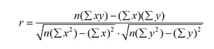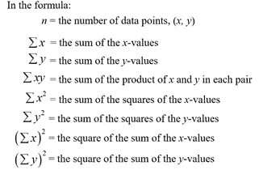

**同时偏差的相关系数:**

该方法用于指示相关性是正向还是负向，尤其是在以数据的短期波动为特征的数据序列中。

每个观察值相对于前面数据的偏差方向[正(+)或负(-)]在不同系列的不同栏中标出。

两个系列各自数据的偏差符号相乘(+ x + = +，+X-=-和-X-=+)，乘积记录在单独的列中。

记录偏差符号乘积栏中正号的总数，称为同时偏差(= C)

同时偏差的相关系数(RC)由以下公式确定:

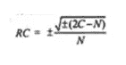

其中，C =两个偏差乘积的列中+号的总数，N =系列中观察值的数量。

**回归线的方法:-**

回归线在预测过程中很有用。其目的是描述因变量与一个或多个自变量的相互关系。

使用从回归线获得的方程作为一个分析师，他可以通过为自变量输入不同的值来预测因变量的未来行为。

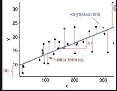

我们可以通过下面的公式计算斜率和常数:

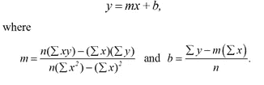

**参考:** [**Scribbr**](https://www.scribbr.com/statistics/standard-normal-distribution/) ，[**mathisfun**](https://www.mathsisfun.com/data/standard-normal-distribution.html)