# 相关矩阵

> 原文：<https://medium.com/analytics-vidhya/correlation-matrix-5e764bcee34?source=collection_archive---------1----------------------->

# 介绍

相关矩阵是显示变量之间相关性的矩阵。它以矩阵的形式给出了所有可能的值对之间的相关性。

我们可以使用相关矩阵来总结大型数据集，并根据它来识别模式和做出决策。我们还可以看到哪个变量与哪个变量更相关，并且我们可以可视化我们的结果。

相关矩阵是显示变量的行和列表格。矩阵中的每个单元都包含相关系数。相关矩阵与其他类型的统计分析相结合。

它在简单线性回归、多元线性回归和套索回归模型等回归技术中非常有用。在回归技术中，我们有几个自变量，并在此基础上预测因变量。

在多元线性回归中，相关矩阵决定了模型中独立变量之间的相关系数。

# 我们为什么要使用相关矩阵？

相关矩阵给你一个关于数据集的概念。

**例子** : —如果你想根据燃料类型、变速器类型、车龄…等来预测一辆车的价格。因此，在这种情况下，相关矩阵对于预测汽车价格非常有用。

由此，我们可以看出，如果两个变量之间的关系:-

如果关系是 1，那么关系是强的

如果该关系为 0，则意味着该关系是神经的

如果关系是-1，那么它意味着关系是负的或不牢固的

*   通过使用相关矩阵，您可以了解数据集，分析数据集，并可视化结果。
*   大多数数据科学家认为这是建立任何机器学习模型之前的主要步骤，因为如果你知道哪个变量与哪个变量更相关，你就会知道哪个对我更重要。
*   相关矩阵是一种统计技术，它给出-1 到 1 之间的值，您可以用这些值来确定变量之间的关系。

# 描述

## 相关系数

在开始相关矩阵之前，你应该知道什么是相关系数及其类型。

相关系数用于检查两个变量之间的关系有多强。相关系数有几种类型。

相关系数类型:-

1.样本相关系数。

2.人口相关系数。

3.皮尔逊相关系数。

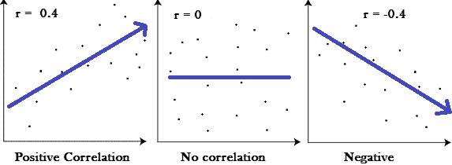

# 如何计算相关系数

示例:—找出给定表格的相关系数

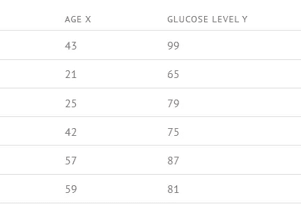

**第一步** : —计算表格中每个数值的年龄 X *血糖水平 Y。

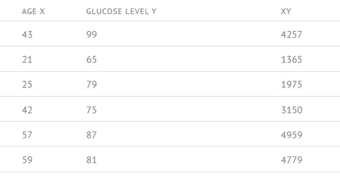

**第二步:——**现在计算表中每个值的 x2 和 y2。

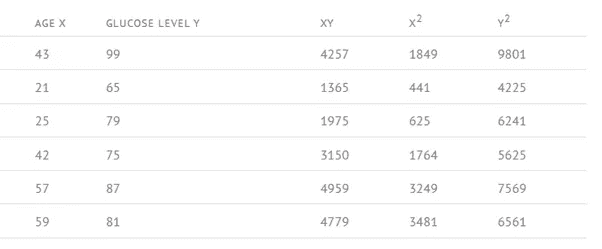

**步骤 3: —** 现在计算每一列的 sigma(σ)。

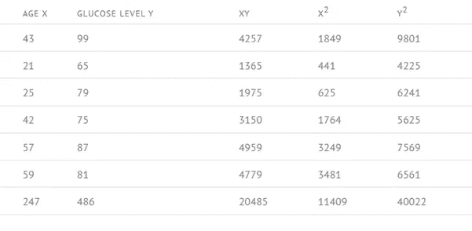

**第四步:—** 现在我们要使用皮尔逊相关系数公式。

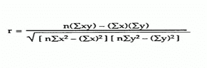

值为:-

n = 6，xy = 20485，σx = 247，σy = 486，σ= 11409，σ= 40022

r = 0.5298……根据公式

通过将值放入这个公式，我们可以计算两个变量之间的关系有多强，因此通过输入值，我们得到 **0.5298** ，这意味着我们的关系大于神经关系，小于正关系

这就是我们如何计算每个值的相关系数，并做一个矩阵，然后我们称它为相关矩阵。

# 用 Python 实现

我们可以很容易地在 python 中实现相关矩阵，因为 python 有很大的库支持，对于统计分析，我们有 pandas 和 NumPy 来处理数据。

大多数数据分析师都在用 python 实现相关矩阵，因为 python 有一个强大的软件包，可以帮助我们进行数据预处理，我们还可以制作很棒的可视化效果。

您需要遵循一些特定步骤来实现相关矩阵:-

## 步骤 1:从各种来源收集数据。

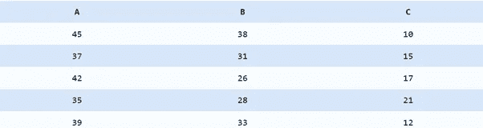

从各种来源收集相关矩阵的数据。以下数据是关于 3 个变量的。

## 步骤 2:用熊猫创建一个 A，B，C 的数据框架。

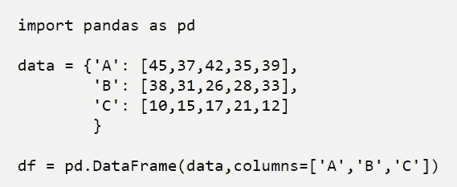

我们已经使用 pandas 库创建了数据框架。现在我们有了 A，B，C 三个变量。

## 步骤 3:使用“corr”函数创建一个相关矩阵。

## 输出:-

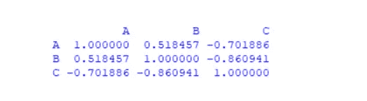

通过使用“corr”函数，我们已经创建了一个相关矩阵，看起来像上面的图像。

第三步:**使用 matplotlib 和 seaborn 可视化表示相关矩阵。**

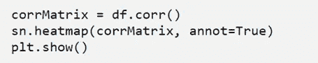

## 输出:-

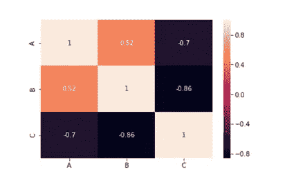

所以，这就是我们如何在 Python 中实现一个相关矩阵，通过它我们可以知道哪个变量与哪个变量高度相关。

积极、消极和中性关系是:-

1.1 表示正相关

2.0 表示中性关系

3.-1 表示负相关

# 相关矩阵的应用

*   我们可以总结大量的数据，目的是发现模式。在我们上面的例子中，可观察到的模式是所有变量彼此高度相关。
*   输入其他分析:-
*   例如，当成对排除缺失值时，人们通常使用相关矩阵作为探索性因子分析、验证性因子分析、结构方程模型和线性回归的输入。
*   作为检查其他分析时的诊断:-
*   例如，对于线性回归，大量的相关性表明线性回归估计是不可靠的。

我们可以在机器学习模型中使用相关矩阵来获得更高的准确性，我们还可以创建混淆矩阵来理解数据。

我们也可以在卫生保健部门使用这种统计技术来预测疾病。

# 结论

相关矩阵是一种非常有用的统计技术，通过它我们可以得到关于数据集的概念或对数据集的概括，从而可以对数据集进行分析并据此做出决策。如果你正在建立任何机器学习模型，我们需要数据并选择哪个功能更有影响力，所以这种技术在这种情况下非常有用。这也是最流行的统计技术。所以它有很大的支持，我们可以很容易地用 python 或任何编程语言实现相关矩阵。