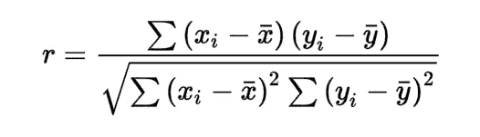
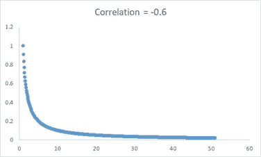
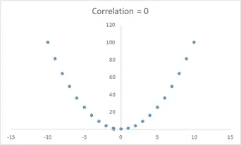
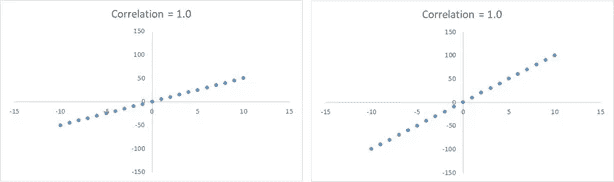

# 相关性神话

> 原文：<https://medium.com/analytics-vidhya/correlation-myths-a644936d51d8?source=collection_archive---------4----------------------->

杰森·库德里特在 [Unsplash](https://unsplash.com/@jcoudriet?utm_source=unsplash&utm_medium=referral&utm_content=creditCopyText) 上拍摄的照片

理解数据属性之间的关系一直是数据分析的核心。这种相互依赖的最常见的衡量标准之一是皮尔逊相关系数，定义如下。

皮尔逊相关系数公式

-1 ≤ r ≤1，符号表示关系的方向和值强度。

皮尔逊相关性(*以下简称相关性*)经常被误解为非此意。

让我们逐一了解这些神话。

1.  ***衡量一种关系***

虽然这是真的，但皮尔逊系数具体衡量的是线性关系，而不是任何一种关系。

例如，下面是一个反向关系图，即 y = 1/x。虽然我们已经确定了这种关系，但皮尔逊系数并没有反映这种关系的全部范围，这在其值-0.6 中很明显

y = 1/x

***2。系数为 0 意味着没有关系***

系数为 0 仅意味着不存在线性关系，但仍可能存在非线性关系。例如，考虑 y = x，我们再次知道存在皮尔逊系数没有捕捉到的关系

y = x

***3。线性斜率越高，相关性越高***

只要存在线性关系，相关系数就会捕捉到它。关系的斜率并不重要。考虑以下完美相关性的示例，即不同斜率关系的 1.0。

对于不同斜率的线性关系，相关性是相同的

对于相关性而言，重要的是强度，即数据点之间的距离和方向(正/负)更近，而不是斜率。

***4。*关联暗示一个原因**

这可能是人们谈论最多的神话了。相关性只是告诉我们，数据属性共享一个线性关系，而没有说明这种关系的原因。

以下数据具有 0.997 的近乎完美的相关性。这是否意味着美国在科学、空间和技术上的支出正在导致上吊、窒息和窒息自杀(或者反之亦然)？大概不会。这些相关性可能只是偶然存在的。

来源:[https://www.tylervigen.com/spurious-correlations](https://www.tylervigen.com/spurious-correlations)

[这里](https://www.tylervigen.com/spurious-correlations)是一堆。

因果关系通常是通过实验确定的，而不仅仅是通过观察相关性。话虽如此，可能会有这样的情况，我们对因果关系不感兴趣，只对做出准确预测的关系感兴趣(另一个时间的主题)。

**结论**

皮尔逊相关系数将线性关系浓缩为-1 和 1 之间的值。作为分析专业人员，我们必须了解这一价值意味着什么，不意味着什么。

***你还遇到过哪些类型的关联措施？***