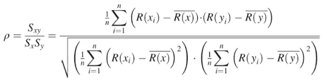

# 相关状态:很复杂

> 原文：<https://medium.com/analytics-vidhya/correlation-status-its-complicated-97a945bb68a1?source=collection_archive---------18----------------------->

这篇文章讲的都是***关系。*** 两个自变量之间的关系。这些变量是如何关联的，它们的关联有多强。我们将一步一步来，并尝试讨论相关性的每个方面。

首先，我们来讨论一个非常重要的术语**协方差**。协方差说明变量之间的关系。如果协方差为正，这意味着如果一个变量增加，其他变量也会增加，如果为负，这意味着如果一个变量增加，其他变量会减少。

方差和协方差方程

> 仔细看协方差方程，如果我们把**【Y】**换成**【X】**，那么它就是方差方程。因此我们可以说
> 
> **COV(X，X)= VAR(X)**

现在你一定在想，如果协方差告诉我们变量是如何相关的，那么我们为什么需要相关性。因为协方差告诉我们关系的**方向**，而相关性告诉我们关系的**强度**。

我们将讨论三种计算变量相关性的方法。

1.  卡尔·皮尔逊相关系数
2.  斯皮尔曼等级相关系数
3.  肯德尔氏τ

# 卡尔·皮尔逊相关系数

皮尔逊相关系数的公式

使用皮尔逊相关系数时，必须记住这几点。

1.  相关系数的值总是在 **1** 之间。
2.  相关系数与**原点和**标度无关。
3.  变量之间的关系是**线性的。**
4.  变量是相互独立的。
5.  变量应形成**正态分布**。

皮尔逊相关系数确实有一些缺点。当变量是非线性的或有一些异常值时。

图 1 显示了异常值，图 2 显示了非线性问题

这两种情况都不会显示正确的相关值。为了克服这个缺点，我们使用 Spearman 的等级相关系数。

# 斯皮尔曼等级相关系数

斯皮尔曼等级相关系数是卡尔·皮尔逊相关系数的非参数版本。当数据不是正态分布时使用。

## 没有并列的队伍。

不存在并列等级时的 Spearman 等级相关系数公式

计算 Spearman 等级相关系数需要遵循的步骤

1.  基于变量值分配等级。
2.  计算变量等级之间的差异(d)。
3.  计算 d，即变量等级之间差值(d)的平方。
4.  将 d 求和，放入斯皮尔曼秩的公式中，计算相关性。

***例:*无并列兵卒例。**

*例子:*没有并列名次的例子。

我们必须为分数和学习时间分配等级。分数排名 1，学习时间排名 2，然后我们计算 d，即变量排名之间的差异。最后，我们计算了 d 并总结了。

将值放入公式 d =194 和 n=10 中。我们得到相关性= -0.17

## **如何处理并列排名**

并列等级意味着如果变量中的两个条目具有相同的值，那么它们的等级也将相同，在这种情况下，我们必须分配相同的等级。对于这种情况，有一个不同的公式

存在并列秩时的 Spearman 秩相关系数公式

但这只有在相同的级别很少的情况下才会起作用。在有很多秩相同的情况下，我们更喜欢肯德尔的τ

# 肯德尔氏τ

肯德尔的 Tau 是对已排序数据列之间关系的非参数度量

***肯德尔的τ=(C—D/C+D)***
其中 C 是和谐对的个数，D 是不和谐对的个数。

Concordant 指定当前值之下的**比当前值大**多少个值。

不一致指定当前值下面有多少个值比当前值小。

计算肯德尔τ需要遵循的步骤

1.  根据参数分配等级 1 和等级 2
2.  排序等级 1
3.  使用秩 2 计算和谐和不和谐
4.  将最终值放入公式 ***(C — D / C + D)***

***例题***

***例题***

在这个例子中，我们已经计算了等级 1 和等级 2，按照升序排列等级 1。

现在我们可以计算 C 和 D 值 C=9 和 D=1，将这些项放入公式中，我们得到*肯德尔的τ= 0.8*。

**最终想法**

理解相关性非常重要，因为它可以帮助我们了解 drop 特性。我们可以去掉相关的特征。也有很多方法来计算它。我们可以根据数据集选择一种方法。没有一种方法是完全正确或错误的，这取决于哪种数据会给出更好的结果。