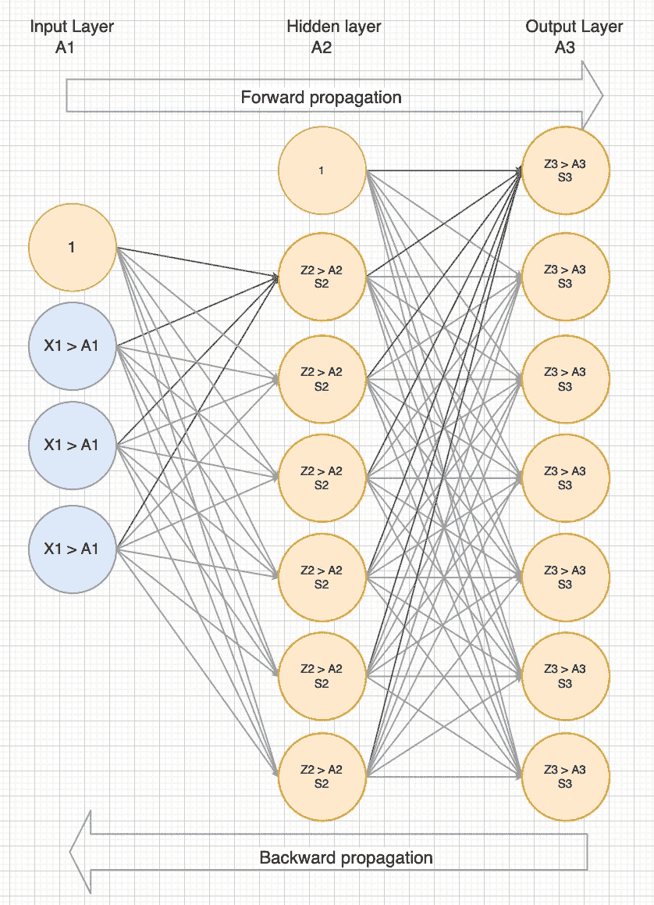
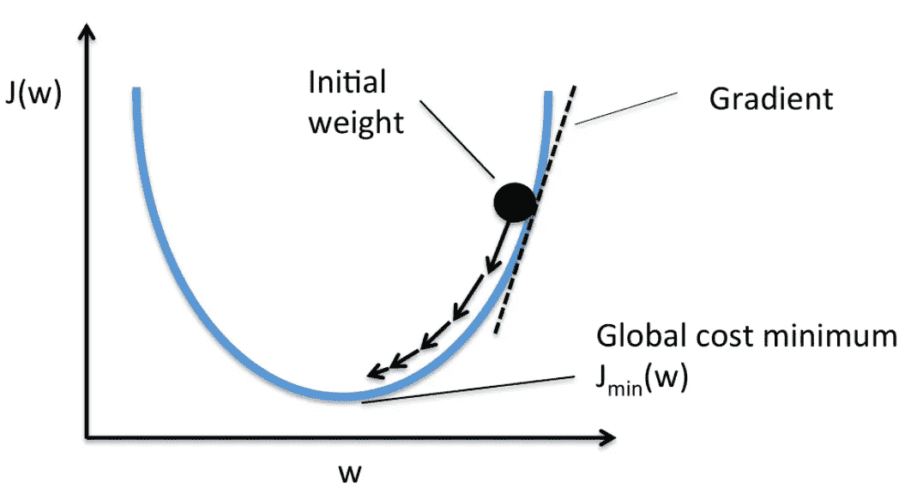
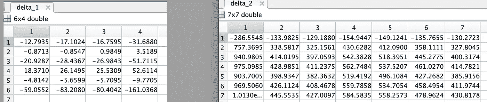
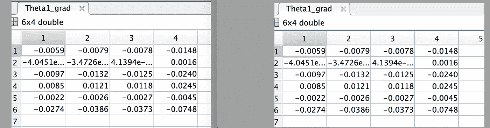
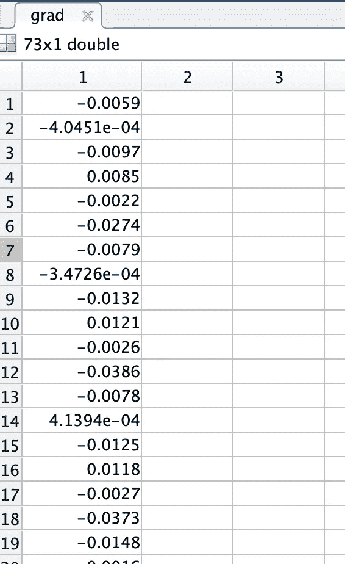

# 神经网络成本和梯度计算深潜 104

> 原文：<https://medium.com/analytics-vidhya/cost-and-gradient-calculation-in-neural-networks-deep-dive-104-2e16f26ce3f3?source=collection_archive---------9----------------------->


在理解了向前和向后传播之后，让我们进入**计算成本和梯度**。这是神经网络的重要组成部分。

这是我的神经网络系列的第 2 部分。如果你只是想要代码，欢迎从[第一部分](https://shaun-enslin.medium.com/explaining-neural-networks-101-a36356113cbd)开始，或者跳到[第五部分](https://shaun-enslin.medium.com/implementing-neural-networks-in-matlab-105-6b71c5872b3c)。

因此，为了执行梯度下降或成本优化，我们需要编写一个成本函数，它执行:

1.  [正向传播](https://shaun-enslin.medium.com/forward-propagation-deep-dive-102-bbeabe4d2fb2)
2.  [反向传播](https://shaun-enslin.medium.com/backward-propagation-deep-dive-103-60390714d2b0)
3.  [计算成本&坡度](https://shaun-enslin.medium.com/cost-and-gradient-calculation-in-neural-networks-deep-dive-104-2e16f26ce3f3)

在这篇文章中，我们将处理(3)和(4)。你可以点击上面的链接深入了解前进/后退道具。

提醒一下，下面是我们的神经网络，我们使用了前向和后向传播，计算了 Z，A 和 s。



图 1

# 成本计算

向前传播后，我们计算了 A3(如图 1 所示)。我们可以认为 A3 是我们的特征(x)和这组权重的一个假设。因此，让我们继续**计算它的成本，看看这些权重的表现如何**。

我们的第一步是计算一个可以用来调整我们的成本的惩罚。如果你想要一个关于正规化的解释，那么看看这篇[文章](/geekculture/logistics-regression-regularisation-2-3-4a0d8b85564c)。

```
% calculate penalty without theta0,
p = sum(sum(Theta1(:, 2:end).², 2)) + sum(sum(Theta2(:, 2:end).², 2));
```

现在我们有了惩罚，我们可以计算成本并应用惩罚。稍后，**成本优化**函数将使用该值来得出我们可以用于预测的最佳权重。

```
% Calculate the cost of our forward prop
J = sum(sum(-yv .* log(a3) — (1 — yv) .* log(1-a3), 2))/m + lambda*p/(2*m);
```

# 梯度

对于成本优化，我们还需要反馈这组特定权重的梯度。图 2 显示了梯度一旦被绘制出来。对于输入到我们的成本函数的权重集，这将是绘制线的梯度。



图 2

现在，我们有了这样的理解，让我们涵盖计算。使用矩阵乘法，我们首先使用 S2 和 A1 计算δ。图 3 显示了每个θ的这个增量。

```
% Calculate DELTA’s (accumulated deltas)
delta_1 = (s2'*a1);
delta_2 = (s3'*a2);
```



图 3

同样，我们想要正则化我们的梯度，因此需要计算一个惩罚。

```
% calculate regularized gradient, replace 1st column with zeros
p1 = (lambda/m)*[zeros(size(Theta1, 1), 1) Theta1(:, 2:end)];
p2 = (lambda/m)*[zeros(size(Theta2, 1), 1) Theta2(:, 2:end)];
```

最后，我们计算每个θ的梯度并应用权重。图 4 显示了梯度

```
% gradients / partial derivitives
Theta1_grad = delta_1./m + p1;
Theta2_grad = delta_2./m + p2;
```



图 4

然而，成本优化函数不知道如何处理 2θ，所以让我们把它们展开成一个向量，结果如图 5 所示。

```
% Unroll gradients
grad = [Theta1_grad(:) ; Theta2_grad(:)];
```



图 5

# 结论

学习了本系列的 4 个部分之后，您现在可以在第 5 部分将它们放在一起了。