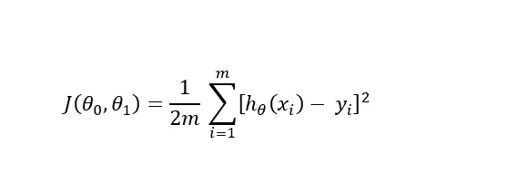
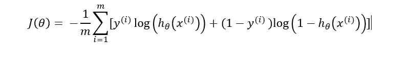
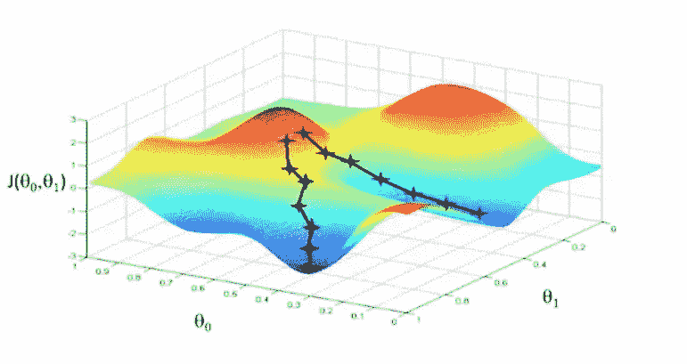
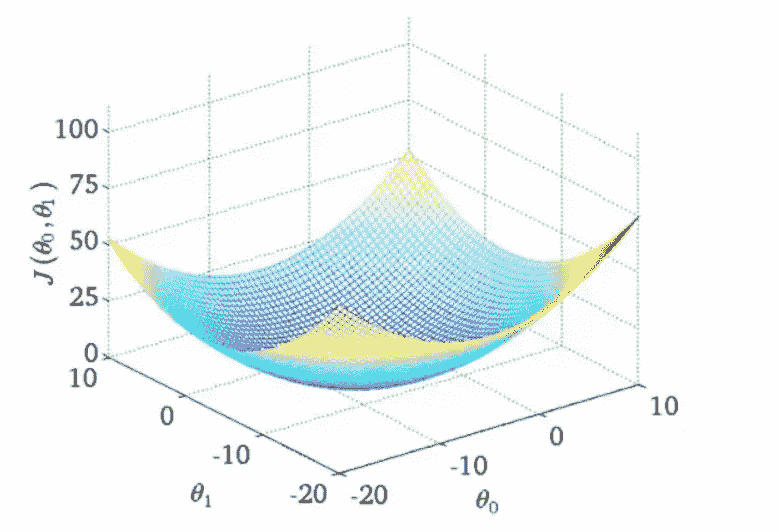

# 成本函数——一个简单的解释

> 原文：<https://medium.com/analytics-vidhya/cost-function-a-simple-explanation-f11cbb8365fc?source=collection_archive---------17----------------------->

成本函数是在给定一组数据的情况下测量机器学习模型的性能的函数。

举一个简单的线性回归模型的例子。线性回归模型的成本函数如下所示

作者图片

该函数所做的只是计算实际值和预测值之间的差值，并对其求平方。对每个例子都这样做，并将这些平方值相加。

1/2m 项用于数学目的，如计算结果的平均值。既然我们已经讨论了这个问题，让我们继续讨论逻辑回归的成本函数。

逻辑回归用于分类问题，而线性回归用于回归问题或处理连续值的问题。逻辑回归的成本函数表述为

作者图片

一个有趣的事实是，这些成本函数会对梯度下降产生巨大影响。考虑上述线性回归和逻辑回归的例子。线性回归的成本函数在技术上可以修改，以适应逻辑回归的需要。那么我们为什么不这样使用它呢？

要回答这个问题，我们需要看看两种类型的函数，即**凸**和**非凸**函数。

非凸函数是有多个局部最小值的函数，它们看起来像这样

来源:[吴恩达](http://www.holehouse.org/mlclass/01_02_Introduction_regression_analysis_and_gr.html)

所以当我们运行梯度下降时，很容易卡在任何局部最小值。这在任何情况下都不是最佳的。所以下一个问题是凸函数怎么比这个好？

凸函数在图形中绘制时看起来像抛物线。这种类型的函数相对于前者的主要优点是，当执行梯度下降时，它们具有单个收敛点。这个点被称为**全局最小值。**

来源:[吴恩达](http://www.holehouse.org/mlclass/01_02_Introduction_regression_analysis_and_gr.html)

当存在全局最小值时，梯度下降算法能够更快地收敛，并且它不会陷入局部最小值，因为只有一个也恰好是全局最小值！

感谢您的阅读！我将在我的下一篇文章中与您联系！