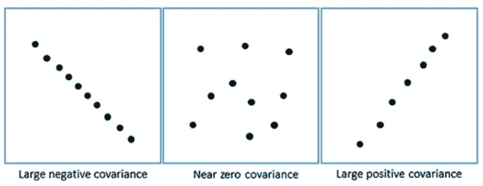
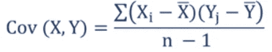
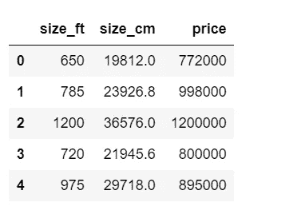
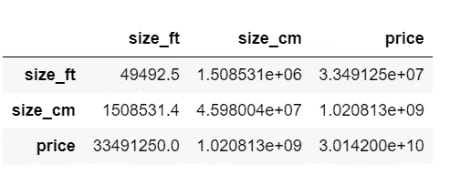
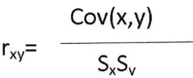
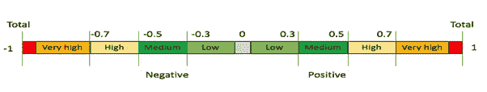

# 协方差与相关性

> 原文：<https://medium.com/analytics-vidhya/covariance-vs-correlation-1f7aaa65e40a?source=collection_archive---------17----------------------->

这篇文章是关于协变性和相关性的:它们是什么，它们是如何相关的，它们之间有什么不同。

协方差和相关性是告诉我们两个随机变量之间关系的两个统计度量。

## 协方差

协方差告诉我们两个随机变量如何一起变化，或者你可以说变量如何相对于彼此变化。它告诉我们两个变量之间是否有关系，以及这种关系在哪个方向。

协方差可以对两个变量之间的三种关系进行分类:

1.  正向趋势:表明两个变量趋向于同向移动。在这种情况下，当一个变量的值增加时，另一个也会增加。在这种情况下，协方差的值为正。
2.  负趋势:揭示两个变量趋向于反向运动。在这种情况下，当一个变量的值增加时，另一个将会减少。在这种情况下，协方差的值为负。
3.  无趋势:这表明两个变量之间没有关系。在这种情况下，协方差的值接近于 0。

三种关系

计算协方差的公式如下

协方差公式

在哪里，

x 和 Y 是两个变量，

x 柱和 Y 柱是两个变量的平均值，

n 是观测值/数据点的总数。

## ***问题与解释***

我们可以从上面的公式解释，协方差是以单位来度量的。变量的单位/比例将是协方差的单位。这就是为什么协方差值对数据的规模很敏感，这使得它们很难解释。如果我们改变变量的标度/单位，协方差的值将会不同。让我们看一个例子:

`house_data.head()`

房屋 _ 数据

在上面的数据中，我们有以英尺和厘米为单位的房子大小，目标变量是价格。让我们看看尺寸和价格在两种尺度(英尺和厘米)下的协方差:

`house_data.cov()`

协方差

我们可以从价值上解释，大小和价格之间的关系是正相关的。随着尺度的变化，如果特征大小发生变化，协方差的值也会发生变化，因此我们无法判断关系的强度。

协方差的值可以从∞变到-∞。如果我们将协方差标准化，使其无论变量的单位/标度如何都保持不变，这个问题就可以解决。所以我们用两个变量的标准差来除协方差。结果称为相关系数。

相关公式

## 相互关系

相关性给了我们两个随机变量之间关系的方向和强度。它衡量这两个变量相互关联的程度。相关性是无量纲的，即它们不是以单位来衡量的，而是纯值。相关系数的值从-1 变化到 1。

高绝对值表示强关系，值的符号表示关系的方向。

在上图中我们可以看到:

**-1** :这意味着两个变量之间存在完美的负关系，即变量的运动方向相反。

**0** :两个变量之间没有关系。

**+1** :这意味着两个变量之间存在完美的正相关关系，即变量同向运动。

现在，让我们检查大小和价格之间的相关性。

`house_data.corr()`

相关系数

相关值为 0.87，表明:

1.规模和价格之间的积极和强有力的关系

2.变量大小的比例变化不会改变相关系数的值，这表明它是无量纲的。

## 结论

协方差和相关性是非常密切相关的。协方差只是相关性的一种度量，而相关性是协方差的一种缩放形式。当在它们之间进行选择时，相关性是首选，因为它不受尺度或维度变化的影响。相关值的范围在-1 到 1 之间，因此更容易解释。协方差和相关性的唯一限制是它们只能测量线性关系。

谢谢你