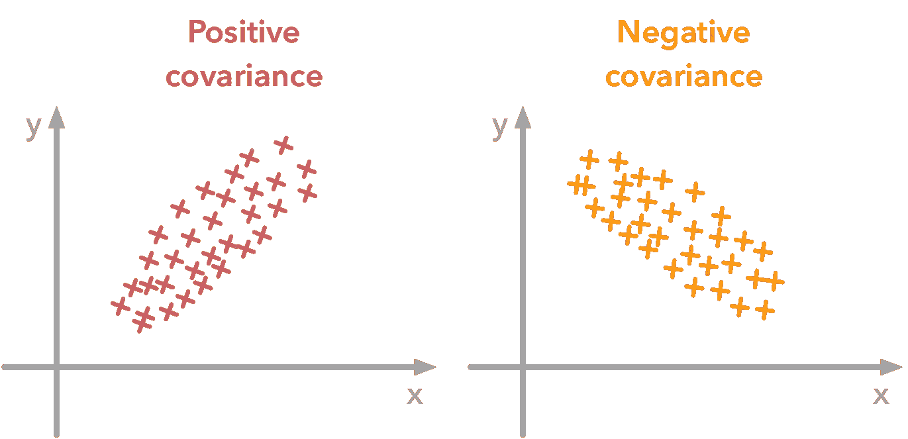
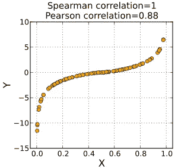
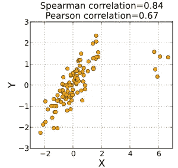

# 协方差与皮尔逊相关系数与斯皮尔曼秩相关系数

> 原文：<https://medium.com/analytics-vidhya/covariance-vs-pearson-correlation-coefficient-vs-spearmans-rank-correlation-coefficient-1d2d8789a728?source=collection_archive---------6----------------------->

# **协方差:**

协方差是数据分析或数据预处理中最常用的主题之一。它用于量化特定数据集中要素之间的关系。简而言之，它用于理解数据集中两个或更多不同列之间的关系。

照片来自[谷歌云](https://medium.com/u/4f3f4ee0f977?source=post_page-----1d2d8789a728--------------------------------)

协方差背后的数学类似于方差，这很有趣。正如我们所知，协方差用于 2 个变量，我们可以将其表示为协方差(x，y)。这里协方差(x，x)等于方差(x)。这就是方差和协方差之间的关系。

毕竟，这种技术只能告诉我们一个特定的列是否与其他列正相关或负相关，但是它不能告诉我们正相关或负相关的程度。

# **皮尔逊相关系数:**

为了理解比例性的强度，引入了皮尔逊相关系数。这种技术不仅能告诉我们两个变量之间的关系是正的还是负的，还能告诉我们比例有多大。

如果数据是线性的，那么皮尔逊相关系数的结果将是准确的，但是如果数据是非线性的，那么结果将不是完美的。

然而，通过使用几个对数归一化函数可以将非线性数据转换成线性数据，但是如果数据确实很大并且异常值更多，那么将它们转换成线性数据将会非常困难，并且在转换过程中很有可能丢失一些数据。

皮尔逊相关系数的范围是 **-1 < = ρ < = 1**

图片取自[维基百科](https://medium.com/u/108319a4c14d?source=post_page-----1d2d8789a728--------------------------------)

从上图可以明显看出，如果数据是线性的，那么ρ的值不是 0。如果数据像上图一样是非线性的，那么ρ的值是 0，这意味着 x 和 y 变量之间没有关系。但是我们不能得出结论，如果数据是非线性的，那么在没有任何其他证据的情况下，这种关系将是零或接近零。

# 斯皮尔曼等级相关系数；

为了更好地理解非线性数据之间的关系，引入了 Spearman 秩相关系数法。它与皮尔逊相关系数相似，但变化很小。

在计算时，我们不考虑列中的精确值，而是首先按升序对所有值进行排序，并给它们排名。那么这些等级被考虑用于计算。看起来不会因为这个变化而有任何影响，但实际上这个小变化帮助我们找到变量之间的准确关系，即使数据是非线性的。

下图将给出一些关于 spearman 相关性的清晰描述。

图片取自[维基百科](https://medium.com/u/108319a4c14d?source=post_page-----1d2d8789a728--------------------------------)

在第一张图中，虽然数据是非线性的，但从表面上看，这种关系显然是积极的。所以斯皮尔曼相关系数是 1，皮尔逊相关系数接近 1，但不完全等于 1。因此，皮尔逊相关对于非线性数据是不准确的。

在第二张图中，虽然数据是线性的，但有一些异常值，这些异常值可能会影响结果。但是异常值的影响在皮尔逊相关中很高，因为其值为 0.67，而在斯皮尔曼相关中这种影响较小，因为其值为 0.84。

这就是为什么斯皮尔曼相关比皮尔逊相关更有帮助。

**结论:**

在看到所有 3 种方法后，很明显应用斯皮尔曼相关法更有帮助。但是两者都做很有趣，因为如果你有 Spearman 值> Pearson 值，这意味着你有一个单调但非线性的相关性。我希望这篇文章能帮助你更容易地理解相关性之间的区别。