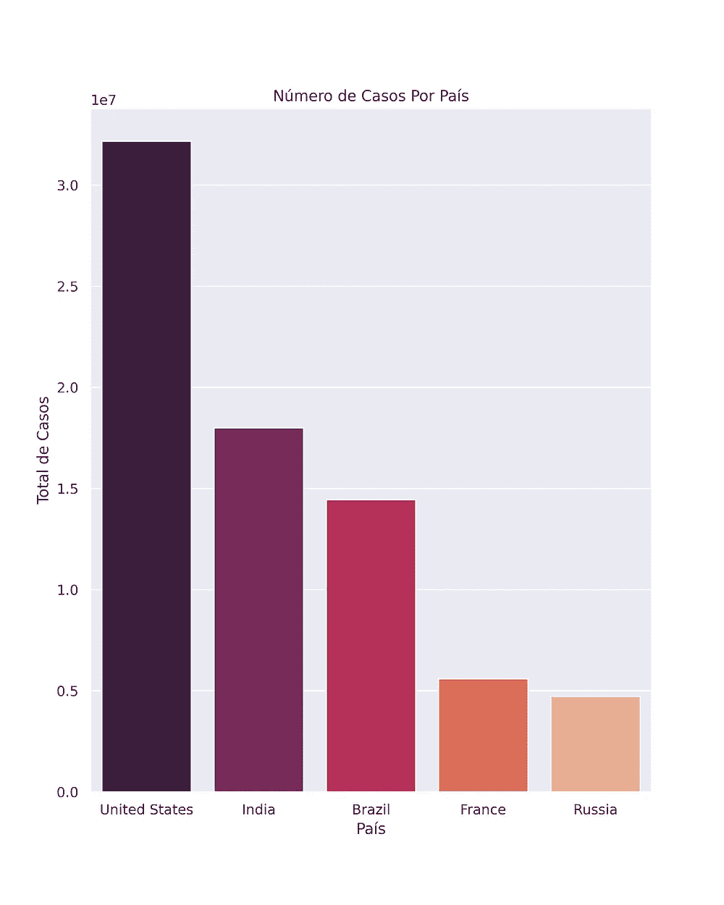
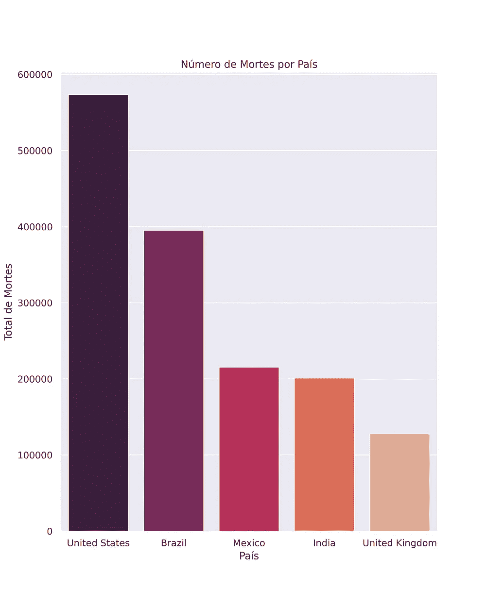
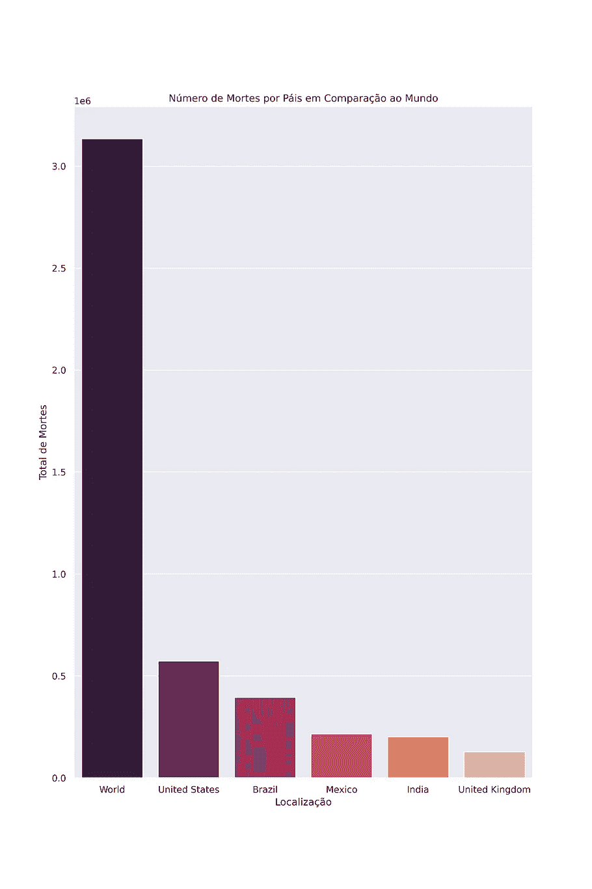
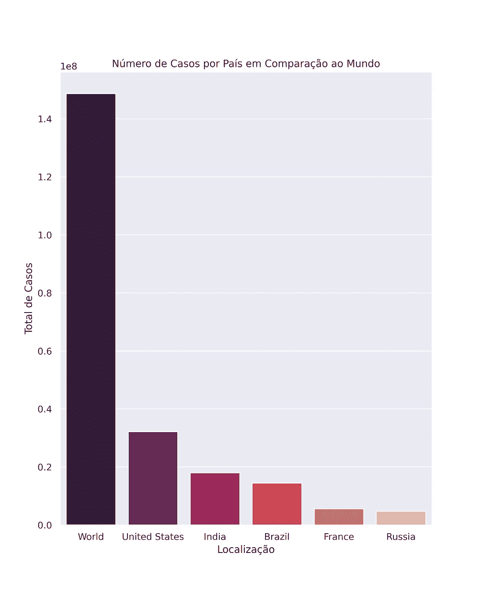
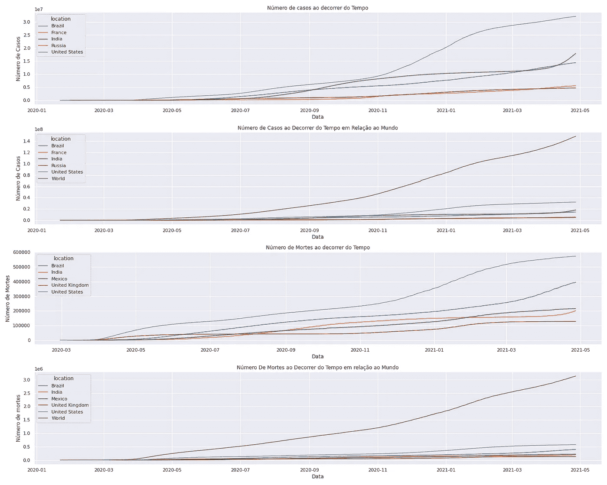
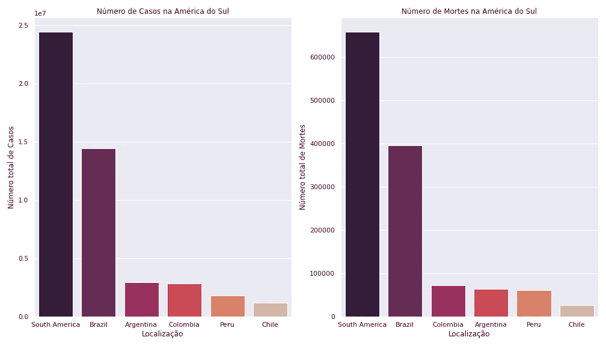
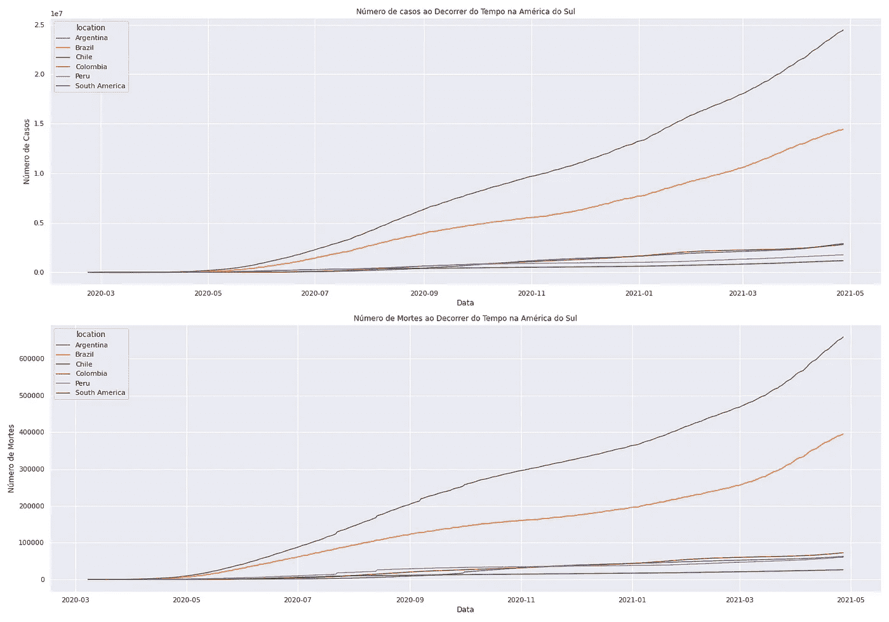

# 巴西和世界的新冠肺炎数据分析

> 原文：<https://medium.com/analytics-vidhya/covid-19-data-analysis-in-brazil-and-the-world-5b6e56ef5a43?source=collection_archive---------13----------------------->

葡萄牙语,[小团体！](/data-hackers/análise-de-dados-do-panorama-da-covid-19-no-brasil-e-no-mundo-35c4f04dac77)

新冠肺炎是一种由新发现的冠状病毒引起的传染病。

主要通过感染者咳嗽或打喷嚏时产生的飞沫传播，症状的严重程度因人而异。

事实是，人们对新冠肺炎知之甚少。世界各地都在进行研究，但结果还没有定论。

迄今为止，据观察，约 80%的确诊病例无症状且发病迅速。大多数属于这一类的人康复后没有任何后遗症。

然而，15%的人会有严重的感染，需要氧气。其余 5%的人将被归类为非常严重的感染，需要在医院环境中使用机械呼吸器进行辅助通气。

为了提高对巴西新冠肺炎疫情的认识，我将对该疾病的公开数据进行分析。

# 数据收集

使用的数据来自 GitHub 上的一个关于新冠肺炎的知识库，来自 OWID(我们的数据世界)。因此，要分析的数据集是一个**。csv(** `**owid-covid-data.csv**` **)文件—数据**中我们的世界关于新冠肺炎(冠状病毒)的数据

# 探索性数据分析

这是你将获得必要知识的地方，因此你将能够吸收从分析中获得的所有见解。

最好的开始方式是检查我们的**数据帧**的主体是什么样子的，所以让我们看看我们的数据是如何分布的。

在输入一行代码后，我们可以看到我们的数据帧有:

*   **84 530 条目**
*   **59 座土堆**

值得注意的是，数据帧有许多变量，每个变量将在下面的字典中解释。

## 变量字典

*   `iso_code`-ISO 3166-1 alpha-3-三个字母的国家代码
*   `continent`——地理位置的大陆
*   `location` -地理位置
*   `date` -观察日期
*   `total_cases` -新冠肺炎确诊病例总数
*   `new_cases` -新冠肺炎新增确诊病例
*   `new_cases_smoothed` -新冠肺炎新增确诊病例(平滑后 7 天)
*   `total_deaths` -归因于新冠肺炎的死亡总数
*   `new_deaths` -新增死亡归因于新冠肺炎
*   `new_deaths_smoothed` -新冠肺炎新增死亡人数(7 天平滑)
*   `total_cases_per_million` -每 100 万人中确诊的新冠肺炎病例总数
*   `new_cases_per_million` -每 100 万人中新增新冠肺炎确诊病例
*   `new_cases_smoothed_per_million` -每 100 万人新增新冠肺炎确诊病例(7 天平滑)
*   `total_deaths_per_million` -每 100 万人中死于新冠肺炎的总人数
*   `new_deaths_per_million` -每 100 万人中新增新冠肺炎死亡人数
*   `new_deaths_smoothed_per_million` -每 100 万人中新增新冠肺炎死亡人数(7 天平滑)
*   `reproduction_rate` -新冠肺炎有效再生产率(R)的实时估计。
*   `icu_patients` -某一天在重症监护室(ICU)的新冠肺炎患者人数
*   `icu_patients_per_million` -每 1，000，000 人中某一天在重症监护室(ICU)的新冠肺炎患者人数
*   `hosp_patients` -某一天住院的新冠肺炎患者人数
*   `hosp_patients_per_million` -某一天每 100 万人中住院的新冠肺炎患者人数
*   `weekly_icu_admissions` -一周内新入住重症监护病房(ICU)的新冠肺炎患者人数
*   `weekly_icu_admissions_per_million` -特定周内每 100 万人中新入住重症监护室(ICU)的新冠肺炎患者人数
*   `weekly_hosp_admissions` -一周内新入院的新冠肺炎患者人数
*   `weekly_hosp_admissions_per_million` -某周每 100 万人中新入院的新冠肺炎患者人数
*   `total_tests`-新冠肺炎的全部测试
*   `new_tests` -新冠肺炎的新测试(仅连续计算)
*   `total_tests_per_thousand` -每 1000 人中新冠肺炎的测试总数
*   `new_tests_per_thousand` -新冠肺炎每 1000 人中的新测试
*   `new_tests_smoothed` -新冠肺炎的新测试(7 天平滑)。对于不每天报告测试数据的国家，我们假设在没有报告数据的任何时期，测试每天都有相同的变化。这将生成一个完整的每日数据系列，然后在 7 天的滚动窗口内进行平均
*   `new_tests_smoothed_per_thousand` -每 1000 人中新冠肺炎的新测试(7 天平滑)
*   `positive_rate` -新冠肺炎测试为阳性的份额，以 7 天滚动平均值给出(这与`tests_per_case`相反)
*   `tests_per_case` -对新冠肺炎每个新确诊病例进行的检测，以 7 天滚动平均值给出(这与`positive_rate`相反)
*   `tests_units` -该位置用于报告其测试数据的单位
*   `total_vaccinations` -施用的新冠肺炎疫苗总剂量数
*   `people_vaccinated` -接受至少一剂疫苗的总人数
*   `people_fully_vaccinated` -接受疫苗接种方案规定的所有剂量的总人数
*   `new_vaccinations` -新新冠肺炎疫苗接种剂量(仅计算连续天数)
*   `new_vaccinations_smoothed` -新新冠肺炎疫苗接种剂量(7 天平滑)。对于不每天报告疫苗接种数据的国家，我们假设在没有数据报告的任何时期，疫苗接种每天都有相同的变化。这将生成一个完整的每日数据系列，然后在 7 天的滚动窗口内进行平均
*   `total_vaccinations_per_hundred` -总人口中每 100 人接种新冠肺炎疫苗的总人数
*   `people_vaccinated_per_hundred` -总人口中每 100 人中至少接种一剂疫苗的总人数
*   `people_fully_vaccinated_per_hundred` -总人口中每 100 人接受疫苗接种方案规定的所有剂量的总人数
*   `new_vaccinations_smoothed_per_million` -总人口中每 1，000，000 人接种的新新冠肺炎疫苗剂量(7 天平滑)
*   `stringency_index` -政府响应严格指数:基于 9 个响应指标的综合衡量标准，包括学校关闭、工作场所关闭和旅行禁令，重新调整为 0 至 100 的值(100 =最严格的响应)
*   `population`-2020 年人口
*   `population_density` -按土地面积划分的人口数量，以平方公里为单位，最近一年可用
*   `median_age` -人口中值年龄，联合国 2020 年预测
*   `aged_65_older`-65 岁及以上人口的比例，最近一年的可用数据
*   `aged_70_older`-2015 年 70 岁及以上人口的比例
*   `gdp_per_capita` -按购买力平价计算的国内生产总值(2011 年定值国际美元)，最近一年可用
*   `extreme_poverty` -生活在极端贫困中的人口比例，自 2010 年以来的最新数据
*   `cardiovasc_death_rate`-2017 年心血管疾病死亡率(每年每 10 万人死亡人数)
*   `diabetes_prevalence`-2017 年糖尿病患病率(占 20 至 79 岁人口的%)
*   `female_smokers` -最近一年的吸烟女性比例
*   `male_smokers` -吸烟男性的比例，最近一年可用
*   `handwashing_facilities` -最近一年拥有基本洗手设施的人口比例
*   `hospital_beds_per_thousand` -每 1，000 人的医院床位，自 2010 年以来的最近年份
*   `life_expectancy`-2019 年出生时预期寿命
*   `human_development_index`——衡量人类发展三个基本方面平均成就的综合指数——健康长寿、知识和体面的生活水平

## 数据类型

我们还可以讨论在我们的 DataFrame 中发现的数据类型，它们大多是 **Float** data **(** 带小数位的数据**)、**然而，我们也有一些例外，数据类型为 **object** **(** 非数值数据**)。**

## 第一个条目

接下来，让我们来看看我们的数据框架，让我们看看前 5 个条目，看看它们告诉我们什么。

前五个条目

检查前几个条目后，我们可以看到一些值丢失了。然而，当涉及到关于病毒的数据时，进行大范围的清理是没有意义的，因为这些数据已经与现实相符。

# 数据清理

因此，我们将分析缺失值最多的变量，然后我们可以定义哪种处理方式最合适。

分析缺失数据后，值得注意的是:

*   `weekly_icu_admissions`、`weekly_icu_admissions_per_million`、`weekly_hosp_admissions`和`weekly_hosp_admissions_per_million` -成为分析的无关变量，因为约 98%的值缺失，所以可以排除。变量`tests_units`也将被排除，因为它与分析无关。
*   `icu_patients`、`icu_patients_per_million`、`hosp_patients`和`hosp_patients_per_million` -是指注册当天的变量，有超过 87%的缺失值。因此，这些将被排除在外，以便进行尽可能接近现实的分析。

# 查看数据

这一部分通过图表或数据框的方式将数据可视化。

## 病例最多的国家

接下来，让我们找出 2021 年 4 月 27 日案例最多的国家，依次是:

*   **世界** — **148.716.872** 世界各地登记的案件。
*   **美国** — **32.175.725** 据 [**美国有线电视新闻网巴西**](https://www.cnnbrasil.com.br/internacional/2020/03/27/por-que-os-eua-tem-tantos-casos-de-covid-19) 报道，造成大量病例的可能原因之一也是美国政府未能迅速果断地采取行动阻止病毒的传播。
*   **印度** — **17.997.113** 登记病例，印度是一个人口庞大的国家，大约有 13.66 亿人。尽管是一个国土面积较小的国家，但它的人口密度很高，这可以解释病例的数量。
*   **巴西** — **14.441.563** 巴西也是一个大陆面积的国家，但人口比印度和美国少，高病例数量是由于缺乏准备，人们在封锁和使用口罩方面的疏忽，这导致了病毒的大量传播。
*   法国 — **5.595.403** 出现大量登记病例的主要原因之一是政府行动迟缓，导致病毒更大范围的传播。
*   **俄国** — **4.725.252** 病例，一个大陆规模的国家，但人口比类似规模的国家少，却有利于病毒传播的气候。然而，它不符合死亡人数最多的前 5 个国家，这是一个非常积极的观点。

## 死亡人数最多的国家

接下来，让我们找出 2021 年 4 月 27 日死亡人数最多的国家

我们可以注意到，死亡人数最多的国家依次是:

*   **世界**——**3 . 134 . 956**世界各地记录的死亡人数。
*   **美国** — **573.381** 登记死亡，这是意料之中的，病例最多的国家也是死亡人数最多的国家。
*   **巴西** — **395.022** 登记的死亡人数，它不是第二个病例较多的国家，但却是第二个死亡人数较多的国家，这可能是由于缺乏资源和该国没有准备好应对病毒。
*   **墨西哥** — **215.547** 登记死亡，这里我们有一个意外病例，它不符合病例最多的 5 个国家，但它是死亡人数最多的 5 个国家之一。
*   印度——**201.187**看起来印度知道如何有效地应对这种病毒，因此死亡人数减少了。
*   **英国** — **127.705** 登记死亡，没有出现在病例最多的 5 个国家中，却是死亡病例最多的 5 个国家之一，绝对是一个奇特的病例。

## 5 国家图表死亡和病例总数

为了有一个图形可视化，这往往是更有效地获取信息比文本，我将绘制图表的 5 个国家的死亡和病例最多。

因此，为了便于比较，我还将展示世界各地的图表，这样我们就可以将各国的数量与全球的总数联系起来。

在图表中，我们可以看到，条形越高，颜色越深，因此数字也越高。

*   当我们把世界和国家放在一起，我们可以看到，虽然一个国家的病例数量很大，但全球的病例总数约为世界人口的 1.8%。换句话说，全球 98.2%的人口没有感染新冠肺炎病毒。我们要考虑到 78.66 亿的 1.8%是一个很大的数目。
*   当我们谈到死亡总数的时候，我们全球有 3134956 例死亡，148716872 例，大约 **2.1%** **感染病毒的人死亡**，而 **97.9%痊愈**。

# 一段时间内死亡和病例的图表

接下来，我将绘制一张图表，以便我们可以看到新冠肺炎病例和死亡随时间的演变。图表将上述国家和世界作为分析对象。

我们可以从图表中获得一些*见解*:

*   **美国**病例数一直排名第一。
*   虽然在病例数量上**印度**领先**巴西**，但巴西有大量额外死亡病例。
*   记录死亡人数最多的国家是美国
*   当我们把**世界**放到图表上时，它的增长变得更有表现力，因为它是全球所有国家病例和死亡的总和。

# 巴西的探索性分析

现在，为了对巴西进行具体的分析，我将复制一个 DataFrame，它将只返回位置为 **Brazil** 的条目。

让我们来了解一下这个*数据集*，我们可以看看它的前 5 个条目。

数据框上显示的最近日期是 2021 年 4 月 27 日。

## 巴西首例死亡病例

巴西的第一例死亡发生在:

*   **2020 年 3 月 17 日**——那一天已经有 *321 例*，那也是**巴西出现第一例新冠肺炎死亡**的时候。

## 巴西首例

巴西的第一例新冠肺炎病例记录于:

*   2020 年 2 月 26 日 —巴西报告首例新冠肺炎病例的日期。

## 第一例和第一例死亡

我们知道，巴西的首例病例和首例死亡发生在以下日期:

*   2020 年 2 月 26 日——巴西记录的首例新冠肺炎病例。
*   2020 年 3 月 17 日，巴西首次记录了新冠肺炎的死亡。

## 第一个病例和第一个死亡之间的时间间隔

从第一例有记录的病例到第一例死亡，已经过去了很长时间:

*   **20 天**——从第一例病例到第一例死亡。

毫无疑问，巴西是受冠状病毒疫情影响最严重的国家之一，为了便于比较，我们将巴西与**南美 5 个病例和死亡人数较多的国家进行对比分析。**

为此，我们将创建一个**数据帧**的副本，其中只显示南美洲大陆的条目。让我们通过查看前 5 个条目来了解*数据集*。

## 病例最多的国家

接下来，我们将查找南美洲哪些国家的最新病例最多。

病例最多的国家依次是:

*   **巴西** — **14.441.563** 登记病例。
*   **阿根延**——**2 . 905 . 172**登记病例。
*   **哥伦比亚** — **2.804.881** 登记案件。
*   **秘鲁** — **1.768.186** 登记病例。
*   **智利** — **1.179.772** 登记病例。

与其他国家相比，巴西的病例数差异显著。当我们发现仅巴西的病例就占南美洲所有病例的 50%以上时，这就成了一个可怕的数据。

## 死亡人数最多的国家

最后，我们将定位南美洲哪些国家在最近一段时间内死亡人数最多。

死亡人数最多的国家依次是:

*   **巴西** — **395.022** 登记死亡。
*   **哥伦比亚** — **72.235** 登记死亡。
*   **阿根廷** — **62.599** 登记死亡。
*   **秘鲁** — **60.013** 登记死亡。
*   **智利** — **26.020** 登记死亡人数。

因此，我们再次看到巴西继续在死亡人数和病例数上领先。不过，**阿根廷**比**哥伦比亚**病例多，但死亡人数少。

## 5 国家图表死亡和病例总数(南美洲)

南美国家**病例**和**死亡**的可视化处理图。

从图表中我们可以看到，无论是病例还是死亡人数，巴西都保持在第一位。

我们可以从图表中得出的其他一些**见解**有:

*   **巴西**占**南美病例和死亡人数的最大份额。**
*   **巴西**占南美死亡人数的 50%以上，登记死亡人数**395022 人**。南美洲有 658283 例登记死亡。
*   虽然阿根廷的病例比哥伦比亚多，但死亡人数却少。

## 一段时间内死亡和病例的图表(南美洲)

图表来看新冠肺炎在南美国家的演变。

我从图表中获得的一些*见解*如下:

*   **巴西**对**南美图**影响很大，知道他们有相似的行为，在病例数和死亡数上最相似。
*   无论是病例数还是死亡数，智利都是最后一名。

# 结论

在这种分析中，我们可以获得关于新冠肺炎的各种信息。例如，我们现在知道**美国**是迄今为止病例和死亡人数最多的国家，**巴西**是死亡人数第二多的国家，**印度**比**巴西**病例多但死亡人数少，我们可以指出巴西是南美受疫情影响最大的国家。其他一些有趣的事实是:

*   这并不是因为你有更多的病例，你也会有更多的死亡，反之亦然，这方面的例子是印度和墨西哥。
*   **墨西哥**不在病例最多的 5 个国家之列，但却是死亡人数最多的 5 个国家之一**。**

**要访问该项目，[请单击此处！](https://github.com/JoaoGustavo29/Portfolio_DataScience/blob/master/An%C3%A1lise_de_Dados_do_Panorama_da_COVID_19_no_Brasil_e_no_Mundo.ipynb)在 [LinkedIn](https://www.linkedin.com/in/jo%C3%A3o-gustavo-borges-e-souza-6700451b8/) 上关注我，关注我的 [GitHub](https://github.com/JoaoGustavo29/Portfolio_DataScience) ，在那里你可以找到更多未来的项目。**