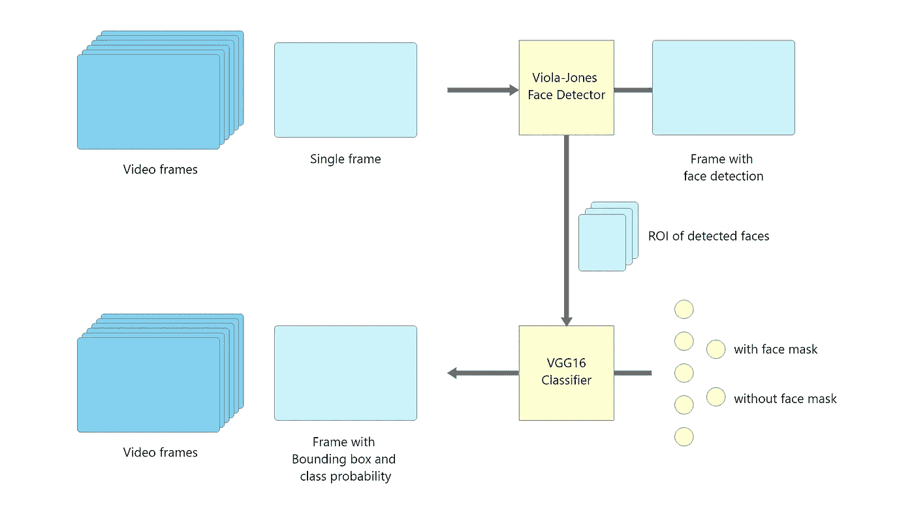
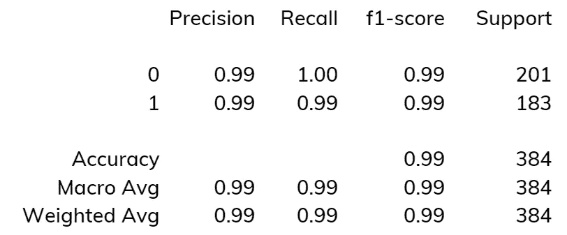
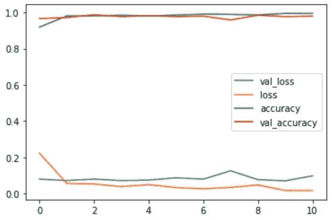

# 新冠肺炎:基于 TensorFlow 和 OpenCV 的人脸面具检测系统

> 原文：<https://medium.com/analytics-vidhya/covid-19-face-mask-detection-system-with-tensorflow-and-opencv-1bd19a14125e?source=collection_archive---------1----------------------->

# 关于我

嗨，我是 Vishal S R，我住在钦奈，我是一名最后一年的 B-Tech 计算机科学学生。我专攻机器学习。我非常相信自学。我把每个问题都视为探索新事物的机会。

LinkedIn:[*vishalsr*](http://www.linkedin.com/in/vishalsr)

Github: [vishal-sr](https://github.com/vishal-sr)

insta gram:[vishal . Sr_](https://www.instagram.com/vishal.sr_)

项目回购:[Github 回购 ](https://github.com/vishal-sr/AI-in-Healthcare/tree/main/Face%20Mask%20Detection)

# 目录

1.  摘要
2.  方法学
3.  数据和预处理
4.  履行
5.  代码😎👨‍💻
6.  结论

# 摘要

世界开始关注人工智能的好处，而不是它的启示。人们开始使用人工智能解决复杂的问题，我们也是。我研究了检测和分类一个人是否戴口罩的问题。随着这个疫情成为 ***新常态*** 戴口罩很重要，并确认我们周围的人是否戴口罩。让我们让人工智能来解决这个问题。我用了两步流水线来解决这个问题。

# 方法学

正如我提到的，这个项目包括两个步骤，下图显示了两步管道的设计。



让我们看看我们的系统如何检测人脸并分类人脸是否包含人脸面具。

从视频捕获中，我使用 OpenCV 获取了一个单独的帧，并将获取的帧传递给 Viola-Jones 人脸检测器(HaarCascade 人脸检测器)。在检测器检测到人脸后，我裁剪了人脸 ROI(感兴趣区域),并将其传递到流行的 CNN 架构 VGG16 中，以分类人脸 ROI 是否包含人脸遮罩。之后，使用来自 Viola-Jones 检测器的坐标和来自 VGG16 模型的类别概率，我分别为所有可能的人脸及其类别概率绘制了边界框。

# 数据和预处理

我从[***Github repo***](http://github.com/balajisrinivas/Face-Mask-Detection/tree/master/dataset)中收集了数据，其中包含了戴面具和不戴面具的人脸图像。在训练 VGG16 网络之前，我们必须对数据进行预处理。获取和预处理数据的步骤如下:

## 导航到数据集文件夹并创建类别、标签字典:

获取图像文件夹(带面罩的人脸文件夹和不带面罩的人脸文件夹)并创建类别和标签字典。

```
Main folder
    - with_mask
          -- images
          .
          .
    - without_mask
          -- images
          .
          .
```

## 从子文件夹中获取图像并对其进行预处理:

使用 OpenCV 单独获取每张图像并执行一些预处理步骤，

1.  将 BGR 图像转换为 RGB 格式的 cv2.imread()函数将图像读取为 BGR。
2.  将图像大小调整为 160 x 160 x 3。
3.  将图像转换成 NumPy 矩阵。
4.  将所有像素从 0 重新调整到 1
5.  将图像矩阵的大小调整为#images，160，160，3。
6.  将目标标签转换成一个热点向量。
7.  分为训练集、验证集和测试集。

# 履行

当我们有管道、数据和解决问题的方法时，实现整个检测系统是容易的。接近的步骤，

1.  导入所需的库和框架
2.  数据和预处理
3.  建模
4.  模特培训
5.  估价
6.  把所有的放在一起

## 导入所需的库和框架

要实现我们的项目，我们必须首先选择所需的库。

```
import os
import cv2
import numpy as np
import pandas as pd
import matplotlib.pyplot as plt
from sklearn.model_selection import train_test_split
from sklearn.metrics import classification_report, confusion_matrix
from tensorflow.keras.applications.vgg16 import VGG16
from tensorflow.keras.layers import Input, Dense, Flatten
from tensorflow.keras.models import Model, load_model
from tensorflow.keras.preprocessing.image import ImageDataGenerator
from tensorflow.keras.utils import to_categorical
```

## 数据和预处理

数据和所有预处理步骤在上一节中讨论过。

## 建模

在这个项目中，我定义了两个模型，一个用于检测人脸，另一个用于对检测到的人脸进行分类。

1.  人脸检测器
2.  面罩分类器

**人脸检测器:**

为了检测人脸，我使用了 Viola-Jones 人脸检测算法。它将视频帧作为输入，并给我可能的面部坐标、面部高度和宽度。

```
faceCascade = cv2.CascadeClassifier(cv2.data.haarcascades + 'haarcascade_frontalface_default.xml')
```

**口罩分类器:**

对于人脸面具分类器，我使用了一种流行的技术，称为 VGG16 CNN 架构的转移学习。

> 迁移学习是机器学习中的一种技术，其中我们可以通过修剪顶层(完全连接的层)来使用在大型数据集上训练的预训练 CNN 模型进行检测或分类问题。底层(卷积层或扁平化层以下)用于特征提取，我们新添加的全连接层用于分类。

在我们的例子中，我在 ImageNet 上的预训练 VGG16 上使用了迁移学习技术，并添加了 64 个单元作为完全连接层(ReLU 激活)和 2 个单元作为输出层(Softmax 激活)。在我们的模型中，只有最后两个层被设置为在我们的数据集上训练(带 _mask 和不带 _mask ),因为所有其他层都是预训练的。

```
Model: "model" _________________________________________________________________ Layer (type)                 Output Shape              Param #    ================================================================= input_1 (InputLayer)         [(None, 160, 160, 3)]     0          _________________________________________________________________ block1_conv1 (Conv2D)        (None, 160, 160, 64)      1792       _________________________________________________________________ block1_conv2 (Conv2D)        (None, 160, 160, 64)      36928      _________________________________________________________________ block1_pool (MaxPooling2D)   (None, 80, 80, 64)        0          _________________________________________________________________ block2_conv1 (Conv2D)        (None, 80, 80, 128)       73856      _________________________________________________________________ block2_conv2 (Conv2D)        (None, 80, 80, 128)       147584     _________________________________________________________________ block2_pool (MaxPooling2D)   (None, 40, 40, 128)       0          _________________________________________________________________ block3_conv1 (Conv2D)        (None, 40, 40, 256)       295168     _________________________________________________________________ block3_conv2 (Conv2D)        (None, 40, 40, 256)       590080     _________________________________________________________________ block3_conv3 (Conv2D)        (None, 40, 40, 256)       590080     _________________________________________________________________ block3_pool (MaxPooling2D)   (None, 20, 20, 256)       0          _________________________________________________________________ block4_conv1 (Conv2D)        (None, 20, 20, 512)       1180160    _________________________________________________________________ block4_conv2 (Conv2D)        (None, 20, 20, 512)       2359808    _________________________________________________________________ block4_conv3 (Conv2D)        (None, 20, 20, 512)       2359808    _________________________________________________________________ block4_pool (MaxPooling2D)   (None, 10, 10, 512)       0          _________________________________________________________________ block5_conv1 (Conv2D)        (None, 10, 10, 512)       2359808    _________________________________________________________________ block5_conv2 (Conv2D)        (None, 10, 10, 512)       2359808    _________________________________________________________________ block5_conv3 (Conv2D)        (None, 10, 10, 512)       2359808    _________________________________________________________________ block5_pool (MaxPooling2D)   (None, 5, 5, 512)         0          _________________________________________________________________ flatten (Flatten)            (None, 12800)             0          _________________________________________________________________ dense_1 (Dense)              (None, 64)                819264     _________________________________________________________________ dense (Dense)                (None, 2)                 130        ================================================================= Total params: 15,534,082 
Trainable params: 819,394 
Non-trainable params: 14,714,688 _________________________________________________________________
```

## **模型训练(人脸面具分类器):**

我们的模型在我们之前预处理的图像数据集的 ImageDataGenerator()上训练。

```
datagen = ImageDataGenerator(
      rotation_range=15,
      zoom_range = 0.15,
      width_shift_range=0.1,
      height_shift_range=0.1)
```

训练属性和超参数:

*   损失函数—分类交叉熵
*   优化器— Adam(自适应矩估计)
*   纪元— 11

```
Epoch 1/11 loss: 0.2238 - accuracy: 0.9185 - val_loss: 0.0804 - val_accuracy: 0.9661 
Epoch 2/11 loss: 0.0576 - accuracy: 0.9801 - val_loss: 0.0729 - val_accuracy: 0.9713 
Epoch 3/11 loss: 0.0534 - accuracy: 0.9808 - val_loss: 0.0807 - val_accuracy: 0.9869 
Epoch 4/11 loss: 0.0397 - accuracy: 0.9840 - val_loss: 0.0724 - val_accuracy: 0.9765 
Epoch 5/11 loss: 0.0503 - accuracy: 0.9801 - val_loss: 0.0753 - val_accuracy: 0.9817 
Epoch 6/11 loss: 0.0339 - accuracy: 0.9850 - val_loss: 0.0879 - val_accuracy: 0.9765 
Epoch 7/11 loss: 0.0274 - accuracy: 0.9902 - val_loss: 0.0805 - val_accuracy: 0.9791 
Epoch 8/11 loss: 0.0351 - accuracy: 0.9889 - val_loss: 0.1267 - val_accuracy: 0.9582 
Epoch 9/11 loss: 0.0485 - accuracy: 0.9856 - val_loss: 0.0778 - val_accuracy: 0.9843 
Epoch 10/11 loss: 0.0180 - accuracy: 0.9945 - val_loss: 0.0712 - val_accuracy: 0.9765 
Epoch 11/11 loss: 0.0172 - accuracy: 0.9941 - val_loss: 0.0987 - val_accuracy: 0.9791
```

## 评估(面罩分类器):

在这里，我使用三个度量或函数来评估模型，

1.  准确(性)
2.  混淆矩阵
3.  分类报告
4.  绘制损耗和精确度

**精度:**

在第 11 个纪元结束时，我们的模型获得了，

*   99.41%的训练准确率，
*   97.91%的验证准确性，以及
*   99.21%的测试准确率。

```
correct = 0
total = 0
pred = np.argmax(model.predict(X_test), axis=1)
for i, img in enumerate(pred):
      if img == np.argmax(y_test[i]):
            correct += 1
      total += 1print(correct/total * 100)
```

**混淆矩阵:**

从测试集(384 个样本)上的混淆矩阵中，我获得了，

*   真阳性和真阴性分别是 200 和 181，
*   假阳性和假阴性分别为 1 和 2。

```
cm = confusion_matrix(
      np.argmax(model.predict(X_test), axis=1), 
      np.argmax(y_test, axis = 1)
     )
print(cm)
```

**分类报告:**



```
cr = classification_report(
      np.argmax(model.predict(X_test), axis=1), 
      np.argmax(y_test, axis = 1)
     )
print(cr)
```

**标绘损失和精度:**



```
plt.plot(np.arange(0, 11), 
      history.history['val_loss'], label='val_loss')
plt.plot(np.arange(0, 11), 
      history.history['loss'], label = 'loss')
plt.plot(np.arange(0, 11), 
      history.history['accuracy'], label = 'accuracy')
plt.plot(np.arange(0, 11), 
      history.history['val_accuracy'], label = 'val_accuracy')
plt.legend()
plt.show()
```

## 综上所述:

让我们看看我们的系统的工作流程，首先我从视频源(视频链接，网络摄像头等)捕捉帧。)并处理图像(从 BGR 转换为灰度)。将处理后的图像传入 Viola-Jones 人脸检测器，并获取可能人脸的坐标。在得到人脸的坐标后，我裁剪了人脸 ROI(感兴趣区域),并将人脸 ROI 传递到 VGG16 人脸遮罩分类器中。VGG16 模型返回人脸 ROI 是否包含人脸遮罩，以及它们的分类概率。根据 Viola-Jones 和 VGG16 模型的结果，我使用 OpenCV 编程绘制了它们的类概率的边界框和文本。

## 代码😎👨‍💻

# 结论

一个人工智能系统被成功地规划、构建、评估和测试，以发现一个人是否戴着面罩。我所有的项目代码和数据集都上传到了 [Github](https://github.com/vishal-sr/AI-in-Healthcare/tree/main/Face%20Mask%20Detection) 。