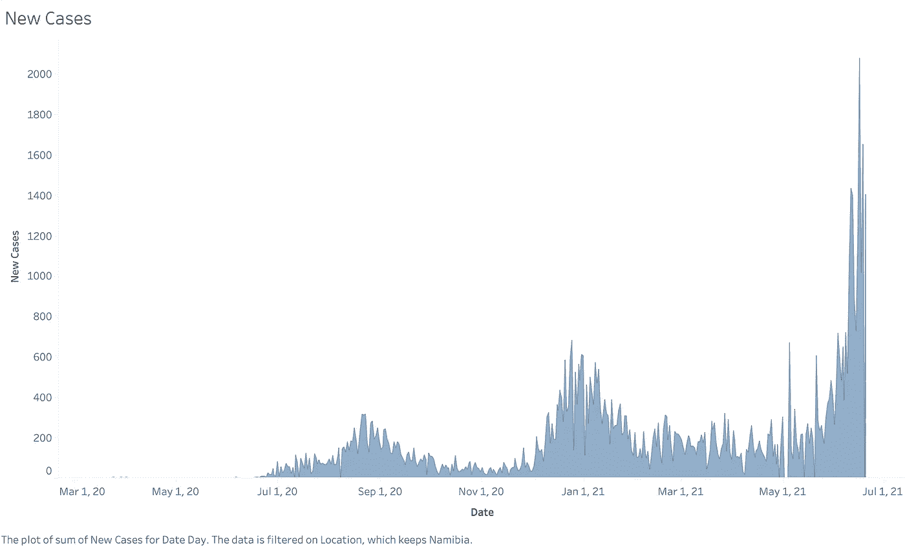

# 纳米比亚的新冠肺炎:数据说明了什么

> 原文：<https://medium.com/analytics-vidhya/covid-19-in-namibia-what-the-data-says-a6a0526f2901?source=collection_archive---------15----------------------->

像地球上的其他国家一样，纳米比亚一直在与新冠肺炎作战。虽然纳米比亚政府仍有许多不足之处，但它已经做了大量工作，采取措施帮助遏制病毒传播，拯救人们的生命，同时保障人民的生计。在本文中，我们深入研究了从[https://covid.ourworldindata.org](https://covid.ourworldindata.org/data/owid-covid-data.csv)获得的全球 covid 数据，分析了新冠肺炎在纳米比亚的趋势，并将其与其他国家进行对比，以了解相对于一些受影响最严重的国家，纳米比亚是如何受到新冠肺炎的影响的。

这是一个数据可视化项目，所以本文的讨论仅限于此。在这篇文章之后，我们将对疫情进行深入的统计分析，敬请关注。

# 纳米比亚的新冠肺炎趋势

首先，我们从总病例和新病例的角度来看病毒的传播。

上图显示了每天新增病例激增的三个不同时间。第一次发生在 2020 年 8 月初，并以这种速度持续到 2020 年 9 月底。这是纳米比亚的第一波浪潮。第二次高峰在 2020 年 12 月开始，并在 2021 年 1 月底开始回归正常。这可以被描述为第二波。第三次高峰始于 2021 年 5 月初，目前在 2021 年 6 月 16 日达到顶峰，单日新增病例达到创纪录的 2075 例。我们无法判断 6 月 16 日是否会是第三波中的最高值，但是，如果历史可以证明的话，很可能会是最高值(还要考虑到当天新增确诊病例的数量是一个异常值)。此外，根据前两次浪潮的趋势，这波浪潮还可能持续几周到一个月。此外，请注意，这一波记录了纳米比亚每天最多的病例和频率。这意味着，在这一波结束后，病例数将回归正常水平，但仍有可能高于前两波。

当我们把每天新病例的数量和新测试的数量进行对比时，我们发现了一些有趣的事情。每个点的最高峰值与新测试的最高数量一致，并且这发生在所有 3 个波的峰值处。例如，一天中记录的最高病例数是在 1 月 16 日，这些结果是从纳米比亚一天中接触的最多的检测中获得的。这为长期以来的理论提供了可信度，即纳米比亚每天记录的病例数量相对较低，因为它每天进行的检测相对较少。因此，需要加强测试活动。

到目前为止，我们看到的趋势与每天新增死亡人数的趋势类似。每一波都与每天记录的高死亡人数相关联。随着波动回归正常，死亡人数也在下降。与前两次浪潮相比，纳米比亚正在经历的第三次浪潮每天死亡人数最多，累计死亡人数也最多，这主要是因为它也碰巧每天阳性检测人数最多。这是有道理的。每一次浪潮都与病毒的高传播率相关，这意味着许多易受感染的人面临感染病毒的风险，需要住院治疗。越来越多的人需要住院治疗，这往往给卫生保健系统带来巨大负担，使其不堪重负，导致越来越多的人死于艾滋病毒。我们的集体责任是遵守政府规定的新冠肺炎协议，通过接种疫苗来帮助减少需要住院治疗的人数，从而限制疫情的持续时间。

关于纳米比亚的病例总数，没有什么可说的，只是总数在过去几个星期里几乎呈指数增长。如果不采取措施降低每日感染率，这是个坏消息。

# 纳米比亚与世界其他地方

在这一节中，我们来看看纳米比亚的新冠肺炎图表和数字，以及它们与世界其他地区相比的样子。当我说“世界其他地区”时，我指的是根据其与纳米比亚的邻近程度(即南非)以及它们受病毒影响的程度而选择的几个国家。我们特别将纳米比亚与印度、美国、法国、巴西和英国进行比较。

纳米比亚的人口比所有列出的国家都要少得多，所以为了便于比较，为了得出真实的结果，我们使用了每十万人的数字。

上面两张图显示了纳米比亚每天新增病例数与印度相比的情况。在过去的几个月里，印度是疫情受灾最严重的地区之一。这一时期在图表上显示为 2021 年 4 月 1 日至 2021 年 6 月之间的天数。然而，当我们比较纳米比亚和印度时，我们发现纳米比亚几乎在每一点上每 10 万人中每天的感染率都更高。这意味着，当我们混淆人口规模的差异时，纳米比亚每天感染病毒的人数比印度多。值得注意的是，第二张图显示了印度的实线和纳米比亚的虚线。这表明，尽管在印度每天检测呈阳性的人数较少，但与纳米比亚相比，阳性结果出现的频率要高得多。

如下图所示，纳米比亚和印度之间的新增死亡人数也呈现相同趋势

这表明纳米比亚每天记录的死亡人数比印度多得多，尽管没有印度频繁。

当将纳米比亚与美国和巴西等国家进行类似的比较时，纳米比亚的新增每日感染率似乎低于这些国家。下图对此进行了说明:

请注意，在过去一个月左右的时间里，与纳米比亚相比，美国记录的新增病例要少得多。在我看来，这可以归因于美国加强了疫苗接种运动。

当对纳米比亚和它最近的邻居南非进行类似的比较时，数据显示了类似的/可比较的趋势。

图表还显示，纳米比亚和南非几乎一直都是同时出现海浪的。考虑到这些国家彼此如此接近，这并不奇怪。每天每 10 万人中新增死亡人数也说明了这一趋势。

在分析死亡人数时，我还想知道纳米比亚和美国(世界上新冠肺炎死亡人数最多的国家)的每日死亡人数如何比较。

美国的每日死亡人数在 2021 年 1 月的某个时候达到峰值，此后一直呈下降趋势。另一方面，纳米比亚每天的死亡人数一直呈上升趋势。在 2021 年 4 月的某个时候，纳米比亚开始记录每 10 万人中的死亡人数超过美国，这一趋势一直持续到今天。随着美国许多州放松新冠肺炎，以及一个相对强大的运动，我不得不得出结论，上述美国每日死亡趋势与他们强大的疫苗接种运动有关。

PS: *我试图做一个包含疫苗编号的可视化，但是，数据集对于疫苗接种变量有太多的空值。这使得分析无法进行。*

作为分析的结尾，下面是一张图表，显示了我所比较的国家中新冠肺炎病毒导致的总死亡人数。

正如您所看到的，美国、法国和英国等国家似乎已经开始停滞，而纳米比亚似乎在增长。

# 临终遗言

数据没有显示阳性病例或死亡人数有下降趋势。此外，比较分析表明，我们的情况与世界其他地区一样糟糕，甚至更糟。虽然政府已经做了很多，但看来艰难的时刻还在前面。我说这些不是为了吓唬你或引起公众恐慌，而是为了提醒你，我们有集体责任防止新冠肺炎的传播并减少随之而来的死亡人数。请遵守现有的协议，重要的是，接种疫苗不仅有助于降低感染病毒的风险，还可以降低感染病毒后需要住院治疗的可能性。如前所述，减少新冠肺炎死亡人数在很大程度上取决于减轻病毒给卫生设施带来的负担。

我希望这一分析已经给了你一个简单易懂的新冠肺炎在纳米比亚，也许是世界其他地方的概况。这篇文章的后续将是对该病毒如何具体影响纳米比亚的深入统计分析。请注意这一点。