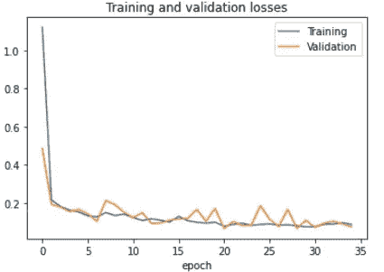

# 使用胸部 X 射线扫描的 COVID 19 预测

> 原文：<https://medium.com/analytics-vidhya/covid-19-prediction-using-chest-x-ray-scans-35ad08fda4f8?source=collection_archive---------13----------------------->

# **简介:**

随着全球 COVID 19 病例数量的不断增加，医生的负担也越来越重。任何常规的 COVID 测试大约需要 1-2 天才能获得最终报告。因此，需要开发一种能够更快输出结果的测试，以便能够在早期采取必要的措施。

随着人工智能和深度学习的出现，有可能设计出一种监督学习模型，它可以在给定一些输入特征的情况下预测特定的疾病。
这是我项目的目标，即建立一个神经网络，通过查看胸部 X 射线扫描，以高精度预测一个人是否患有新冠肺炎病。

这个项目可以减轻医生的负担，得到更快更准确的报告。

来源:谷歌图片

# 使用的库和数据集

整个项目用 python 语言制作，在 google colab 环境下进行。为了设计神经网络，使用 Keras 顺序 API，TensorFlow 作为后端。

对于可视化数据和数据分析:使用了 pandas、matplotlib 和 NumPy 库。

该数据集是从一个开源网站 kaggle.com 获得的。数据集包含两组，即非 COVID 19 和 COVID 19 感染的患者的肺 X 射线图像。

# **数据预处理和数据扩充**

为了将训练数据传递给我们的模型，我们必须首先对其进行预处理，并将其分成训练测试集和验证集。

***数据扩充:*** 数据扩充是在我们的训练数据上实现的一种基本且有价值的技术，使我们的模型更加高效。在数据增强中，我们基本上试图改变图像的方向，翻转图像(垂直或水平)，模糊图像等。，来增加我们的训练数据集。

# **构建卷积神经网络**

**卷积神经网络**或 **ConvNet** 是一类神经网络，最常用于分析视觉图像。

构建的模型是连续的，结合了卷积层、汇集层、下降层、展平层、具有 relu 激活的密集层和具有 sigmoid 激活的输出层。

由于我们在这个项目中的任务是二元分类，即预测 COVID 19 阳性或 COVID 19 阴性，所以我在最终输出层上使用了 sigmoid 激活。为了在神经网络上执行梯度下降，我使用了学习率为 0.001 的 Adam optimizer。

最后在训练数据集上对模型进行训练，然后我对模型进行评估。我做了大量的点击和试运行来微调模型要训练的时期数，最高的训练和验证集精度是在 35 个时期获得的

# **模型评估**

## **可视化:**

为了直观显示每个时期后训练和验证数据集的准确性和损失，我在 matplotlib 库的帮助下绘制了它们。

最后，在测试集上对该模型进行了评估，即从未见过的图像，其准确率为 98.14 %

模型的最终结果是:

1.  训练集准确率:97.38 %
2.  训练集损失:0.0875
3.  验证集准确率:97.79 %
4.  验证集损失:0.0744
5.  测试集准确率:98.14 %
6.  测试集损失:0.06641

# **参考文献**

1.  Google Colab 项目链接:[https://Colab . research . Google . com/drive/1 ea 2r p5b _ 8 vwtoxeoy 7 R4 dq Mao 4 pze _ y？usp =分享](https://colab.research.google.com/drive/1oeA2Rp5B_8VWtOXEoY7R4dQMaO4pZe_y?usp=sharing)
2.  Github 项目链接:[https://github . com/rishitotteja/Prediction-of-新冠肺炎-using-Chext-X-ray-Images-convolutionary-Neural-Network-CNN](https://github.com/RishitToteja/Prediction-of-COVID-19-using-Chext-X-ray-Images-Convolutional-Neural-Network-CNN)
3.  使用的数据集来源:[https://github.com/RishitToteja/Chext-X-ray-Images-Data-Set](https://github.com/RishitToteja/Chext-X-ray-Images-Data-Set)