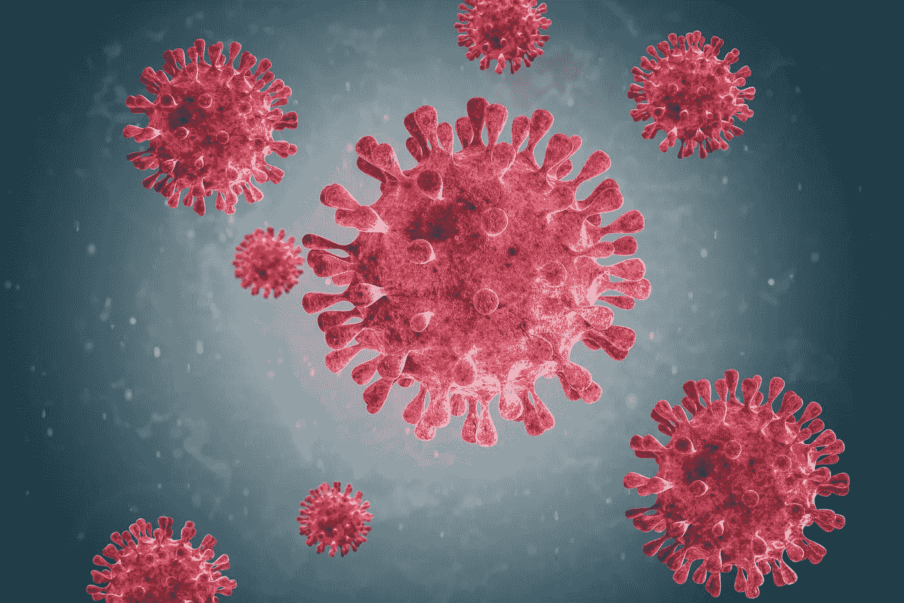
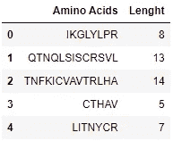
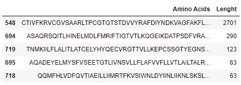
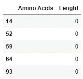

# 使用 Python 进行新冠肺炎蛋白质分析

> 原文：<https://medium.com/analytics-vidhya/covid-19-protein-analysis-with-python-82bccb607b98?source=collection_archive---------4----------------------->

## 用新冠肺炎刺突蛋白学习蛋白质分析的基础知识(教程的第 1 部分，共 5 部分)



来源:[果园软件](http://www.orchardsoft.com)

# 介绍

蛋白质组学是对生物系统中蛋白质的研究。典型地，在这个领域中，研究蛋白质的结构、功能和相互作用。但是这个领域最重要的目标之一是描述蛋白质的三维结构。在接下来的文章中，我们将探索分析新冠肺炎刺突蛋白三维结构的方法。但在我们开始之前，让我们先了解我们正在使用的 DNA 序列，并使用 python 进行蛋白质合成。

# 设置环境

1.  下载[蟒蛇包](https://docs.anaconda.com/anaconda/install/windows/)
2.  下载 Python 3
3.  在这里安装来自[的 Biopython】](https://anaconda.org/anaconda/biopython)
4.  打开 Jupyter 笔记本

# 下载数据

为了这个演示，我们需要新冠肺炎基因组的 FASTA 序列。使用下面的 **wget** 命令下载项目数据:

```
# Get the data
!wget [https://raw.githubusercontent.com/VarunSendilraj/Bioinformatics/main/covid19_basic _protien_analysis/sequence.fasta](https://raw.githubusercontent.com/VarunSendilraj/Bioinformatics/main/covid19_basic%20_protien_analysis/sequence.fasta)
```

如果您在 widows 或 mac 上， **wget** 命令将不起作用，因此请使用 **urlib** 库:

**Windows/Mac:**

```
import urllib.request
url = '[https://raw.githubusercontent.com/VarunSendilraj/Bioinformatics/main/covid19_basic%20_protien_analysis/sequence.fasta'](https://raw.githubusercontent.com/VarunSendilraj/Bioinformatics/main/covid19_basic%20_protien_analysis/sequence.fasta')
filename = 'sequence.fasta'
urllib.request.urlretrieve(url, filename)
```

# 了解 FASTA 文件

让我们从导入 **Biopython** 库并解析基因组文件开始我们的分析:

```
import Bio
from Bio import SeqIO # library used to parse the file
from Bio import Seqcovid19 = SeqIO.parse('sequence.fasta', 'fasta')
```

在一个典型的 FASTA 文件中，除了感兴趣的序列之外，还有多个其他记录存储在那里。让我们遍历 FASTA 文件，分离并打印出感兴趣的信息:

```
for rec in covid19:
    seq = rec.seq  #genome sequence
    print(rec.description)
    print(seq[:10])
    print(seq.alphabet)--------------------------------------------------------------------
**#expected output:**NC_045512.2 Severe acute respiratory syndrome coronavirus 2 isolate Wuhan-Hu-1, complete genome
ATTAAAGGTT
SingleLetterAlphabet()
```

正如我们上面看到的，我们的字母表顺序是[**【singletelphabet()】**](https://biopython.org/docs/1.75/api/Bio.Alphabet.html)**。**因为我们正在处理 DNA，所以让我们将字母表转换成[**ambiguous _ DNA()**](https://biopython.org/docs/1.75/api/Bio.Alphabet.html)这样我们就可以在教程的后面执行特定的操作:

```
from Bio import Seq
from Bio.Alphabet import IUPACseq = Seq.Seq(str(seq), IUPAC.unambiguous_dna)
```

现在，如果我们打印出这个序列，它看起来会非常吓人和令人困惑:

```
print(seq)--------------------------------------------------------------------**#expected output:**ATTAAAGGTTTATACCTTCCCAGGTAACAAACCAACCAACTTTCGATCTCTTGTAGATCTGTTCTCTAAACGAACTTTAAAATCTGTGTGGCTGTCACTCGGCTGCATGCTTAGTGCACTCACGCAGTATAATTAA
...........
TGAACAATGCTAGGGAGAGCTGCCTATATGGAAGAGCCCTAATGTGTAAAATTAATTTTAGTAGTGCTATCCCCATGTGATTTTAATAGCTTCTTAGGAGAATGACAAAAAAAAAAAAAAAAAAAAAAAAAAAAAA
```

因此，让我们使用 [**默认值**](https://realpython.com/python-defaultdict/) 来计算基因组中每个含氮碱基的数量:

```
from collections import defaultdict
count = defaultdict(int)for letter in seq:
    count[letter] += 1

total = sum(count.values())
count--------------------------------------------------------------------**#expected output:**defaultdict(int,
    {'A': 8954, 
     'T': 9594, 
     'G': 5863, 
     'C': 5492})
```

让我们分析一下每个碱基的百分比:

```
for letter, count in count.items():
    print(f'{letter}: {100.*count / total} {count}')--------------------------------------------------------------------**#expected output:**A: 29.943483931378122 8954
T: 32.083737417650404 9594
G: 19.60672842189747 5863
C: 18.366050229074006 5492
```

# 新冠肺炎蛋白质合成

既然我们已经了解了基因组，让我们把 DNA 转化成蛋白质。这个过程的第一步叫做转录。这是 DNA 序列在酶 [RNA 聚合酶](https://www.bing.com/search?q=RNA+polymerase&filters=sid%3a31ff3089-4479-977c-79a7-5c2469e159c2&form=ENTLNK)的帮助下转化为 RNA 分子的过程。我们实际上可以用 Biopython 的 [**转录()**](http://biopython.org/DIST/docs/tutorial/Tutorial.html#sec24) 函数来模拟这一点:

```
rnaCount = defaultdict(int)for letter in rna:
    rnaCount[letter] += 1

total = sum(rnaCount.values())
print(rnaCount)--------------------------------------------------------------------#expected output:
defaultdict(int, {'A': 8954, 'U': 9594, 'G': 5863, 'C': 5492})
```

通过上面的代码我们可以看到 *T(胸腺嘧啶)*被 *U(尿嘧啶)*所取代。这表明转录是成功的。下一步是通过翻译将其转化为蛋白质。翻译是用来描述[核糖体](https://www.bing.com/search?q=Ribosome&filters=sid%3a195ffa10-9311-01fe-8ce7-9446487ed838&form=ENTLNK)合成蛋白质过程的术语。类似于上面的例子，这可以通过一个 [**translate()**](http://biopython.org/DIST/docs/tutorial/Tutorial.html#sec25) 函数来完成:

```
protien = rna.translate(stop_symbol="*") #(*)represent stop codonprint(protien)--------------------------------------------------------------------#expected output:
Seq('IKGLYLPR*QTNQLSISCRSVL*TNFKICVAVTRLHA*CTHAV*LITNYCR*QD...KKK', HasStopCodon(IUPACProtein(), '*'))
```

终止密码子由**星号(*)表示。**这告诉核糖体停止在该位点构建特定的蛋白质。有了这些知识，我们可以将序列分解成独立的蛋白质，并将其组织在一个数据框架中:

```
aa = protien.split("*")ncov = [str(i) for i in aa]
ncov_len = [len(str(i)) for i in aa]#store the amino acid chains into a df
import pandas as pd
df = pd.DataFrame({'Amino Acids': ncov, 'Lenght': ncov_len })df.head()
```

输出应该是这样的:



图片作者:Varun Sendilraj

让我们看看最长和最短的氨基酸序列(蛋白质):

```
df.nlargest(5, "Length")df.nsmallest(5, "Length")
```

最长序列:



图片作者:Varun Sendilraj

最短序列:



图片作者:Varun Sendilraj

最后，让我们看看最常见的氨基酸:

```
from collections import CounterCounter(protien).most_common(10)
--------------------------------------------------------------------
#expected output[('L', 886),
 ('S', 810),
 ('*', 774),
 ('T', 679),
 ('C', 635),
 ('F', 593),
 ('R', 558),
 ('V', 548),
 ('Y', 505),
 ('N', 472)]
```

最后，我们获得了新冠肺炎基因组，并进行了蛋白质合成。在下一个教程中，我们将采用新型冠状病毒穗的 PDB 文件，并做一些蛋白质可视化和三维分析。

**已完成的 Jupyter 笔记本** : [生物信息学/新冠肺炎蛋白质分析第 1 部分. ipynb 在主要的 VarunSendilraj/生物信息学(github.com)](https://github.com/VarunSendilraj/Bioinformatics/blob/main/covid19_basic%20_protien_analysis/Covid-19%20Protien%20Analysis%20part%201.ipynb)

第二部分:即将推出