# 使用逻辑回归和 LSTM 的新冠肺炎情感分析

> 原文：<https://medium.com/analytics-vidhya/covid-19-sentiment-analysis-using-logistic-regression-and-lstm-bab3ca6d33a1?source=collection_archive---------14----------------------->

# 背景:

使用来自 [Kaggle](https://www.kaggle.com/datatattle/covid-19-nlp-text-classification) 的新冠肺炎数据集，使用逻辑回归和 LSTM 建立情感分析模型。

# 数据预处理:

我导入了所需的库，使预处理成为可能。

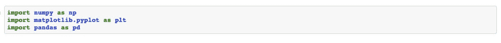

加载 csv 文件并使用 latin1 作为 UTF-8 编码，或者只是读取而不编码会返回错误。我用了。info 函数来获取关于数据集的信息。

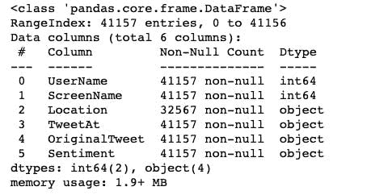

然后，我检查了训练数据集和测试数据集的前五列，以查看每列的行标题。

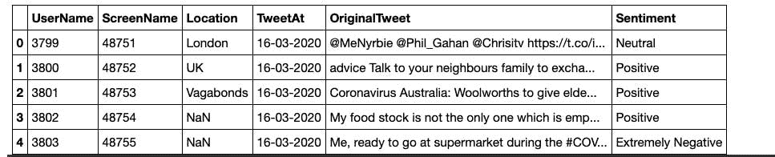

从情绪上看，它有五个等级:积极、消极、非常积极、非常消极和中性。我不得不把五门课减少到三门。正面的、负面的和中性的，并将这些变化应用于训练集和测试集。使用 matplotlib.pyplot，我可视化了更新后的数据集。

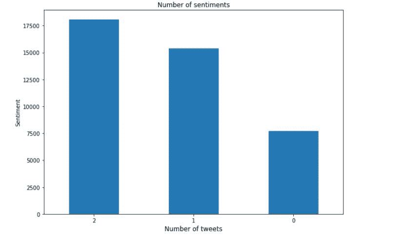

我检查了训练集和测试集中的空值，发现 location 有空值。

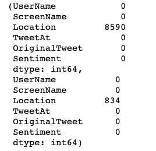

训练集和测试集分别具有(41157，6)和(3798，6)列和行。

# 数据清理:

这个项目有文本数据集，它的清理必须彻底，以防止错误。导入清洗所需的库

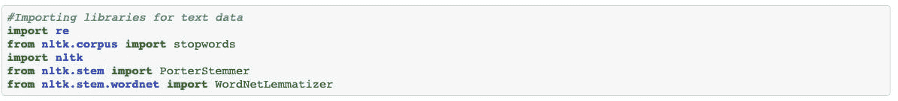

我删除了所有的停用词，包括标签，网址，提及，数字等。我将这些更改应用于训练集和测试集。分析的基础是被选中的 Tweet 栏和情感栏，其他的被删除。可视化更新的数据集

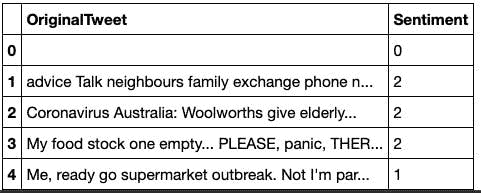

我对训练集和测试集都进行了简化。

分割和矢量化:

我导入了有助于数据集分割和矢量化的库，它们是 scikit-learn 框架。

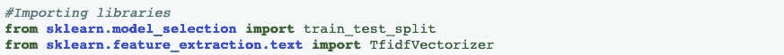

我分割了数据集，并对其进行了矢量化处理。我使用的矢量器是 TFID 矢量器，因为我考虑了一个词的总权重，包括它的频率。我想象了特征、重量和发生的频率

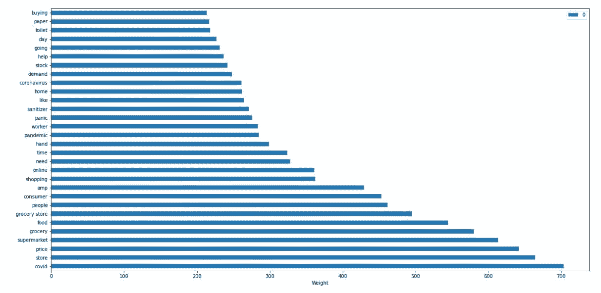

# 建筑和培训:

# 逻辑回归模型:

我导入了完成这项工作所需的库

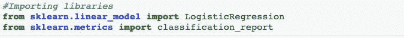

让分类器报告工作，我在训练数据集中得到了以下结果

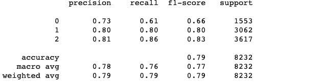

我还使用两个参数对验证数据集进行了测试。第一个参数为:penalty = 11 solver = lbfgs，精度较低。然后我改变了第二个参数:penalty = 12 solver = saga，得到了更高的精度，如下所示

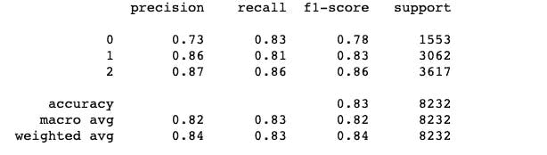

用测试集检查报告，我还必须在测试前对测试集进行矢量化。在用模型进行预测时，我得到了以下报告

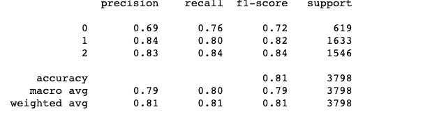

模型可视化:

我使用 seaborn 和混淆度量来可视化结果

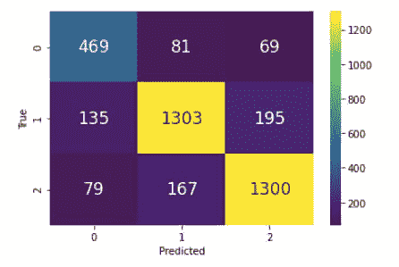

# LSTM 模式:

这是第二个使用相同数据集的模型，我在这个模型中对数据集使用了标记器。下面是所需库的样子

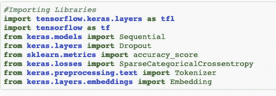

我还填充了数据集以获得相等的长度

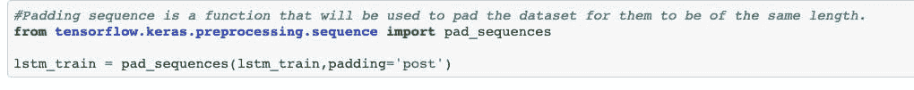

构建 LSTM 模型:

我使用序列模型来构建神经网络，其中丢失了稀疏分类交叉熵、Adam 优化器和“准确性”指标来编译模型。模型概述:

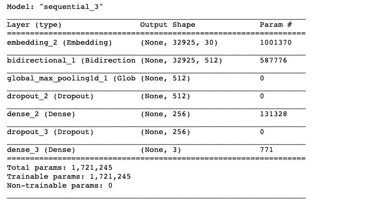

我分割数据集，并使用两个时期训练模型。

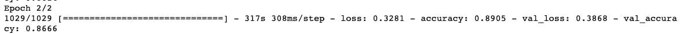

预测:

我使用填充后的测试数据集进行预测，获得了 83.997451290152%的准确率。

可视化:

使用混淆度量和 seaborn，模型是可视化的。

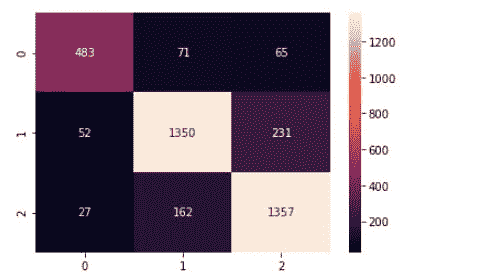

# 结论:

这是本周早些时候一次面试的课后作业。这个笔记本可以在 [Github](https://github.com/Nwosu-Ihueze/iQube_lab/blob/main/Sentiment_analysis.ipynb) 和 [Kaggle](https://www.kaggle.com/nwosurosemary/sentiment-analysis-with-logistic-regression-lstm) 中找到。对于建议或更正，可以通过 [LinkedIn](https://www.linkedin.com/in/rosemary-nwosu-ihueze/) 联系我。

感谢您的阅读。