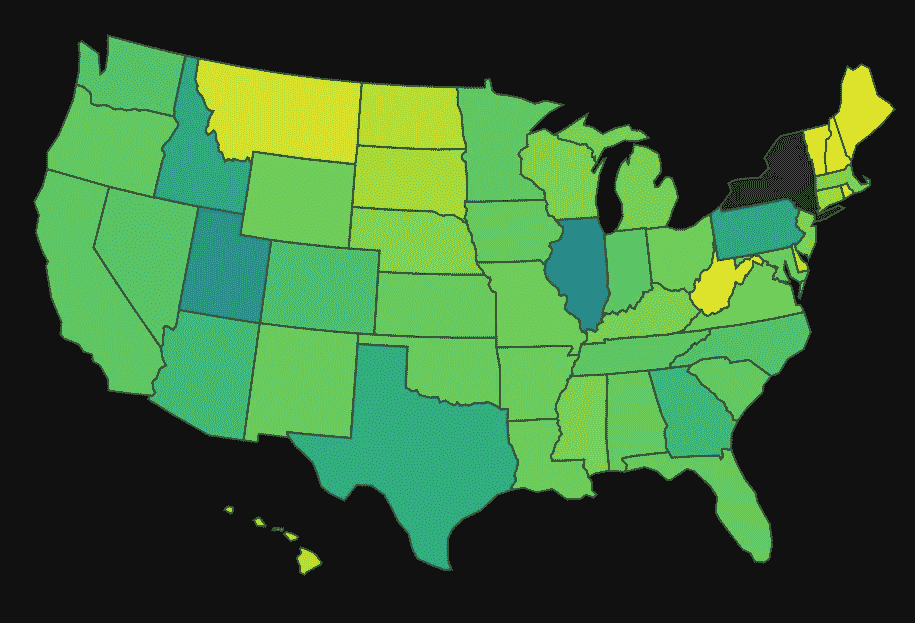

# 新冠肺炎疫苗接种——带 Plotly Express 的动画 Choropleth 地图

> 原文：<https://medium.com/analytics-vidhya/covid-19-vaccinations-an-animated-choropleth-map-with-plotly-express-50aa3c83e01e?source=collection_archive---------10----------------------->



作者图片

## 如何用不到 20 行代码创建一个美国各州的地图，以动画形式展示辉瑞新冠肺炎疫苗的推出。

*需要注意几个问题:这个案例研究只研究了辉瑞疫苗，使用的人口数据来自 2019 年。该数据仅用于演示* [*图表达 Choropleth*](https://plotly.com/python/choropleth-maps/) *图的使用。*

Plotly express 是一种奇妙的、高级的和用户友好的与 Plotly 交互的方式。它抽象出了创建许多可用的美丽情节所涉及的复杂性，下面我们将重点关注我最喜欢的一个——动画 Choropleth 地图。

## **进口:**

```
import pandas as pd
import plotly.express as px
```

## **数据:**

本练习的数据来自:

*   [美国疾病预防控制中心:按辖区划分的新冠肺炎疫苗分销分配——辉瑞](https://data.cdc.gov/Vaccinations/COVID-19-Vaccine-Distribution-Allocations-by-Juris/saz5-9hgg)
*   [Infoplease:各州人口排名](https://www.infoplease.com/us/states/state-population-by-rank) (2019)

为了让数据进入我在动画中使用的状态，需要一些数据争论和特征工程。我已经在这个[要点](https://gist.github.com/Tavnuh/e414a18e7667581383ae0363d04f4529)中提供了争论的数据，你可以在这个项目的 [GitHub 回购中看到争论的操作。](https://github.com/Tavnuh/COVID-19-Vaccine-Rollout-Map/blob/master/US%20Covid-19%20Vaccinations.ipynb)

我选择使用每个州按人均计算的首剂分配的累计总和来显示每个州人口的覆盖率。

# 动画 Choropleth 地图

```
px.choropleth(data_frame = data.query(‘jurisdiction != “Alaska”’),
              locations=’state_codes’,
              color=’vax_per_cap’,
              template = ‘plotly_dark’,
              color_continuous_scale=”viridis”,
              animation_frame=’week’,
              locationmode=’USA-states’,
              basemap_visible=False,
              scope=’usa’,
              height=600,
              width=800,
              title=’Pfizer COVID-16 Vaccine allocations’,
              hover_name = ‘jurisdiction’,
              labels={‘vax_per_cap’:’Vaxes % of Population’,
                      ‘week’:’Week’,
                      ‘state_codes’:’State Code’})
```

上面你可以看到生成的地图，以及由 Plotly Express 提供的一些内置交互性的简短演示。

## 论据的解释:

`data_frame` :接受一个数据框架或字典作为输入，在这种情况下，我过滤掉了阿拉斯加，纯粹是因为它在人均剂量方面遥遥领先，并且扰乱了色阶:)

`locations` : Plotly express 需要美国地图的州代码(不是州名)，这是由 [rogerallen](https://gist.github.com/rogerallen/1583593) 提供的字典帮助的，包含在 GitHub repo 中。干杯罗杰。

这是将要告诉绘图对象如何给地图上色的列或系列。

`template`:给你一个简单的方法来访问一些默认的颜色。你可以从`['ggplot2', 'seaborn', 'simple_white', 'plotly', 'plotly_white', 'plotly_dark'`等地选择。

`color_continuous_scale`:根据提供给“颜色”栏的数据的分布方式，选择不同的[色标](https://plotly.com/python/builtin-colorscales/)可能会有用。

`animation_frame`:这是一列将指示颜色如何从一帧到另一帧变化，通常是一个时间序列数据点。

`basemap_visible`:去掉没有相应数据的陆地区域，这里是阿拉斯加。

`labels`:我用来清理图例和悬停工具提示中的一些数据标签的字典。

**关于色阶的一个词:**你可能注意到右边的色阶条是动态的，即。根据每一帧的最小值和最大值在动画过程中进行更改。有一个名为`range_color`的参数，它将上限和下限作为一个元组，允许您锁定一个颜色范围。我在这里没有使用它，因为我想显示状态之间随时间的比较，但如果您希望传递给`color`的变量与一个设定的上下限进行比较，它可以让您进行控制。

# 结论！

目前就这些。显然，这里的数据并不是新冠肺炎疫苗推广数据的完美或超级可靠的来源，但希望它是超级强大和易于使用的体面展示 **Plotly Express** ，以及在这些麻烦时期世界可能走向何方的一些有希望的迹象。请，请随意叉回购，增加更多的疫苗制造商，并根据您的喜好进行其他调整！很想看看你在评论中提出了什么。