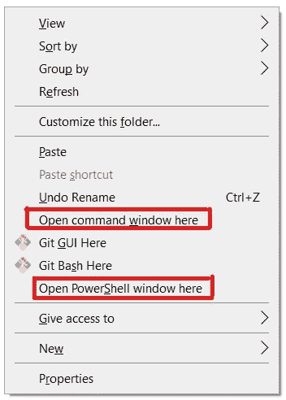
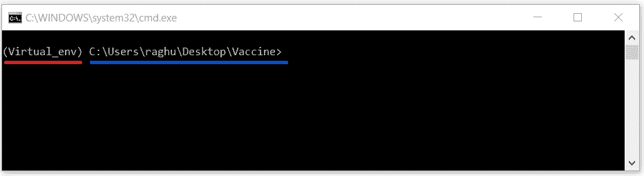
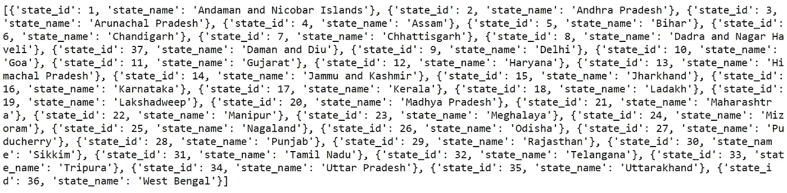
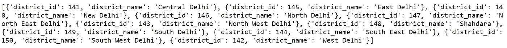
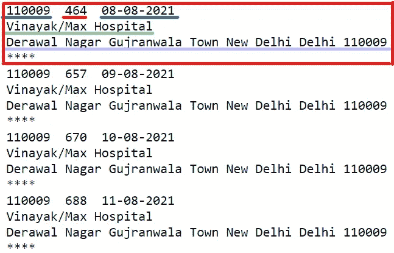

# 使用 PYTHON 的新冠肺炎疫苗查找器

> 原文：<https://medium.com/analytics-vidhya/covid-19-vaccine-finder-with-python-34a3ec55fd72?source=collection_archive---------10----------------------->


使用 Python 的新冠肺炎疫苗查找器— Raghuvansh Tahlan

新冠肺炎是一个持续的局势，也是一个不可预测的局势。向牺牲生命的一线工人表示哀悼，向仍在战斗的其他人表示问候。几乎每个人都受到了影响，有些人比其他人更严重，但还没有结束。多亏了它，我们的生活陷入了停滞。

在这个可怕的时代，疫苗给了我们希望和战斗的勇气。但是在印度很难买到，因为印度人口众多，供应有限。像 Paytm Vaccine Finder 这种基于政府通过 [*API Setu*](https://apisetu.gov.in/public/api/cowin) 、提供的 API 的移动应用，已经为人们提供了出色的服务。但是人们不应该局限于提供给我们的应用程序；我们应该能够自己创建一个基本的或者修改它们来满足我们的需要。

这是一个使用 Python 创建新冠肺炎疫苗查找器的指南:

1.  创建虚拟环境。

2.根据地区和密码寻找疫苗

3.使用机器人在电报上发送信息

# 创建虚拟环境(venv)

虚拟环境帮助创建、管理和隔离项目环境，每个环境使用相同或不同版本的可执行文件。如果要部署项目，它们也有助于轻松创建需求文件。

[](/analytics-vidhya/hands-on-virtual-environment-in-python-bb0d5a0b8699) [## 为什么我不再使用命令行来激活我的虚拟环境？

### 了解如何使用 venv 创建虚拟环境并使用可执行文件激活。

medium.com](/analytics-vidhya/hands-on-virtual-environment-in-python-bb0d5a0b8699) 

1.  在任何合适的位置创建一个名为“ **Vaccine** ”的新文件夹(或者根据方便的情况)。
2.  打开命令窗口(CMD)或 Power Shell，导航到文件夹“**疫苗**”。也可以按下 **SHIFT** 同时**右键**选择“**在此打开命令窗口**或“**在此打开 PowerShell 窗口”。**



步骤 2-在此处打开命令窗口/PowerShell 窗口— Raghuvansh Tahlan

3.使用 **venv 创建一个虚拟环境。**

```
python -m venv <name_of_virtual_environment>
```

4.创建一个**文本(。txt)** 文件，并将其重命名为“**activate . bat**”**以使‘批处理可执行文件’用于激活虚拟环境。**

```
start cmd /k "%~dp0Virtual_env\Scripts\activate.bat"
```

**编写以下命令并保存文件，其中“ **Virtual_env** ”是创建的虚拟环境的名称。**

**现在，执行批处理文件(双击),如果一切正常，应该会得到如下所示的输出。**

****

**步骤 4 —激活虚拟环境— Raghuvansh Tahlan**

**5.创建一个名为“ **Vaccine.py** ”(个人选择)的 Python 文件，使用编辑器打开它，并编写以下命令**

```
print("Hello")
```

**保存文件并通过以下命令执行 Python 文件。**

```
python Vaccone.py
```

**应该可以在命令行中看到“Hello”作为输出。**

**5.我们需要 python 模块" **requests** "来请求 API，可以使用命令来安装**

```
pip install requests
```

# **基于地区和密码查找疫苗的功能**

**官方文档和可用方法请参考[***COWIN-API***](https://apisetu.gov.in/public/api/cowin/cowin-public-v2)网站。**

1.  **州的唯一标识。**

**获取 Cowin API 的州 id 的代码— Raghuvansh Tahlan**

****

**使用 CoWIN_API 的 STATE _ ID—Raghuvansh tah LAN**

**为了找到基于地区的疫苗，我们需要获得所需州的“州 id”。“ **BASE_STATE_URL** ”返回状态及其各自的 id。**

```
STATE_ID = 9
```

**这个“ **STATE_ID** ”将用于使用 API 获取地区名称及其各自的 ID。**

**2.所选州中地区的唯一标识**

**获取 Cowin API 地区 id 的代码— Raghuvansh Tahlan**

**“ **BASE_DISTRICT_URL** ”和“ **STATE_ID** ”用于获取地区名称及其各自的标识号。**

****

**使用 CoWIN_API 的 DISTRICT _ ID—Raghuvansh tah LAN**

**所选的地区 Id 被添加到"**地区代码列表中。****

```
DISTRICT_CODE_LIST = [143,146] #For North Delhi and North West Delhi
```

**3.配置变量**

**COWIN API 的配置变量— Raghuvansh Tahlan**

**除了州和地区 Id，还有许多配置可用，如疫苗类型、费用类型和年龄组。**

**4.约会 URL**

**我们可以使用一些参数来搜索疫苗接种的会话，但最有效的是使用 Pincode 和该位置的地区 Id 进行搜索。**

```
APPOINTMENT_BASE_URL_DISTRICT = '''[https://cdn-api.co-vin.in/api/v2/appointment/sessions/public/calendarByDistrict?district_id={entity}&date={date}'''](https://cdn-api.co-vin.in/api/v2/appointment/sessions/public/calendarByDistrict?district_id={entity}&date={date}''')
```

**这个 URL 包含两个变量，"**实体**"和"**日期**"，分别接受"**地区标识**"和"**日期**"的值。**

```
APPOINTMENT_BASE_URL_PINCODE = '''[https://cdn-api.co-vin.in/api/v2/appointment/sessions/public/calendarByPin?pincode={entity}&date={date}'''](https://cdn-api.co-vin.in/api/v2/appointment/sessions/public/calendarByPin?pincode={entity}&date={date}''')
```

**这也是一个类似的 URL，但接受“**密码**和“**日期**”来搜索疫苗接种会话。**

**5.查找疫苗接种会话的功能**

**上述函数接受“**模式**作为输入，它是两个“**密码**和“**区**”中的一个。根据选择的模式，变量“**实体列表**”和“ **url** ”被初始化。通过向 API 发出的变量初始化请求，获取并过滤结果，最终附加到屏幕上显示的“**消息**字符串中。每个疫苗接种阶段使用“ ******** ”分隔。**

****

**第一行包含三个部分，“**密码**”、“**剂量数**”和“**疫苗接种日期**”。**

**第二行是“**疫苗接种中心的名称”**，后面是第三行中的“**疫苗接种中心的地址”**。**

# **使用电报机器人通知**

**使用电报机器人“ **Bot_token** ”和“ **Chat_id** ”发送消息是必要的。按照指南为您的帐户生成一个。**

**[](/@ManHay_Hong/how-to-create-a-telegram-bot-and-send-messages-with-python-4cf314d9fa3e) [## 如何创建电报机器人并用 Python 发送消息

### Telegram 拥有令人惊叹的功能，机器人功能就是其中之一

medium.com](/@ManHay_Hong/how-to-create-a-telegram-bot-and-send-messages-with-python-4cf314d9fa3e) 

```
T_API = '<your_bot_token_here>'
T_CHAT_ID = [<chat_ids_sepearated_by_comma>] # [12345,32455,56777]
```

当您生成了“ **Bot_token** ”和“ **Chat_id** ”之后，将这些值分别放入“ **T_API** ”和“ **T_CHAT_ID** ”中。

```
URL = '''[https://api.telegram.org/bot{T_API}/sendMessage?chat_id={T_CHAT_ID}&text='''](https://api.telegram.org/bot{T_API}/sendMessage?chat_id={T_CHAT_ID}&text=''')
```

生成的“URL”将用于发送消息。

该函数接受“ **URL** ”和“**消息**”作为参数发送给用户。

结合使用 Telegram Bot 查找疫苗和发送消息的函数，我们得到以下函数。该功能接受“**模式**”并在发现疫苗会话时使用电报机器人发送消息。

执行一次或两次函数是没有意义的，但是在一些调度程序或 cron 作业的帮助下重复执行它是有意义的。APScheduler 是一个很好的能够调度间隔和 cron 作业的工具。

# 使用 APScheduler 调度作业

1.  安装 [*程序器*](https://apscheduler.readthedocs.io/)

```
pip install apscheduler
```

2.向调度程序导入和添加作业。** 

**这就把我们带到了指南的结尾，希望你喜欢。请在我的[***Github***](https://github.com/rvt123/Medium_Articles/tree/main/COVID-19%20Vaccine%20Finder%20With%20Python)找到本指南的完整代码。在[***LinkedIn***](https://www.linkedin.com/in/raghuvansh-tahlan/)上联系我。**

**[](https://www.linkedin.com/in/raghuvansh-tahlan/) [## raghuvansh tah LAN-Guru Gobind Singh Indraprastha 大学-新德里，德里，印度| LinkedIn

### 我正在北印度工程学院学习 B. Tech(计算机科学工程)。立志成为一名数据科学家。对算法交易和板球分析感兴趣

www.linkedin.com](https://www.linkedin.com/in/raghuvansh-tahlan/) [](https://github.com/rvt123/Medium_Articles/tree/main/COVID-19%20Vaccine%20Finder%20With%20Python) [## Medium _ Articles/在主 rvt123 上使用 Python 的新冠肺炎疫苗查找器/Medium_Articles

### 此时您不能执行该操作。您已使用另一个标签页或窗口登录。您已在另一个选项卡中注销，或者…

github.com](https://github.com/rvt123/Medium_Articles/tree/main/COVID-19%20Vaccine%20Finder%20With%20Python)**