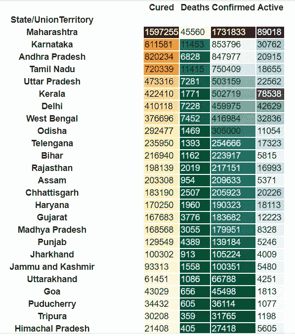

# 新冠肺炎可视化-Choropleth，底图地图和 Tableau

> 原文：<https://medium.com/analytics-vidhya/covid-19-visualizations-choropleth-basemap-maps-and-tableau-9f59dcaf98fd?source=collection_archive---------11----------------------->

自首例冠状病毒疑似病例以来，世界正面临着死亡率极高的严重创伤。来自所有国家的关于活跃病例、死亡、恢复、1 周高峰、提供的疫苗接种和许多其他术语的信息正在以惊人的速度增加。数据在调查、研究和应对突发公共卫生事件的能力中始终发挥着至关重要的作用，这一点在全球危机中尤为突出。

在 [Unsplash](https://unsplash.com/) 上 [Aljoscha Laschgari](https://unsplash.com/@alaschgari) 拍摄的照片

探索性数据分析(EDA)用于分析庞大的数据集，并通过可视化来总结基本特征。在开始工作或进入建模部分之前，这被认为是非常关键的一步，因为它有助于数据科学家理解数据之间的潜在相关性。

# Covid 世界分析

**基本可视化**

1.  确诊和治愈病例最多的前 5 个国家

该数据集包含按字母顺序排列的各个国家。生成的饼图显示了迄今为止确诊病例和治愈病例最多的前 5 个国家。

2.死亡率最高的五个国家

**高级可视化(Choropleth)**

Choropleth 地图广泛用于传达与地理数据集相关的信息，它根据要突出显示的数据变量来划分带有颜色、阴影或图案的地理区域。实现 choropleth 图而不是任何基本图的主要好处是可以简洁地表示大量信息，这在视觉上很吸引人并且容易理解。

照片由[大英图书馆](https://unsplash.com/@britishlibrary)在 [Unsplash](https://unsplash.com/) 上拍摄

**确诊病例**

通过考虑不同国家和该国家/地区的确诊病例，创建了霍乱分布图。将鼠标悬停在地图中的任何特定区域，可以显示与该特定国家相关的信息，这是相对于简单的表格或图表视觉效果的一个主要优势，因为它将减少理解数据所花费的时间，并且覆盖无数的数据。

霍乱-按国家/地区分列的确诊病例

同样，这张地图显示了不同国家的死亡率。

霍乱-按国家/地区分列的死亡人数

# Covid(印度)分析

**基本可视化**

1.按州/联盟地区从最高到最低的确诊病例

2.死亡率最高和确诊病例最多的 10 个州

**高级可视化(底图)**

底图是在 python 中创建地图地块的一个非常有用的库。它通过添加地理投影和其他数据集来绘制海岸线和政治边界，扩展了 Matplotlib 的功能。地理定位在分析数据时提供了有见地的信息。通过提供一个灵活的框架，可以对底图进行自定义，以展示各种主题，这些主题能够展示人口变化、发展增长、天气趋势，甚至是我们政治环境的快照。

**形状文件**-它存储地理特征的位置、形状和属性。它存储为一组相关文件，包含一个要素类。它用于生成底图，因为它包含所需的地理点和面信息。除此之外，一个形状文件包含至少 3 个不同的文件，所以在读取它之前，所有的文件必须位于同一个文件夹中。

**新冠肺炎死亡事件**

**新冠肺炎活跃案例**

下载本分析中使用的形状文件- [形状文件](https://www.igismap.com/download-india-boundary-shapefile-free-states-boundary-assembly-constituencies-village-boundaries/)

# **表格可视化**

Tableau 是执行数据可视化的非常有效的工具，并且是用户友好的。它可以创建复杂的图形，给人一种类似 Excel 中的数据透视表图形的感觉。此外，它可以处理巨大的数据集，并快速提供计算和视觉效果，可以在事后进行过滤。

**优点**

1.  可以快速创建视觉效果，并且很容易在视觉效果中切换不同的滤镜。当有大量的数据并且所有的数据都必须合并到一个单一的视图中时，这是非常有益的。

2.用户界面组织良好，只需点击几下鼠标就可以定制视图。

3.非常容易与多个数据源集成。

4.它为跨国公司提供了以非常交互式的拖放方式执行复杂可视化的能力。

5.Tableau 仪表板可以在企业级部署，并且可以在多种设备上查看和操作，包括笔记本电脑、平板电脑和移动设备。

下面显示的图像是从 Tableau 中的数据集生成的可视化效果。在悬停在任何国家，它显示活跃的和新的案件分别为该国。由于有多个国家/地区需要可视化，因此此图是一个合适的选项，因为所有国家/地区都可以有效涵盖。

下面给出的图表是一个美丽的可视化，其中涵盖了所有世卫组织地区。在右侧，有一个当前适用于欧洲的过滤器，因此图中只考虑了欧洲地区。更改过滤器后，图表将自动根据特定区域进行更改。

继续玩可视化:)

**本文使用的所有代码和数据(Tableau Sheet，Python 笔记本)都可以在** [**Github**](https://github.com/anusandesara/Covid-19-Analysis) **上获得。**

**参考文献**

1.  J.斯图尔特，p .肯涅利，[照明的 Choropleth 地图](https://www.tandfonline.com/doi/abs/10.1080/00045608.2010.485449) (2010)，美国地理学家协会年鉴
2.  米（meter 的缩写））Misra，D. Kumar，[用于城市景观分析的多源数据集底图制作](https://www.researchgate.net/publication/327882916_Base_Map_Preparation_with_Multi-Source_Datasets_for_Urban_Landscape_Analysis) (2018)，印度 ESRI 用户大会
3.  南 Dey，M. Rahman，U. Siddiqi 和 A. Howlader，[分析 COVID‐19](https://onlinelibrary.wiley.com/doi/full/10.1002/jmv.25743) (2020)，医学病毒学杂志
4.  南米塔尔，[印度新冠肺炎的探索性数据分析](https://www.ijert.org/an-exploratory-data-analysis-of-covid-19-in-india) (2020)，《国际工程研究与技术杂志》。