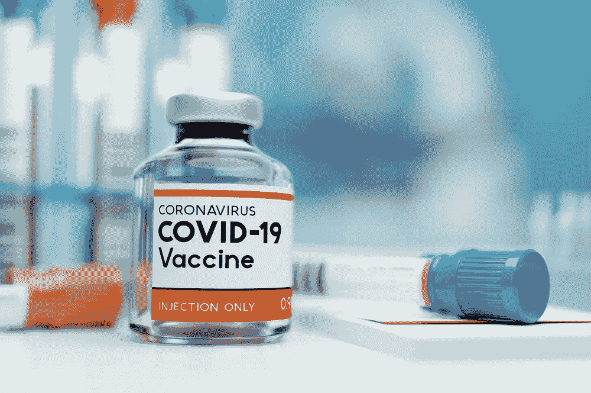

# 新冠肺炎:用 Python 可视化世界疫苗接种数据

> 原文：<https://medium.com/analytics-vidhya/covid-19-visualizing-world-vaccination-data-with-python-bbd09cbe6b39?source=collection_archive---------8----------------------->

2020 年12 月 2 日，英国批准了第一个针对新冠肺炎的疫苗，6 天后，第一个人接种了辉瑞疫苗。这是大规模采用疫苗的第一步，也是全球疫苗接种计划的开始。

三个月后，疫苗接种项目有了怎样的发展？最常用的疫苗是什么…