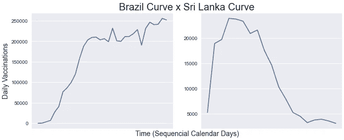

# 新冠肺炎世界 Python 免疫比赛

> 原文：<https://medium.com/analytics-vidhya/covid-19-world-immunization-race-with-python-22c574e630cc?source=collection_archive---------15----------------------->

预测领奖台，在一张 GIF 中可视化疫苗接种演变，考察其黑马！


戴安娜·波莱希娜在 [Unsplash](https://unsplash.com/s/photos/coronavirus-vaccine?utm_source=unsplash&utm_medium=referral&utm_content=creditCopyText) 上拍摄的照片

最近，我发现自己非常好奇，要多久才能最终看到我们的世界摆脱我们所处的这种非常历史性的局面。为此，我决定看看关于疫苗接种的最新数据，在这个过程中，我发现在 GIF 中看到一场完全免疫的比赛可能是一件很酷的事情——特别是如果它是用 python 编写的，结合了 matplotlib 和地理绘图！结果就是这种美。


很高兴知道新冠肺炎的群体免疫率可能达到 70%。

## 酷！现在让我们来了解塞舌尔和智利。

*好吧，那么塞舌尔是什么*？我也是这么问自己的。根据维基百科:

> 塞舌尔是一个由 115 个岛屿组成的群岛国家，位于索马里海的东部边缘。

经过一些研究，可以理解为什么他们在我们的比赛中击败了世界其他国家——这是一个依靠旅游业生存的高经济(世界银行分类)国家。此外，他们的人口只有 10 万左右。

现在，以色列和阿拉伯联合酋长国获得第二和第三名并不奇怪，但是智利呢？是什么让它成为可能？

智利毫不犹豫地尽早购买尽可能多的疫苗。事实上，他们现在已经订购了足够的剂量来对其人口进行两次免疫。智利采取的另一个好举措是为中国农场和阿斯利康主持疫苗试验，这给了他们很大的优势。

# 获取代码！

首先，这里的 [**一应俱全**](https://github.com/ga-tardochisalles/covid-world-vaccination-progress) 上的 [**我的 GitHub**](https://github.com/ga-tardochisalles) 。为了得到想要的结果，我将 python 3.8 与 pandas、geopandas、matplotlib 和 numpy 一起使用。

项目目录结构(python 代码在“src”文件夹中):


1.  让我们首先导入必要的库:

```
import os
from datetime import datetime
import matplotlib.pyplot as plt
import pandas as pd
pd.set_option('display.max_columns', 10)
pd.set_option('display.max_rows', 50)
import geopandas as gpd
import numpy as np
import math
```

2.下载并读取用于绘图的数据集/shape file:

```
# data gathered on 19th of Feb, 2021
INFO_PATH = "../data/country_info.csv"  # [https://www.kaggle.com/koryto/countryinfo?select=covid19countryinfo.csv](https://www.kaggle.com/koryto/countryinfo?select=covid19countryinfo.csv)
VACCINATION_PATH = "../data/country_vaccinations.csv"  # [https://www.kaggle.com/gpreda/covid-world-vaccination-progress](https://www.kaggle.com/gpreda/covid-world-vaccination-progress)
SHAPEFILE_PATH = "../shapefiles/ne_10m_admin_0_countries_lakes/ne_10m_admin_0_countries_lakes.shp"  # [https://www.naturalearthdata.com/http//www.naturalearthdata.com/download/10m/cultural/ne_10m_admin_0_countries_lakes.zip](https://www.naturalearthdata.com/http//www.naturalearthdata.com/download/10m/cultural/ne_10m_admin_0_countries_lakes.zip)info_df = pd.read_csv(INFO_PATH, usecols=["country", "alpha3code", "pop"])
vac_df = pd.read_csv(VACCINATION_PATH, usecols=["country", "iso_code", "date", "total_vaccinations","daily_vaccinations"], parse_dates=["date"])
geo_df = gpd.read_file(SHAPEFILE_PATH)[['ADM0_A3', 'geometry']].to_crs('+proj=robin')
```

3.创建一个我们拥有其每日疫苗接种信息的国家列表，并创建一个空列表来存储拥有足够“可信”数据的国家。此外，初始化字典以存储每个国家的“最早”和“最晚”数据点以及用于未来预测的期望每日疫苗接种值:

```
all_countries = vac_df[vac_df['daily_vaccinations'].isna() == False].country.unique().tolist()
good_confidence_countries = []
countries_daily_fforward = {}
countries_first_update = {}
countries_latest_update = {}
```

4.循环选择将出现在分析中的国家(在这种情况下，至少有 15 天疫苗接种数据的国家),并填充字典:

```
for c in all_countries:
    first_non_na_i = vac_df[(vac_df['daily_vaccinations'].isna() == False) & (vac_df['country'] == c)].head(1).index.item()
    this_c_df = vac_df[(vac_df.index >= first_non_na_i) & (vac_df.country == c)]
    nans_after_first_nan = this_c_df.daily_vaccinations.isna().sum()
    days_with_info = this_c_df.daily_vaccinations.notna().sum()
    first_non_nan_update = this_c_df[this_c_df.daily_vaccinations.notna()]['date'].head(1).item()
    latest_non_nan_update = this_c_df[this_c_df.daily_vaccinations.notna()]['date'].tail(1).item()
    lastest_date = this_c_df['date'].tail(1).item()
    if days_with_info < 15:
        continue
    else:
        good_confidence_countries.append(c)
        all_time_mean = this_c_df[this_c_df.daily_vaccinations.notna()]['daily_vaccinations'].mean()
        recent_mean = this_c_df[this_c_df.daily_vaccinations.notna()]['daily_vaccinations'].tail(5).mean()
        selected_forward_daily_vac = math.floor(0.15 * all_time_mean + recent_mean * 0.85)
        countries_daily_fforward[c] = selected_forward_daily_vac
        countries_first_update[c] = first_non_nan_update
        countries_latest_update[c] = latest_non_nan_update
```

对于这一步，我选择使用 15%的历史平均值+ 85%的五个最新数据点平均值来预测未来的平均每日疫苗接种量。我决定这样做，因为看到下面两种情况中的一种是非常常见的，一个国家的每日疫苗接种数量可能会缓慢增长，然后停滞不前，或者可能会在一个高音符中开始(当他们接受一堆疫苗剂量时，突然下降，停滞不前)。为此，最好不要太关注他们早期接种疫苗的几周或几天，因为它不能对未来说太多:

```
plt.style.use('seaborn')
fig, axes = plt.subplots(nrows=1, ncols=2, figsize=(10, 4))
ax23 = fig.add_subplot(111, frameon = False)
ax23.set_xlabel('Time (Sequencial Calendar Days)', fontsize=14)
ax23.set_xticks([])
ax23.set_yticks([])
ax23.set_title("Brazil Curve x Sri Lanka Curve", fontsize=20)
axes[0].plot(vac_df[vac_df['country'] == "Brazil"].dropna().date, vac_df[vac_df['country'] == "Brazil"].dropna().daily_vaccinations)
axes[0].set_ylabel('Daily Vaccinations', fontsize=14)
axes[1].plot(vac_df[vac_df['country'] == "Sri Lanka"].dropna().date, vac_df[vac_df['country'] == "Sri Lanka"].dropna().daily_vaccinations)
for ax in axes:
    ax.set_xticklabels([])
    ax.set_xticks([])plt.show()
```



让我们只保留我们想要的国家:

```
vac_df = vac_df[vac_df['country'].isin(good_confidence_countries)]
```

5.对于这一步，我将创建一个数据帧，其中每行代表一个{日期，国家}对，日期范围从我们第一次输入每日疫苗接种到 2023 年。首先我们应该知道起始日期:

```
vac_df[vac_df['date'] == vac_df[vac_df.daily_vaccinations.notna()]['date'].min()]
```


现在用正确的日期和国家名称范围创建数据框架，我们称之为“clean_df”:

```
def create_country_date_df(countries, start, end):
    all_dfs = []
    for country in countries:
        df = pd.DataFrame({"date": pd.date_range(start, end), "country": country})
        all_dfs.append(df)
    concat_df = pd.concat(all_dfs, ignore_index=True)
    return concat_df
clean_df = create_country_date_df(good_confidence_countries, '2020-12-14', '2022-12-31')
```

6.将其与“vac_df”和“info_df”合并，以获得每日疫苗接种值(当其为 NaN 时，固定 iso_code 列)和各国所需的疫苗总数(2 *人口，因为每个人需要两剂疫苗):

```
clean_df = pd.merge(left=clean_df, right=vac_df, how='left', on=['date','country'])
clean_df["iso_code"] = clean_df.groupby("country").transform(lambda x: x.fillna(method="bfill"))["iso_code"]
clean_df["iso_code"] = clean_df.groupby("country").transform(lambda x: x.fillna(method="ffill"))["iso_code"]
clean_df = clean_df.merge(info_df[["alpha3code", "pop"]], how="left", left_on="iso_code", right_on="alpha3code").drop(['alpha3code'], axis=1).rename({"pop":"needed_vaccines"}, axis=1)
clean_df['needed_vaccines'] = clean_df['needed_vaccines'].astype(np.int64) * 2 # converting from numpy.int32 to numpy.int64 to prevent overflow
```

7.现在需要填写“每日接种疫苗”列 NaNs，当 NaNs 在未来出现时(在一个国家的最后一个数据点之后)使用已经定义的每日平均值，当它在第一个数据点之前出现时为零，或者当它在这些日期之间出现时简单地向前填充:

```
def correct_daily_vac_col(x):
    dt = x['date']
    country = x['country']
    before_first_info = dt < countries_first_update[country]
    after_last_info = dt > countries_latest_update[country]
    if before_first_info:
        return 0
    elif after_last_info:
        return countries_daily_fforward[country]
    elif pd.isnull(x['daily_vaccinations']):
        return x['daily_vaccinations']
    else:
        return math.floor(x['daily_vaccinations'])
clean_df['daily_vaccinations'] = clean_df.apply(lambda x: correct_daily_vac_col(x), axis=1)
clean_df['daily_vaccinations'] = clean_df['daily_vaccinations'].fillna(method="ffill")
```

8.找出每个国家在每个日期接受免疫的总人口的百分比:

```
clean_df["total_vaccinations"] = clean_df.groupby(['country'])['daily_vaccinations'].cumsum(axis=0)
clean_df["immunization_coverage"] = np.where((clean_df.total_vaccinations / clean_df.needed_vaccines) < 1, (clean_df.total_vaccinations / clean_df.needed_vaccines), 1)
clean_df['immunization_coverage'] = clean_df['immunization_coverage'] * 100  # transforming it to [0, 100] range
```

9.将其合并到 geopandas 数据框架中(缺少数据的国家/地区行将有 nan):

```
merged = pd.merge(geo_df, clean_df, how='left', left_on='ADM0_A3', right_on='iso_code').drop(["iso_code"], axis=1)
```

10.**最后**，让我们迭代每个连续的日期，建立排行榜并绘制/保存图表(在这种情况下，每月只有三个图表！):

```
title = "      COVID-19 World Immunization Progress Until 2023"
description = "If vaccination across various countries remain in the same pace(as on February 19th, 2021), thats how the race goes.\n"\
"                   Data: Our World in Data - ourworldindata.org • Author: Gabriel Tardochi Salles".strip()
# set a variable that will call whatever column we want to visualise on the map
variable = 'immunization_coverage'
# set the range for the choropleth
vmin, vmax = 0, 100completely_immunized = []
ranking = ''
# building and saving the ranking while creating the img files
for date in clean_df.date.unique():
    this_plot = merged[(merged['date'] == date) | (merged['date'].isna())]
    date_time = pd.to_datetime(str(date)) 
    date_string_to_plot = date_time.strftime("%b, %Y")
    date_string_to_save = date_time.strftime("%Y%m%d")
    month_year_only = date_time.strftime("%b/%Y")
    saving_path = f"../out/images/img_{date_string_to_save}.jpg"

    # checking if someone got 100%
    now_completed_countries = this_plot[(this_plot['immunization_coverage'] == 100) & ~(this_plot['country'].isin(completely_immunized))]['country'].tolist()
    for country in now_completed_countries:
        completely_immunized.append(country)
        podium_len = len(completely_immunized)
        suf = lambda n: "%d%s"%(n,{1:"st",2:"nd",3:"rd"}.get(n if n<20 else n%10,"th"))
        ranking += f"{suf(podium_len)} - {country} ({month_year_only})\n"
    if date_string_to_save == "20221231":
        ranking += "                . . ."
    if (not (date_string_to_save.endswith("05") or date_string_to_save.endswith("15") or date_string_to_save.endswith("25"))) or date_string_to_save == "20221231":
        continue
    # create figure and axes for Matplotlib
    fig, ax = plt.subplots(1, figsize=(14, 7))
    # plotting only countries that are "competing" on the race
    print(len(this_plot))
    this_plot.dropna().plot(column=variable, cmap='Purples', linewidth=0.8, ax=ax, edgecolor='.9', vmin=vmin, vmax=vmax, legend=False, norm=plt.Normalize(vmin=vmin, vmax=vmax))
    # remove the axis
    ax.axis('off')
    # add a title
    ax.set_title(title, fontdict={'fontsize': '24', 'fontweight' : '2'}, color='#0A0122')
    # create an annotation for the data source and author
    ax.annotate(description, xy=(0.1, .065), xycoords='figure fraction', horizontalalignment='left', verticalalignment='top', fontsize=12, color='#555555')
    # Create colorbar as a legend
    sm = plt.cm.ScalarMappable(cmap='Purples', norm=plt.Normalize(vmin=vmin, vmax=vmax))
    # empty array for the data range
    sm._A = []
    # add the colorbar to the figure
    cbar = fig.colorbar(sm, label="% of the Population Fully Immunized", pad=0, shrink=0.7)
    # position the annotation of the date string to the bottom left
    ax.annotate(date_string_to_plot,
            xy=(0.14, .265), xycoords='figure fraction',
            horizontalalignment='center', verticalalignment='top',
            color='#3C4052', fontsize=20)

    # position the annotation of the ranking to the bottom left, above our date string
    ax.annotate(ranking,
            xy=(0.032, .57), xycoords='figure fraction', color='#717171',
            horizontalalignment='left', verticalalignment='top',
            fontsize=11)
    # plotting the rest of the countries differently
    this_plot[this_plot.isna().any(axis=1)].plot(ax=ax, color='#fafafa', hatch='///')
    fig.tight_layout(pad=0.05)
    # saving to our images directory
    plt.savefig(saving_path, dpi=300)
    # if its the last date available, save it many times to make the gif "pause" a little bit on the last image
    if date_string_to_save == "20221231":
        for i in range(10):
            plt.savefig(f"../out/images/img_{date_string_to_save + str(i)}.jpg", dpi=300)
    plt.close('all')
```

## 根据情节创建 GIF！

为了实现这一目标:

1.  安装[***ImageMagick***](https://imagemagick.org/index.php)***；***
2.  打开终端，导航到保存文件的目录；
3.  只需运行以下命令:

```
magick -delay 20 -loop 0 *.jpg immunization_race.gif
```

就是这样！

随时在 [**LinkedIn**](https://www.linkedin.com/in/gabriel-tardochi-salles-a1653a193/) 上联系我。

这本书给了我一些灵感:

[](https://towardsdatascience.com/how-to-make-a-gif-map-using-python-geopandas-and-matplotlib-cd8827cefbc8) [## 如何使用 Python、Geopandas 和 Matplotlib 制作 gif 地图

### 不需要 Photoshop:只使用 Python 和命令行制作动画图表。

towardsdatascience.com](https://towardsdatascience.com/how-to-make-a-gif-map-using-python-geopandas-and-matplotlib-cd8827cefbc8)