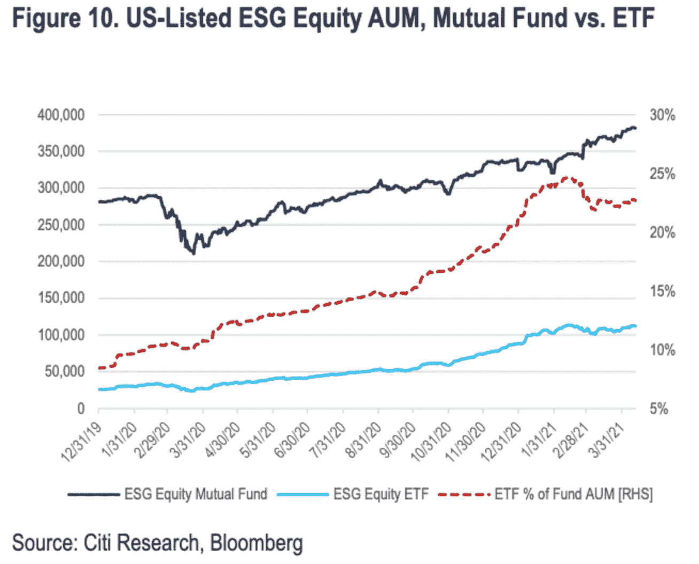

# Covid 对 ESG 的影响

> 原文：<https://medium.com/analytics-vidhya/covid-effect-on-esgs-87e04e8ea9f2?source=collection_archive---------14----------------------->

这篇文章更多的是对本周指向 ESG 崛起的新闻文章的总结，尤其是“方舟效应”

我想把我喜欢的股市照片换成其他的

以防万一，你不知道 ESG 是什么，它是一种环境、社会和治理评级系统。

花旗集团(Citigroup Inc .)目前预测，到 2030 年，仅美国的 ESG 投资组合 ETF 就将拥有超过 1 万亿美元的储备，而全球疫情加剧了道德投资的激增。

据该银行的分析师称，全球疫情引发了投资者对优秀企业的需求，尤其是那些有坚实劳动实践的企业。当你考虑到对以科技为重点的主题基金的狂热时，其中许多属于环境、社会和治理类别，可持续发展的热潮超出了华尔街的预期。

Scott Chronert 领导的团队在一份报告中写道，“过去一年的 Covid 情况加快了股票 ESG ETF 的采用。”“由于社会意识的提高和对相关系统主题的参与度增加，我们正在重新思考评估 ESG ETF 潜力的最佳路线图。”

花旗集团(Citigroup)预测，到 2024 年，股票 ESG 交易所交易基金的投资将达到 650 亿美元，到 2010 年年底将达到 3000 亿美元。当时，这两种预测似乎都过于雄心勃勃。然而，根据美国银行的数据，这个数字现在是 1120 亿美元。

疫情并不是唯一让人们思考道德投资的东西。随着投资者试图击败新环境政策可能引发的海啸，民主党接管美国国会引发了绿色基金的激增。快速扩张背后的另一个主要因素是主题和环境、社会和公司治理类别之间的日益融合。由于方舟投资管理公司(Ark Investment Management)等公司备受瞩目，根据机器人或人工智能等行业利基进行投资的主题基金已成为今年最热门的趋势之一。

某些基金很难归类，它总是归结为一个命名的问题。然而，基因组学和网络安全等未来主题在讨论社会和治理问题时往往被归类为 ESG。例如，贝莱德(BlackRock)的 iShares 自动驾驶电动汽车和技术 ETF (IDRV)会检查所有主题和 ESG 盒子。

根据 Chronert 和他的同事的说法，假设每月流量为 40 亿美元且市场不升值，到 2024 年，ESG ETFs 将占整体股票 ETF 市场份额的 4.5%，到 2030 年将占 8.5%。根据花旗集团的数据，去年每月的资金流入接近 50 亿美元。

像这样的看涨预测在市场上有很大的吸引力。

“在我们看来，未来十年将是行动的十年，而行动的动力将来自我们每天看到的东西——疫情、气候变化和社会问题，”道富环球顾问公司(State Street Global Advisors)美国 SPDR 交易所交易基金公司的首席投资策略师迈克尔·阿隆(Michael Arone)说。