# COVID 时间序列预测

> 原文：<https://medium.com/analytics-vidhya/covid-time-series-forecast-e21c827923df?source=collection_archive---------8----------------------->

嗨，朋友们。好久不见了是吗？

在为我面试的几家公司准备各种案例研究时，我真的很忙。我做的一个有趣的案例研究是为一家位于美国和印度的公司提出建议，告诉他们应该在什么时候重开实体店。

我不会告诉你结果的细节，但是对于这个特殊的案例研究，我做了一个预测美国和印度 COVID 的时间序列。事实是，在这个案例研究之前，我没有任何做时间序列的经验。嗯，我们在使用 LSTM 的深度学习中确实触及了这个话题，但我不认为这是做时间序列的“实际”体验。

无论如何，我被给了一个严格的时间表来完成几项任务，老实说，我不认为我在这方面做得很好。尽管如此，我还是把这写下来，记录我的这次经历，这样我可以在以后更好地改进它:)。

像往常一样，首先我们通过导入必要的库来开始项目:

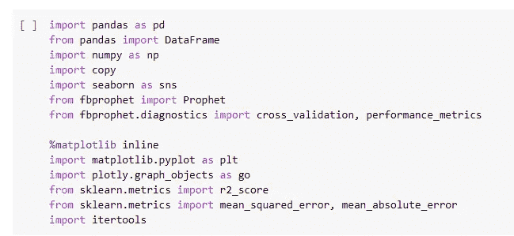

和一些原始数据探索:

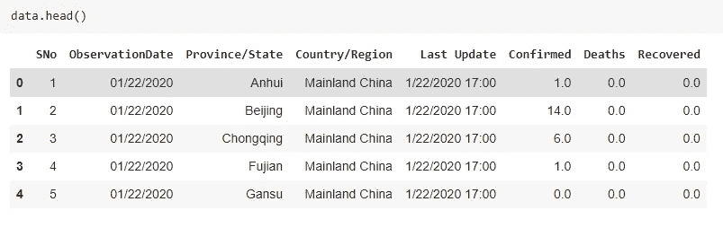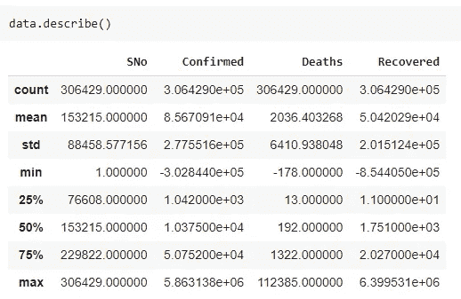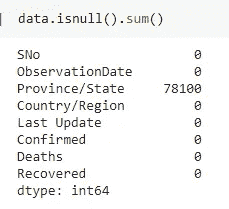

省/州列下缺少值。我忽略了这一点，因为我们预测的是国家层面的数字。

这是印度不同时期的案例。下图可以看到，我们这里最新的数据是 2021 年 5 月左右。印度确诊病例数在 4 月和 5 月初急剧增加，但在 5 月底出现放缓迹象。

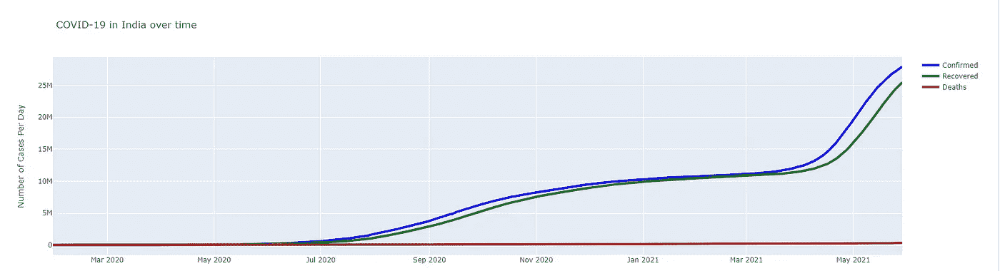

接下来是美国的 COVID 病例。在这里，我发现恢复案件的数量似乎是奇数。由于某种原因，从 2021 年 1 月起恢复的病例数为 0。这是不可能的，对吧？试图在其他地方搜索数据，但什么也没找到。因为我们要预测确诊病例的数量，所以我保持原样。然而，确诊病例的数量对我们来说显示出一个相当曲折的形状。

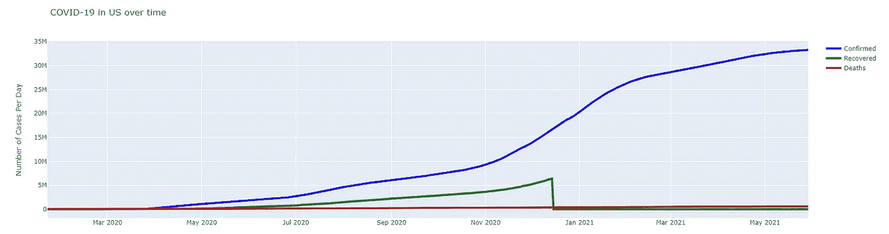

所以在给定的数据集中，确诊病例的数量是累积的。我想预测每日新增病例，而不是预测累计数量。为此，我用移位差分法对确诊病例数进行了分解。

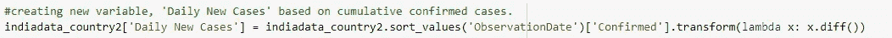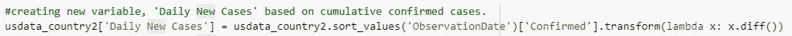

在此基础上，我进一步创建了两个新列——新病例增长率和感染死亡率。

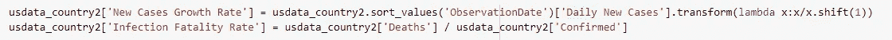

新病例增长率=今天的病例数/昨天的病例数

感染死亡率=死亡人数/确诊病例数

这两列都是在创建仪表板的数据可视化部分使用的。

由于我使用的是 FBProphet 模型，该模型要求将列重命名为 ds(表示日期)和 y(表示观察值)。然后从那里，我进一步分裂训练和测试数据集。在我的项目中，我创建了模型来预测未来 14 天内确诊病例/每日新增病例的数量。

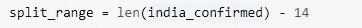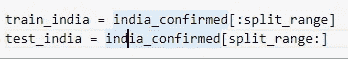

我建立了单独的模型来预测美国和印度的累计病例数和每日新增病例数。这里我将只展示一个例子，但是请随意访问我的 [github 页面](https://github.com/gyiernahfufie/COVID-Analysis---US-and-India)获取完整的源代码。

这是一个预测美国未来 14 天确诊病例数量的模型。

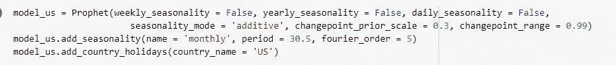

你应该能在网上找到每个参数代表什么。事实是，我不确定应该为每个参数设置什么值。上面给出的截图是多次试验和错误组合后的结果。

将模型拟合到训练数据集中。

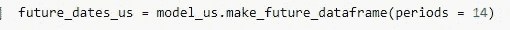

为预测创造 14 天的时间框架。

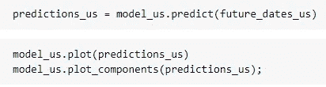

这是模型的结果。根据下面的结果，我们可以知道，在接下来的 14 天里，美国的病例将继续增加，但速度较慢。

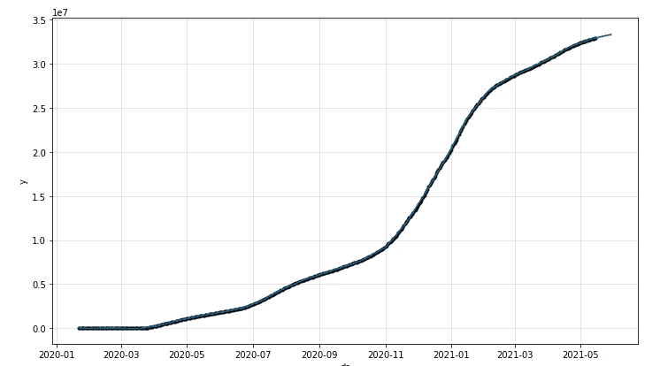

我们基于几个评估指标的结果告诉我们，这个模型做得很好。

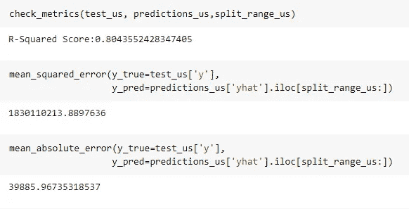

默认情况下，FBprophet 模型为预测值提供了 80%的不确定性区间。这是它在图中的样子:

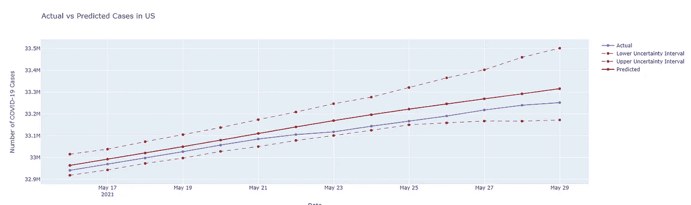

如你所见，实际值，在虚线范围内，这是我们的不确定度上下区间。

就是这样！我在 github 上已经覆盖了比我在这里写的更多的内容(更多的模型+交叉验证)。所以只要去[那里](https://github.com/gyiernahfufie/COVID-Analysis---US-and-India)，请让我知道我如何才能更好地改善这一点！