# COVID Tweets——在疫情的第一天找到相似的 Twitter 用户

> 原文：<https://medium.com/analytics-vidhya/covid-tweets-finding-similar-twitter-users-in-the-first-days-of-the-pandemic-f72a66447dfa?source=collection_archive---------10----------------------->

# **简介**

即使在冠状病毒疫情的早期，许多人也在 Twitter 等社交媒体平台上分享他们对这种致命疾病的想法。关于 COVID 在中国传播的问题，对其死亡率的担忧，关于政府应对措施的辩论，以及关于其起源的阴谋论，只是网上谈论的许多相关话题中的几个。就像任何受欢迎的主题一样，用户经常发现自己与其他人意见不一，支持自己的观点反对反对的观点，并主导全国的公共话语。

鉴于美国政治日益两极分化，许多关于冠状病毒的观点也与政治意识形态有关——民主党人比共和党人更有可能推广口罩[1]，而保守派比自由派更有可能批评中国是病毒的原因[2]，美国左翼人士比右翼人士更倾向于支持政府疫情指令。[3]

因此，如果一个观点可以与整个政党联系在一起，那么对于持有这个观点的人来说，这说明了什么呢？我们能根据一个人在网上说的几句话来确定他的政治立场吗？如果是这样的话，我们能找到相似的用户分享相同的观点吗？如果可以的话，我们会如何使用这些信息呢？一个可以在社交媒体上找到类似用户的政治推荐系统，可能对各种各样的个人和组织都有价值——从记者、活动家和竞选工作者到政府部门、情报机构和大企业。虽然其中一些机构的定向政治广告的道德和最终用途值得怀疑，但了解它在实践中可能如何运作是很有趣的。

# **协同过滤 VS 内容过滤**

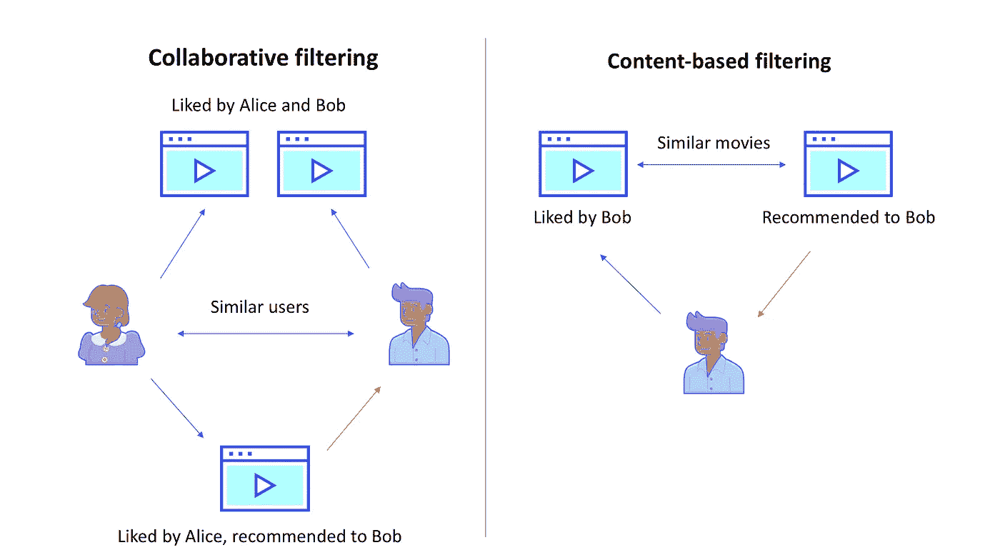

协作过滤与基于内容的过滤

在数据科学中，推荐系统有两种主要的数据过滤方式——基于内容的过滤和协同过滤。在基于内容的过滤中，多个**项目**(如电影、电视节目、书籍或任何其他类型的内容)相互比较，并根据它们共有的**品质**对相似性进行排名。在流行媒体的情况下，这些品质可以是标题、情节概要、流派、作者或创作年份。如果项目共享许多共同的品质，那么它们被分级为比不共享的项目更相似。另一方面，协同过滤基于多个**用户**共有的**项**来测量他们的相似性。这里，我们不需要知道项目的特定质量，只需要两个用户都以相同的方式对足够多的相同项目做出反应——例如消费相同的内容或给相同的内容相同的评级。[4]

因为这个项目将在 Twitter 上找到相似的用户，所以它将依赖于协作过滤——根据用户共享的项目来衡量用户的相似性，将标签、推文文本、用户描述和用户位置作为项目。在某种程度上，这几乎是基于内容和协同过滤的交叉，因为数据集中一半的项目实际上是用户本身的质量(用户描述和用户位置)。

# 下载数据

为了获得大量疫情早期的旧 twitter 数据(让我们选择 2 月 1 日，那时病毒刚刚开始从武汉蔓延)，我们需要一个 Twitter 开发人员帐户。然而，由于 Twitter 对用户每月可以请求的旧推文数量有严格的限制，我们不能依赖像 Tweepy 这样的 API 那样我们不会获得足够的数据。因此，我们可以使用其他用户保存的预先存在的数据集，而不是自己获取数据。2020 年初与 COVID 相关的推文的最佳来源之一是危机 NLP 的 GeoCOV19。[5]该网站有一个“脱水”的 tweet 档案，以简单的 tweet IDs 的形式，可以输入到一个“hydrator”程序中，该程序将整个 tweet“再水合”为 JSON 信息。[6]一旦我们下载了 zip 文件，提取了 TSV 文件，并在做了一些小的修改后将其重新保存为 CSV 格式，我们就准备好进行水合了。

将 TSV 转换为水合器的 CSV

水合器程序接口

下载“水合器”后，我们可以输入 CSV 并运行它。虽然 2 月 1 日包含超过 600，000 条推文 id，但自那以后许多推文被删除，我们最终获得了大约 400，000 条推文。因为速率限制仍然适用，对一天的推文进行补水需要连续两个小时，生成的 JSON 文件要占用几个 GB。但是，我们可以将该文件转换回一个较小的 CSV 文件，然后在笔记本中将其作为两个独立的 Pandas 数据帧打开——一个要修改，另一个要保存以供参考。

将 CSV 解读为熊猫数据框架

# 清理数据

关于数据帧的信息

有 34 列，但其中许多是不必要的，因为我们的数据集已经如此之大，这将有助于删除尽可能多的额外信息。这里最重要的字段是标签、tweet 的文本、用户的屏幕名称、用户描述和用户位置。虽然坐标、地点和时区看起来都很重要，但很少有用户在他们的推文中提到这些参数。其余的字段不是有用的、有趣的，或者主要是空值，所以它们也是可删除的。

删除所有不必要的列

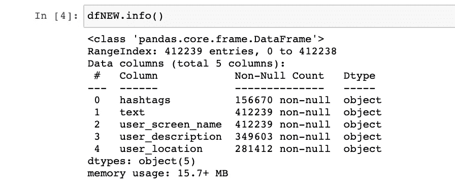

关于数据帧的信息—拖放后

现在我们已经隔离了 5 个最重要的列，但是我们仍然可以在数据集中看到一些不需要的特征——它充满了空值，用“NaN”(不是数字)表示，并且包含许多美国以外的位置。我们开始清理吧。

*(注意:为了保护用户身份，所有用户屏幕名称将被模糊化)*

新数据帧的头部

我们可以做的一件事是让所有的东西都小写，以便于识别。

使每一列都小写

我们还可以用一个词替换重要城市的名称，如“华盛顿，DC”(美国首都)和“纽约市”(美国最大的城市)，并为其他两个任期的美国州提供一个词，以便于搜索。

将两项状态转换为单个单词

现在，我们可以将城市和州的名称包含在一个更大的列表中，以便与数据集的其他部分隔离开来。虽然包含州首字母缩略词会导致更多结果，但也会导致更多错误识别的地点，例如，蒙大拿州的“MT”可能指名称中有山的地方。“in”代表印第安纳,“or”代表俄勒冈,“IN”可以是在任何地方使用的停用词。“DE”代表特拉华州，“LA”代表路易斯安那州，“MI”代表密歇根州是常见的西班牙语术语。我们希望避免这些情况，如果我们不包括这些州首字母缩略词，那么我们也不应该包括任何其他州首字母缩略词(DC 和纽约是唯一的例外，因为它们是重要的地方)。我们还应该从我们的位置中删除所有提到“美国”的地方，这样这个国家就不会出现在我们最常用的词语中。

按州名过滤数据帧

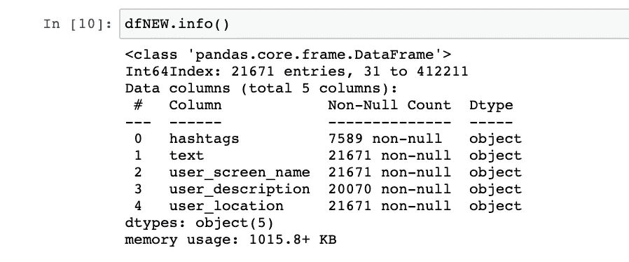

关于数据框的信息-仅限美国各州

现在我们已经限制了我们的位置，我们在 400，000 列中只有大约 20，000 列。但是还有更多问题需要解决。所有字段都必须包含数据，因此我们必须删除任何具有空值的行。我们还应该从我们的字段中删除特殊字符、标点符号和停用词，以及其余的州首字母缩略词，以简化我们的搜索结果。

从列中删除额外数据

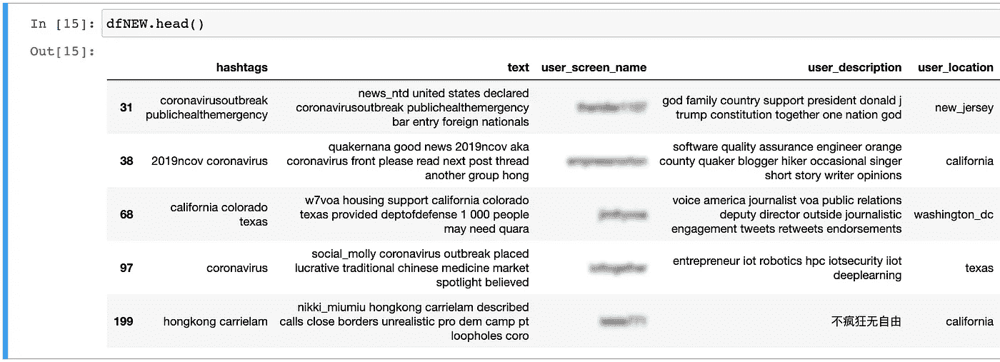

简化数据框架

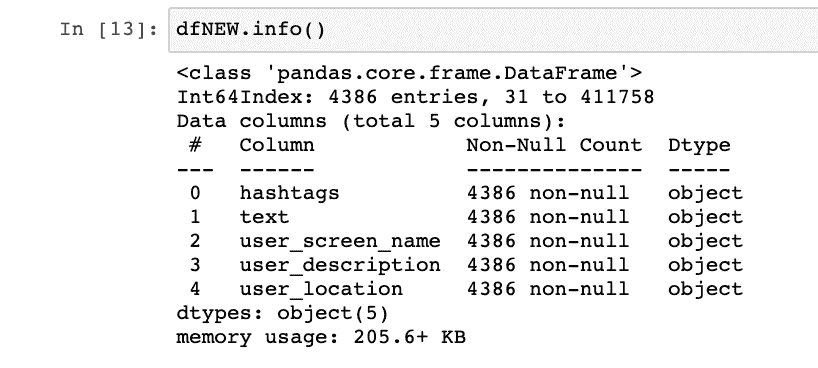

关于数据帧的信息—最终列计数

在此之后，整个集合是其先前大小的一小部分，但是其列始终只填充最相关的信息。此时，我们可以进入分析的第一步:计算最常见的术语。

# 画出最常见的术语

这里我们从 Scikit-Learn 导入 CountVectorizer，从 Matplotlib 导入 Pyplot。[7]计数矢量器使我们能够对一系列文本文档进行“记号化”以创建已知单词的词汇表，在这种情况下,“记号化”是将一个字符串分解成一系列单独的元素(或“记号”)的行为，这些元素随后可以被独立地解析。[8]另一方面，Pyplot 让我们绘制数据图表。

绘制最常用术语的图表

首先我们设置要查找的词的范围，然后我们设置要查找的词(或列)的类型，然后我们设置图形的颜色。我们创建了将范围作为输入的 CountVectorizer 对象、对术语类型运行 CountVectorizer 的 top_terms 对象以及按降序对前 20 个术语进行排序的 top20 对象。然后我们绘制图表。我们还可以将范围更改为 2 和 3，以查看最常见的两个或三个单词的短语。

因为这个 Twitter 数据集是基于 COVID 相关的推文，“冠状病毒”是最常用的标签，在 4386 条推文中有近 3500 条出现。下一个热门标签是“中国”和“武汉”，反映了疫情早期关于 COVID 起源的新闻。之后的几乎所有事情都是你所期待的。两项 hashtag 集不太常见，但包含相同的思想，三项 hashtag 集更不常见。

前 20 个标签(一个术语)

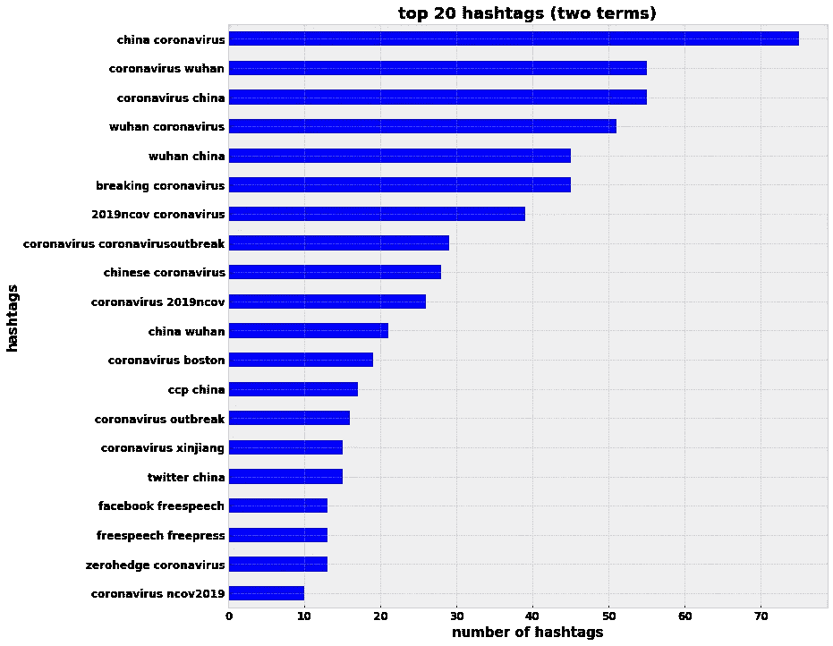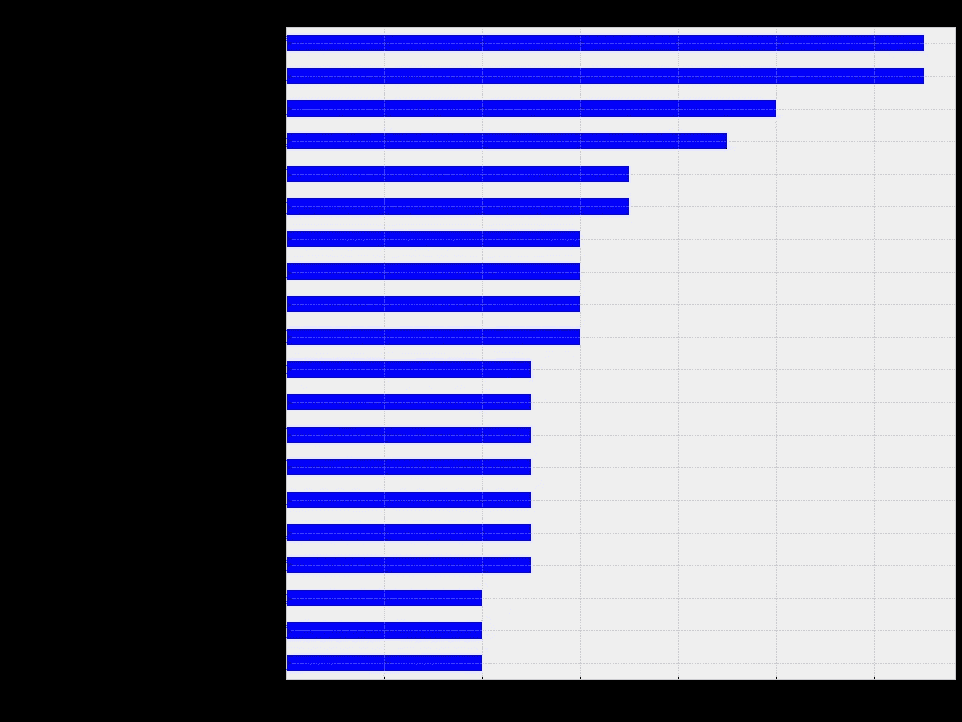

前 20 个标签(左边两个，右边三个)

使用常见文本术语“火车”、“意大利”、“女人”、“大声评论”的推文

通过文本搜索最常见的术语会产生类似的结果，但“train”和“Italy”是意外的。查找实际的推文展示了来自 Twitter 的某一天的一条被广泛分享的推文是如何广泛扭曲我们的搜索结果的。

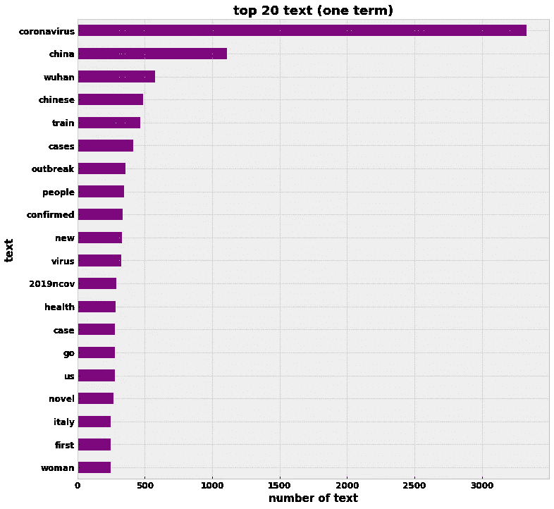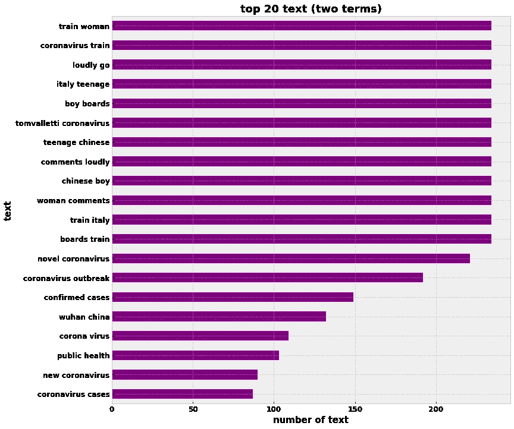

前 20 个文本术语(一个术语—左侧，两个术语—右侧)

搜索用户描述会产生更多的通用术语，其中“爱情”、“新闻”和“健康”位于图表顶部。许多用户描述都以正确学习术语为特色，如“maga”、“trump”、“god”或“conservative”。这证实了 Twitter 作为一个高度政治化的社交媒体平台的用途，特别是对上届总统选举那年的共和党活动人士而言。用户描述中最常见的两个术语集更有见地:纽约人、公共卫生爱好者、以家庭为导向的个人和特朗普粉丝的投票率最高(至少在发关于冠状病毒的推特的人方面)。或者这些只是 Twitter 上最活跃的用户类型？很难说。

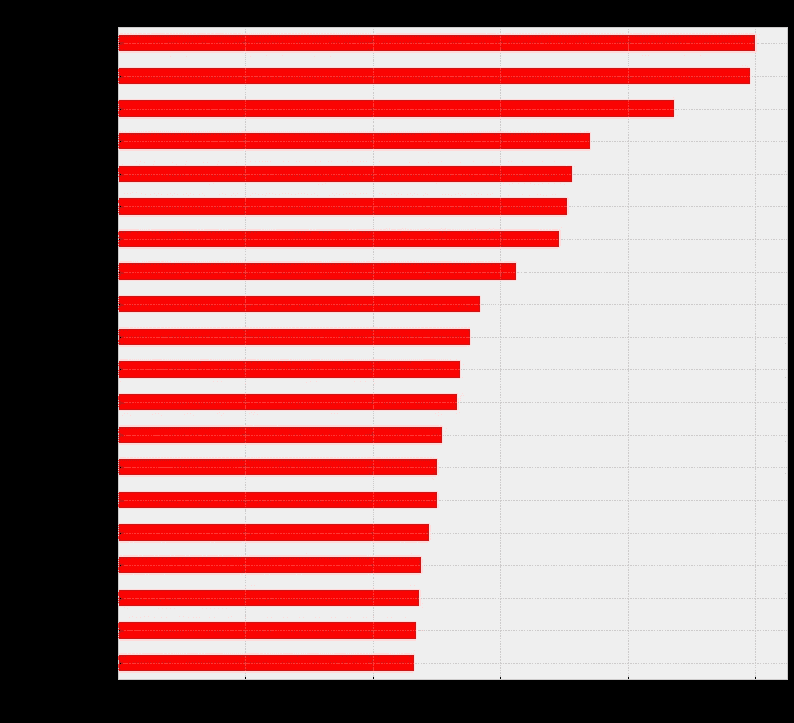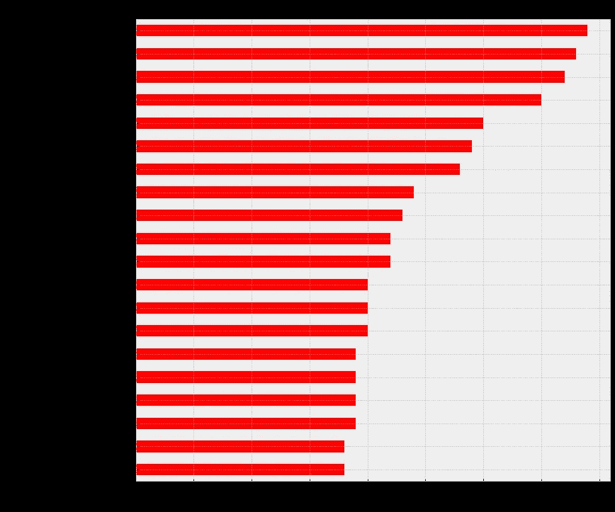

前 20 个用户描述术语(一个术语—左侧，两个术语—右侧)

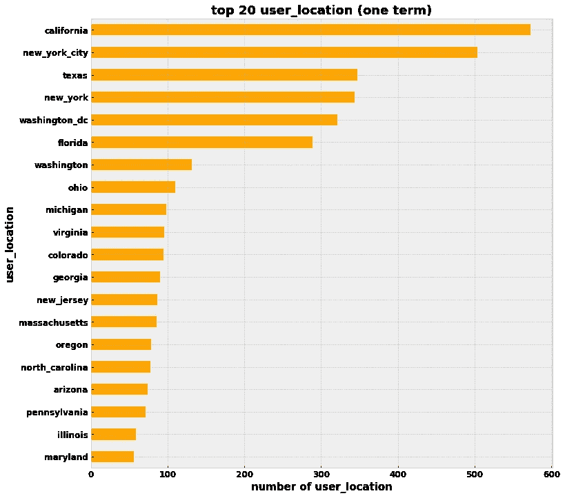

前 20 个用户位置

最后，我们搜索前 20 个用户位置。考虑到加利福尼亚、德克萨斯、佛罗里达和纽约是人口最多的州，那么多推特用户从这些地方发推特也就不足为奇了。对于活跃的社交媒体用户来说，华盛顿 DC 也是一个热点——如果纽约市和纽约合并，东海岸州将在列表中占据主导地位。

现在我们已经确定了最常用的标签、文本术语、用户描述和用户位置，是时候在数据集中搜索类似的内容了。然而，让我们首先将新数据集与旧数据集联系起来。通过隔离旧数据集中与新数据集中的推文共享相同索引号的所有推文，我们可以将它们一一对应，以便于比较。然后，我们可以重置它们的索引，使它们都从零开始，这有助于我们为相似的内容搜索创建更清晰的索引图。

重置新旧数据帧的索引

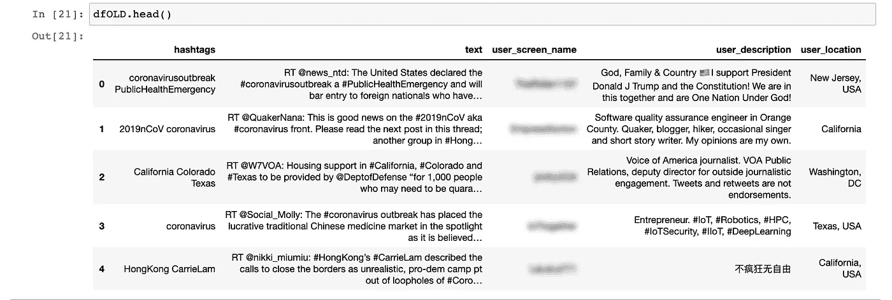

旧数据帧头，索引复位

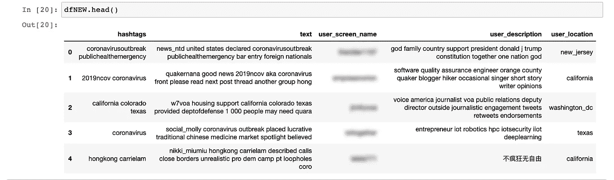

新数据帧头，索引复位

# TF-IDF

在我们之前的搜索中，我们通过使用 CountVectorizer 对最常见的术语进行计数，找到了它们。然而，尽管简单地查找两个不同数据集之间最常见的术语听起来像是搜索相似内容的一种不错的方法，但问题出现了:随着两个文档的大小都增加，它们共享的常用词的数量也趋于增加，即使它们谈论的不是相同的主题。因此，对共享单词的基本计数不足以找到真正相似的内容。

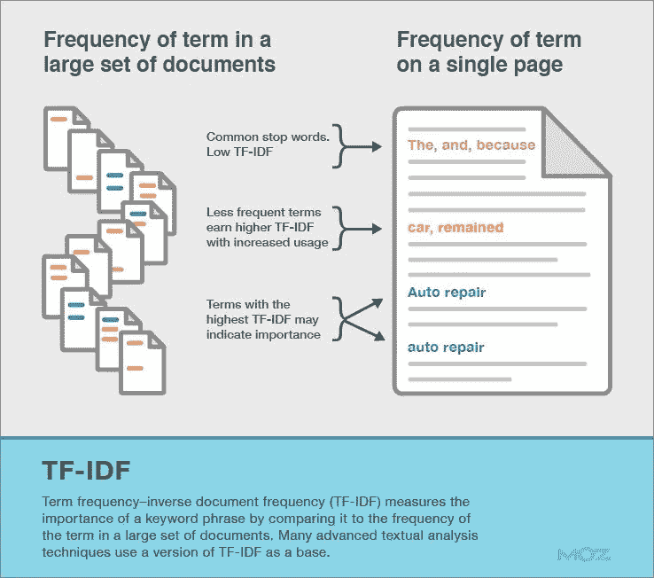

TF-IDF 的可视化

由于这个问题，我们最终使用了 TfidVectorizer，它利用了 TF-IDF 算法。TF 代表“词频”，即一个单词在单个文档中出现的频率。IDF 代表“逆文档频率”，它是一个词在文档语料库(或作品主体)中出现频率的度量，通过将文档总数除以包含特定词的文档数来获得。当 TF 和 IDF 相乘时，我们得到一个值，该值反映了一个单词对于文档语料库中的特定文档有多重要。这里我们将参数设置为“hashtags”每个 hashtag 被矢量化，创建一个向量矩阵，并显示矩阵的形状。[9]

TF-IDF 矢量器

# 余弦相似性

虽然有多种计算相似性的方法，但我们可以使用余弦相似性来计算一个数字质量或相似性分数，该分数根据数学距离表示一个用户与另一个用户的相似性。

余弦相似性公式

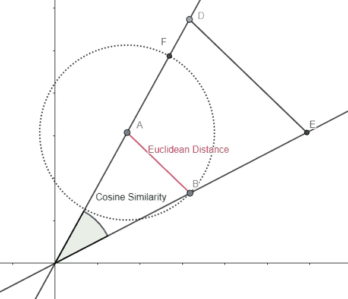

余弦相似度 VS 欧几里德距离

数学很复杂，但它涉及到将向量投影到多维空间，并计算两个不同向量之间的角度余弦。角度越小，相似度越高。虽然它本身可能很难理解，但当我们在图表上将其可视化并与另一个指标进行比较时，它会更有意义。这是余弦相似性与欧几里德距离的关系图。[10]

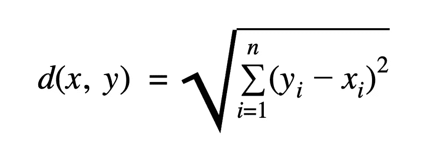

欧几里德距离公式

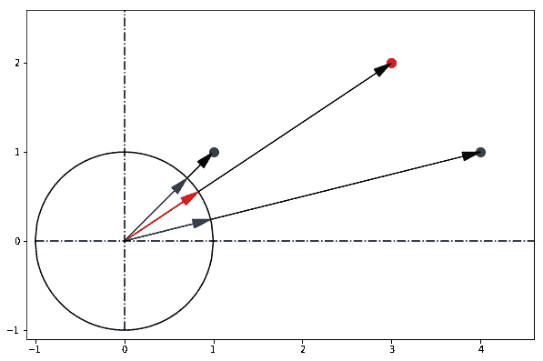

角度与距离

余弦相似性据说作为相似性的度量优于欧几里德距离，因为它忽略了向量的权重和大小，并且仅关注角度。

这方面的一个例子是测量三个不同项目的相似性:

*   物品 A:一盒鸡蛋，一罐牛奶，一条面包
*   B 项:100 箱鸡蛋，100 壶牛奶，100 条面包
*   C 项:1 盒鸡蛋，1 瓶葡萄酒，1 瓶啤酒

欧几里德距离将项目 A 和 C 评定为相似，而余弦相似性将项目 A 和 B 评定为相似。

总之，我们可以将 TF-IDF、余弦相似度和线性核(识别线性可分数据)一起使用来获得这些分数。

余弦相似性

# 搜索相似用户

在创建搜索之前，我们要做的最后一件事是创建一个索引的反向映射，通过在字段中输入用户的用户名来查找用户的索引。

索引的反向映射

最后，我们可以创建自己的程序来在数据集中查找相似的用户。

查找相似的用户

因为最常用的标签之一是“中国”，所以让我们找到包含国家名称的标签集最长的用户，这样我们就有一大组术语可以比较。我们还可以将它显示在原始数据集旁边，以了解用户当时在说什么。然后就可以找到使用 hashtags 和这个类似的用户。

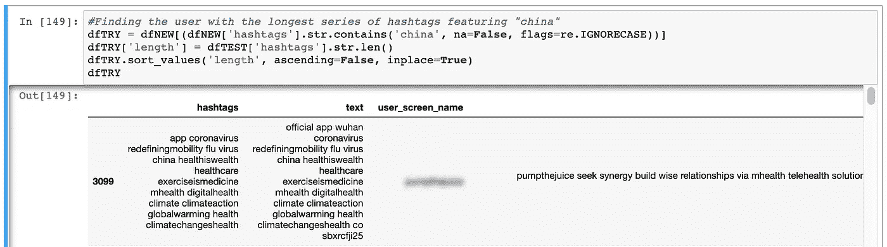

寻找拥有最长的“中国”标签系列的用户

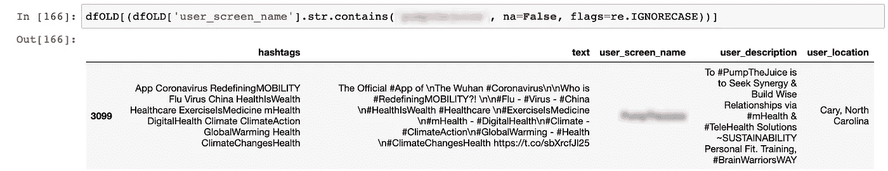

用户#3099 的完整推文——带有最长的“中国”标签系列

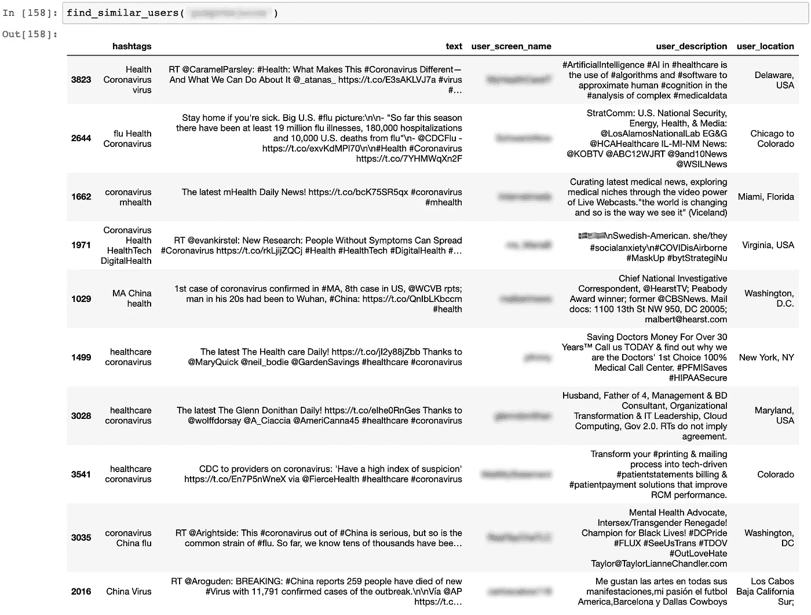

查找与用户#3099 相似的用户

有趣的是，虽然“中国”是这里最初的兴趣标签，但这个选择中的大多数用户更关心健康，因为原始推文中的许多其他标签(#Health，#Healthcare，#MHealth，#DigitalHealth)都与健康相关。然而，整个 Twitter 数据集确保了绝大多数用户使用冠状病毒标签，所以毫不奇怪，许多用户会提到健康。与实际的推文文本相比，标签通常也很少使用——因为大多数用户在每条推文中只使用两到四个标签，基于标签使用来搜索用户可能不足以真正衡量相似性。让我们尝试使用与上面类似的方法搜索文本术语，这次使用第三个最常用的术语“武汉”

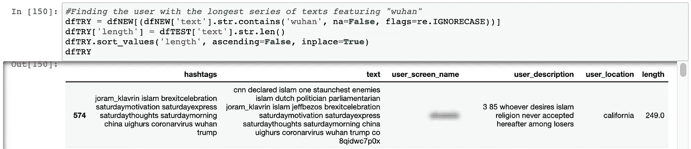

查找以“武汉”为特色的最长推文系列的用户

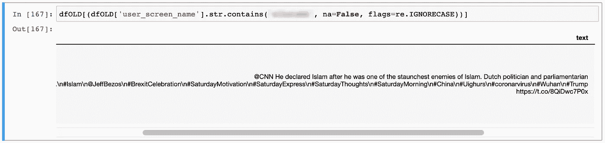

用户#574 的完整推文——最长的推文系列以“武汉”为特色

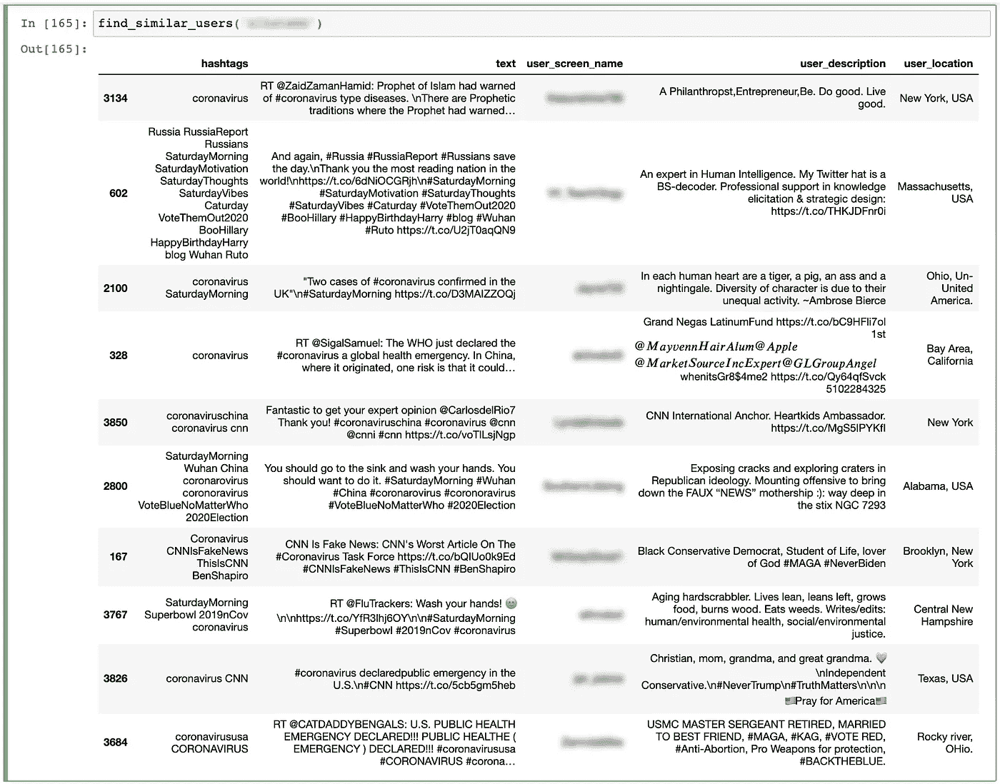

查找与用户#3099 相似的用户

在这种情况下，可能有太多的推文文本可以作为相似性搜索的基础——用户不仅发布了关于武汉的信息，还发布了许多其他主题，如伊斯兰教、英国退出欧盟、荷兰政治家、杰夫·贝索斯，以及对周六的不同提及。因此，搜索会产生相似的不同帖子。也许通过用户描述搜索会得到一些更有趣的结果。既然“特朗普”在如此多的用户描述中是如此常见的政治术语，那么让我们找到包含前总统姓名的用户描述最长的用户。

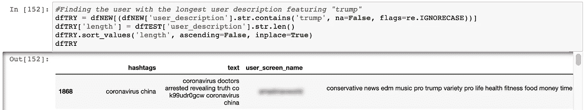

查找以“Trump”为特色的用户描述最长的用户

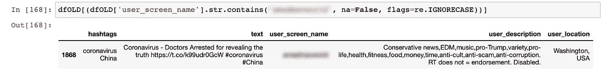

用户#1868 的完整推文-最长的用户描述以“特朗普”为特色

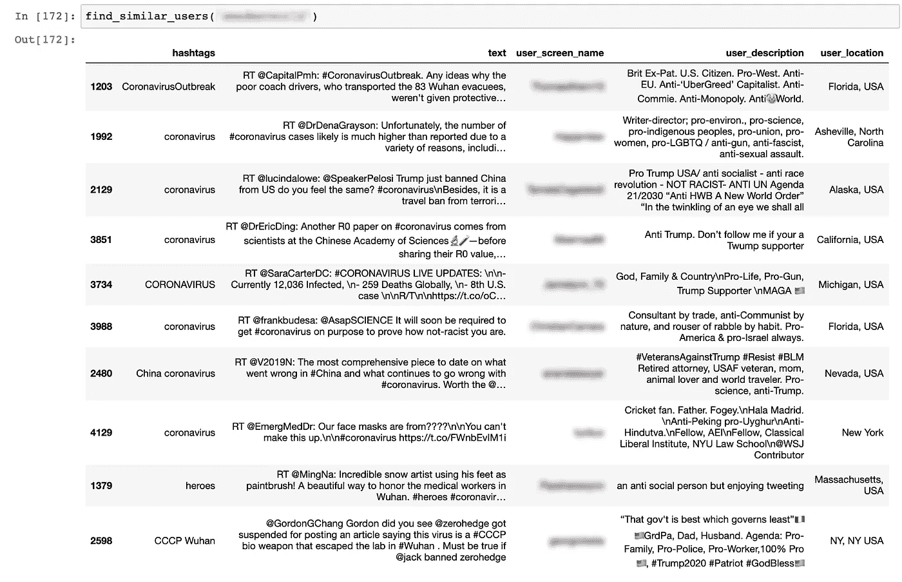

查找与用户#1868 相似的用户

这被证明在寻找可能彼此分享相似之处的用户时更有用，因为人们在他们的用户描述中说的关于他们自己的事情通常比他们对公众(或彼此)说的事情更私人。然而，这里有一个耐人寻味的转折，即反特朗普的用户几乎与支持特朗普的用户一样多，而那些“支持”或“反对”其他事情的用户——例如，一个用户“支持枪支”，另一个用户“反对枪支”。这个相似度搜索做不到的一点就是情感分析。如果不考虑使用这些概念的背景，即使公开提及政治概念也不能轻易揭示一个人的实际政治信仰。然而，应该指出的是，最支持特朗普的用户来自佛罗里达州、阿拉斯加州、密歇根州和佛罗里达州，这些州都在 2020 年总统大选中投票支持特朗普。

我们可以做的第四个搜索是用户位置。让我们试试德克萨斯州，它既是人口第二大州，也是特朗普选民的一大堡垒。

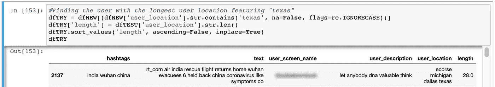

查找以“德克萨斯”为特色的用户位置最长的用户

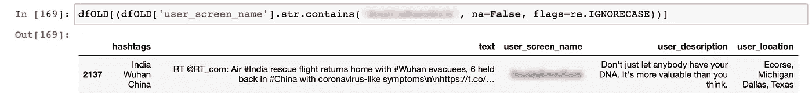

用户#2137 的完整推文——最长的用户位置以“德克萨斯”为特色

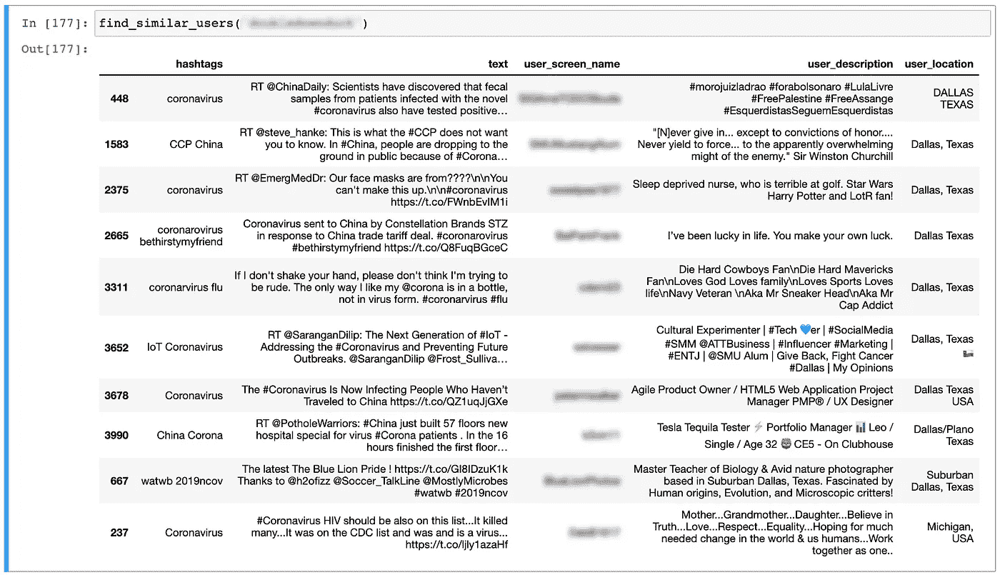

查找与用户#2137 相似的用户

虽然几乎每个人都来自达拉斯，并在推特上谈论冠状病毒，但一半的用户提到了一些关于中国的事情，他们的用户描述相当多样化。仅凭这些信息，很难说这些用户是否真正相似。

对于我们的第五次也是最后一次搜索，让我们做一些全新的事情——将每个用户的标签、文本术语、用户描述和用户位置组合成一个内容“汤”,然后将这些汤相互比较。我们选择的用户也是随机的。

创建一个标签、文本、用户描述和用户位置的“大杂烩”

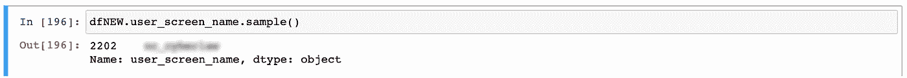

寻找随机用户

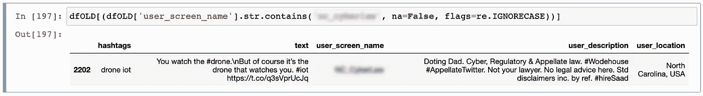

随机用户的完整推文

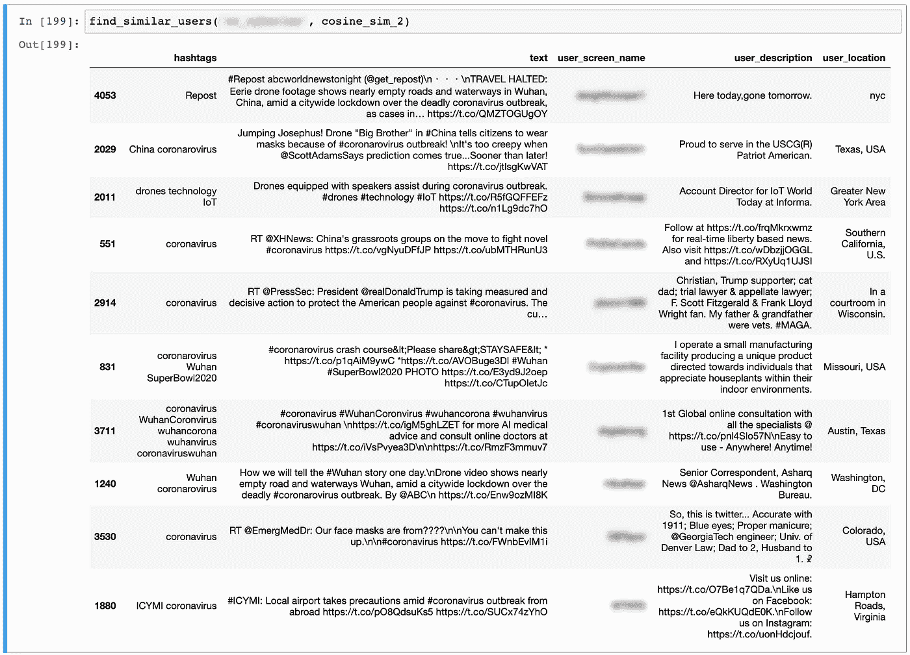

寻找与随机用户相似的用户

我们添加到搜索中的指标越多(标签、tweet 文本、用户描述、用户位置)，用户实际上看起来就越随机。虽然我们可以看到一些关于无人机、爸爸、法律和 IOT(物联网)的提及，但我们无法衡量文本中的哪些词比其他词更重要(并且没有一个用户位置与原始位置相似)。

# 限制

最明显的限制是，这个数据集完全专注于关于冠状病毒的推文，这限制了数据的范围。在疫情传播的早期，它也只有一天的推文，每个用户只有一条独特的推文来代表自己。它不是一个大型数据集，当消除包含空值的列时，它变得更小——许多用户不使用标签或用户位置。最重要的是，仅基于州的全名搜索位置，并从结果中排除首字母缩略词，会进一步缩小数据的大小。这个数据集并不能全面反映所有 Twitter 用户，甚至不能反映这个数据集中的用户。这项研究也没有分析用户统计数据，如总推文、关注者、朋友、分享或评论。虽然最好的结果来自用户描述的搜索，但没有对它们进行情感分析，很难从中得出许多有意义的见解——两个人都可以提到完全相同的事情，但如果他们对这些事情持有完全不同的观点，那么用户真的相似吗？

# 结论

绝大多数在线查找相似内容的教程都是基于推荐系统，这些系统可以过滤电影或电视节目等内容，或者对喜欢这些电影或电视节目的独特用户进行协作过滤。因此，基于 Twitter 用户的政治相似性搜索似乎是该项目的最佳选择，因为它与其他例子中使用的指标最接近。然而，基于用户位置而不是用户本身的未来社交媒体相似性搜索可能更有用。找到相似的位置并测量在那里使用的最常见的术语可以更好地帮助我们了解生活在这些位置的用户一般是什么样的，他们倾向于谈论什么政治话题，以及这些用户中的大多数是否对 COVID 有特定的看法。对于那些对人们的政治信仰感兴趣的人来说，地区目标和个人目标一样有用。然而，为了进行这种类型的搜索，数据帧的结构必须经历一些基本的改变。据我所知，这个基于位置的数据帧不能有任何重复的用户位置(不像这个项目中的数据帧)，每个用户位置都必须包含与之相关的全部信息——换句话说，每个位置的每一列数据都必须将所有相应的标签、推文文本、用户描述和用户名合并成一个单词汤，以便进行分析。只有这样，用户位置才能被适当地相互比较，以找到它们之间的相似性。至少，这是我想象的进行相似性搜索所需要的。但那是另一个时间的项目。

# 参考

[1][https://the conversation . com/video-how-do-how-do-mask-weaking-so-politized-144268](https://theconversation.com/video-how-did-mask-wearing-become-so-politicized-144268)

[2][https://www . Washington post . com/politics/2020/04/25/Senate-GOP-talking-points-冠状病毒-责备-中国-非川普/](https://www.washingtonpost.com/politics/2020/04/25/senate-gop-talking-points-coronavirus-blame-china-not-trump/)

[3][https://www . nytimes . com/2020/04/17/us/politics/poll-watch-quarantine-抗议者. html](https://www.nytimes.com/2020/04/17/us/politics/poll-watch-quarantine-protesters.html)

[4][https://towards data science . com/introduction-to-recommender-systems-1-971 BD 274 f 421 #:~:text = Content % 2d based % 20 filtering % 20 does % 20 no，the%20items%20to%20be%20given。&text = It % 20 收集% 20 用户% 20 关于% 20 不同% 20 项目% 20 的% 20 反馈% 20 并且% 20 使用% 20 他们% 20 获得% 20 建议。](https://towardsdatascience.com/introduction-to-recommender-systems-1-971bd274f421#:~:text=Content%2Dbased%20filtering%20does%20not,the%20items%20to%20be%20given.&text=It%20collects%20user%20feedbacks%20on%20different%20items%20and%20uses%20them%20for%20recommendations.)

【https://crisisnlp.qcri.org/covid19 

[6]https://github.com/DocNow/hydrator

[7][https://machine learning mastery . com/prepare-text-data-machine-learning-sci kit-learn/](https://machinelearningmastery.com/prepare-text-data-machine-learning-scikit-learn/)

[8][https://www . techopedia . com/definition/13698/token ization #:~:text = token ization % 20 is % 20 the % 20 act % 20 of，phrases % 20 or % 20 even % 20 whole % 20 sentences。&text = Tokenization % 20 is % 20 used % 20 in % 20 computer，the % 20 process % 20 of % 20 exic % 20 analysis](https://www.techopedia.com/definition/13698/tokenization#:~:text=Tokenization%20is%20the%20act%20of,phrases%20or%20even%20whole%20sentences.&text=Tokenization%20is%20used%20in%20computer,the%20process%20of%20lexical%20analysis)。

[9][https://monkey learn . com/blog/what-is-TF-IDF/#:~:text = TF % 2d IDF % 20 is % 20a % 20 统计，跨% 20a % 20 set % 20 of % 20 documents](https://monkeylearn.com/blog/what-is-tf-idf/#:~:text=TF%2DIDF%20is%20a%20statistical,across%20a%20set%20of%20documents)。

[https://www.machinelearningplus.com/nlp/cosine-similarity/](https://www.machinelearningplus.com/nlp/cosine-similarity/)