# 用 CNN 破解 reCAPTCHAs 和迁移学习

> 原文：<https://medium.com/analytics-vidhya/cracking-recaptchas-with-cnns-and-transfer-learning-edc26ab675ec?source=collection_archive---------11----------------------->


reCAPTCHA [来源](https://www.quora.com/How-does-reCAPTCHA-stop-bots-from-clicking-the-checkbox)

目录

*   [代号](https://github.com/whipIash/reCAPTCHASolver)
*   [简介](#7487)
*   [计算机如何看待](#71cf)
*   [卷积神经网络](#53df)
*   [迁移学习](#123d)
*   [结果](#5ad8)
*   [结论](#2704)

# 介绍

1950 年，艾伦·图灵提出了“机器能思考吗？”他设想了一个名为模仿游戏的测试(又名**图灵测试**)，其中有三个玩家，两个人和一台电脑。一个人的任务是试图确定其他玩家中哪个是计算机，哪个是人。虽然在那时，计算机很容易与人类区分开来，但今天它已经成为一个真正的挑战。这已经成为人工智能哲学中一个极具影响力的重要概念。

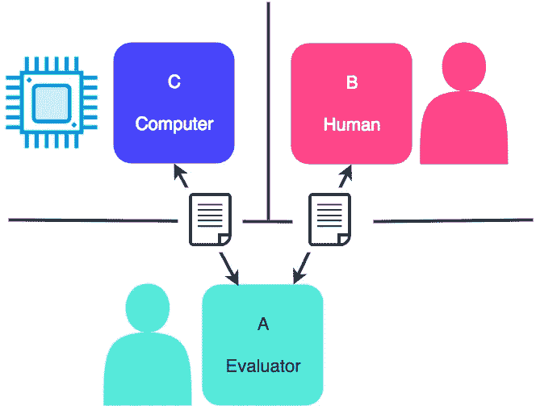

图灵测试来源: [botsociety.io](https://botsociety.io/blog/2018/03/the-turing-test/)

验证码是图灵测试的一种形式。它们被称为**反向图灵测试**，因为一个或多个角色的目标在机器和人类之间被颠倒了。验证码使用另一台电脑自动完成这个过程，而不是人工评估。这就是首字母缩略词 CAPTCHA 来源于“测试期间完全自动告诉 **C** 计算机和 **H** 人类 **A** 部分。”你可能见过基于文本的验证码测试，你必须正确输入扭曲图像的文本。

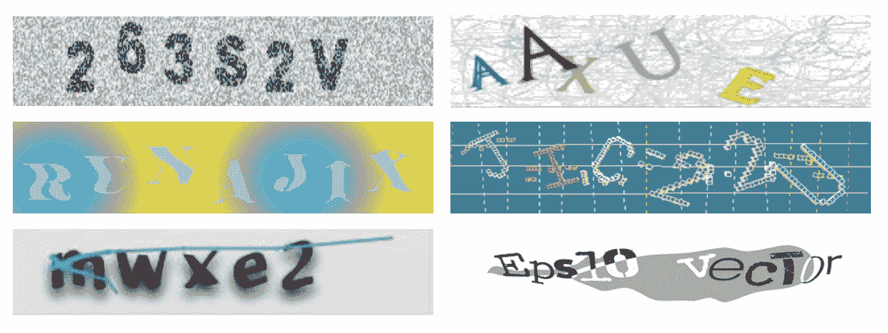

你丫知道，[这些](https://www.imperva.com/learn/application-security/what-is-captcha/)烦人的东西？

ReCAPTCHA 与常规验证码的作用相同。它最初是由卡耐基梅隆大学的学生开发的，后来被 T42 谷歌收购。ReCAPTCHA v1 使用基于文本的图像，如上图所示。然而，自从许多过去的机器学习论文证明了它可以用 AI 轻易破解之后，它就停止了。ReCAPTCHA v2 使用基于图像的验证码，如下图所示。

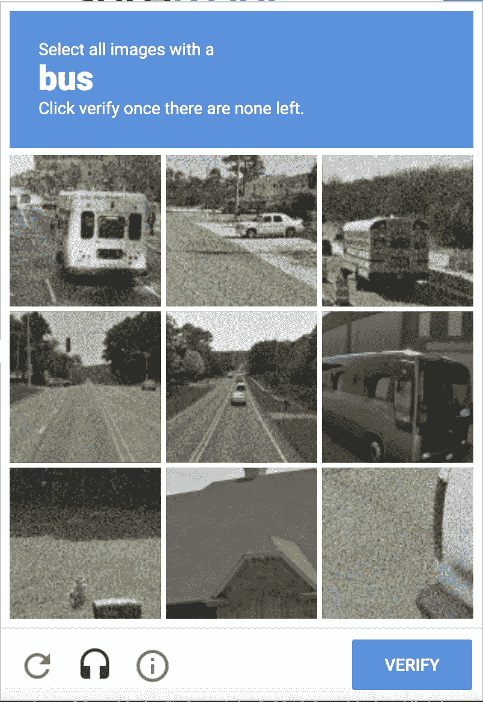

谷歌 reCAPTCHA v2 [来源](/@sxie2004/use-google-recaptcha-v3-in-china-727007879afe)

在这篇文章中，我将回顾**我如何使用机器学习来解决基于图像的 reCAPTCHAs** ，并解释像**卷积神经网络**和**迁移学习**这样的概念。如果人工智能对你来说是新的，你可以看看我的[人工智能快速介绍文章](https://ryansh3n.medium.com/a-quick-introduction-to-ai-e5ce18264092)，如果神经网络看起来很可怕，我会推荐这个 [3Blue1Brown 播放列表](https://www.youtube.com/playlist?list=PLZHQObOWTQDNU6R1_67000Dx_ZCJB-3pi)。

# 一、计算机是怎么看的？

你可能知道计算机处理 1 和 0 的信息。那么计算机是如何把一张图片变成它能理解的数值的呢？它通过**将图像转换成一个数组值**来实现这一点。每个像素根据其亮度或暗度分配一个值，范围为 0-255(RGB 颜色代码)。0 表示黑色，255 表示白色。如果接近 0，这两者之间的一切都会变暗，如果接近 255，则会变亮。

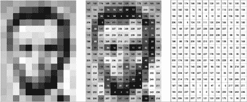

将亚伯拉罕·林肯的照片转换成像素值数组的例子。[来源](https://openframeworks.cc/ofBook/chapters/image_processing_computer_vision.html)

那么，计算机如何对值进行分类以匹配一个对象呢？

# 卷积神经网络

CNN 类似于常规的神经网络。它们都是由具有机器可学习的权重和偏好的神经元组成的。每个神经元接收一个输入，执行一个计算并返回一个输出。它仍然有一个损失函数，在常规神经网络中学到的大多数东西仍然适用。

CNN 的特别之处在于**它们是专门设计来将图像作为输入的。**这意味着我们可以将某些属性编码到架构中，使转发功能更加有效**和**减少网络中的参数数量。****

**CNN 的第一个特性是**它们可以将矩阵作为输入**。常规神经网络只能接受向量输入。在 CNN 中，矩阵通常以 3 维排列:高度、宽度和深度。高度和宽度是不言自明的，它们代表了图像的高度和宽度。深度因图像类型而异。如果它是 RGB 图像，那么深度将是 3，因为它有 3 个不同的通道(红色、绿色和蓝色)。然而，如果图像是灰度图像，那么它的深度将为 1，因为它只有一个通道(想想之前的林肯图片)。**

**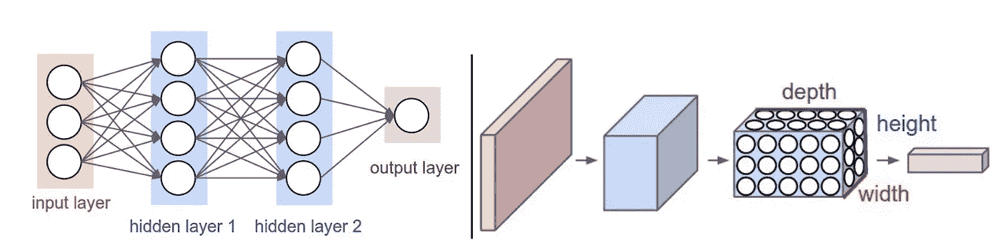**

**神经网络(左)与 CNN(右)架构**

**CNN 还可以通过查看图像来记住空间信息，每次分析一组像素。在常规神经网络中，它逐个像素地查看图片，很难看到连接的组件。保存空间信息的关键是通过**卷积层**(因此得名卷积神经网络)。它还允许模型减少参数的数量。**

**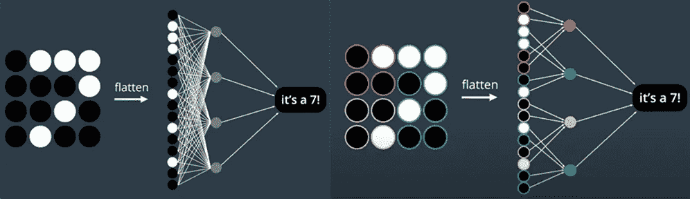**

**常规神经网络与 CNN 对比分析小块图像[来源](https://classroom.udacity.com/courses/ud188/)**

**你可以在上图中看到 CNN 是如何记住空间信息的。通过观察紧密分组的斑块中的节点，CNN 可以了解到距离较近的像素比距离较远的像素相关性更强。这很重要，因为它可以帮助定义图像的特征，如边缘。而常规的神经网络只接收向量的输入，并且不知道数字最初是在网格中空间排列的。**

**卷积层将一系列**卷积核(又名滤波器)**应用于输入图像。**

**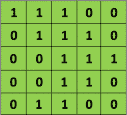**

**假设我们有一个原始的 5x5 图像，如像素值为 0 或 1 的绿色矩阵。**

**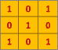**

**然后我们可以有一个像 orange matrix 这样的卷积滤波器。**

**原始图像的卷积计算如下:**

**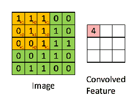**

**[来源](https://ujjwalkarn.me/2016/08/11/intuitive-explanation-convnets/)**

**那么发生了什么？我们每次在原始图像上滑动卷积滤波器 1 个像素，这被称为我们的**步距**。想象一下用放大镜阅读文本，在页面上滑动放大镜。对于每个位置，我们计算两个矩阵的逐元素乘法，得到最终的和。然后，我们将总和添加到输出矩阵中。**

**注意到我们最终的矩阵变小了吗？此外，请注意，角落像素几乎不影响最终矩阵值，而中心像素影响新矩阵中的每个值。我们可以使用**零填充**来解决这些问题。这就是，等等，我们用零填充矩阵的地方🤯。零填充保留了空间大小，并允许像素更平等地贡献给最终矩阵。**

**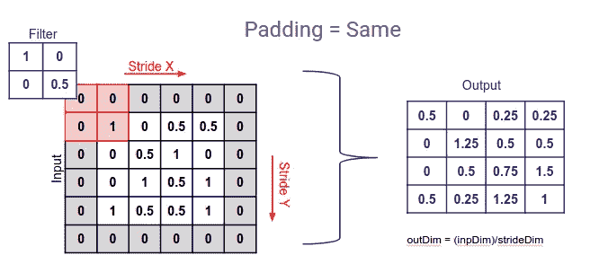**

**[来源](https://ayeshmanthaperera.medium.com/what-is-padding-in-cnns-71b21fb0dd7)**

**这些过滤器帮助**过滤掉无用的“噪音”**和**提取重要的特征**比如物体的边缘。CNN 将通过训练学习这些过滤器的值。这些过滤器的输出可以输入到更多的过滤器中，以检测眼睛、鼻子和牙齿等身体部位。这些可以输入到更多的过滤器中，以检测更复杂的东西，如人脸！**

**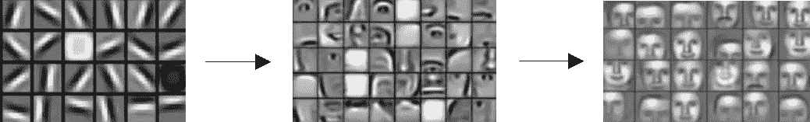**

**边缘过滤器→身体部位过滤器→面部过滤器[来源](http://datahacker.rs/edge-detection/)**

# **最大池化🏊‍♂️**

**合用不是游泳池，实际上是空间合用。**空间池降低了卷积层的维度，但保留了最重要的信息。****

**在 max pooling 中，我们在输入图像的一部分上滑动一个窗口，然后**取窗口**中的最大值 **并将其添加到我们的输出矩阵中。这类似于卷积层，我们也在输入上滑动一个滤波器来提取数据。****

**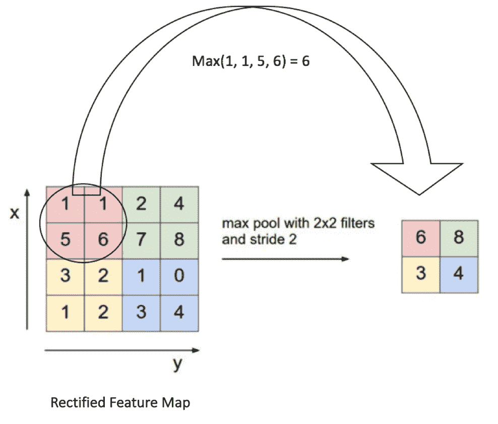**

**最大池[来源](https://ujjwalkarn.me/2016/08/11/intuitive-explanation-convnets/)**

**请注意，还有其他类型的池，如平均池(取窗口中值的平均值)和总和池(取总和)。但是，在大多数情况下，max pooling 通常会执行得更好，因为它会查看面片中最重要的特征(如边)，而不是查看平均存在情况。**

# **ReLU 激活功能**

**激活功能的目的是让我们能够**更好地执行梯度下降**。在每个卷积运算之后，使用一个额外的 **ReLU(整流线性单元)**运算。这是一个函数，如果输入为正，它将再次输出输入，否则，它将输出零。ReLU 是一个非线性函数。这意味着函数对于给定的变量不是线性的。线性方程的一个例子是 y=mx+b，而非线性方程可以是 y = ax +bx+c。我们的函数应该是非线性的，因为在现实生活中，没有多少关系是线性的，所以添加非线性函数可以帮助我们看到更复杂的关系。**

**像池，也有其他类型的激活功能，如 sigmoid，tanh，你甚至可以创建自己的。然而，人们发现 ReLU 在大多数情况下表现更好。**

**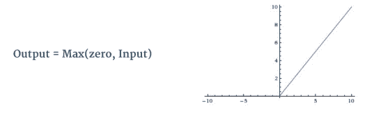**

**ReLU 功能可视化。[来源](https://medium.com/p/edc26ab675ec/edit)**

# **辍学者**

****丢弃层用于防止模型过度拟合数据。**过度拟合是指模型与训练数据“拟合”得如此之好，以至于当它与其他数据一起呈现时，模型会失败，因为它非常精确，但仅与训练数据一起呈现。解决这个问题的一个简单方法是增加辍学。**添加 dropout 可以通过随机删除节点来减少训练时间，并有助于避免过度拟合。**在退出的情况下，模型不能过于依赖少数几个选定的节点，而是必须训练所有的节点，使其表现良好。想想只锻炼你的手臂。你只会擅长某些需要手臂力量的运动，但是当涉及到其他肌肉群的运动时，你就不那么擅长了。总之，千万不要跳过 day🦵.腿**

**哦，也用辍学。**

# **对图像进行分类**

**在拍摄了一张图像并通过一个带有 ReLU 激活函数的卷积层，然后将该图像传递到一个最大池层**之后，我们仍然没有图像类**。这是我们回到我们信任的神经网络的时候。他们可以从最终的 max pooling 图层中获取数据，并为其分配权重和偏差以对其进行分类。**

**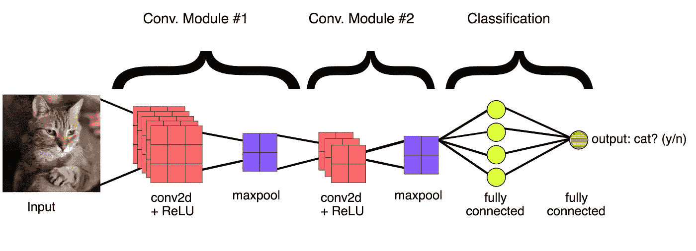**

**卷积神经网络的完整架构[来源](https://developers.google.com/machine-learning/practica/image-classification/images/cnn_architecture.svg)**

**太棒了，让我们破解一些验证码！！！**

**但是等等，**

**如果你尝试使用上面的简单架构来分类图像，你会发现你的准确率很低。在现实中，高精度模型有许多卷积层和许多训练数据，即使这样，它们也能达到 90 多的精度。那么，我们应该如何自己制作一个成功的模型呢？**

# **迁移学习**

**迁移学习是指我们利用从一项任务中获得的知识来解决相关的任务。作为人类，我们一直都在这样做。比如拿 Java 编程中获得的知识去学习如何用 Python 编码。这样我们就不必从头开始，我们可以利用以前的经验更快更准确地学习。我们可以对 ML 模型做同样的事情，通过成熟的架构获得更准确的结果。**

**我选择使用 VGG-16 模型，因为它简单而准确。利用我们对卷积神经网络的了解，我们可以理解 VGG-16 模型中正在发生的事情，而不会感到困惑。该模型在 ImageNet 上进行训练，ImageNet 是一个包含超过 1400 万个图像和 1000 个类别的数据集。它实现了 92.7%的前 5 名测试准确率。**

**我不会说太多关于 VGG-16 的细节，但是你可以在这里了解更多**

****

**这是一张 VGG16 架构的图片——我们以前没见过**

****

**[这里的](https://neurohive.io/en/popular-networks/vgg16/)是架构的一个更形象的例子**

**要在 Pytorch 上得到这个预先训练好的模型，我们要做的就是**

```
model = models.vgg16(pretrained=True)
```

**不，真的。就这么简单。**

# **结果呢**

**你可以在这里找到代码[T5T7**82%的整体准确率**。我还附上了一段我制作的视频，对代码进行了分解。](https://github.com/whipIash/reCAPTCHASolver)**

**这是我做的一个视频，展示了代码和我的思考过程。**

1.  **获取数据**

**我在 [**GitHub**](https://github.com/deathlyface/recaptcha-dataset) 上找到了一个标签为 reCAPTCHA **的数据集，我用它作为训练数据。我**移除了 VGG16 模型没有训练过的职业**并且**平衡了每个职业的图片数量**。我还用随机水平翻转和 10 度的随机旋转对数据**进行了一点扩充，这样无论图像的旋转或方向如何，模型都会知道如何对图像进行分类。然后，我将剩余的数据集分成**训练、验证和测试。****

**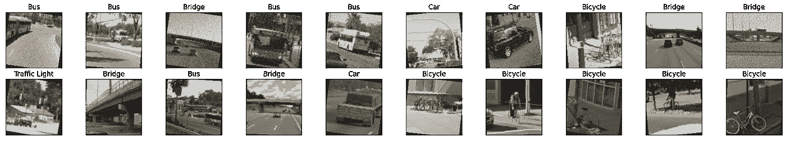**

**作者图片**

**2.训练模型**

**得到 VGG16 模型后，我创建了一个新的分类器来输出 5 个最终类，而不是 VGG16 模型中使用的 1000 个类。我只是简单地添加了一个最终的全连接层，从 1000 个输入特性到 5 个输出特性。我使用**交叉熵损失**作为我的损失函数，并使用 **Adam 优化器**，其**学习率为 0.0005** 。最后，我训练了 **15 个时期**，并在每次验证损失减少时保存模型状态。**

**3.测试模型**

**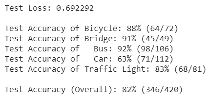**

**作者图片**

**该模型能够非常好地对公共汽车、桥梁和自行车进行分类！赛车似乎有点难，交通灯也很普通。然而，我对这个模型达到 82%的准确率感到非常自豪，因为我个人知道，我只有 90%的准确率。我有太多关于小失误或不够注意导致我重做的记忆。此外，[斯坦福大学 2010 年的这项](http://theory.stanford.edu/people/jcm/papers/captcha-study-oakland10.pdf)研究发现，图片验证码的三人一致率仅为 71.0%。**

**这是可视化结果的图片。正确答案在括号里。**

**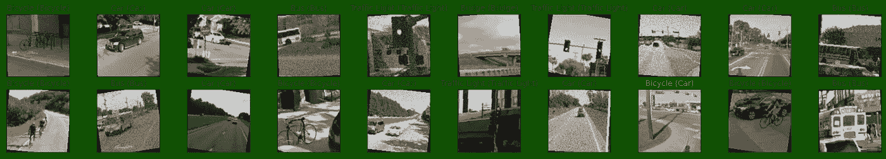**

**作者图片**

# **结论**

**希望您通过这篇文章获得了一些价值，并了解了 CNN 和迁移学习的力量。此外，如果你在你的网站上使用验证码，我会推荐**升级到 ReCAPTCHAv3** ，它不使用基于图像或基于文本的验证码，而是根据用户如何与你的网站互动来返回分数。此外，我的模型不是基于图像的验证码的游戏规则改变者。许多网站提供这种邪恶的东西，但我只是想**展示人工智能如何应用于等式**。**

**如果你还在读这篇文章，想想**人工智能如何应用在你的生活中**和**建造它**！那是最好的学习方法。**

**这就是这一个，如果你喜欢它，你可以给它一个**掌声**，如果你真的喜欢它，你可以**关注**了解更多内容！**

**嘿，感谢你阅读我的文章。我今年 16 岁，对机器学习和网络安全感兴趣。如果你有兴趣看我的更多内容，可以考虑订阅我的 [*简讯*](https://www.subscribepage.com/ryanshen) *！还有，看看我的*[*LinkedIn*](https://www.linkedin.com/in/ryanshen/)*和*[*Github*](https://github.com/whipiash/)*页面。***