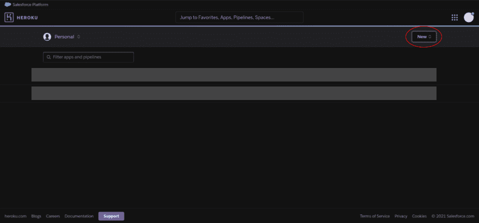
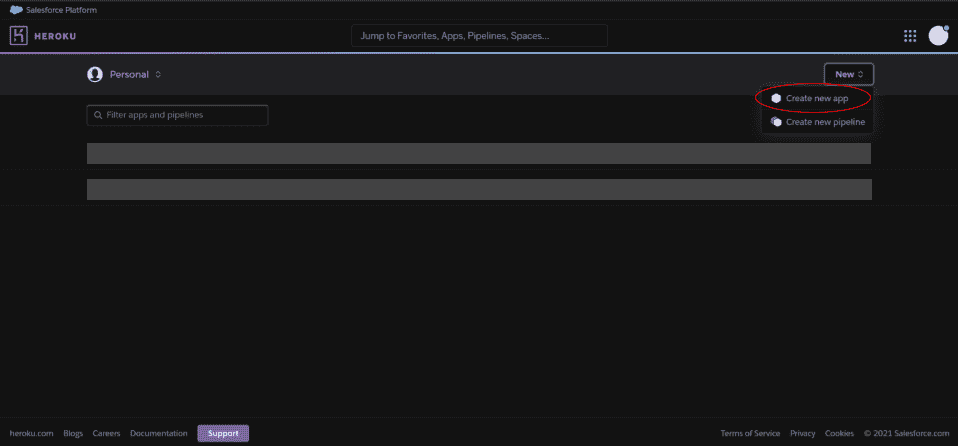
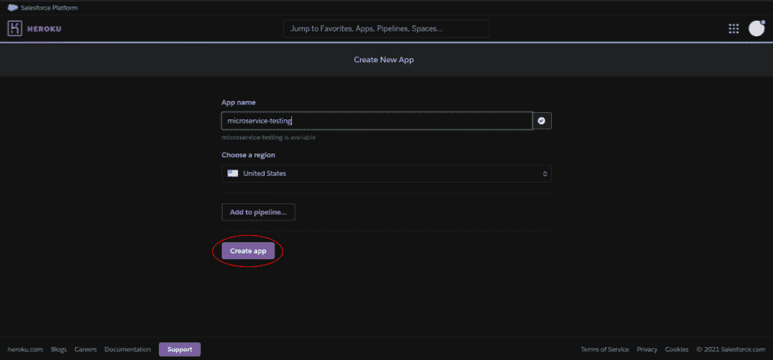
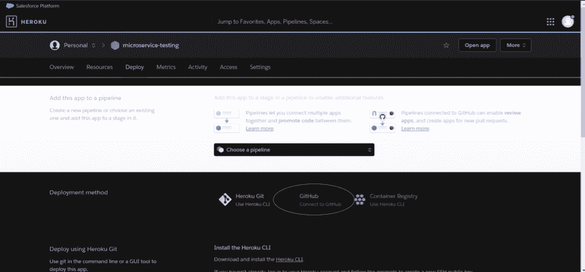
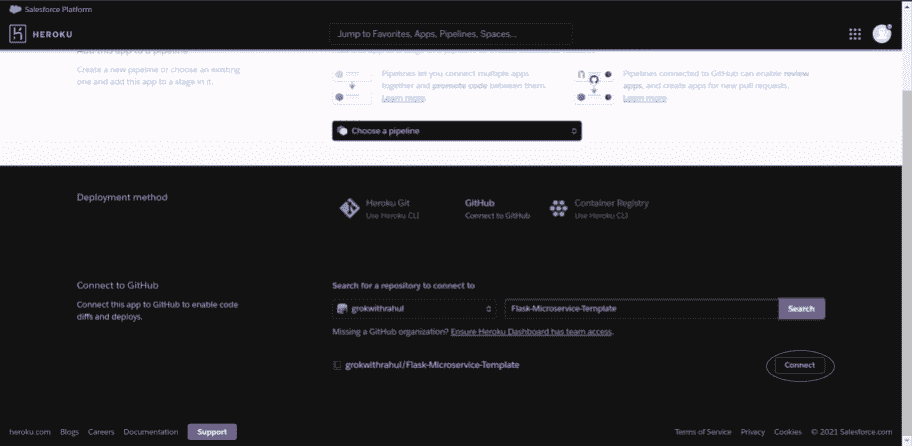
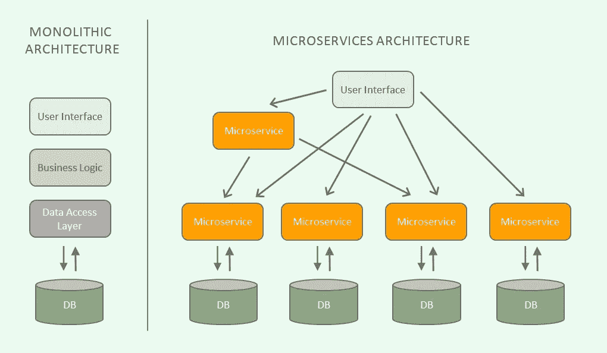

# 15 分钟内创建一个微服务！

> 原文：<https://medium.com/analytics-vidhya/create-a-microservice-in-15-minutes-flat-e57bbde1c980?source=collection_archive---------9----------------------->

照片由来自 [Pexels](https://www.pexels.com/photo/group-of-people-in-a-street-market-2276796/?utm_content=attributionCopyText&utm_medium=referral&utm_source=pexels) 的 [Krisztina Papp](https://www.pexels.com/@almapapi?utm_content=attributionCopyText&utm_medium=referral&utm_source=pexels) 拍摄

微服务就像 Baazars:人们可以得到他们可能想要的一切，但每个商店只卖一种类型的物品:服装店卖衣服，水果店卖水果。集市本身并不是一个大商店，而是一些小商店的组合，每个小商店都出售专门的商品。现在，想象一下，如果每家商店都必须出售每样东西，那会有多混乱！没有一家商店能够专营。这降低了质量并带来了不必要的负担。

这个想法也可以应用于软件。一个试图做所有事情的单一、庞大的代码库是无法专门化的。这降低了质量并带来了不必要的负担。每次更新，从变量名的改变到整个类的重写，都需要重新部署整个 monolith。此外，众所周知，这些单一代码库很难扩展以响应实时流量。此外，任何一个模块的错误都会导致整个模块崩溃。

我们如何应对这些问题？进入微服务:执行小的特定功能的小的隔离容器。作为一个整体，微服务涵盖了整体代码库的所有功能。微服务提供粒度扩展，支持持续集成/部署，并简化扩展服务的维护。

我们将使用 Python、Flask 和 Heroku 在 15 分钟内创建我们自己的微服务——完全免费。

## 赫罗库

您需要创建一个 Heroku 帐户。Heroku 是一个云服务平台，类似于 AWS 和 Google Cloud。我们将使用 Heroku，因为它很容易建立，并提供了一个很好的免费层。注册后，Heroku 会将你重定向到你的应用概述仪表板。

按下“新建”下拉按钮，然后选择“新建应用”

输入项目名称(Heroku 将在为您的微服务创建 URL 时使用此名称作为 _.herokuapp.com 的子域)。

我们已经创建了 Heroku 应用程序。为了部署您的代码，Heroku 将需要一个 Github 存储库，从那里它可以检索您的代码库。我已经创建了一个模板库，里面有你和 Heroku 运行你的微服务所需的一切，这里:[https://github . com/grokwithrahul/Flask-Microservice-Template](https://github.com/grokwithrahul/Flask-Microservice-Template)

派生存储库，并将其重命名。

## 使用模板:

将作为您的微服务运行的 python 文件位于 src/microservice.py。在该文件中，有两个函数:一个函数的 URL 为'/'，返回字符串“hello”。另一个允许你执行需要长时间运行的代码；不会导致赫罗库被绞死。您可以通过替换 heavyProcess()下的代码来定义 heavy_process。

## 链接到 Heroku

到目前为止，我们已经创建了一个 Heroku 帐户和一个 Heroku 应用程序。还有，我们已经分叉了微服务模板。现在，是时候将 Github 库与 Heroku 链接起来了。

导航至应用仪表板的部署选项卡。点击连接到 Github。

登录 GitHub 帐户后，输入存储库的名称。按“连接”

连接存储库后，您可以根据需要启用自动部署。因此，每次提交都会自动部署在 Heroku 上。

要开始部署您的代码，向下滚动并按 Manual Deploy。这将启动部署。

你有它！你已经建立了一个微服务。要访问它，您可以在应用程序仪表板中单击打开应用程序。这将带您到微服务的“/”URL，并启动与之相关的功能。

## 了解微服务的优势

现在我们的微服务已经启动并运行，我们可以检查它所提供的好处了。

资料来源:算法 a

微服务允许粒度扩展。运行单个任务的单个微服务几乎可以立即扩展，以响应增加的流量。这样，您只需要扩展您需要的功能——不像单片应用程序，您需要扩展整个程序。

微服务提供 CI/CD。每个微服务都可以在开发后立即部署。要部署一个单一的应用程序，所有的团队都必须完成他们的项目，等待其他团队完成他们的项目，停止所有的工作，然后打包。

微服务易于维护。服务器故障不会影响整个应用程序。微服务允许您隔离故障和分离故障，允许您的主应用程序继续运行，即使其中一个功能出现故障。理解和调试微服务也更容易，因为它们的代码库更小。