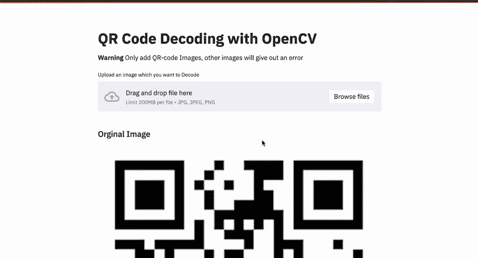
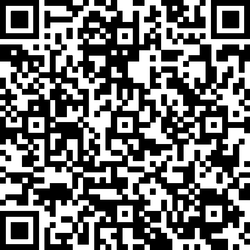

# 使用 OpenCV 和 Streamlit 创建一个 QR 码解码器 web 应用程序

> 原文：<https://medium.com/analytics-vidhya/create-a-qr-code-decoder-web-application-using-opencv-and-streamlit-b0656146e2d1?source=collection_archive---------4----------------------->



QR 码解码是一个非常有趣的应用程序，现在如果我们可以将它部署为一个 web 应用程序会怎么样？

## 二维码到底是什么？



QR 码或**快速响应码**是一种矩阵码(2D 条形码)，它是一种机器可读的光学标签，包含有关商品的信息，并指向一个网站或应用程序。

快速响应系统因其快速的可读性和更大的存储容量而变得流行。它仍然广泛用于许多服务，如应用程序下载和支付。

你可以从 [**点击**](https://share.streamlit.io/pavankunchala/qr-code-application/main/qr_code_app.py) 查看这个应用程序

## 让我们从实现开始

在这篇博客中，让我们尝试使用 **Streamlit** 和 **OpenCV 创建一个解码 QR 码的 web 应用程序。**

你可以从[这里](https://pypi.org/project/streamlit/)安装 Streamlit

**(或)**

```
 pip install streamlit ` 
```

你可以从[这里](https://pypi.org/project/opencv-python/)安装 OpenCV

**(或)**

```
pip install opencv-python
```

**导入库**

让我们开始导入必要的库，我们将使用 Streamlit，OpenCV，Pillow 等。

**添加演示图片和标题**

我们可以使用 streamlit 的`st.title()`函数为 web 应用程序添加一个变量和标题来添加演示图像

**二维码解码器功能**

现在让我们创建一个解码图像的函数，我们使用 OpenCV `cv2.QRCodeDetector().`中可用的函数来解码图像

在上面的代码片段中，我们使用了`@st.cache`函数，它的移除提高了函数运行的速度。

我们已经使用`detectAndDecode()`函数对 QR 码中的文本数据进行解码，上述函数将解码后的数据作为输出

## 上传任何 QR 图像

为了使 web 应用程序更加动态，我们将允许用户上传任何图像进行解码(用户应该记住，他应该只上传一个二维码图像，任何其他图像都可能出错)

为了上传图像，我们使用了`st.file_uploader()`功能，您还可以提及您想要上传的图像类型，我们还使用了`st.markdown()`功能来提醒用户仅上传二维码图像进行解码。

## **显示图像**

我们可以使用`st.image()`功能显示上传的图像。

## 显示解码的数据

现在让我们来看看从二维码解码的数据，它可以是一个文本或一个应用程序或网站的链接，我们已经使用了上面创建的函数来获取解码的数据。

## 部署应用程序

要部署应用程序，您必须在文件夹中提供 requirements.txt 文件。你可以使用 **pipreqs** 库来创建你可以安装它并从[这里](http://pip install pipreqs)了解更多信息，在提供文档后你可以在一个公共 Github repo 中上传它。

你可以使用[https://share.streamlit.io/](https://share.streamlit.io/)来分享你的应用，你只需要提供主要的 python 脚本链接，你就可以部署它了。

结束(至少现在)

你可以从 [**这里**](https://github.com/pavankunchala/qr-code-application/blob/main/qr_code_app.py#L74) 找到博客的代码

**PS** :如有疑问可以邮件我[这里](http://pavankunchalapk@gmail.com/) (pavankunchalapk@gmail.com)，

你可以在我的 **LinkedIn** 上从 [**这里**](https://www.linkedin.com/in/pavan-kumar-reddy-kunchala/) 联系我，你也可以在我的 **Github** 上从 [**这里**](https://github.com/Pavankunchala) 查看我的其他代码(它有非常酷的东西)

我也在寻找**深度学习**和**计算机视觉**领域的自由职业机会，如果你愿意合作，在这里给我发邮件([pavankunchalapk@gmail.com](mailto:pavankunchalapk@gmail.com))

祝你有美好的一天！