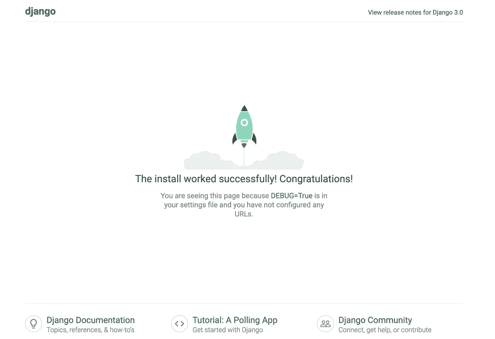
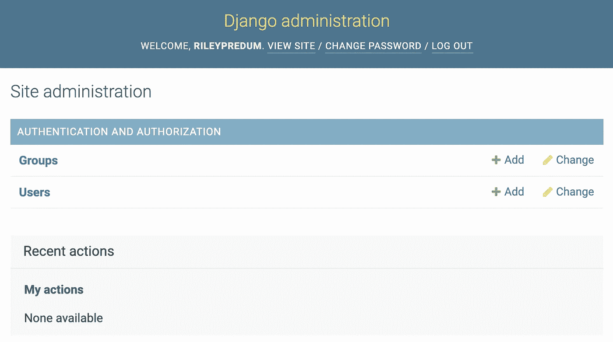

# 在 django 创建一个简单的博客网站

> 原文：<https://medium.com/analytics-vidhya/create-a-simple-blog-website-in-django-f091bb1d718c?source=collection_archive---------0----------------------->

是时候把我的文学博客转换成科技博客了。我受到了我的如何创建股票相关矩阵的启发，它得到了你们很多人的回应。因此，让我们开始一个多部分的技术博客系列！

为了实现这个目标，我使用了 Django，这是一个构建在 Python 之上的可扩展 web 框架，对此我已经很熟悉了。这篇文章是写给有相似目标的人的，他们不熟悉 Django、Python 和/或 web 框架，正在寻找项目来适应我们所处的新现实。

# 设置

我们将设置 Django、您的项目目录和您的虚拟环境。您将需要以下版本的以下内容:

```
pipenv (version 2019.11.26)
python (version 3.7.5)
```

你可以在这里下载 pipenv [。如果您正在进行一系列全新的安装，您可以在这里下载 Python](https://pipenv-fork.readthedocs.io/en/latest/) [和 pip(为 Python 安装软件包的软件包处理程序)](https://www.python.org/downloads/release/python-365/)[这里下载](https://pip.pypa.io/en/stable/installing/)。

# 安装 DJANGO

这将使用那个版本的 Python 把那个版本的 Django 安装到您的虚拟环境中。

```
pipenv --python 3.6.5 install django==3.0.6
```

# 建立姜戈

在 CMD 上导航到您想要创建项目的位置，并在那里输入以下命令:

```
django-admin startproject Project_Name
```

在终端中导航到该文件夹，然后按`ls`确认您在正确的位置。您应该会看到 Django 项目中的一个关键文件`manage.py`。

运行以下命令来迁移变更，这是在 Django 中同步项目文件的必要命令:`python manage.py migrate`。您应该在终端中看到一堆文件正在提交。现在不要担心那个。下一次运行`python manage.py runserver`使其启动并运行。

您应该在终端中看到 URL 是 [http://127.0.0.1:8000/](http://127.0.0.1:8000/) 。在您的浏览器中，亲自查看您的项目已初始化！您应该会看到这个默认屏幕:



如果你看到它起作用了，你就可以定制你的项目了！如果你没有看到，请评论，我会回答你的任何问题。

# 创建超级用户

你需要创建一个管理员用户来使用 Django Admin 来管理你的博客文章等等。在终端中，运行以下命令并按照提示创建该用户:

`python manage.py createsuperuser`。

您应该看到您的用户帐户已成功创建。现在，在服务器运行的情况下，导航到[http://127 . 0 . 0 . 1:8000/Admin](http://127.1.000.8000/admin)，登录并查看管理视图。

成功登录后，您应该会看到以下内容:



# 运行在不同的端口上

如果您想要更改服务器的端口，那么您需要将它作为命令行参数传递:

```
$ python manage.py runserver 1602
```

IP 地址也是如此:

```
$ python manage.py runserver 0:8000
```

这将在 IP 地址 0.0.0.0 上运行

# 创建第一个应用程序

好的，我们是在这里上应用程序开发课程吗，不好意思，但是这些是我们在 Django 的术语。Django 的工作基于应用程序的概念，你可以把它看作是你网站内部的微功能。在一个完全构建的项目中，你网站的博客可能就是这样一个应用。你想让应用程序能够理想地跨项目即插即用，这样你就可以回收代码。这样，假设将来你创建了另一个网站，你希望一个完整的博客能够弹出到网站的一个子域中。

也就是说，我将假设您想要以下应用程序作为默认:一个主页(博客文章列表视图)和一个关于页面。实际上,“关于”视图是一个更加静态的视图，不一定需要动态更新，但有一天可能会！运行以下命令来创建这些应用程序。

```
python manage.py startapp blog 
```

# 创建视图

让我们写第一个视图。你需要打开你家`/`目录下的`views.py`文件。让我们创建一个简单的视图如下:

```
from django.http import HttpResponsedef index(request):
    return HttpResponse("Welcome to home page.")
```

为了调用视图，我们需要将它映射到一个 URL。让我们创建一个新文件(`urls.py`)，并放入以下代码:

```
from django.urls import pathfrom . import viewsurlpatterns = [
    path('', views.index, name='index'),
]
```

现在我们已经为 blog 应用程序设置了 URL，但是它没有连接到主 Django 应用程序。因此，让我们进入主`urls.py`文件，如下所示:

```
from django.contrib import admin
from django.urls import include, pathurlpatterns = [
    path('blog/', include('blog.urls')),
    path('admin/', admin.site.urls),
]
```

现在我们已经将一个视图连接到了 URL，您可以在浏览器中查看它了。只需重新运行开发服务器即可:

```
$ python manage.py runserver
```

在浏览器中转到[http://localhost:8000/blog/](http://localhost:8000/blog/)，您应该会看到文本“欢迎来到主页”。

# 模型

我们将为博客应用程序定义模型。我们将创建一个模型，并将其标记为“文章”或“博客文章”(您可以自行决定)。Python 类代表了这些概念。编辑`blog/models.py`文件，如下所示:

```
from django.db import modelsclass Post(models.Model):
    title= models.CharField(max_length=200)
    content= models.CharField()
    pub_date = models.DateTimeField('date published')
```

我们可以看到每个类都继承了`Model`的类。每个模型都有几个类变量，每个类变量代表模型中的一个数据库字段。要获得更多关于`Model`类的信息，我建议你参考[Django 官方文档。](https://docs.djangoproject.com/en/3.1/intro/tutorial02/)

# 激活模型

这一小段模型代码给了 Django 很多信息。有了它，Django 可以:

*   为此应用程序创建数据库架构。
*   创建一个 Python 数据库访问 API 来访问`Post`对象。

要进行迁移，只需运行以下命令:

```
$ python manage.py makemigrations blog
```

您应该会看到类似如下的输出:

```
Migrations for 'blog':
  blog/migrations/0001_initial.py
    - Create model Post
```

通过运行`makemigrations`，您告诉 Django 您已经对您的模型做了一些更改。

要最后一次迁移数据库，运行`migrate`命令，如下所示:

```
$ python manage.py migrate 
```

## 模板和视图

Django 作为一个框架利用了[模型视图模板(MVT)](https://www.javatpoint.com/django-mvt) 软件设计模式。在那个链接中有更多的细节，但是基本上当你访问一个 URL 时，Django 会检查匹配那个 URL 的模式，以及它需要什么样的模板和模型来呈现给浏览器。它用模型的数据呈现模板(想想页面结构)。

# 如何创建您的模板

首先，在`blog/views.py`中创建一个新视图:

```
def post(request, post_id):
    return HttpResponse("You're looking at post %s." % question_id)
```

现在配置`urls.py`来使用这个视图:

在`/blog/<post_id>/`查看您的浏览器。如果您在管理面板中添加了帖子，将会显示此 ID。现在，让我们创建一个真正显示博客文章的视图。在`blog/views.py`中，我们添加以下代码:

但是这里有一个问题:页面的设计在视图中是硬编码的。为了纠正这一点，我们将创建一个模板。首先，在您的`blog`目录中创建一个名为`templates`的目录。姜戈会在那里寻找模板。

将以下代码放入名为`index.html`的模板中:

现在让我们更新`blog/views.py`中的`index`视图，以使用模板:

# 结论

我希望你能从这本初学者指南中学到很多，用 Python 在 Django 中设置一个简单的 web 应用程序。我写这篇文章的目的是向您介绍 Python 中 Django 的基础知识，从而增强您的好奇心并从那里开始尝试。

欢迎在评论中留下你的想法。谢谢，祝编码愉快！