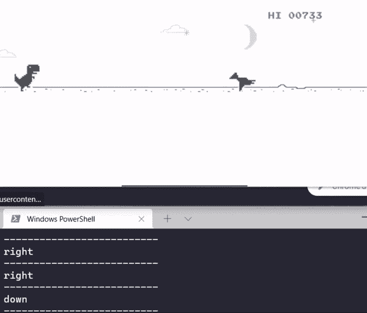
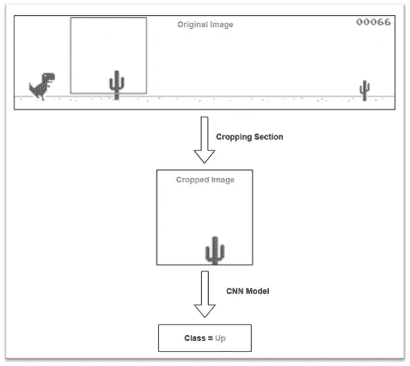
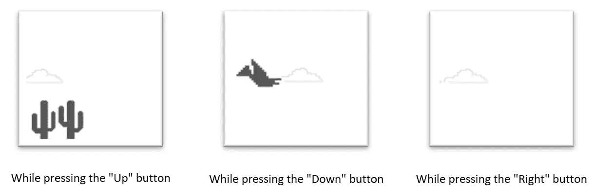
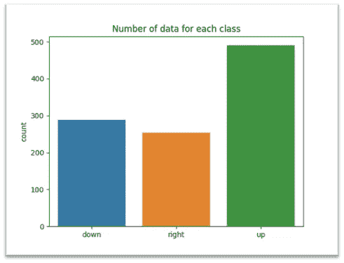
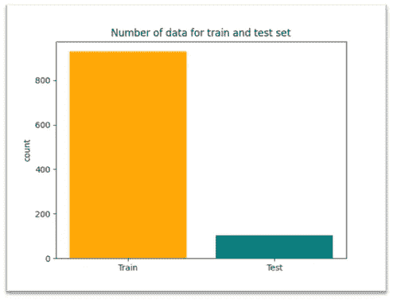
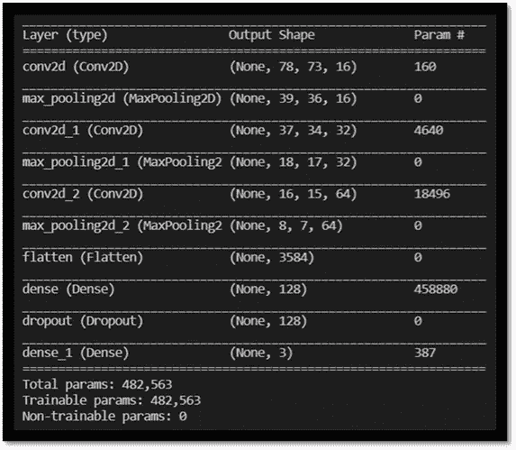
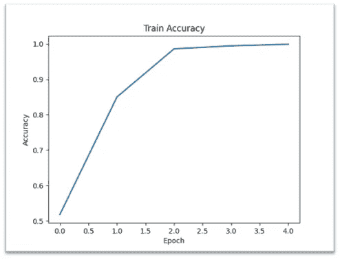
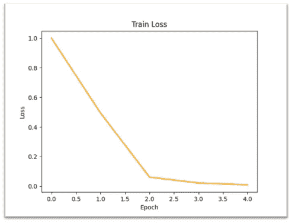
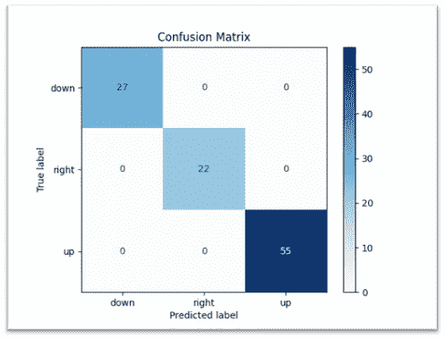
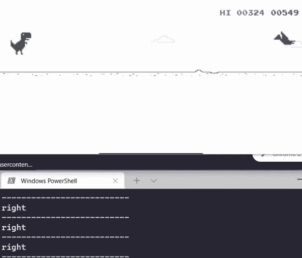

# 创建一个人工智能来玩 CNN 的 Chrome Dino 游戏

> 原文：<https://medium.com/analytics-vidhya/create-an-ai-to-play-chrome-dino-game-with-cnn-b769e58bb14c?source=collection_archive---------11----------------------->

在本文中，我们将实现一个卷积神经网络(CNN)模型来玩 Chrome Dino 游戏，这是 Google Chrome 的一个扩展。当一切完成后，我们将看到如下所示。

为了实现 CNN 模型，我们将按顺序执行以下操作:

*   首先，我们将通过玩一会儿游戏来创建一个数据集。
*   为了创建数据集，我们将在玩游戏时抓取屏幕，并记录当时按下了哪个键。
*   创建数据集后，我们将训练一个使用 CNN 准备的分类模型。
*   在分类模型训练完成后，我们将通过一个测试软件来测试模型，并根据结果来获得更好的模型。

# 数据准备

在准备数据集之前，已经决定了数据集中包含的内容。为了在这种情况下准备分类模型，决定了以下事项:

*   模型的输入将是从游戏的特定部分截取的截图的矩阵转换。
*   要分类的类别有:

> **Up:** 这个类将用于在游戏中跳跃恐龙。
> **滑下:**这个类将用于在游戏中滑下恐龙。
> **右:**这个类将用于让游戏中的恐龙保持直线行进。

根据分类模型的结构，一边玩游戏一边截图。在拍摄这些截图时，无论按下了什么按钮(上、下、右),该按钮信息也被用在截图的名称中，以存储为一个类。在截图的同时，在游戏中的恐龙面前取一个用边框确定的正方形区域作为基础。

我们可以在下图中看到实现模型的过程。

实现模型的过程

# 数据预处理

有时，由于玩游戏时截图的速度，截图和班级信息不一致。由于数据集中的这种不兼容性会对模型的训练过程产生不利影响，因此检查并删除了不一致的数据。

创建数据集时，屏幕截图以 RGB 格式保存。然而，由于图像中没有太多的颜色信息(通常有黑白色调)，数据在作为输入提供给模型之前被转换为“灰度”。由于 RGB 图像是三维的，如果用这样的数据训练模型，训练过程将花费很长时间。因此，通过执行转换过程减少了模型的训练时间，并且在玩游戏时增加了 FPS(每秒帧数)。

# 数据可视化

如前所述，数据集中有 3 个类(上、下和右)。所以我们可以在下图中看到这些类的一些例子。数据集中这样的例子太多了。

图像总数为 1032 的数据集中的类分布如下图所示。由于游戏中“向上”键按的比较多，所以数据最多的就是这个类。

数据集中每个类的数据数量

在开始训练之前，数据集被分成 90% — 10%的“训练集”和“测试集”。在这个过程之后，数据集的分布如下。

数据集中训练集和测试集的数据数量

# 创建 CNN 模型

*逻辑回归*，*人工神经网络*或者*卷积神经网络*说到用深度学习分类可能会想到。在这三种结构中，*卷积神经网络(CNN)* 通常是图像分类的主导结构。因此，决定使用 CNN 模型，因为玩游戏需要图像分类。为此，下图中的 CNN 模型是使用 Keras 库创建的。

用于图像分类的 CNN 模型

在上面的 CNN 模型中，我们看到有 482，563 个参数需要训练。另外， *dropout* 层用在分类层之前，防止训练时过拟合。

# 训练 CNN 模型

在上述章节中创建 CNN 模型后，开始了针对 *5 个时期*的训练过程。为了在训练期间获得更好的结果，手动改变超参数，执行微调，并选择给出最佳结果的模型。培训的结果是:

> T **rain 准确率(训练数据成功):** 100%
> 
> **测试准确度(测试数据成功):** 100%

下图显示了训练过程中模型的准确性和损失的变化。

培训过程中的培训准确性

培训过程中的培训损失

由于训练后模型对测试数据的准确性为 100%，显示类别如何相互混合的*混淆矩阵*显示为无混淆，如下所示。

模型的混淆矩阵

# 测试 CNN 模型

在创建了 CNN 模型并对数据进行了训练之后，测试阶段开始了。在测试阶段，使用训练过程后获得的权重。

在这个阶段，运行一个为测试创建的软件，并截取游戏中相关区域的截图。然后，使用模型权重进行预测。这个预测将是*上、下、右*类之一。如果这个预测是:

> **Up:** 创建的测试软件通过按键盘的“Up”键继续游戏。
> 
> **Down:** 创建的测试软件通过按键盘的“Down”键继续游戏。
> 
> **右:**创建的测试软件按键盘的“右”键继续游戏。

# 摘要

在本文中，我们首先准备了一个玩游戏的数据集。然后，我们简单地创建一个 CNN 模型，用数据集进行训练。最后，我们创建并启动了一个测试软件，现在我们的 AI 正在玩 Chrome Dino 游戏:)

AI 在玩 Chrome Dino 游戏

你可以在这个 [GitHub](https://github.com/frhtas/AI-Dino) 库中看到所有的代码和模型权重。