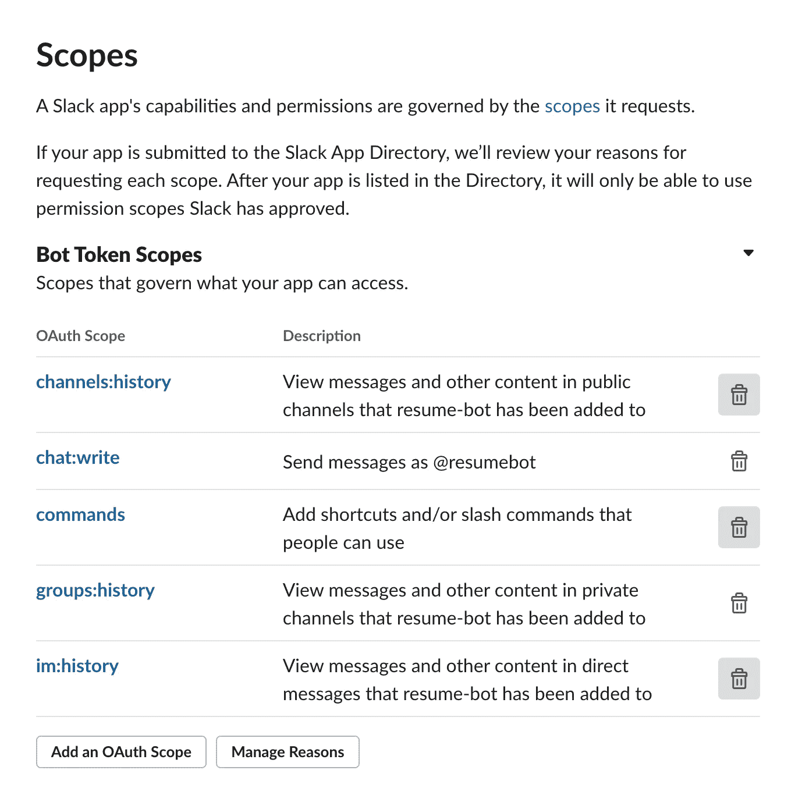

# 用 python 和 AWS 在 1 小时内创建并发布一个 slack bot

> 原文：<https://medium.com/analytics-vidhya/create-and-distribute-a-slack-bot-with-python-and-aws-in-1-hour-41c4a6c0f99d?source=collection_archive---------1----------------------->

了解如何在 AWS 的帮助下，在不到一个小时的时间内从头开始创建 slack bot。然后，您可以根据自己的需要定制这个机器人。本文的所有代码都可以在我的 [github](https://github.com/cazabec/slackbot-aws-lambda) 上检索到。

在本文中，我将向您展示如何创建一个简单的机器人，当有人在频道中发布消息时，它会进行回复。您还将学习如何分发您的机器人，以便任何人都可以安装它。

# 1.设置松弛应用程序

对于这一步，我们需要创建一个 Slack 应用程序，填写基本信息，订阅事件并为我们的新机器人设置权限。

*   前往 https://api.slack.com/apps[的](https://api.slack.com/apps)，点击“**创建新应用”**
*   输入应用程序的名称，并选择您的工作区
*   您应该会被重定向到应用程序的“基本信息”部分
*   更新本页的“显示信息”部分
*   转到边栏上的“活动订阅”页面:

*   启用事件并点击**订阅 bot 事件**，添加以下权限: *message.channels。*暂时将“**请求 url** ”字段留空，我们稍后会填充它。
*   然后，转到侧边栏中的“Oauth & Permissions”选项卡，转到“ **Scopes** ”部分，添加以下范围(有些范围已经预填充，您不能删除它们。

根据你试图解决的问题，你必须定制你的范围。

# 2.设置 AWS

在这一步中，我们将在 AWS 上创建创建我们的 bot 所需的所有组件。如果你还没有 AWS 账户，不用担心，你可以在 https://aws.amazon.com/fr/free/免费创建。对于大多数使用情形，免费层已经足够了。

*   登录您的 AWS 帐户，然后转到“服务”选项卡中的 **lambda** 。
*   点击“**创建功能**，然后点击“从头开始创作”并填写姓名字段

自动气象站λ

*   单击您的新 lambda 函数，然后单击“**添加触发器**”，我们将创建一个 API 网关，它将公开“暴露”我们的 lambda，以便我们可以向它发送事件。
*   选择“ **API 网关**，然后“**创建 API**”(HTTP API)。将安全性设置为“开放”，以便 slack 可以向您发送请求，然后单击“**创建**
*   你可以通过点击 Api 端点链接(见下图)来测试你的 lambda，你应该会看到“ *Hello from lambda！*

*   回到 slack 的“事件订阅”页面，粘贴您的 API 端点的链接。您应该会看到一个错误。这是因为 slack 正在尝试验证你的端点，你必须返回 slack 发送的“*挑战*值。

*   在 AWS 上，转到 lambda 函数编辑代码，并将代码放在下面，以返回挑战并验证您的 URL。

> **def lambda_handler(event，context)** 是每个 lambda 函数的入口点。event 参数为您提供了关于触发该函数的事件的信息(在我们的例子中是 slack API post 请求)

*   回到 Slack，点击“**重试**”来验证你的请求 URL，现在应该可以正常工作了。
*   你可以进入侧边栏的“基本信息”选项卡，点击“**安装你的应用**”，然后点击“**安装到工作区**”

# 3.编写机器人代码

您的 bot 现在已经安装在您的工作区中，您的 AWS lambda 已经准备好接收来自这个工作区的事件。现在是时候给 lambda 函数添加逻辑了。

*   在您的 slack 工作区，进入一个频道，通过键入`@name-of-your-bot`并按回车键将您的机器人添加到该频道

将机器人添加到频道

您现在可以接收 lambda 函数上的事件了！我们只需在我们的 lambda 函数中添加逻辑，这里有一个小示例，它检查消息中是否附加了文件，如果是，则进行回复。

恢复 bot lambda 代码

*   对于本例，您需要添加 **BOT_TOKEN** 环境变量，转到 slack 上的“ **Oauth & Permissions** ”来复制它并创建一个环境变量(见下图)

添加环境变量

如果您使用这段代码，这就是您应该得到的结果👇

基本时差机器人结果

*如果你有问题或者它不工作，你想调试，你可以去看看 AWS 上的*[*cloud watch*](https://aws.amazon.com/fr/cloudwatch/)*服务，它会在每个 lambda 调用上写日志。*

# 4.将 slash 命令添加到 slack 应用程序中(可选)

Slack 允许你创建斜线命令，像`/setreply hello world !`，这在很多情况下非常有用

*   转到 slack 侧边栏中的“**斜线命令**”标签，点击“创建新命令”
*   您可以创建第二个 lambda 函数来处理与 slash 命令相关的事件，您还必须创建另一个 API 网关，只需重复我之前描述的步骤。
*   一旦完成，您就可以在创建 slash 命令时将 API 端点的链接复制到“**请求 URL** ”字段中。
*   转到您的新 lambda 函数，并根据您的需要扩展这个基本代码:

当有人在频道中输入你的斜杠命令时，你的 lambda 将被触发。让逻辑适应你的需要。

# 5.使用 dynamoDB 存储数据

你的机器人可能需要存储信息，做一些比回复短信更复杂的事情。我将向你展示如何将 DynamoDB 链接到你的任何一个 lambdas 上，这样你就可以构建任何类型的机器人。

当您想要分发 slack 应用程序以将其安装到新的工作空间时，您还需要一种存储令牌的方法(在下一步中)

*   在你的 AWS 账户中找到 [dynamoDB](http://console.aws.amazon.com/dynamodb/home) 服务，点击“**创建表格**
*   填写表名并设置主键，在我的例子中，表名是“token ”,主键也是“token”。我们将为我们的机器人添加到的每个新工作空间存储一个 slack 令牌。我们还将有一个名为“teamId”的字段，它是您的工作区的唯一 Id。

我们现在需要让我们的 lambda 访问我们的 dynamoDB 服务。否则，当您试图从 lambda 访问数据库时，将出现“权限被拒绝错误”。

*   在 AWS 上进入你的 [IAM](https://console.aws.amazon.com/iam/home) 服务，点击“**角色**
*   找到与你的 lambda 函数对应的角色，对我来说是“oauthLambda-role-et3lslpe”然后点击它

*   点击权限标签中的“附加策略”并搜索“dynamoDB”
*   添加符合您需求的策略，在我的例子中，我添加了完全访问(AmazonDynamoDBFullAccess)

*   如果您正在使用 python，您可以使用强大的 [Boto3](https://boto3.amazonaws.com/v1/documentation/api/latest/index.html) 库并像这样查询您的表:

在这个例子中，我使用了“reply”表，并更新了名为“default”的行的“content”字段。我邀请您阅读 Boto3 文档，了解如何查询您的数据库。

# 5.分发您的机器人

一旦你完成了新机器人的编码，就该分发它了。我将向您展示如何实现 oauth2 协议，这样任何人都可以将您的 bot 安装到它的工作区。

*   用 API 网关创建第三个 lambda 函数(oauthLambda )(如步骤 2 所示)
*   在 slack 上，转到侧边栏中的“ **Oauth &权限**，然后点击“**添加 Oauth 重定向 URL**”，然后点击“**设置重定向 URL**
*   添加新 API 网关的 URL 作为新的重定向 URL。

*   转到侧边栏上的“**管理发行版**”选项卡，检查您的 bot 是否符合所有标准，然后单击“**激活发行版**”

*   一旦完成，你将从 slack 获得一个可共享的 URL(见下图)，在测试它之前，你必须做最后一件事:编码你的 lambda 来执行 oauth2 过程。

*   回到 AWS，编辑最后一个 AWS lambda 函数(oauth 函数)的代码。将代码[放在](https://github.com/cazabec/slackbot-aws-lambda/blob/997dc5dbc070695110524b7d59f61ba9f5e0c153/lambda/oauth2.py)下面:

当有人试图在他们的工作空间上安装你的 bot 时，这个代码将被调用，它唯一做的事情是将 oauth 令牌保存在 dynamoDB 中 slack teamId 旁边。

*   现在，您可以修改步骤 3 中的示例代码，使用与从 slack 收到的事件中的 teamId 相对应的令牌([这里是我的 github 上的一个例子](https://github.com/cazabec/slackbot-aws-lambda/blob/997dc5dbc070695110524b7d59f61ba9f5e0c153/lambda/event_receiver.py#L6))。

当一个事件发生在安装了你的机器人的工作空间时，你会在你的 lambda 上收到一个事件，它的有效负载包含“ **teamId** ”。每个 teamId 都与一个 bot 令牌一起存储在您的数据库中，这就是您如何根据接收到的事件知道必须使用哪个令牌的原因。

瞧啊。现在你有了一个运行在 AWS 上的机器人，任何有你链接的人都可以把它安装到他的工作空间。

# 结论

如果你想用 AWS 立刻创建一个新的 slack bot，我试图展示你如何开始的主要步骤。无论您的用例是什么，您都可以扩展基本示例。尽情发挥你的想象力，用神奇的机器人为 slack 社区做贡献。

如果你有任何问题，评论这个帖子，我会尽快回答。