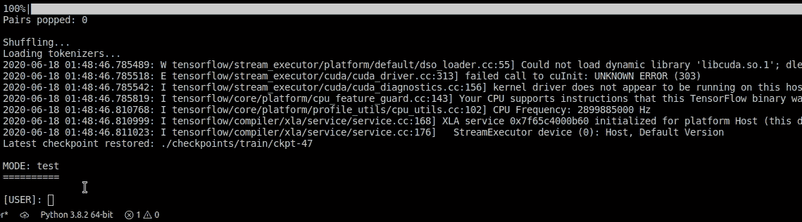

# 如何通过三个简单的步骤创建聊天机器人？(T5 变压器)

> 原文：<https://medium.com/analytics-vidhya/create-chatbot-using-chatformer-t5-based-chat-bot-1b3445f87d72?source=collection_archive---------1----------------------->

> 一个关于如何使用我的库创建一个上下文聊天机器人(不需要深度学习，因为我已经为你做了)并在 Reddit/Telegram/移动应用上部署它的 3 步教程


**用例**

想做一个聊天机器人吗？

我们让你很容易，使用*子 reddits* 你的聊天机器人可以学习人们如何交谈/回应某些问题/回复。

如果我告诉你，你几乎不需要任何编码就可以完成它，并且可以把它部署到任何你想部署的地方。

这是我用 r/mentalhealth subreddit 的数据训练库制作的聊天机器人。

**演示:**



训练数据是从 reddit.com/r/mentalheath 收集的

[Chatformer](https://github.com/Ar9av/transformer-nmt-chatbot) 是 Chatbot 的一个端到端实现，它使用了一个强大的转换器模型 [T5](https://ai.googleblog.com/2020/02/exploring-transfer-learning-with-t5.html) 。

在这里，我将向您展示如何创建、更新、训练和分析聊天机器人，并将其部署在 Telegram/Reddit 等任何地方，或者在您自己的网站平台上使用它。

*已经等不及了？
打开以下 Google Colab 笔记本，在旅途中使用。*

[*链接到 colab 笔记本*](https://colab.research.google.com/drive/17TmAJCD2jmydaN7TDJ32Tc8FsMVYzalH?usp=sharing)

**训练数据**

没有训练数据？在脑海中有一个包含你的用例的子编辑吗？我们会保护你的！

对于下面的例子，我们将使用 reddit 来获取训练数据。

# **第一步:**

**克隆**

*   使用以下命令将此存储库克隆到您的本地计算机

```
$ git clone https://github.com/Ar9av/transformer-nmt-chatbot.git
```

更改工作目录

```
$ cd transformer-nmt-chatbot
```

**设置**

*   使用以下命令安装需求，我们可能需要 chromium 驱动程序来创建我们的训练数据

```
$ pip install -r requirements.txt
$ sudo apt-get install chromium-chromedriver
```

# **第二步:**

**基于 Reddit 对话线索的训练数据**

您可以通过 reddit 对话直接训练它，只需提供您想要的数据的子编辑和页数。

您可以使用`config.yml`进行配置，并将`reddit_data`更改为`True`。

您可以在`reddit_config.yml`中提及子目录、页面、分类标准。

`reddit_config.yml`的示例模板

运筹学

**基于自定义数据集的训练数据**

如果您使用自己的自定义数据集，请保持以下格式。

将`config.yml`中的参数`reddit_data`改为`False`。

训练数据应该在`data`文件夹中。

对话数据应保存在`train.to`和`train.from`两个文件中。每行表示 from 和 to 表单中每个一对一对话的 id。

文件`train.to`:

```
Hey
How are you
```

文件`train.from`

```
Hi
I am fine
```

# 第三步:

坐下来，你所要做的就是运行下面的代码

**培训**

# 配置训练参数

更改`config.yml`中的参数，将`type`更改为`train`并运行以下命令。

```
$ python main.py
```

**如果不是书呆子就忽略**


对于那些想玩训练参数的书呆子来说，配置如下:

## 想要将应用程序部署到子编辑吗？
T21【Reddit 自动回复脚本

在训练完一个子编辑数据后，我们可以使用模型来通过评论进行干预，并使用`reddit_bot.py`生成回复

在`reddit_credentials.yml`中配置 bot (app)用户凭证

# **第四步:**

放松，你已经完成了，先生。

喝一杯印度茶，和你的新聊天机器人聊天。


## 建议！？

> 为什么不投稿！？
> 
> -备选方案 1
> 
> 🍴叉这个回购！
> 
> 🔃使用`[hhttps://github.com/Ar9av/transformer-nmt-chatbot/compare/](https://github.com/Ar9av/transformer-nmt-chatbot/compare/)`创建一个新的拉动请求。
> 
> -备选方案 2
> 
> 👯使用以下命令将此存储库克隆到您的本地计算机
> 
> $ git 克隆[https://github.com/Ar9av/transformer-nmt-chatbot.git](https://github.com/Ar9av/transformer-nmt-chatbot.git)

***疑惑、建议，联系我。***

[我的 LinkedIn](https://www.linkedin.com/in/ar9av/)