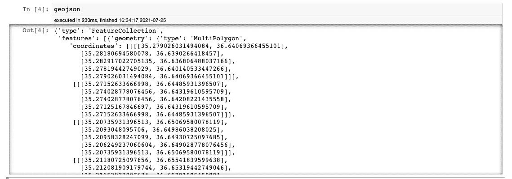
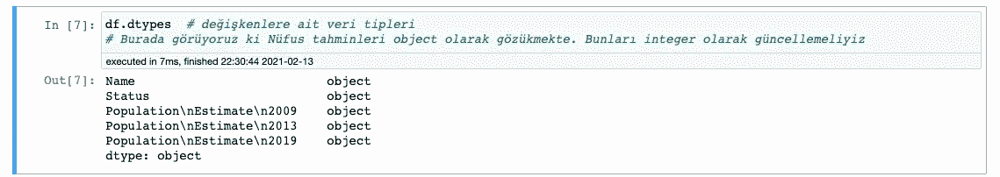
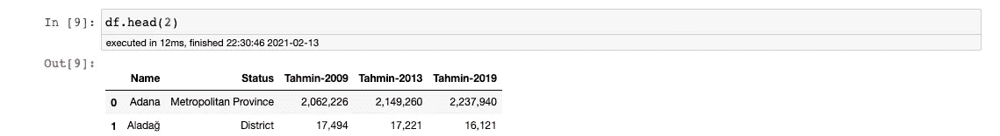
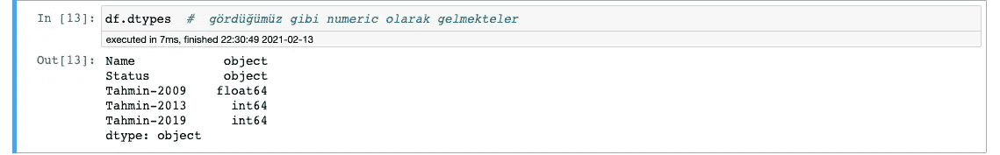
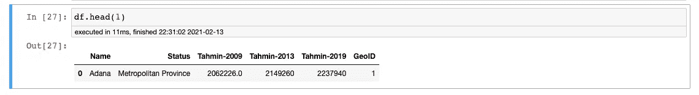
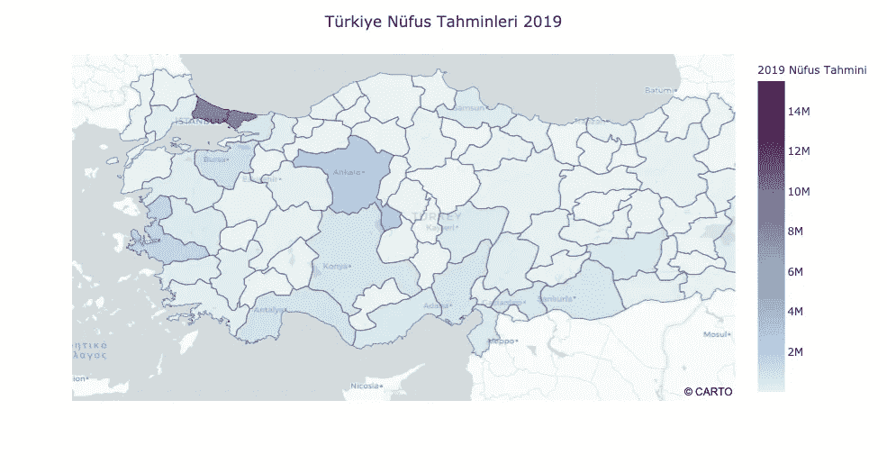
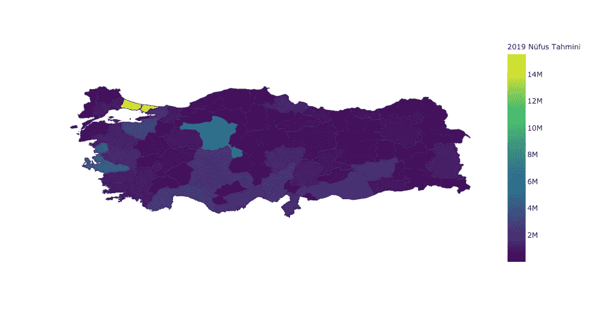
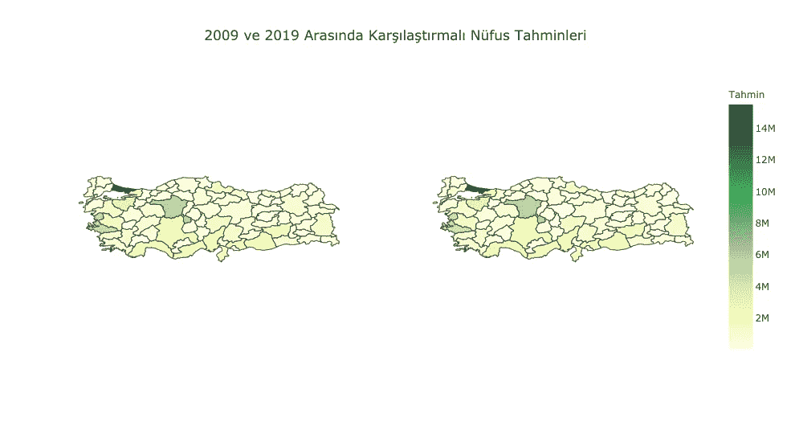

# 使用 Plotly 创建 Choropleth 地图

> 原文：<https://medium.com/analytics-vidhya/create-choropleth-maps-by-using-plotly-31771803da7?source=collection_archive---------4----------------------->

大家好。在这个故事中，我们将试图涵盖，我们如何使用 Plotly 创建 choropleth 地图。

如果我们想创建 choropleth，我们需要有与我们的目标区域相关的 GeoJSON 文件。我准备了我们将在这个故事中用到的笔记本。你可以从[这里](https://github.com/mebaysan/VeriBilimi/blob/master/Python/3-)KesifciVeriAnaliziVeVeriGorsellestirme/Plotly-Dash-Examples/Plotly-Choropleth/Choropleth.ipynb)进入。

# 关于我们的 Jupyter 笔记本

我们将使用[这个数据集](https://www.citypopulation.de/en/turkey/admin/)来创建我们的笔记本。该数据集包含某些年份土耳其总人口的估计值。你可以从[这里](https://docs.google.com/spreadsheets/d/1iwe7WoUGxl9EkzJwvpw4Fzo_AUh8jjPuHCtJLkZgcLE/edit#gid=0)访问数据集。我们将使用[这个 GeoJSON 文件](https://gist.github.com/mebaysan/9be56dd1ca5659c0ff7ea5e2b5cf6479)作为我们的目标区域。我们将创建的 choropleth 将展示估计的人口。

# 我们开始吧

## 准备和导入依赖项

```
import pandas as pd
import numpy as np
import plotly.express as px
import plotly.graph_objects as go
from plotly.subplots import make_subplots
import requests
import json
```

与 Plotly 包不同，我们需要导入**请求**和 **json** 包。我们将使用请求从 GitHub gists 获取 GeoJSON 数据，并使用 JSON 访问数据。

## 导入数据集

从 CSV 文件导入包含估计人口的数据集。

```
df = pd.read_csv('Turkey Districts - Population Estimate - Sayfa1.csv')
```

为了从 GitHub gist 访问数据，我们将使用请求，并将 GET 请求发送到包含 GeoJSON 文件的 URL。

```
response = requests.get('[https://gist.githubusercontent.com/mebaysan/9be56dd1ca5659c0ff7ea5e2b5cf6479/raw/6d7a77d8a2892bd59f401eb87bd82d7f48642a58/turkey-geojson.json'](https://gist.githubusercontent.com/mebaysan/9be56dd1ca5659c0ff7ea5e2b5cf6479/raw/6d7a77d8a2892bd59f401eb87bd82d7f48642a58/turkey-geojson.json'))
```

如你所知，我们的响应存储在响应对象中。现在，我们需要从响应对象中提取 json 数据，并将其作为 GeoJSON 进行访问。

```
geojson = response.json()
```

如果你打印 geojson 变量，我们在其中存储数据，你可以看到 json 数据。



## 检查数据集并准备可视化

打印数据类型，看看它们是什么样子的。



你看，估计列是对象类型。但是它们存储的是数字数据。我们需要改变他们的数据类型。首先，我将更改它们的列名，以便于访问。

```
df.rename(columns={'Population\nEstimate\n2009': 'Tahmin-2009',
                   'Population\nEstimate\n2013': 'Tahmin-2013',
                   'Population\nEstimate\n2019': 'Tahmin-2019'
                   }, inplace=True)
```

我将使用 **df.head(2)** 查看前两行



现在看起来好多了。但是仍然有一个问题。他们在 Excel 文件中用“，”分隔浮点值，但我们使用“.”分隔在 Python 中。我们需要解决那件事。我将通过使用 lambda 函数对列使用 apply 函数。我将用'，'分割所有的值，然后将我为每一行分隔的所有部分连接成一个字符串。

```
df['Tahmin-2009'] = df['Tahmin-2009'].apply(lambda x: ''.join(x.split(',')))
df['Tahmin-2013'] = df['Tahmin-2013'].apply(lambda x: ''.join(x.split(',')))
df['Tahmin-2019'] = df['Tahmin-2019'].apply(lambda x: ''.join(x.split(',')))
```

现在，如果您尝试将列转换为数字数据，您将会看到错误。因为他们写的是'…'而不是空值。我用 numpy.nan 替换'…'值。

```
df.replace('...', np.nan, inplace=True)
```

现在，我可以将估计的列转换为数字数据。

```
df['Tahmin-2009'] = pd.to_numeric(df['Tahmin-2009'])
df['Tahmin-2013'] = pd.to_numeric(df['Tahmin-2013'])
df['Tahmin-2019'] = pd.to_numeric(df['Tahmin-2019'])
```

我要检查数据类型。



看啊。这似乎是我们想要的。该数据集包含土耳其的城市和地区。但我只想选择城市。因此，我将使用状态列来过滤数据集。

```
df = df[(df['Status'] == 'Metropolitan Province') | (df['Status'] == 'Province')]
```

## 关于我们 GeoJSON 数据的一些信息

在本节中，我们将使用我们在故事开始时创建的 geojson 变量。

*   geojson['features'] =我们可以访问存储城市坐标的数组
*   geojson['features'][0] =我们可以访问存储城市坐标的数组的第一项
*   geojson['features'][0]['id'] =我们可以访问第一个城市的 geojson id
*   geojson[' features '][0][' properties ']=我们可以访问第一个城市的 geo JSON 属性
*   geojson[' features '][0][' properties '][' name ']=我们可以在 geo JSON 属性中访问第一个城市的名称属性

默认情况下，Plotly Choropleth 会查看 GeoJSON 的**特征(geojson['feature'])** 对象的 id。如果我们愿意，我们可以改变这一点，我们可以说“您必须查看 geo JSON[' feature '][' properties ']”。

让我们想象一下。我们不知道。我们将创建一个变量作为 geoDict，用于从 geojson 绑定城市名称和城市 id。该字典将包含城市名作为键，城市 id 作为值。

```
geoDict = {}
for i in geojson['features']:
    geoDict[i['properties']['name']] = i['id']
```

## 将数据集与 GeoJSON IDs 绑定

我需要改变一些价值观的价值，因为我们想要的。有拼写问题。因为这些值是我们在 geojson 中使用 replace 函数更改的。

```
df.loc[df['Name'] == 'Afyonkarahisar'] = df.loc[df['Name'] == 'Afyonkarahisar'].replace('Afyonkarahisar', 'Afyon')df.loc[df['Name'] == 'Elâzığ'] = df.loc[df['Name'] == 'Elâzığ'].replace('Elâzığ', 'Elazığ')df.loc[df['Name'] == 'Hakkâri'] = df.loc[df['Name'] == 'Hakkâri'].replace('Hakkâri', 'Hakkari')
```

首先，我创建了一个列，并将其默认值设置为“Yok”。

```
df.loc[:, 'GeoID'] = 'Yok'
```

现在，我使用 dataframe 的“名称”列和 geoDict 的键将 geojson ids 与 dataframe 绑定在一起。

```
df['GeoID'] = df['Name'].apply(lambda x: geoDict[x])
```



我们可以在数据框中看到大地水准面

哼。我们对数据进行了预处理，以准备我们想要的格式。现在我们可以创造合唱团。我们开始吧。

# 使用 Plotly Express 的 Choropleths

## Choropleth 地图框

用[地图框](https://www.mapbox.com/)绘制创建的 Choropleth 地图框。通过使用从 MapBox 创建的 MapBox 令牌，您可以使用自己定制的地图。

*   df =哪个数据帧变量
*   geojson =哪个 geojson 变量
*   locations = plot ly 中用于绑定 geojson 和 dataframe 的列
*   颜色=哪一列将设置颜色
*   range_color =为设置颜色设置最小值和最大值
*   中心=地图开始时将使用哪个坐标
*   标签=更改您在绘图中使用的标签
*   mapbox_style = mapbox 地图样式
*   custom_data =您可以发送自定义数据，以便在悬停等情况下使用。行动

```
fig = px.choropleth_mapbox(
df,  
geojson=geojson,
locations='GeoID',
color='Tahmin-2019',                           color_continuous_scale="dense", 
range_color=(df['Tahmin-2019'].min(),df['Tahmin-2019'].max()),
center={'lat': 38.7200, 'lon': 34.0000},
labels={'Tahmin-2019': '2019 Nüfus Tahmini'},
mapbox_style="carto-positron",
zoom=4.8,
opacity=0.5,
custom_data=[df['Name'],
df['Tahmin-2019'], df['Status']]
)# Some make-up for plot
fig.update_layout(
title='Türkiye Nüfus Tahminleri 2019',
title_x=0.5
)# I created my own hover template for on hover event
hovertemp = '<i style="color:red;">Şehir Adı:</i> %{customdata[0]}<br>'
hovertemp += '<i>Şehir Statüsü:</i> %{customdata[2]}<br>'
hovertemp += '<i>Tahmini Nüfus:</i> %{customdata[1]:,f}<br>'# I set my own hover template
fig.update_traces(hovertemplate=hovertemp) fig.show()
```

如果您执行代码，您可以看到输出。



## Choropleth

与之前使用 choropleth _ mapbox 函数创建的地图不同，我们使用了 featureidkey 参数。它将使用 geojson 的**属性**属性绑定 geojson 和 dataframe。

**颜色 _ 连续 _ 刻度**改变调色板。

**update_geos** 功能可以设置地图设置。 **fitbounds** 可以绘制地图边框**可见**参数可以设置可见性。

```
fig = px.choropleth(
df,
geojson=geojson,
locations='Name',
featureidkey='properties.name',
color='Tahmin-2019',
color_continuous_scale="Viridis",
range_color=(df['Tahmin-2019'].min(),
df['Tahmin-2019'].max()),
center={'lat': 38.7200, 'lon': 34.0000},
labels={'Tahmin-2019': '2019 Nüfus Tahmini'},
custom_data=[df['Name'],
df['Tahmin-2019'], 
df['Status']]
)fig.update_geos(
fitbounds="locations",
visible=False
) hovertemp = '<i>Şehir Adı:</i> %{customdata[0]}<br>'
hovertemp += '<i>Şehir Statüsü:</i> %{customdata[2]}<br>'
hovertemp += '<i>Tahmini Nüfus:</i> %{customdata[1]:,f}<br>' fig.update_traces(hovertemplate=hovertemp)fig.show()
```



我们用 choropleth 制作的地图

# 使用 Plotly 图形对象的 Choropleths

在这一节中我不想作不必要的解释。因为手法差不多。如果你不知道如何创造支线剧情，你可以阅读我的故事。

```
fig = make_subplots(
rows=1, cols=2,
specs=[
[{"type": "choropleth"},{"type": "choropleth"}],
]
)fig.add_trace(trace=go.Choropleth(
    featureidkey='properties.name',
    geojson=geojson,
    locations=df['Name'],
    z=df['Tahmin-2009'],
    colorscale='YlGn',
    colorbar_title="Tahmin",
    zmin=df['Tahmin-2009'].min(),
    zmax=df['Tahmin-2009'].max(),
    name='2009 Nüfus Tahmini',
    hoverinfo='location+z',
    showlegend=False,
    showscale=False,
), row=1, col=1)fig.add_trace(trace=go.Choropleth(
    featureidkey='properties.name',
    geojson=geojson,
    locations=df['Name'],
    z=df['Tahmin-2019'],
    colorscale='YlGn',
    colorbar_title="Tahmin",
    zmin=df['Tahmin-2019'].min(),
    zmax=df['Tahmin-2019'].max(),
    name='2019 Nüfus Tahmini',
    hoverinfo='location+z',
), row=1, col=2)fig.update_geos(fitbounds="locations",
                visible=False,
                )hovertemp = '<i>Şehir Adı:</i> %{location} <br>'
hovertemp += '<i>Nüfus Tahmini:</i> %{z:,}'fig.update_traces(hovertemplate=hovertemp)fig.update_layout(
    title='2009 ve 2019 Arasında Karşılaştırmalı Nüfus Tahminleri', title_x=0.5)fig.show()
```



我们可以看到不同年份的不同地图

我希望这个故事能帮助你理解“我们如何用 Plotly 创建 choropleth 地图”。

亲切的问候。