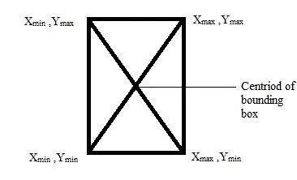
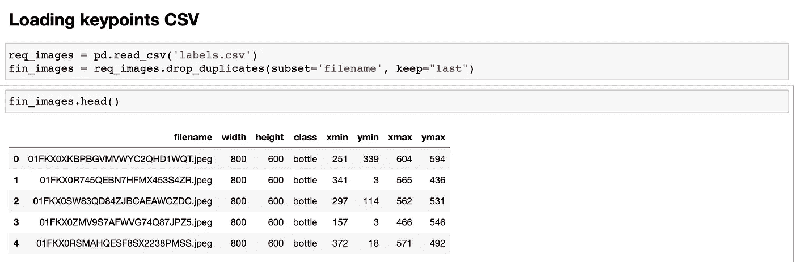
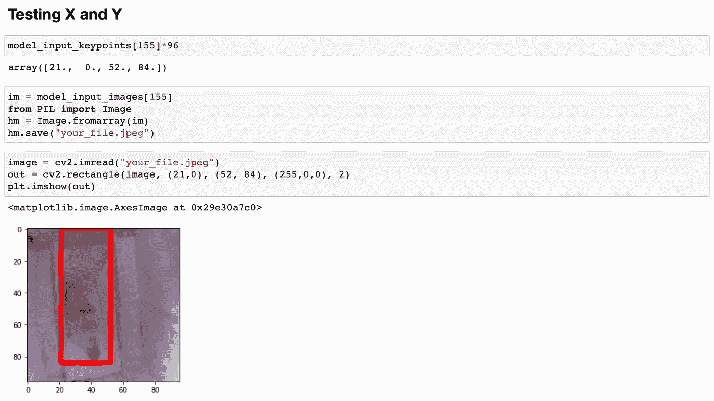
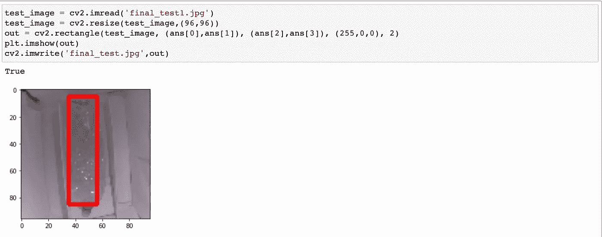

# 不使用 tensorflow API 创建自定义对象检测

> 原文：<https://medium.com/analytics-vidhya/create-custom-object-detection-without-using-tensorflow-api-230159a58207?source=collection_archive---------1----------------------->

目标检测是计算机视觉最广泛的应用之一。无论是特斯拉的自动驾驶模式还是简单的面具检测模型，物体检测和定位都是一条路要走。当向我介绍对象检测时，我同样感到惊讶，当我进行简单的 google 搜索时，我所能找到的只是 tensorflow 对象检测 API。甚至当我在关键字中添加“不使用 tensorflow API”时，它仍然显示使用 tensorflow API 的结果。这极大地激励我创建自定义对象检测模型，消除对使用高级 API 的依赖。

Tensorflow 的对象检测 API 非常酷，但我发现它非常笨拙和耗时。此外，它的 GitHub 库一直在更新，这与可用的教程和博客不匹配。因此初学者很难应付。在这篇博客中，我将解释如何在不使用 tensorflow API 的情况下，使用 CNN 创建一个精确的对象检测模型。但是，我们肯定会导入 keras 和 tensorflow 库来创建模型。那么，让我们开始吧！

# 这个概念

试着回忆一下我们传统的 CNN 图像分类模型——我们将一张 RGB 图像作为输入，比如 200x200，然后预测它是一只猫还是一只狗。因此，我们的输入形状变成(None，200，200，3 ),经过一次热编码后，我们的输出形状变成(None，1 ),其中 None 表示批量大小。

```
model = Sequential()
model.add(Conv2D(32, (3, 3), input_shape=(3, 200, 200)))
model.add(Activation('relu'))
model.add(MaxPooling2D(pool_size=(2, 2)))

model.add(Conv2D(32, (3, 3)))
model.add(Activation('relu'))
model.add(MaxPooling2D(pool_size=(2, 2)))model.add(Flatten())  
model.add(Dense(64))
model.add(Activation('relu'))
model.add(Dropout(0.5))
model.add(Dense(1))
model.add(Activation('sigmoid'))

model.compile(loss='binary_crossentropy',optimizer='rmsprop', metrics=['accuracy'])
```

我们将在这里使用相同的概念。对于对象检测，我们有一个 RGB 图像，我们的输出是 2 个坐标(x，y ),因此我们的模型总共有 4 个输出——xmin，ymin，xmax，ymax。因此，在这种情况下，我们的输出形状将是(None，4)



边界框坐标——来源:ResearchGate

# 数据准备

让我们把这个阶段分成两部分——X 和 Y。X 是图像，Y 是我们的坐标。

为了训练，我们将不得不使用注释工具手动注释图像。为此，我们将使用 LabelImg。这个过程非常简单，你可以按照它的 [GitHub 自述文件](https://github.com/tzutalin/labelImg)上的步骤操作。

一旦我们在同一个文件夹中有了带有 xml 文件的图像。我们将使用 xml_to_csv.py 将 xml 文件转换成 csv 文件。你可以从[这里](https://github.com/datitran/raccoon_dataset/blob/master/xml_to_csv.py)下载这个文件

```
import osimport glob
import pandas as pd
import xml.etree.ElementTree as ET def xml_to_csv(path):    
xml_list = []    
for xml_file in glob.glob(path + '/*.xml'):        
     tree = ET.parse(xml_file)        
     root = tree.getroot()        
     for member in root.findall('object'):            
           value = (root.find('filename').text, 
                  int(root.find('size')[0].text),
                  int(root.find('size')[1].text),                      
                  member[0].text,
                  int(member[4][0].text),                     
                  int(member[4][1].text),                     
                  int(member[4][2].text),                     
                  int(member[4][3].text))            
           xml_list.append(value)    
      column_name = ['filename', 'width', 'height', 'class',                    'xmin','ymin', 'xmax', 'ymax']    xml_df = pd.DataFrame(xml_list, columns=column_name)    
       return x xml_df def main():    
  image_path = os.path.join(os.getcwd(), 'foldername')    
  xml_df = xml_to_csv(image_path)      
  xml_df.to_csv('filename.csv', index=None)         
  [xml to csv script]main()
```

不要忘记更改上面脚本中的“foldername”和“filename.csv”。

因此，我们将有一个 csv 文件，其中包含图像及其在 csv 中的相应坐标。

# 数据生成程序

现在，因为我们有图像，即我们的 X 和 csv 包含坐标，即我们的 Y 准备好了，我们将生成模型训练的数据。

**步骤 1** :首先我们将导入我们刚刚使用 xml_to_csv.py 生成的 csv 文件

```
req_images = pd.read_csv('labels.csv')
fin_images = req_images.drop_duplicates(subset='filename', keep="last")fin_images.head()
```

这将加载我们的 csv，看起来像这样:



xml 到 csv 转换文件

**步骤 2 :** 编写用于从 csv 生成图像的代码，并将大小调整为 96x96，因为这将减少训练时间和计算能力。请注意，我们将返回两个对象—调整大小的图像和 source_images 列表，我们将使用它们来进一步验证关键点。

```
def generate_images():

    source_images = fin_images['filename'].to_list()

    images = []

    for i in source_images:
        path = 'train/'+i
        input_image = cv2.imread(path)
        input_image = cv2.resize(input_image,(96,96))
        images.append(input_image)
#         cv2.imwrite('img_t.jpg',input_image)

    images = np.array(images)
    print('images_shape:',images.shape)
    return images, source_imagesmodel_input_images, source_images = generate_images()
```

**第三步:**同样，我们将加载边界框的坐标，并根据我们的 96x96 大小的图像对它们进行归一化。

因为我们将图像的尺寸调整为 96x96，所以边界框的点会相应地改变。为此，我们将找到宽高比，并将 xmin 和 xmax 乘以宽比，将 ymin 和 ymax 乘以高比。这将为我们提供用于模型训练的标准化坐标。

```
fin_images['width_ratio'] = fin_images['width']/96
fin_images['height_ratio'] = fin_images['height']/96fin_images['xmin'] = fin_images['xmin']/fin_images['width_ratio']
fin_images['xmax'] = fin_images['xmax']/fin_images['width_ratio']
fin_images['ymin'] = fin_images['ymin']/fin_images['height_ratio']
fin_images['ymax'] = fin_images['ymax']/fin_images['height_ratio']
```

为了检查我们是否已经正确归一化，只需确保数据帧中的所有坐标应该小于 96(显然！)

**第四步:**就像图像一样，我们将生成 Y ie 归一化坐标。在这里，我们将通过检查文件名和 source_images 列表中的 image_name 来验证我们正在获取对应于图像的正确关键点。

```
def generate_keypoints():

    keypoint_features = []

    for i in source_images:
        try:
            print(i)
            image_name = i
            mask = fin_images[fin_images['filename'] == image_name]
            mask = mask.values.tolist()
            print(mask)
            keypoints = (mask[0][4:8])
            #print(keypoints)
            newList = [int(x) / 96 for x in keypoints]
            #print(newList)
            keypoint_features.append(newList)
        except:
            print('error !')
    keypoint_features = np.array(keypoint_features, dtype=float)    
    return keypoint_features
```

只是为了确保到目前为止一切都做得正确，加载任何随机的 X 和 Y，并在图像上绘制矩形。如果边界框显示正确，这意味着您已经正确执行了归一化。如果没有，喝杯咖啡&再次尝试以上步骤！



通过手工绘制边界框来测试我们生成的 X 和 Y

第五步:最后，我们将创建模型架构。您可以创建任何基于 CNN 的序列模型，并根据您的需要和要求调整其复杂性和优化器。

```
input_shape = (96,96,3)
no_of_keypoints = 4  #xmin, ymin, xmax, ymaxmodel = Sequential()# Input dimensions: (None, 96, 96, 3)
model.add(Convolution2D(32, (3,3), padding='same', use_bias=False, input_shape=input_shape))
model.add(LeakyReLU(alpha = 0.1))
model.add(BatchNormalization())
# Input dimensions: (None, 96, 96, 32)
model.add(Convolution2D(32, (3,3), padding='same', use_bias=False))
model.add(LeakyReLU(alpha = 0.1))
model.add(BatchNormalization())
model.add(MaxPool2D(pool_size=(2, 2)))# Input dimensions: (None, 48, 48, 32)
model.add(Convolution2D(64, (3,3), padding='same', use_bias=False))
model.add(LeakyReLU(alpha = 0.1))
model.add(BatchNormalization())
# Input dimensions: (None, 48, 48, 64)
model.add(Convolution2D(64, (3,3), padding='same', use_bias=False))
model.add(LeakyReLU(alpha = 0.1))
model.add(BatchNormalization())
model.add(MaxPool2D(pool_size=(2, 2)))# Input dimensions: (None, 24, 24, 64)
model.add(Convolution2D(96, (3,3), padding='same', use_bias=False))
model.add(LeakyReLU(alpha = 0.1))
model.add(BatchNormalization())
# Input dimensions: (None, 24, 24, 96)
model.add(Convolution2D(96, (3,3), padding='same', use_bias=False))
model.add(LeakyReLU(alpha = 0.1))
model.add(BatchNormalization())
model.add(MaxPool2D(pool_size=(2, 2)))# Input dimensions: (None, 12, 12, 96)
model.add(Convolution2D(128, (3,3),padding='same', use_bias=False))
model.add(LeakyReLU(alpha = 0.1))
model.add(BatchNormalization())
# Input dimensions: (None, 12, 12, 128)
model.add(Convolution2D(128, (3,3),padding='same', use_bias=False))
model.add(LeakyReLU(alpha = 0.1))
model.add(BatchNormalization())
model.add(MaxPool2D(pool_size=(2, 2)))# Input dimensions: (None, 6, 6, 128)
model.add(Convolution2D(256, (3,3),padding='same',use_bias=False))
model.add(LeakyReLU(alpha = 0.1))
model.add(BatchNormalization())
# Input dimensions: (None, 6, 6, 256)
model.add(Convolution2D(256, (3,3),padding='same',use_bias=False))
model.add(LeakyReLU(alpha = 0.1))
model.add(BatchNormalization())
model.add(MaxPool2D(pool_size=(2, 2)))# Input dimensions: (None, 3, 3, 256)
model.add(Convolution2D(512, (3,3), padding='same', use_bias=False))
model.add(LeakyReLU(alpha = 0.1))
model.add(BatchNormalization())
# Input dimensions: (None, 3, 3, 512)
model.add(Convolution2D(512, (3,3), padding='same', use_bias=False))
model.add(LeakyReLU(alpha = 0.1))
model.add(BatchNormalization())# Input dimensions: (None, 3, 3, 512)
model.add(Flatten())
model.add(Dense(512, activation='linear'))
model.add(Dropout(0.3))
model.add(Dense(no_of_keypoints))
model.summary()
```

不要忘记保持最后一个密集层为:

```
model.add(Dense(no_of_keypoints))) # 4 in our case 
```

在我们的例子中是 4，因为我们有 4 个关键点作为输出——xmin，xmax，ymin，ymax。

**步骤 6 :** 一旦你的序列模型准备好了，只需使用生成的 X(模型输入图像)和 Y(模型输入关键点)编译和拟合模型

```
from keras.callbacks import EarlyStopping, ReduceLROnPlateauearlyStopping = EarlyStopping(monitor='loss', patience=30, mode='min', baseline=None)rlp = ReduceLROnPlateau(monitor='val_loss', factor=0.7, patience=5, min_lr=1e-15, mode='min', verbose=1)model.compile(optimizer='adam', loss='mean_squared_error', metrics=['mse'])history = model.fit(model_input_images, model_input_keypoints, epochs=500, batch_size=16, validation_split=0.15, callbacks=[earlyStopping])
```

**第 7 步:**标志着我们的物体检测训练结束。现在是考验我们努力的时候了！让我们测试模型。请记住，我们必须执行与培训时相同的预处理步骤。

```
image_test = "final_test1.jpg"
test_image = cv2.imread(image_test)
test_image = cv2.resize(test_image,(96,96))
cv2.imwrite('final_test.jpg',test_image)
images = np.array(test_image)/255.0print(images.shape)
test=np.expand_dims(images,axis=0)
print(test.shape)ans = model.predict(test)
print(abs(ans))ans = ans * 96  #denormalizing
print(ans)
```

**步骤 8 :** 让我们在图像上绘制坐标，以可视化我们的结果。

```
test_image = cv2.imread('final_test.jpg')
test_image = cv2.resize(test_image,(96,96))
out = cv2.rectangle(test_image,(ans[0],ans[1]),(ans[2],ans[3]),    (255,0,0), 2)
plt.imshow(out)
cv2.imwrite('final_test.jpg',out)
```



目标检测模型输出

使用此管道进行对象检测的最大优点是，您可以根据自己的需求轻松调整管道的模型和其他参数。你也可以用这个试试迁移学习。只要确保在最后一个密集层保留 4 个 nuerons 就可以了。

# 未来的改进和范围

*   需要弄清楚，如何为多个边界框修改它
*   再添加一个参数来预测置信度得分
*   如果您正在使用任何其他数据标注工具以 Pascal-VOC 以外的格式导出坐标，则需要调整数据生成管道

如果你遇到任何错误或问题，请随时写下你的评论。此外，如果您尝试了这种方法并获得了惊人的预测，请不要犹豫，在评论中炫耀您的结果。

对于定制的计算机视觉和基于人工智能的产品和服务，请访问我们的 [Think In Bytes](http://www.thinkinbytes.in) 或查看我们的[产品组合](https://docs.google.com/presentation/d/1vewfvp7LZjp_-dVMBgJmxLXuNag6K7HwxA1j_ABcQKI/edit?usp=sharing)！