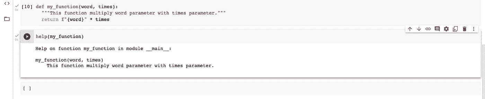

# 为 Python 代码创建文档

> 原文：<https://medium.com/analytics-vidhya/create-documentation-for-python-codes-ca6167a0a904?source=collection_archive---------5----------------------->

大家好。在这个故事中，我们将尝试介绍如何为我们的 Python 代码创建文档，以及什么是文档字符串。希望对理解有帮助。

代码文档是编程的重要部分之一。当我们将代码转移给其他开发人员时，他们会帮助我们。他们很容易理解代码是什么。

在 Python 中，我们可以通过在目标函数或对象上使用“ **help** 函数来查看文档。但是不要忘记，当我们使用“帮助”功能时，我们需要使用 Python shell。否则，如果您想将文档字符串作为一个字符串，您应该使用“ **__doc__** ”属性。让我们看看它们是如何工作的。


帮助功能


__doc__ 属性

对于额外的信息，我们可以通过使用“ **dir** ”函数来查看实例的属性和方法。


dir 函数

我将创建一个空函数，名为 **my_function** ，并对其使用帮助函数。


如果我们想用 Python 代码创建文档，我们需要使用这种结构来创建文档:

**“关于函数的一些事情……”**

有三个引语。



但是如果我们想创建好的文档，我们应该使用这种结构:

```
def my_function():**“”” Summary line****Extended description****[explain parameters]****[what returns]****“””
...**
```

# 文档样式

我们有几种创建文档的风格。

## 谷歌风格

```
"""Summary lineExtended description of functionArgs: arg1 (int): Description of Arg1 arg2 (type): Description of Arg2Returns:
     arg1 * arg2"""
```

## NumPy 风格

```
"""Summary lineExtended description of functionParameters
----------arg1 : int Description of arg1 ...arg2: type of arg1 (if it is optional: type, optional) Description of arg2Returns
----------"""
```

## 重构的文本样式

```
"""Summary lineExtended description of function:param arg1: Description of arg1:type arg1: int:param arg2: Description of arg2:type arg2: str"""
```

## Epytext 样式

```
"""Summary lineExtended description of function@type arg1: int@param arg1: Description of arg1@type arg2: str@param arg2: Description of arg2
...
"""
```

在本教程中，我将使用谷歌风格的文档字符串。因此，我将使用 Google style 创建一个文档字符串。

```
def my_function(word, times):"""word multiply times This function multiply word parameter with times parameter. Args: word (str): String that you want to multiply with times times (int): number that how many times you want to multiply Returns: word * times (str)"""return f"{word}" * times
```

当我使用帮助功能时，会出现以下输出。


所以我们用三重引用来创建文档。我们需要看到这个故事的最后一部分。是 [pyment](https://github.com/dadadel/pyment) 。Pyment 通过使用我们已经编码的 Python 文件来帮助我们创建文档。我们可以用它从 Python 文件中生成文档。

我将在我的桌面上创建 Python 文件，如 **app.py** 所示。


我将使用 pyment 从我的 Python 文件中生成文档字符串。你可以在下面看到如何使用 pyment。

```
pyment -w -o <docstyle> <file_name.py>
```

*   -w =覆盖文件
*   -o =文档样式(numpy、google 等。)
*   如果您想知道 pyment 支持哪些类型，您需要检查这个

```
pyment -h # and go -o section
```

我将使用 **pyment -w -o google app.py** ，pyment 将使用 Google style 生成我的文档字符串。


是的，我希望它有所帮助。你可以从[这里](https://colab.research.google.com/drive/1R0-pUbshOfhan9Q7ByJ3XMrHLdJGV0eE?usp=sharing)访问我们为这个故事创建的 Colab 笔记本。

亲切的问候。