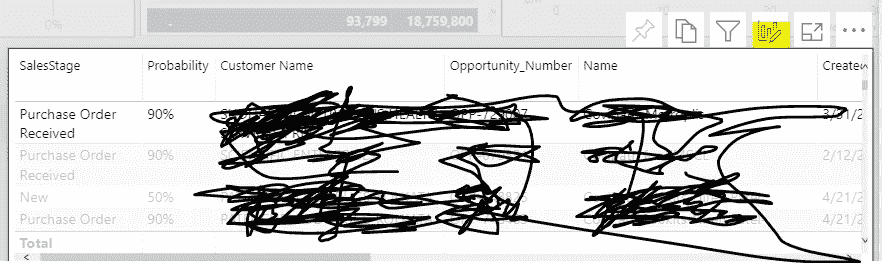

# 从 Power BI 上的默认仪表板视图创建个人书签

> 原文：<https://medium.com/analytics-vidhya/create-personal-bookmarks-from-the-default-dashboard-view-on-power-bi-9a94ee1b6308?source=collection_archive---------9----------------------->

今天我要分享一个在 Power BI 中创建自定义视图(**个人书签**)的有用功能。如果您是访问同一个仪表板的用户之一，您可能会发现有时视图不能满足您的要求。然而，从 BI 工程师的角度来看，满足每个用户的需求是不合适的。最终用户的解决方案来了，一个定制的视图。在仪表板上构建自定义视图有一些优势，最重要的一点是您可以同时拥有多个版本，如果您需要定期提供不同的报告，这将是一个很好的帮助。

# **第一步，找出你想要定制的组件**

转到组件并选择顶部的图标，以个性化视觉效果

个人书签使视觉个性化

个人书签更改类型

如果需要，还可以更改默认设计的类型。

# **第二步，选择要添加到组件的列**

您可能已经在仪表板中包含了一些数据源，所以请确保您有一个清晰的结构和关联构建，这可以帮助您更容易地找到目标列。从右侧选择您需要的列，并利用搜索功能来节省您的时间。

个人书签添加栏

注意:如果您没有很好地管理您的相关性，您可能会在向组件添加新列时收到下面的错误消息。要解决这个问题，您需要回到结构中，更新源表之间的相关性

个人书签关联错误消息

# **第三步，保存您定制的视图**

单击顶部的选项卡并保存您的视图。您可以根据您的请求拥有多个视图，以定期完成必要的报告。

添加个人书签

现在，您可以拥有自己的视图(个人书签),而不会影响仪表板的默认设置。请继续关注其他能量 BI 技能。