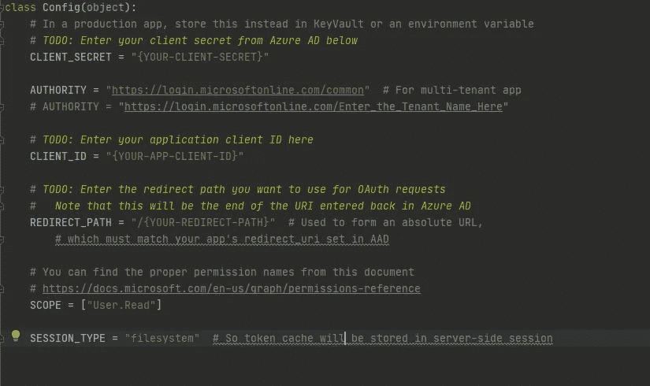
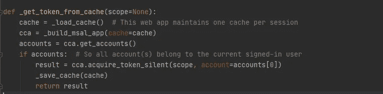
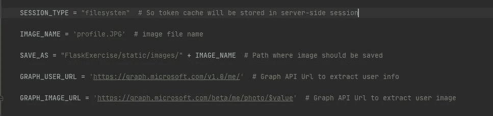
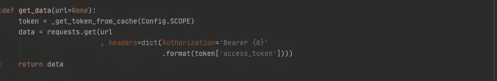
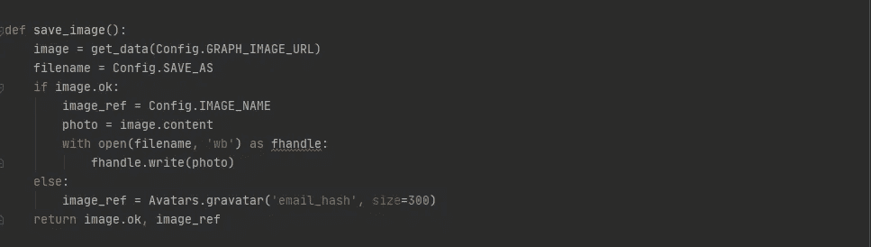
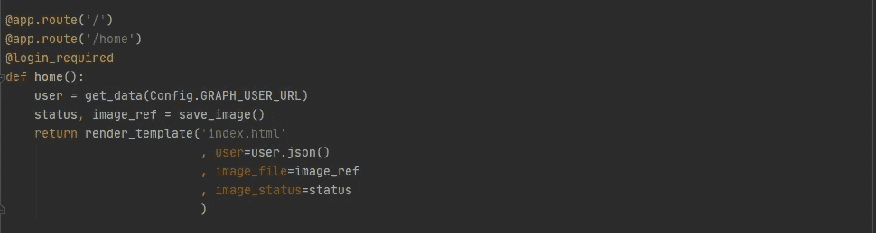
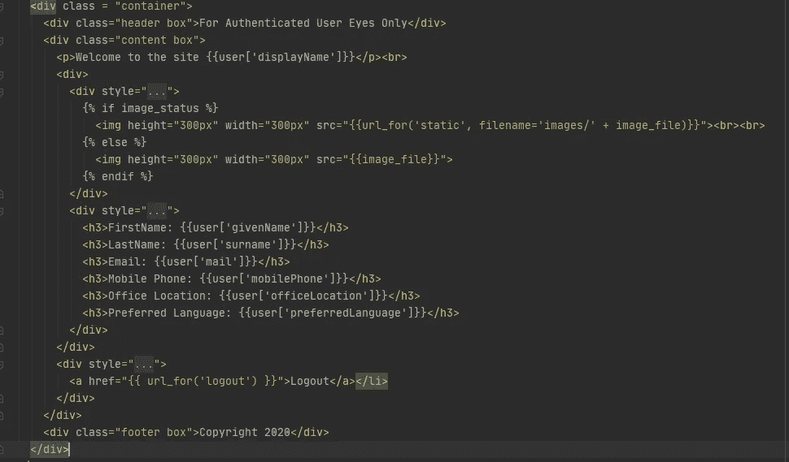
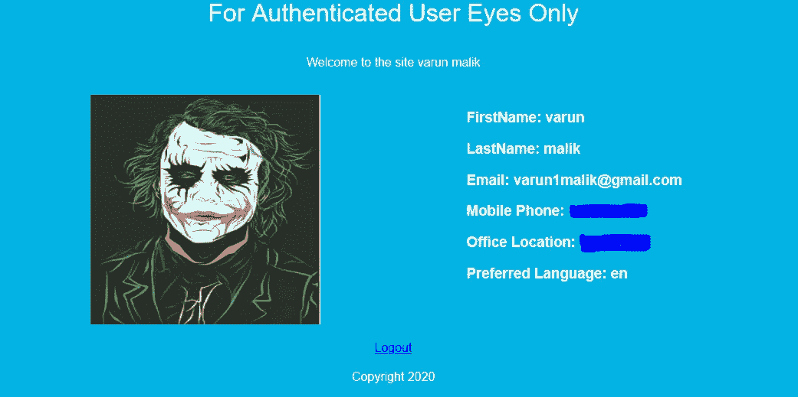

# 使用 Microsoft Graph API 创建个人资料页面

> 原文：<https://medium.com/analytics-vidhya/create-profile-page-using-microsoft-graph-api-280f57149f09?source=collection_archive---------28----------------------->

> Microsoft Graph 是一个 RESTful web API，使您能够访问 Microsoft 云服务资源。注册应用程序并获得用户或服务的身份验证令牌后，您可以向 Microsoft Graph API 发出请求。

**先决条件**:

【azure 主动订阅

熟悉将微软认证库或`msal`集成到应用程序中(可选)

[向微软身份平台注册的应用程序](https://docs.microsoft.com/en-us/azure/active-directory/develop/quickstart-register-app)

从[这里](https://github.com/VMoose/Msal_Active-Directory)下载或克隆启动代码。

**第一步:**开始，打开***config . p****y*文件，在那里输入应用客户端 ID、客户端密码和 redirect_path。 [**这个**](https://docs.microsoft.com/en-us/azure/active-directory/develop/quickstart-register-app) 应该可以帮你入门。

**步骤 2:** 在本地运行应用程序。如果一切顺利，您应该能够看到:

在尝试登录 Microsoft 时，您应该看到:

**步骤 3** :来自 Azure active directory 的认证令牌保存在缓存中，可以通过在 **views.py** 中添加以下函数从缓存中提取

**第四步:**在 **config.py** 中添加变量，从 Microsoft Graph API 中获取用户信息。

**第五步**:将此函数粘贴到 **views.py** 中，从 API 中获取数据

**步骤 6** :使用下面的函数将图形 API 中的图像保存到本地

**第 7 步**:将数据传递给**索引模板**，登录后显示。

**第八步**:显示**指标模板**中的数据

最终的输出应该是这样的

**有用链接:**

1.  [https://developer.microsoft.com/en-us/graph/graph-explorer](https://developer.microsoft.com/en-us/graph/graph-explorer)—了解更多关于图形 API 的信息
2.  从[这里](https://github.com/VMoose/Msal_Active-Directory)下载或克隆完整的代码。