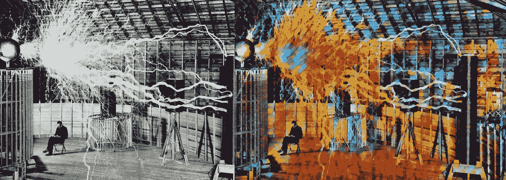
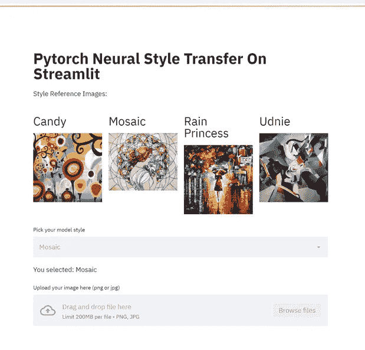
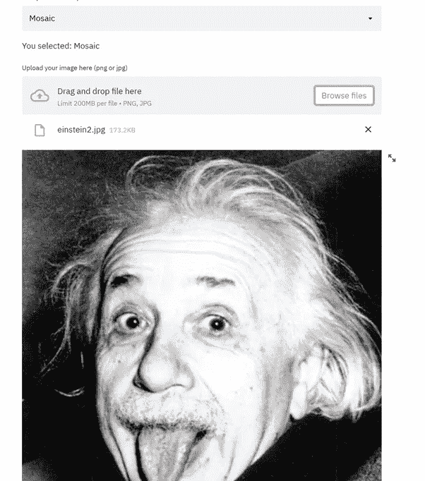
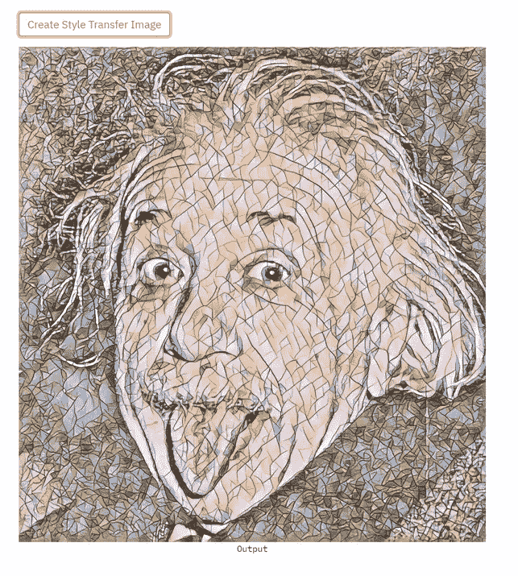
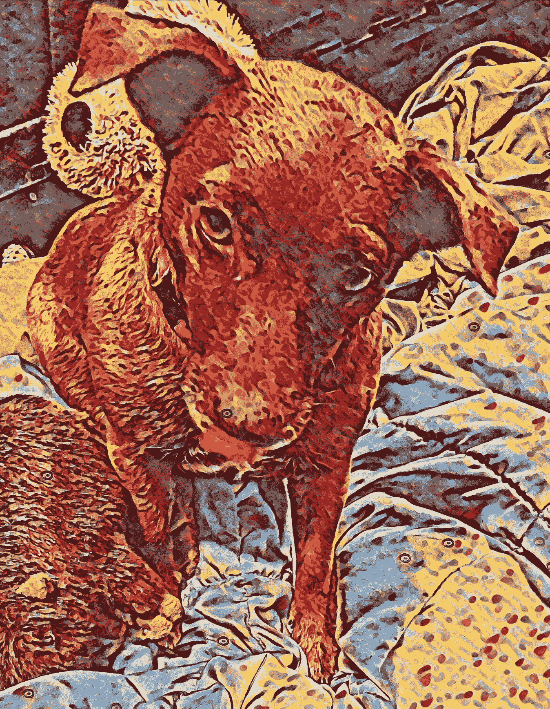

# 使用 Streamlit 创建您自己的 DeepArt 克隆:Pytorch 神经风格转移 Web 应用程序(带代码和 Colab 演示)

> 原文：<https://medium.com/analytics-vidhya/create-your-own-deepart-clone-pytorch-neural-style-transfer-web-app-using-streamlit-with-code-b12c0e41d4c7?source=collection_archive---------18----------------------->

尼古拉·特斯拉的神经类型转移

*在推特上关注我:* [@GDurendal](https://twitter.com/GDurendal)

神经类型转移是现代机器学习中有趣但通常不切实际的领域之一。考虑到算法的相对复杂性，建立环境的后勤工作通常是不值得的。一旦你使用了控制台命令，创建图像的过程就没有想象中的有趣或简单了。当然，有像 deepart 这样的网站和大量关于这个主题的应用程序。但没有什么能让人工智能工程师插入他们自己的模型或自己部署前端。当使用它们时，还会增加应用程序/Web 队列的延迟。如果我们能创造出自己的速度更快、可定制性更强的东西会怎么样？

有一天，我发现自己想要承担一个定制的 Streamlit 项目，以便更好地理解简单按钮和表格之外的框架。幸运的是，我也在同一时间看到了这个 pytorch 神经风格传输演示:[https://github . com/py torch/examples/tree/master/fast _ neural _ style](https://github.com/pytorch/examples/tree/master/fast_neural_style)。这个特殊的实现给出了非常好的结果(在我看来)。因此，我决定基于它创建自己的 streamlit 风格传输 web 应用程序。

# 该应用程序

让我们来看看应用程序本身。当您第一次打开它时，您会看到以下内容:

正如你所看到的，这是完全直观的。只要根据给定的画作选择一种风格，然后上传你的图片。让我们试试爱因斯坦的马赛克风格:

现在点击“创建风格转移图像”按钮运行算法！

就是这样！超级容易！速度会因图像大小而异，但任何 2MB 以下的图像都应该在一分钟内完成，这取决于你的电脑性能/互联网速度(如果你使用的是 colab)。对我来说，这一次只花了几秒钟，大多数人都是这样。肯定比任何公开的风格转换应用程序都要快。

它很容易使用，以至于我有时间去玩它。你可以画你的狗:

我特别喜欢旧图像上的结果。当然，有像 [deoldify](https://heartbeat.fritz.ai/using-deoldify-to-colorize-and-restore-grayscale-images-and-videos-c5f88b67cffb) 这样的框架可以恢复旧照片，但是这一点也不好玩。看看这些结果:

编辑这张拼贴画比运行人工智能花了我更多的时间。

我当然可以理解为什么人们会更喜欢把这样的画挂在房子里，而不是一幅普通的旧画。

在代码方面，该算法将这些图像存储在 images/output-images 目录中，并根据所使用的样式对它们进行单独命名，以免阻塞目录。只需右键单击并执行“图像另存为”即可直接从 streamlit 应用程序中保存图像。但是如果你想把它们保存在文件夹中，在你再次使用相同的样式之前，一定要把它们复制下来。

# 代码

所有相关代码都可以在我的 github 上找到:

 [## GeorgeDavila/pytorchneuralstylesteamlit

### 基于在 https://github.com/pytorch/examples 运行的 fast_neural_style 示例，在…中使用以下命令

github.com](https://github.com/GeorgeDavila/PytorchNeuralStyleStreamlit) 

为了方便起见，包含了一个 colab 演示，但它在专用的虚拟环境中工作得最好。在安装了 Python 3.7+的计算机上打开命令提示符并创建虚拟环境:

**py -m venv 流线型**

然后导航到目录: **cd streamlitstyle** 并使用**激活 venv。\脚本\激活**

然后简单地下载 repo 并使用我提供的 requirements.txt 安装需求:**pip install-r requirements . txt**

还需要下载 pytorch 1.7.1。这可以很简单地按照[https://pytorch.org/](https://pytorch.org/)上的说明来完成

一旦所有这些都完成了，你就可以运行程序了！只需使用**streamlit run streamlit _ main . py**，应用程序将在您的浏览器中打开，网址为 [http://localhost:8501](http://localhost:8501)

现在它只是一个简单的界面！

这里有一个 colab 演示，方便那些没有必备硬件的人访问。

 [## GeorgeDavila/pytorchneuralstylesteamlit

### Streamlit 构建的 UI 上的 Pytorch 神经风格传递算法—GeorgeDavila/pytorchneuralstylesstreamlit

github.com](https://github.com/GeorgeDavila/PytorchNeuralStyleStreamlit/blob/main/pytorchNeuralStyle.ipynb) 

由于 colab 和 IPython shells 不支持本地托管，因此 Colab 演示要复杂得多。所以我们必须通过 ngrok 隧道应用程序，并使用相应的 ngrok.io 链接，按照我在 colab 笔记本上写的说明操作。这可能有点复杂，但按照这些说明，你应该能够得到一个活跃的隧道了。更活跃的使用将需要打开一个 ngrok 帐户，所以我建议使用一个本地虚拟环境，如果你想玩得更久的话。

我甚至找到了在 colab 内部编辑 streamlit 代码的方法。Streamlit 通常只能使用 streamlit run 从控制台命令调用，因此您不能直接从 IPython shell 运行它，必须使用控制台命令调用它。所以我们简单地将 streamlit 代码作为文本写入 python 文件(参见文本变量 my_st_code)。自己尝试一些基本的编辑(如果你知道 basic streamlit)，你可以直接从那个笔记本编辑它。

就是这样！我们有一个漂亮易用的 streamlit web 应用程序！如果愿意的话，你甚至可以把它放在 Heroku 上(尽管这个特殊的算法会消耗很多计算能力)。尽情享受吧！