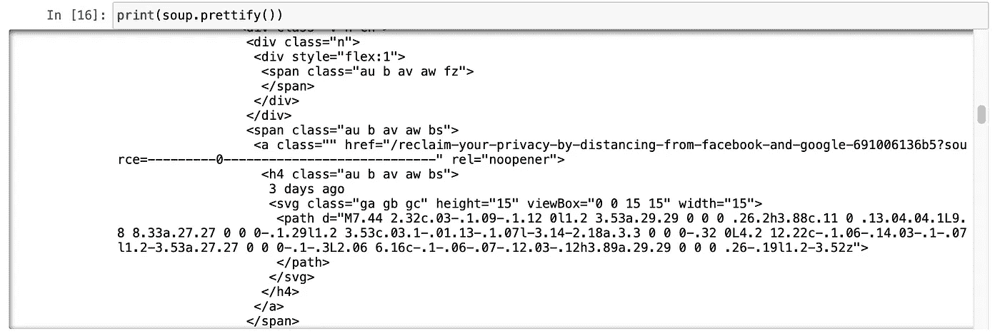
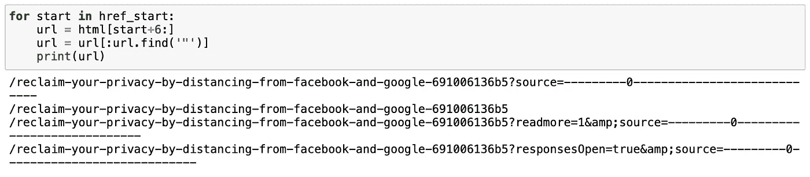
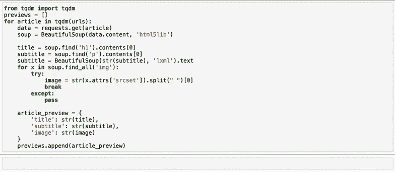
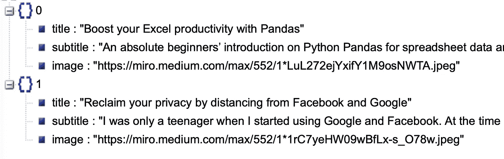

# 使用 python 从任何来源创建自己的时事通讯——第 1 部分(网络搜集)

> 原文：<https://medium.com/analytics-vidhya/create-your-own-newsletter-from-any-source-with-python-part-1-web-scraping-445e6c9e1d75?source=collection_archive---------10----------------------->

## 时事通讯有时很烦人，但也很有用:想象一下，如果你能在一封你控制的电子邮件中获得你真正关心的任何事情的更新。


由[克里斯蒂娜·特里普科维奇](https://unsplash.com/@tinamosquito?utm_source=unsplash&utm_medium=referral&utm_content=creditCopyText)在 [Unsplash](https://unsplash.com/s/photos/post?utm_source=unsplash&utm_medium=referral&utm_content=creditCopyText) 上拍摄的照片

这正是这个分成两部分的小教程的目的:在第一部分中，我们将学习如何制作一个网页抓取器，从任何网站上抓取和过滤信息。在**第 2 部分**中，我们将了解如何使用收集到的数据创建时事通讯，并通过电子邮件发送给你自己或你的订户/朋友。

> 如果你正在寻找本教程的第 2 部分，请点击链接:[https://medium . com/analytics-vid hya/create-your-own-newsletter-from-any-source-with-python-part-2-the-newsletter-ed 21 CD 47 c 788](/analytics-vidhya/create-your-own-newsletter-from-any-source-with-python-part-2-the-newsletter-ed21cd47c788)
> 
> 完整的代码可以在这里找到:[https://github.com/fabiom91/python-newsletter_tutorial](https://github.com/fabiom91/python-newsletter_tutorial)

# 卷筒纸刮刀

对于 web scraper，我们将使用两个非常有用的 Python 库:`requests`和`beautifulsoup`:

在我们继续之前，我们必须看看我们从目标网站上搜集到了什么，在我的例子中:



我的头要爆炸了。🤯

我知道，它看起来一点也不漂亮，但请记住，一旦你提取了你需要的数据，你就不必再看它了。在我的例子中，我已经从上面的截图中看出，一篇文章的链接包含了它的标题。

假设我想获得所有关于*隐私的文章。*我们可以试试这个:


正如你所看到的，仍然有很多废话，但我们可以开始识别一些网址。让我们通过只提取“href”标签之间的字符串来清理这个问题。为此，我们首先必须找到每个“href”元素的位置:

一旦我们知道了每个“href”元素的位置，我们就可以得到内容:



还没有完全实现，但是我们可以清楚地看到，如果我们丢弃查询参数(所有跟在“？”后面的参数))，我们在搜索中只有一个 URL，所以让我们来理清一下:

完美！你可能已经注意到，到目前为止我所说的“URL”实际上是一个相对路径，它缺少域名等。要解决这一问题，我们只需查看发布在中墙中的任何文章，就可以看到完整的 URL 是通过在相对路径前面加上墙 URL 来构成的:

```
[https://fabiom91.medium.com/reclaim-your-privacy-by-distancing-from-facebook-and-google-691006136b5](https://fabiom91.medium.com/reclaim-your-privacy-by-distancing-from-facebook-and-google-691006136b5)
```

假设我对关于*隐私*和*数据分析*的文章感兴趣，我可以得到标题中包含一些关键词如“数据”或“隐私”等的所有文章。为了搜索所有包含所选关键字的链接，我可以使用**正则表达式(Regex)** :

既然我们已经看到了如何提取文章的 URL，我们可能希望从文章中获取更多信息来填充我们的新闻稿。为此，我们可以将刚才使用的相同过程应用于每个文章 URL。

在本例中，我们希望提取:

*   文章标题
*   文章副标题(第一段)
*   文章图片(如果有)

通过分析每篇文章的源代码，我发现标题总是在第一个“h1”标签中，而作为图像，我们可以在标题后的“img”标签中使用第一个。根据副标题，我将使用文章的第一段“p ”:



对于这个例子，我们将只使用这些数据，但如果你感兴趣，你可以抓取不同的网站，然后将所有数据组合在一个单一的新闻稿中。



祝贺您完成了本教程的第 1 部分。要学习如何用收集到的数据制作时事通讯，以及如何自动发送给你自己或你的朋友，请点击这里查看本教程的第二部分

> [https://medium . com/analytics-vid hya/create-your-own-newsletter-from-any-source-with-python-part-2-the-newsletter-ed 21 CD 47 c 788](/analytics-vidhya/create-your-own-newsletter-from-any-source-with-python-part-2-the-newsletter-ed21cd47c788)