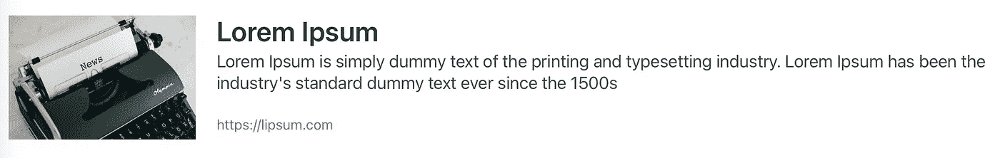
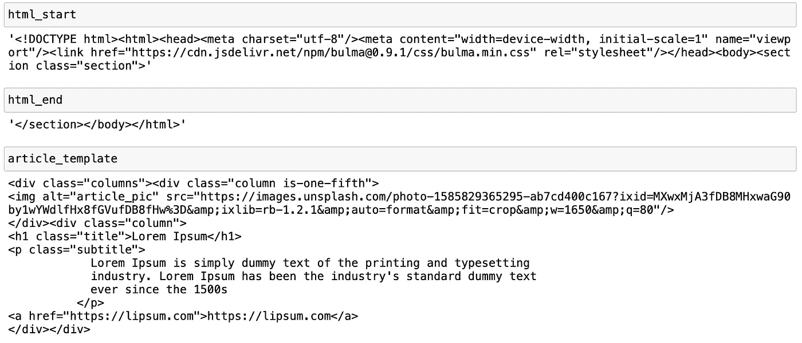
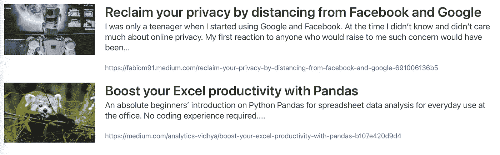

# 使用 python 从任何来源创建自己的时事通讯—第 2 部分(时事通讯)

> 原文：<https://medium.com/analytics-vidhya/create-your-own-newsletter-from-any-source-with-python-part-2-the-newsletter-ed21cd47c788?source=collection_archive---------5----------------------->

## 时事通讯有时很烦人，但也很有用:想象一下，如果你能在一封你控制的电子邮件中获得你真正关心的任何事情的更新。

克里斯蒂娜·特里普科维奇在 [Unsplash](https://unsplash.com/s/photos/post?utm_source=unsplash&utm_medium=referral&utm_content=creditCopyText) 上的照片

欢迎来到这个 2 部分教程的**第 2 部分**，讲述如何利用从任何来源搜集的网络数据制作你自己的个性化时事通讯。在这里，我们将学习如何使用我们在**第 1 部分**中从网络上收集的数据创建和填充电子邮件简讯模板，以及如何通过 Python 和 Gmail 发送。

> 如果你正在寻找本教程的第 1 部分，请点击链接:[https://medium . com/analytics-vid hya/create-your-own-newsletter-from-any-source-with-python-part-1-web-scraping-445 E6 c 9 E1 d 75](/analytics-vidhya/create-your-own-newsletter-from-any-source-with-python-part-1-web-scraping-445e6c9e1d75)
> 
> 完整的代码可以在这里找到:[https://github.com/fabiom91/python-newsletter_tutorial](https://github.com/fabiom91/python-newsletter_tutorial)

## 时事通讯模板

首先，我们要检查我们的数据，并创建一个模板，我们将使用我们的通讯。在我的例子中，我选择了这样的东西:

左图:[马库斯·温克勒](https://unsplash.com/@markuswinkler?utm_source=unsplash&utm_medium=referral&utm_content=creditCopyText)在 [Unsplash](https://unsplash.com/s/photos/news?utm_source=unsplash&utm_medium=referral&utm_content=creditCopyText) 拍摄的照片

正如你所看到的，我已经使用了**布尔玛**来处理我的模板的样式，并使它变得干净和有响应性。你可以在这里查看布尔玛: [https://bulma.io](https://bulma.io)

现在，让我们将模板保存为**“email . html”**，并在同一个文件夹中创建一个新的 Python 脚本或笔记本，我们将使用 **BeautifulSoup** 导入模板，我们将划分模板的“固定部分”(如 html、标题、样式等)。)从“动态部分”(保存数据的模板部分，如“列”):

现在我们可以用本教程第 1 部分收集的数据填充 **article_template** :

现在，如果我们打印 **email_content** ，将其粘贴到一个 HTML 文件中，并在我们的浏览器中打开它，它看起来应该是这样的:

很不错吧？🤩

## 设置您的发件人电子邮件地址

好了，我们已经完成了 HTML 格式的电子邮件模板。在我向您展示如何通过 Python 发送电子邮件之前，您需要确保您想要用来发送时事通讯的电子邮件地址支持 **SMTP** 协议。虽然 Gmail 支持 SMTP，但默认情况下这是不活动的。要在您的发件人电子邮件地址上配置 SMTP，请遵循谷歌支持页面上的简单指南:【https://support.google.com/a/answer/176600?hl=en 

## 发送电子邮件

一旦用 SMTP 配置了发件人电子邮件，发送电子邮件就非常简单了:

如果一切顺利，您应该会在几分钟内收到简讯(时间可能会因众多变量而异)。

我希望你喜欢这个教程。现在，您拥有了完全控制简讯内容所需的所有工具，这样您就可以只接收对您真正重要的内容的更新。

编码快乐！😃