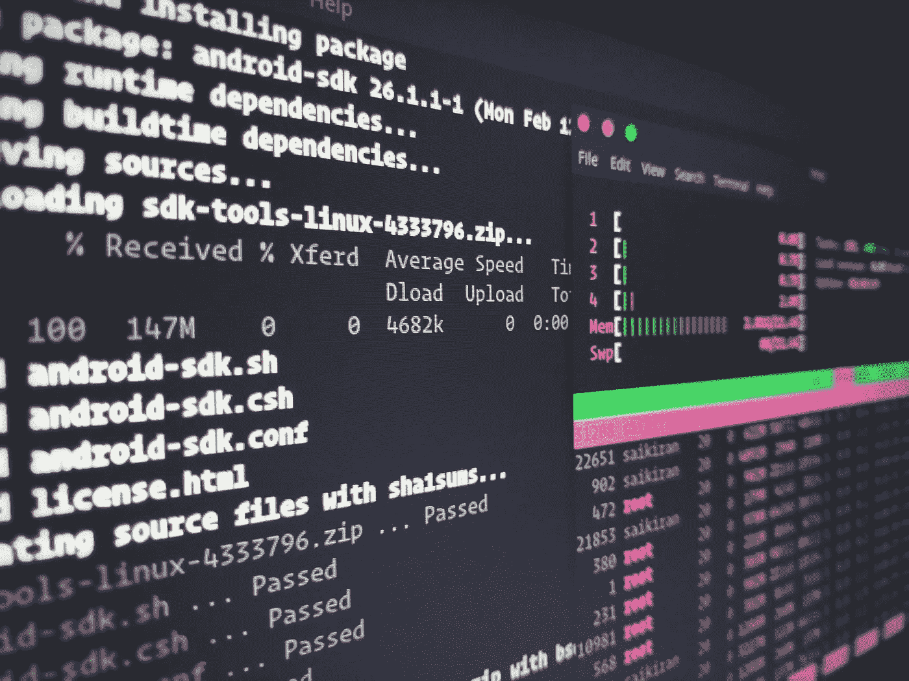

# 创建一个可启动的 USB 闪存驱动器与磁盘破坏者

> 原文：<https://medium.com/analytics-vidhya/creating-a-bootable-usb-flash-drive-with-disk-destroyer-b1f3e0e58717?source=collection_archive---------14----------------------->

在 [Unsplash](https://unsplash.com/s/photos/linux?utm_source=unsplash&utm_medium=referral&utm_content=creditCopyText) 上 [Sai Kiran Anagani](https://unsplash.com/@_imkiran?utm_source=unsplash&utm_medium=referral&utm_content=creditCopyText) 拍摄的照片

有多种方法可以用像 [Rufus](https://rufus.ie/) 或 [Etcher](https://www.balena.io/etcher/) 这样的软件创建一个可启动的 u 盘。尽管前面提到的软件非常擅长它们所做的事情，但有时您希望坚持使用传统的命令行界面(CLI)。在这篇文章中，我们将看看一个众所周知的 Linux 工具，我们可以利用和创建一个可启动的闪存驱动器。问题中的工具是强大的…